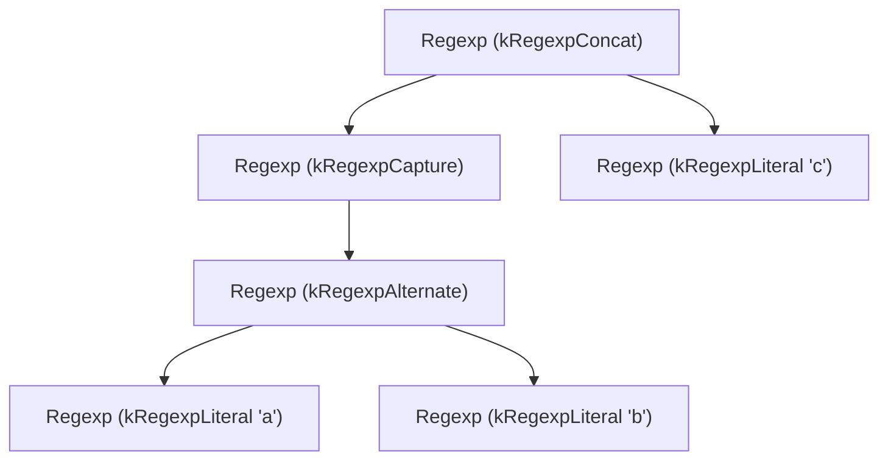
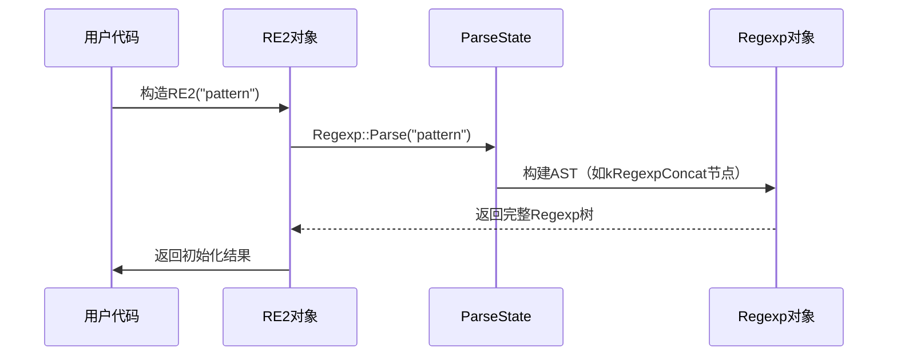

# 第2章：Regexp（正则表达式对象）

欢迎回来

在[第1章：RE2（高级API）](01_re2__high_level_api__.md)中，我们了解到`RE2`类是C++中处理正则表达式的主要工具。

但当传入类似`"(\\d+)-(\\d+)-(\\d+)"`的模式时，`RE2`内部究竟如何"理解"这个字符串？

这就是**Regexp（正则表达式对象）**的职责所在——它是正则模式处理流程中的首个关键环节

### Regexp解决什么问题？ 

想象你向建筑师描述梦想中的房屋。在施工前，建筑师需要绘制*蓝图*——这不是实体建筑，而是包含墙体位置、房间数量和屋顶类型等细节的结构化方案。

在`re2`中，正则表达式字符串（如`a+b*c`）就是原始描述，而`Regexp`对象则是**经过解析的、机器可理解的结构化蓝图**。当调用`RE2 phone_pattern("...")`时，`RE2`对象通过内部解析器将字符串转换为`Regexp`对象，明确表达：
- 哪些部分是字面量（如`a`、`b`、`c`）
- 哪些部分是重复操作（如`+`表示"至少一次"，`*`表示"零次或多次"）
- 这些部分如何组合（如拼接`abc`或选择`a|b`）
- 捕获组`(...)`或字符类`[...]`等特殊结构

这种结构化表示使得后续的优化和编译更加高效。

### Regexp：内部蓝图

前文传送opa[3.md](..\..\Licence\OPA(agent)\3.md) 

`Regexp`对象本质上是**抽象语法树（AST）**。以简单模式`(a|b)c`为例，其`Regexp`结构如下：



#### Regexp对象核心特性：
- **不可变性**：创建后结构固定，确保线程安全
- **引用计数**：通过计数机制共享对象，避免内存泄漏

### 解析流程

用户通常不直接创建`Regexp`对象，而是由`RE2`在初始化时自动完成解析：



### 代码实现

关键代码片段（简化自`re2`源码）：

**1. RE2初始化时触发解析**
```cpp
// re2/re2.cc
void RE2::Init(absl::string_view pattern) {
  entire_regexp_ = Regexp::Parse(pattern, flags_, &status); // 核心解析调用
}
```

**2. 字面量节点的创建**
```cpp
// re2/parse.cc
bool ParseState::PushLiteral(Rune r) {
  Regexp* re = new Regexp(kRegexpLiteral, flags_);
  re->rune_ = r; // 存储字符值
  stacktop_ = re; // 压入解析栈
}
```

**3. 树结构遍历工具**
```cpp
// re2/tostring.cc
string Regexp::ToString() {
  ToStringWalker w(&result);
  w.WalkExponential(this, max_depth); // 安全遍历AST
}
```

### 总结

`Regexp`对象是正则表达式处理流程中的结构化中间表示：
- 将原始字符串转换为机器友好的树形结构
- 支持语法检查与优化预处理
- 为后续编译阶段提供清晰蓝图

[下一章：Prog（编译程序）](03_prog__compiled_program__.md)

