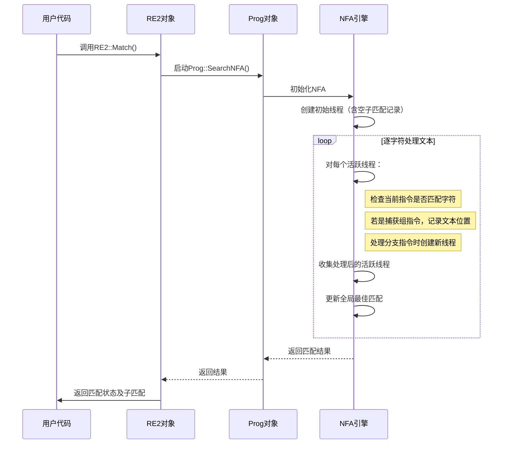

# 第5章：NFA（非确定性有限自动机引擎）

欢迎回来

在[第4章：DFA（确定性有限自动机引擎）](04_dfa__deterministic_finite_automaton_engine__.md)中，我们了解了超高速的DFA引擎，它能高效判断匹配是否存在及其结束位置。

DFA虽然速度快，但存在局限性：对于复杂模式可能消耗大量内存，且其主要优势不在于精确追踪文本中哪些部分匹配了正则表达式的哪些分组。

这时就需要**NFA（非确定性有限自动机引擎）**登场。NFA是`re2`中另一种强大的引擎，提供了不同的平衡点。虽然在某些任务上可能比DFA稍慢，但它能精确捕获正则表达式中括号分组匹配的内容（即"==子匹配=="）。更重要的是，`re2`的NFA经过精心设计，避免了简单"回溯式"NFA引擎常见的*指数级时间复杂度*问题。

### NFA解决什么问题？

想象你正在迷宫中探索，但这个迷宫在某些岔路口存在多条看似可行的路径：
- **DFA**就像一张地图，每个岔路口都有明确标识告诉你*唯一*该走的路径。你永远不需要回溯或猜测，只需一直向前。这种方式极快，但不会记住所有*可能*的路径，只记录实际走过的路径。
- **NFA**则像派出多个探索者。当遇到多条路径的岔路口时，他们会复制自己，每个副本选择不同路径。==所有路径被同时探索==，只要任一探索者找到出口就算成功。这种方法能全面追踪所有可能性，但管理多个探索者比遵循单一固定路径更复杂。

(复制副本加速 有点分布式的意思)

在`re2`中，NFA引擎主要解决两大问题：
1. **精确追踪子匹配**：当正则表达式包含捕获组（如`(...)`）时，NFA会细致记录每个分组在文本中的起止位置，这是它的核心优势。
2. **以更低内存处理复杂模式**：对于某些极其复杂的正则表达式（可能导致DFA生成庞大的内存消耗型"状态映射"），NFA通常能以更可控的内存占用来处理，成为可靠的备选方案。

### NFA：多路径探索者

NFA与DFA的关键区别在于"确定性"：
- **DFA是确定性的**：对于任何输入字符，它总是转移到*一个特定*的下一个状态。
- **NFA是非确定性的**：对于给定输入字符，它可能转移到*多个*下一个状态，甚至可能在执行其他操作（如记录捕获）时保持在相同逻辑"位置"。

`re2`的NFA通过同时模拟所有可能的路径来工作。当逐字符处理输入文本时，它会维护一个"活跃线程列表"（即=="探索者"集合==）。每个"线程"代表当前正在探索的正则表达式路径，并携带自己记录的子匹配边界信息。

### RE2如何选择NFA引擎

通常你不需要直接指定使用NFA。高级`RE2`类（来自[第1章：RE2（高级API）](01_re2__high_level_api__.md)）会根据正则表达式和搜索参数智能选择最佳引擎。

如果正则表达式包含**捕获组**（如`(...)`），或者DFA因内存限制而"退出"（如前一章所述），`RE2`很可能会使用NFA引擎（或其变种如`OnePass`或`BitState`）来确保正确且安全地完成任务。

以电话号码捕获为例：

```cpp
#include "re2/re2.h"
#include <iostream>
#include <string>

int main() {
    // 包含捕获组的正则表达式
    RE2 phone_pattern("(\\d+)-(\\d+)-(\\d+)");
    std::string text = "650-253-0001";
    
    std::string area_code, prefix, line_number;

    // RE2会选择支持子匹配追踪的引擎（通常是NFA或其变种）
    if (RE2::FullMatch(text, phone_pattern, &area_code, &prefix, &line_number)) {
        std::cout << "匹配成功！完整号码: " << text << std::endl;
        std::cout << "  区号: " << area_code << std::endl;   // 输出: 650
        std::cout << "  前缀: " << prefix << std::endl;       // 输出: 253
        std::cout << "  线路号: " << line_number << std::endl; // 输出: 0001
    }
    return 0;
}
```
在此场景中，`RE2`不仅需要判断"650-253-0001"是否匹配，还需返回"650"、"253"和"0001"的具体内容。这种精细的追踪正是NFA引擎的专长。

### NFA引擎的内部机制

NFA引擎运行在`Prog`（编译程序，来自[第3章](03_prog__compiled_program__.md)）的指令集上。与DFA维护单一"当前状态"不同，NFA会跟踪多个独立的执行"线程"。

以下是`RE2`使用NFA的简化流程：



### NFA实现

`Prog::SearchNFA`方法（位于`re2/nfa.cc`）是NFA引擎的主入口。它创建`NFA`对象并调用其`Search`方法。

#### 核心数据结构

```cpp
// 简化自re2/nfa.h
class NFA {
 private:
    // 每个Thread代表一个探索路径
    struct Thread {
        union { int ref; Thread* next; };
        const char** capture; // 子匹配位置数组
    };

    // Threadq: 按指令ID索引的活跃线程集合
    typedef SparseArray<Thread*> Threadq;

    // 关键方法：
    void AddToThreadq(Threadq* q, int id0, int c, absl::string_view context, const char* p, Thread* t0);
    int Step(Threadq* runq, Threadq* nextq, int c, absl::string_view context, const char* p);
};
```
- **`Thread`**：代表一个探索路径，包含`capture`数组记录每个子匹配的起止位置。
- **`Threadq`**：高效存储当前活跃线程的稀疏数组。

#### 路径探索逻辑

`AddToThreadq`方法处理不消耗输入字符的指令（如`Nop`、`Capture`），可能同时探索多条路径：

```cpp
void NFA::AddToThreadq(Threadq* q, int id0, int c, absl::string_view context, const char* p, Thread* t0) {
    // 处理kInstCapture指令时：
    case kInstCapture:
        Thread* t = AllocThread();
        CopyCapture(t->capture, t0->capture);
        t->capture[ip->cap()] = p; // 记录当前文本位置
        t0 = t;
        // 继续处理后续指令
```

#### 单步推进

`Step`方法处理输入字符并更新线程集合：

```cpp
int NFA::Step(Threadq* runq, Threadq* nextq, int c, absl::string_view context, const char* p) {
    for (Threadq::iterator i = runq->begin(); i != runq->end(); ++i) {
        Prog::Inst* ip = prog_->inst(i->index());
        switch (ip->opcode()) {
            case kInstMatch:
                if (!longest_ || /* 更优匹配条件 */) {
                    CopyCapture(match_, t->capture); // 保存子匹配
                    match_[1] = p-1; // 更新匹配结束位置
                }
                break;
```

### 本章总结

`re2`的NFA引擎通过以下特性实现高效子匹配追踪：
- ==多线程并行探索可能路径==
- 精确记录捕获组边界
- 避免指数级时间复杂度
- 作为DFA的补充方案

[下一章：CharClass（字符类表示）](06_charclass__character_class_representation__.md)

