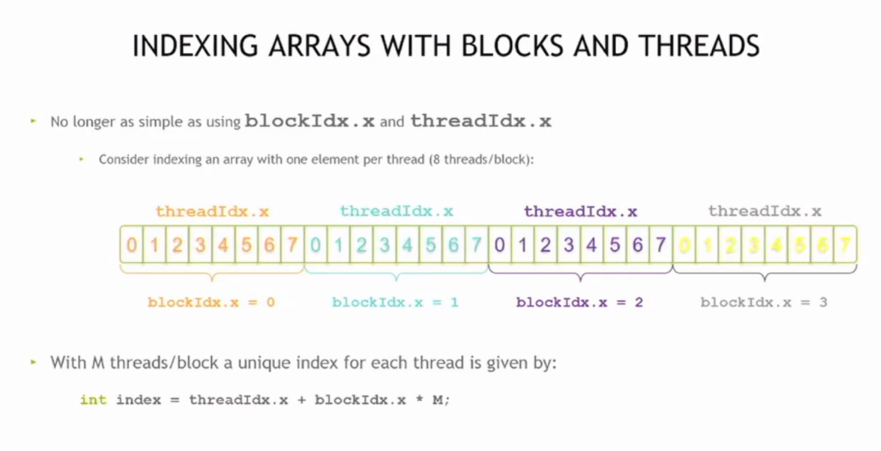
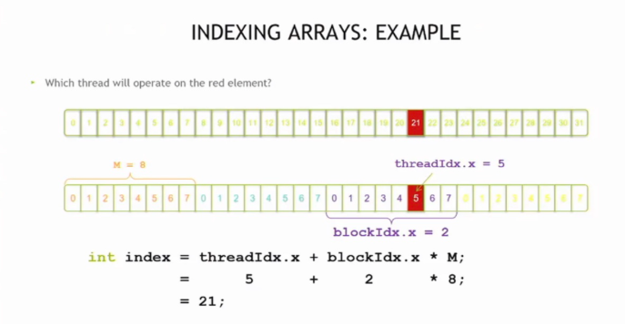
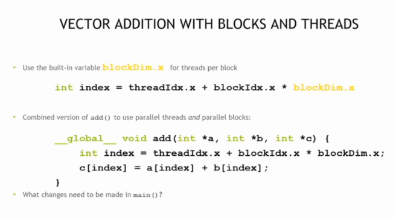

## Thread

### cal

CUDA编程中**通过block和thread的索引（blockIdx.x、threadIdx.x）结合公式`index = threadIdx.x + blockIdx.x * M`来实现数组的并行索引**，以每个块启动8个线程为例直观呈现了多线程并行索引的逻辑。



公式`index = threadIdx.x + blockIdx.x * M`（此处M=8），让线程（threadIdx.x=5）和块（blockIdx.x=2）的索引结合，实现对数组中索引为21的元素进行并行操作的逻辑。




用`threadIdx.x`、`blockIdx.x`和`blockDim.x`通过公式`index = threadIdx.x + blockIdx.x * blockDim.x`实现向量并行加法的核心逻辑与代码示例。



`cudaMemcpy`实现数据在主机与设备间的传输、启动核函数`add`并行执行向量加法，以及通过`free`和`cudaFree`完成内存清理

```c
#define N (2048*2048)
#define THREADS_PER_BLOCK 512

int main(void) {
    int *a, *b, *c; // host copies of a, b, c
    int *d_a, *d_b, *d_c; // device copies of a, b, c
    int size = N * sizeof(int);

    // Alloc space for device copies of a, b, c
    cudaMalloc((void **)&d_a, size);
    cudaMalloc((void **)&d_b, size);
    cudaMalloc((void **)&d_c, size);

    // Alloc space for host copies of a, b, c and setup input values
    a = (int *)malloc(size);
    random_ints(a, N);
    b = (int *)malloc(size);
    random_ints(b, N);
    c = (int *)malloc(size);
    
    // Copy inputs to device
cudaMemcpy(d_a, a, size, cudaMemcpyHostToDevice);
cudaMemcpy(d_b, b, size, cudaMemcpyHostToDevice);

// Launch add() kernel on GPU
add<<<N/THREADS_PER_BLOCK, THREADS_PER_BLOCK>>>(d_a, d_b, d_c);

// Copy result back to host
cudaMemcpy(c, d_c, size, cudaMemcpyDeviceToHost);

// Cleanup
free(a); free(b); free(c);
cudaFree(d_a); cudaFree(d_b); cudaFree(d_c);
return 0;

}

```

> 在核函数`add`里加入`if (index < n)`的判断，再结合`add<<<(N + M-1)/M, M>>>`的启动方式，来处理任意大小向量且避免数组越界

### CUDA编程中使用线程的价值

线程虽增加复杂度，但==具备块所没有的通信和同步机制==，后续将通过新示例深入探讨。后续课程将涵盖的内容，包括`共享内存`、`GPU架构优化`、`原子操作`、`托管内存`、`并发`、`优化分析`和`协作组`等主题