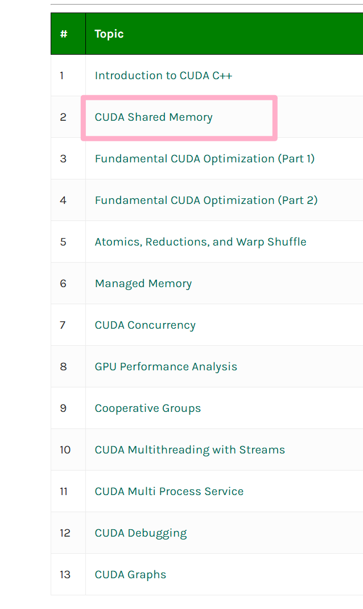
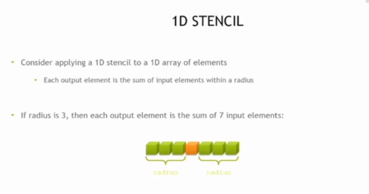
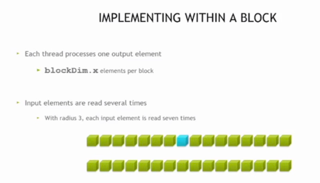
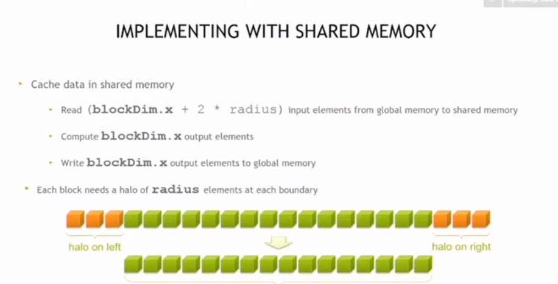
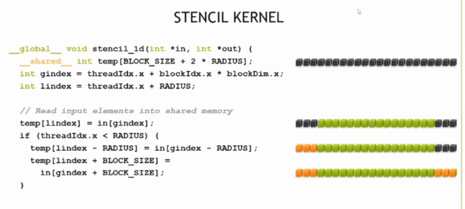
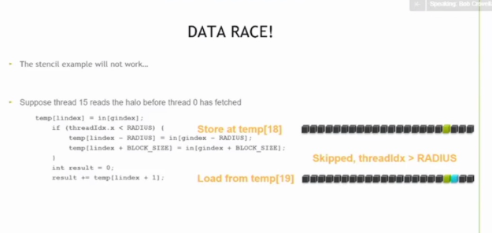
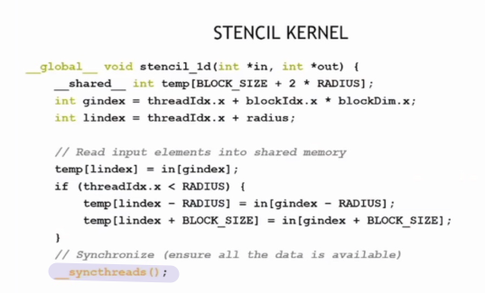
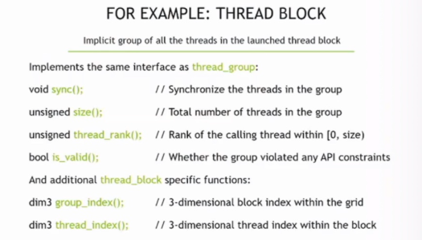

# Lec2 CUDA Shared Memory

## 1D Stencil（一维模板）

即对一维数组中每个输出元素，按半径（如半径3时求和7个输入元素）计算邻域元素的和，用于演示更长数据集的并行处理逻辑。

在一个block内实现1D Stencil的逻辑：每个线程处理一个输出元素，每个block处理`blockDim.x`个元素，输入元素因邻域计算会被多次读取（如半径3时每个输入元素被读7次）。

可以把1D Stencil想象成**“给数组元素‘刷油漆’（计算邻域和）”**的操作： 比如你有一排数字（一维数组），现在要给每个数字“升级”——它的新值是自己和周围几个邻居的和。 - 若“邻居半径”是3，那每个新数字就是自己 + 左边3个 + 右边3个，总共7个数字相加。 - CUDA里用“线程块（block）”来并行干这活：一个线程负责一个新数字，一个块里的线程们一起处理一批数字，这样就能高效完成大量数据的“邻域和计算”了。

 简单说，就是**用并行的方式，批量计算一维数组中每个元素的“邻居总和”**

- 在1D Stencil的这个场景里，“输入被多次读取”是为了**高效利用共享内存**，反而能**减少重复计算和内存访问开销**

理解： 

- 想象你有一堆数字存在“远方的仓库”（GPU全局内存），现在要计算每个数字的邻域和。如果每次算一个数==都去“远方仓库”取邻居==，来来回回跑很多趟，就很慢
-  但如果==把一批数字先搬到“身边的小仓库”（CUDA共享内存==），大家（线程）在“小仓库”里互相借邻居的数来计算，虽然每个数会被邻居多次借用（也就是“多次读取”），但因为“小仓库”离得近，整体速度会快很多——**用“共享内存的重复读取”换“全局内存的频繁访问”**，最终是优化了性能

CUDA中线程间共享数据的机制：

块内线程通过**shared memory（共享内存）**共享数据，它是芯片上极快、用户可管理的内存，用`__shared__`声明且按块分配，其他块的线程不可见。

CUDA中利用共享内存实现1D Stencil的逻辑

将`blockDim.x + 2 * radius`个输入元素从全局内存缓存到共享内存，计算`blockDim.x`个输出元素后写回全局内存，且==每个块需在边界处添加半径大小的halo元素以保证邻域计算完整==。

1D Stencil核函数的代码实现，通过`__shared__`内存缓存输入元素，结合线程索引计算，实现高效的一维模板邻域和并行计算。

CUDA中1D Stencil核函数的核心计算逻辑：==循环遍历半径范围内的共享内存元素求和==，再将结果存储到输出数组，实现高效的一维模板邻域和并行计算。(利用半径 瞬间实现 数组求和)

但是有没有什么问题呢？

有的有的。可能存在 ==数据竞争==

- 若线程15在**线程0未完成halo元素读取**前就访问，会导致数据读取错误，使模板计算逻辑无法正常工作。

### `__syncthreads()`函数

它能==同步一个块内的所有线程==，用于预防RAW/WAR/WAW数据竞争，要求块内==所有线程都到达同步点==，且条件代码需在块内保持一致。

共享内存和线程同步sum

- 用`__shared__`声明块内线程共享的内存（其他块线程不可见）
  - 避免频繁从gpu中调用，共享的一次拿到之后，半径内的线程都可见了，本质是减少io
- 用`__syncthreads()`作为块内线程同步屏障以预防数据竞争，且CUDA线程同步仅支持块级别

### Cooperative Groups（协作组）

它是一种灵活的线程组同步与通信模型，支持线程组间的==可扩展协作、灵活并行分解==等，适用于持久RNN、物理模拟、搜索算法、排序等各类应用

以线程块为例，介绍了CUDA协作组中`thread_block`的接口与功能，包括组内线程同步、线程数量查询、线程排名获取等通用方法，以及块索引、线程索引查询等特有功能~

对比CUDA中缓存与共享内存的特性

说明GV100的L1缓存缩小了共享内存的性能差距：

- 缓存使用更简单且性能达共享内存的90%以上
- 共享内存则在原子操作速度、存储体数量和可预测性上更优

Volta架构在定向测试中共享内存性能从Pascal的70%提升至93%。

remember:  线程抢数据会出错，CUDA只让同一块里的线程同步来解决这个问题