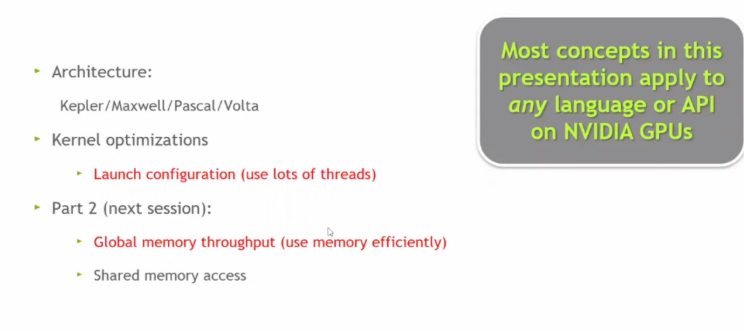
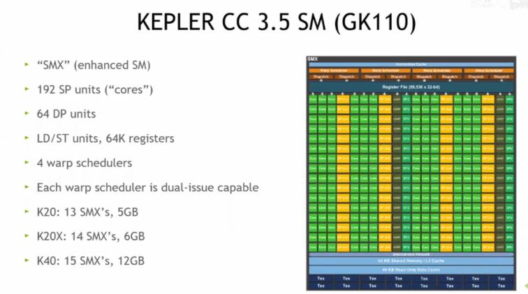

# CUDA Optimization (Part 1)

### 大纲

介绍适用于NVIDIA GPU的架构（如Kepler、Maxwell等系列）

内核优化（如线程启动配置）以及后续关于全局内存吞吐量、共享内存访问等内容

这些概念对各类NVIDIA GPU上的CUDA语言/API实现都适用。

### NVIDIA Kepler架构

（计算能力3.5，GK110核心）的流式多处理器（SM）结构

包含增强型SM单元（SMX）、192个单精度核心、64个双精度核心、存储访问单元、64K寄存器、4个双发射 warp 调度器，还列举了K20、K20X、K40等型号的SMX数量和显存配置

从编程角度展示了该GPU架构的硬件资源情况。

