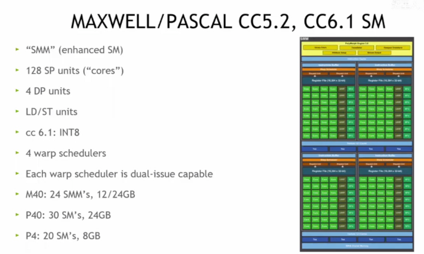
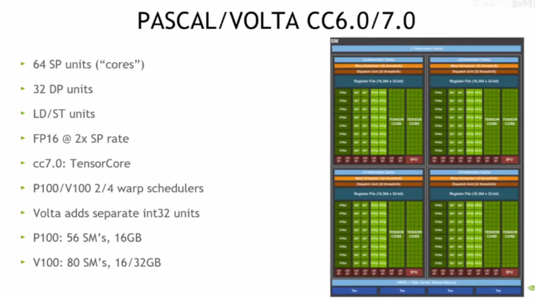
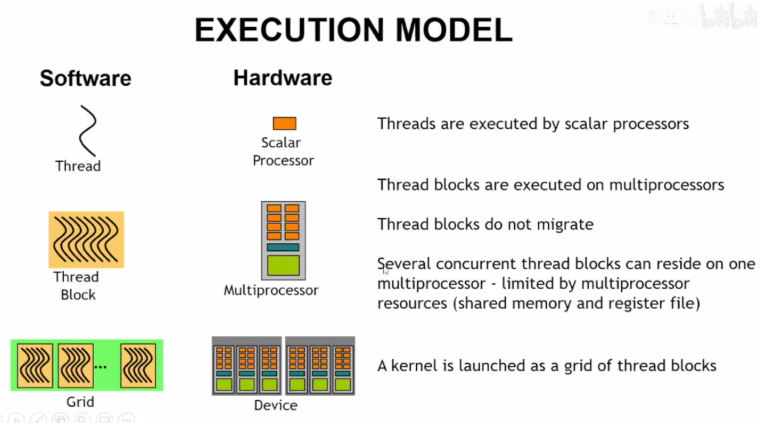
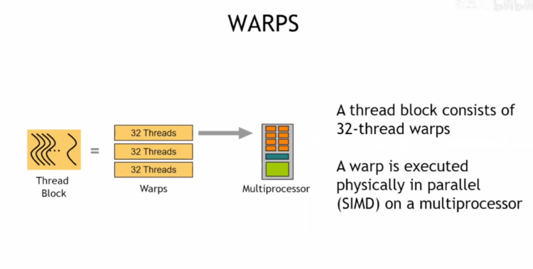
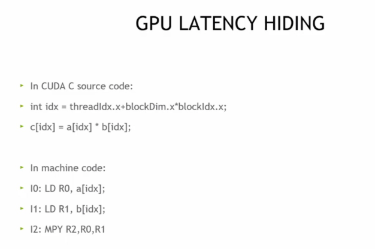
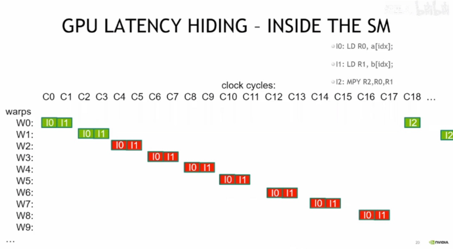
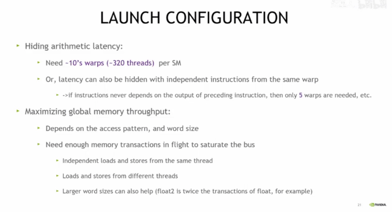
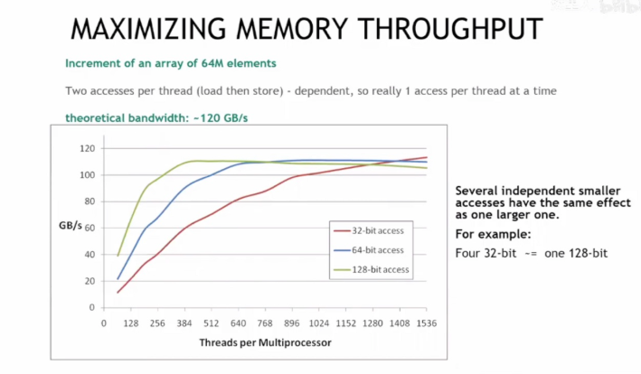

# CUDA Optimization (Part 1)

### 大纲

介绍适用于NVIDIA GPU的架构（如Kepler、Maxwell等系列）

内核优化（如线程启动配置）以及后续关于全局内存吞吐量、共享内存访问等内容

这些概念对各类NVIDIA GPU上的CUDA语言/API实现都适用。

### NVIDIA Kepler架构

（计算能力3.5，GK110核心）的流式多处理器（SM）结构

包含增强型SM单元（SMX）、192个单精度核心、64个双精度核心、存储访问单元、64K寄存器、4个双发射 warp 调度器，还列举了K20、K20X、K40等型号的SMX数量和显存配置

从编程角度展示了该GPU架构的硬件资源情况。

### NVIDIA Maxwell/Pascal架构

（计算能力5.2、6.1）的流式多处理器（SM）结构

其增强型SM单元（SMM）、128个单精度核心、4个双精度核心等硬件资源，以及M40、P40、P4等型号的SMM/SM数量和显存配置

### NVIDIA Pascal/Volta架构

（计算能力6.0/7.0）的流式多处理器（SM）结构

64个单精度核心、32个双精度核心、存储访问单元等硬件资源，Volta架构还包含TensorCore和独立int32单元，同时列举了P100、V100等型号的SM数量和显存配置

### 对比

| 架构维度       | Kepler（CC3.5）                                              | Maxwell/Pascal（CC5.2/6.1）                                  | Pascal/Volta（CC6.0/7.0）                                    |
| -------------- | ------------------------------------------------------------ | ------------------------------------------------------------ | ------------------------------------------------------------ |
| **计算核心**   | -192 个 SP（单精度）核心-64 个 DP（双精度）核心              | -128 个 SP 核心-4 个 DP 核心                                 | -64 个 SP 核心-32 个 DP 核心-Volta 加入 TensorCore（AI 计算加速） |
| **调度与执行** | -4 个双发射 warp 调度器                                      | -4 个双发射 warp 调度器                                      | -P100/V100 为 2/4 个 warp 调度器-Volta 新增独立 int32 单元   |
| **内存与型号** | -K20（13SMX，5GB）、K20X（14SMX，6GB）、K40（15SMX，12GB）   | -M40（24SMM，12/24GB）、P40（30SM，24GB）、P4（20SM，8GB）   | -P100（56SM，16GB）、V100（80SM，16/32GB）                   |
| **优劣分析**   | -**优势**：双精度性能强，适合科学计算类高密度浮点任务；-**劣势**：功耗较高，架构相对老旧，在 AI 等新场景支持不足。 | -**优势**：功耗控制优秀，单精度能效比提升，适合通用计算与轻量图形任务；-**劣势**：双精度性能大幅削弱，对超算类场景支持不足。 | -**优势**：Volta 的 TensorCore 使 AI 训练 / 推理性能爆发，架构灵活性和能效比进一步优化；-**劣势**：Pascal 版本双精度仍弱于 Kepler，架构设计更偏向新型计算场景（如 AI），传统科学计算场景适配需权衡。 |

Kepler 胜在双精度算力，适合传统科学计算

Maxwell/Pascal 赢在能效，适合通用计算

Pascal/Volta（尤其是 Volta）靠 TensorCore 在 AI 领域封神，是人工智能时代的架构先锋。

---

**AI 计算的需求**和**TensorCore 的设计优势**两方面来拆解：

### 1. AI 任务的核心计算模式：矩阵乘法

人工智能（尤其是深度学习）的核心操作是**矩阵乘法**，比如神经网络中的卷积、全连接层，本质都是大量的矩阵运算。以一个简单的神经网络为例，输入数据是一个矩阵，权重也是一个矩阵，两者相乘才能得到输出 —— 而这样的运算在深度神经网络中会被重复数十亿次。

### 2. 传统 GPU 核心的 “力不从心”

普通的 GPU 核心（如之前提到的 SP 单元）是为**通用计算**设计的，它可以处理各种类型的计算任务，但在矩阵乘法这种 “重复性极高、模式很固定” 的运算上，效率并不够。打个比方，传统核心就像 “全能手”，什么活都能干，但干 “流水线式的矩阵乘法” 时，会有很多资源被浪费。

### 3. TensorCore 的 “精准打击”

TensorCore 是专门为**矩阵乘法和累加操作**量身定做的硬件单元。它就像一个 “矩阵乘法专用工厂”：

- 它可以把多个数据打包在一起，**一次性完成大量的矩阵乘法 + 累加**，效率比传统核心高几十倍甚至上百倍。
- 比如在深度学习中，训练一个大模型时，TensorCore 能让原本需要几天的计算，压缩到几小时甚至更短。

### 4. Volta 架构的 “封神” 逻辑

Volta 是第一个大规模集成 TensorCore 的 GPU 架构，它相当于给 AI 计算装上了 “涡轮增压发动机”：

- 以前用普通 GPU 训练 AI 模型，又慢又贵；有了 TensorCore 后，训练速度飙升，成本大幅降低，这直接推动了人工智能从 “实验室技术” 走向 “产业级应用”（比如 ChatGPT 这类大模型的训练，就依赖大量带 TensorCore 的 GPU）。
- 这种 “为 AI 计算定制硬件” 的思路，让 Volta 成为人工智能时代的架构标杆，后续的 GPU（如 Turing、Ampere）也都在这个基础上持续升级 TensorCore 的能力。

总结：因为 ==AI 最核心的计算是矩阵乘法，而 TensorCore 是专门用来高效做矩阵乘法的 “超级加速器”==，Volta 把它大规模用上后，AI 训练和推理的速度、效率都迎来了质变，所以成了 AI 领域的 “封神之作”~

### CUDA执行模型

软件层面的线程、线程块、网格与硬件层面的标量处理器、多处理器、设备之间的对应关系，解释了线程由标量处理器执行、线程块在多处理器上运行且不迁移、==一个内核以线程块网格形式启动==等CUDA程序执行的核心逻辑

### CUDA中Warp（线程束）

==线程块由32线程的Warp组成==，Warp在多处理器上以SIMD（单指令多数据）方式物理并行执行，是CUDA并行计算的底层执行单元之一

这就像学校组织活动，**“Warp（线程束）” 是为了让 GPU 的并行计算更高效、更有秩序而设置的 “分组管理单元”**，我们可以从这几个角度理解：

1. GPU 硬件的 “执行习惯”

GPU 的==**标量处理器（处理核心）是按 “一批 32 个线程==的模式来执行指令**的。就好比食堂打饭，窗口一次能同时给 32 个人打饭（硬件设计如此），所以得把线程先分成每 32 个一组（Warp），才能匹配硬件的执行节奏。

2. 让并行计算更 “高效”

如果没有 Warp，线程是 “零散执行” 的，会导致硬件资源大量浪费。而 Warp 把 32 个线程捆成一组，让硬件能 “一次性处理一批”，就像工厂流水线一次性加工 32 个零件，效率直接拉满。

3. 解决 “线程执行不同步” 的问题

在并行计算中，线程之间可能会有 “分支”（比如 if-else 逻辑）。Warp 的存在能让**同组的 32 个线程尽可能同步执行**—— 就算有分支，也能通过 “统一调度” 减少性能损耗，保证整体执行的流畅性。

简单来说，**Warp 是为了适配 GPU 硬件的执行模式，让大量线程的并行计算既高效又有序，是 CUDA 实现高性能并行的 “底层小助手”**

### CUDA启动配置

按序发指令、线程阻塞时切换线程隐藏延迟（如全局内存延迟超100周期、算术操作延迟不足100周期），最终需启动足够线程来隐藏延迟以实现高效执行。

> GPU 如何通过指令执行流程隐藏延迟以提升性能？

（CUDA C 源码中数组元素相乘，机器码中先加载操作数再乘法）

==GPU在流式多处理器（SM）内部通过切换不同Warp（线程束）来隐藏指令执行延迟==的过程，以内存加载和乘法指令为例，说明在一个Warp等待操作数时，GPU会调度其他Warp执行，从而保持硬件持续高效运行。

**GPU“延迟隐藏”的原理**：当一个Warp（线程束）在执行内存加载（I0、I1）这类`有延迟的操作时，GPU会切换到其他Warp继续执行`，以此让硬件一直保持忙碌，不会因为等待延迟而空闲

每 SM 约 10 个 Warp（约 320 线程）隐藏算术延迟，以及通过优化内存访问模式、字长等方式最大化全局内存吞吐量的策略

#### CUDA 中最大化内存吞吐量

以 64M 元素数组递增为例，说明==通过不同位宽（32/64/128 位）的内存访问，以及多线程并发访问==，可使理论带宽接近 120GB/s，同时独立小访问可等效于大访问以优化吞吐量。

> GPU 通过**多 Warp 切换实现的 “延迟隐藏”**，本质就是一种**异步并行的 “各司其职”**

 CUDA 中 “占用率（Occupancy）” 

==它是衡量流式多处理器（SM）实际线程负载与理论峰值负载的指标==，受每线程寄存器数、线程块线程数、共享内存使用等因素限制，CUDA 还提供占用率计算器辅助分析。

CUDA优化总结

GPU是大规模线程并行且具备延迟隐藏的设备，需通过每SM启动足够线程、足够线程块来加载GPU，并借助分析/剖析工具（如Nsight Compute）进行优化。
