# CUDA Optimization (Part 2)

### NVIDIA GPU 内存架构图

主机（CPU、芯片组、DRAM）与设备（GPU 的多处理器、寄存器、共享内存、L1/L2 缓存及各类 DRAM 内存）的内存层级与交互关系。

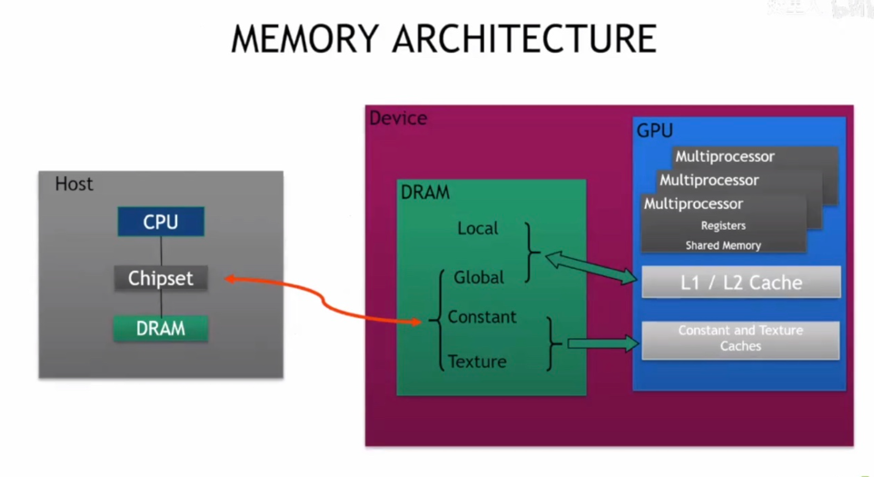

### NVIDIA GPU 内存层级

多个流多处理器（SM）通过寄存器、L1 缓存、共享内存（SMEM），经 L2 缓存与全局内存的层级架构关系

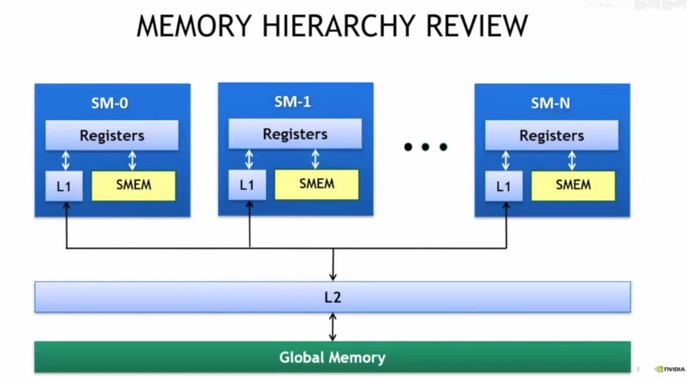

NVIDIA GPU 全局内存（GMEM）操作：加载默认走 ==L1→L2→GMEM==的缓存路径（粒度 128 字节），存储时使 L1 失效并回写 L2。

> 理解 “存储时使 L1 失效并回写 L2” 的设计

从**缓存一致性**和**性能优化**的角度来拆解：

1. 为什么要 “使 L1 失效”？

GPU 里每个流多处理器（SM）都有自己的 L1 缓存。如果一个线程在 L1 里存了数据，而其他 SM 的线程也可能访问同一块全局内存，为了保证**所有线程看到的内存数据是一致的**，当当前 SM 的 L1 里有旧数据时，必须先让 L1 里的这个数据 “失效”，这样其他 SM 再访问时，才会去 L2 或全局内存拿最新的版本。

2. 为什么要 “回写 L2”？

L2 是多个 SM 共享的缓存。把数据回写到 L2，一方面能让**其他 SM 更快地读到最新数据**（不用直接去访问延迟很高的全局内存）；另一方面，L2 的容量比 L1 大，能暂时保存更多数据，后续如果有其他操作要用到这些数据，就可以从 L2 直接取，减少对全局内存的访问次数，从而**提升整体性能**。

简单来说，这两步是为了在 “数据一致性” 和 “访问性能” 之间找平衡 —— ==既保证多线程、多 SM 之间数据不错乱，又尽可能减少慢腾腾的全局内存访问==

###  NVIDIA GPU 缓存加载

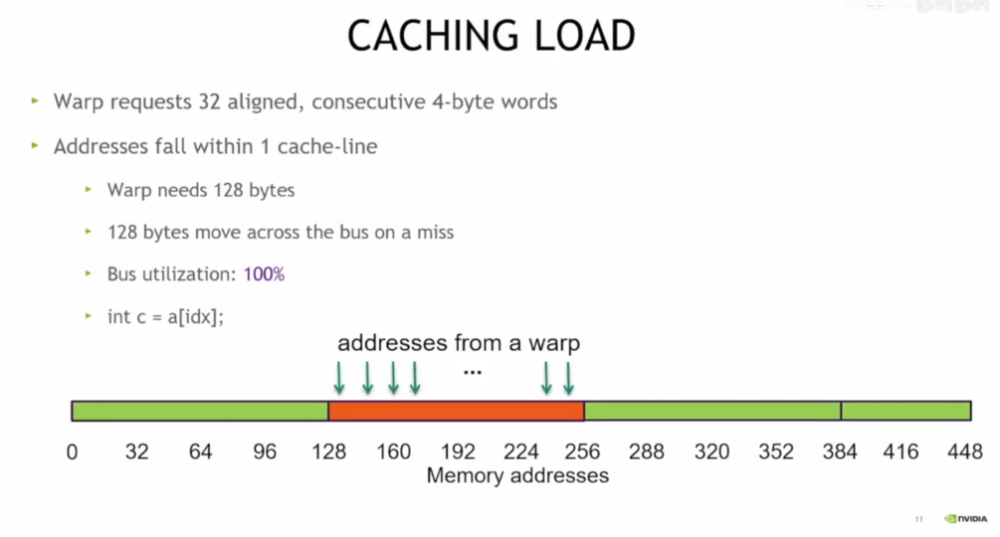

一个 warp 请求 32 个对齐的连续 4 字节数据，地址在一个缓存行内，需 128 字节，未命中时总线传输 128 字节且利用率 100%。

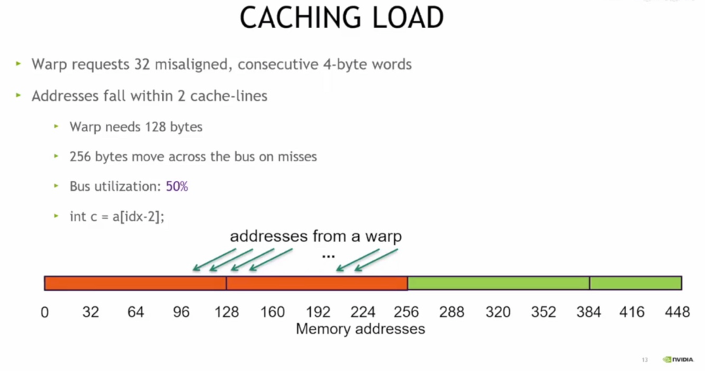

一个 warp 请求 32 个未对齐的连续 4 字节数据，地址跨 2 个缓存行，需 128 字节，未命中时总线传输 256 字节且利用率 50%。

把 GPU 的**缓存加载**想象成 “快递取件”：

- **第一张图（地址对齐，在一个缓存行里）**：就像你一次取 32 个 “快递”，它们都整整齐齐挤在一个 “快递柜（缓存行）” 里。取的时候一次把 128 字节全搬过来，“快递车（总线）” 的空间被用满了（利用率 100%），效率拉满！
- **第二张图（地址没对齐，跨两个缓存行）**：这 32 个 “快递” 散在两个 “快递柜” 里了。取的时候得把两个柜子的 256 字节都搬过来，但其实你只需要 128 字节的快递，相当于 “快递车” 只装了一半货（利用率 50%），效率就低了。

总结一下：**==地址对齐能让 GPU 加载数据时少搬多余的 “快递”，让数据传输的 “车” 跑得更高效==**

---

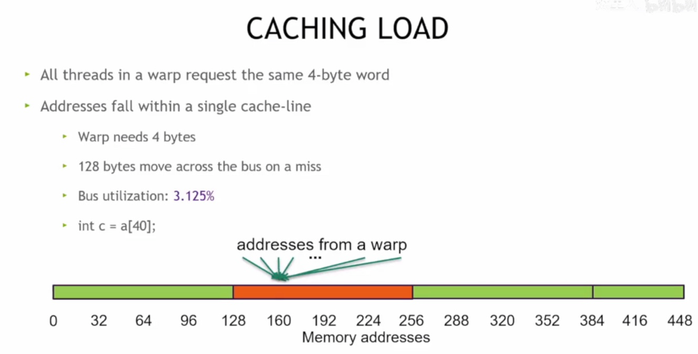

一个 warp 的所有线程请求同一 4 字节数据，地址在单个缓存行内，需 4 字节，未命中时总线传输 128 字节且利用率 3.125%。

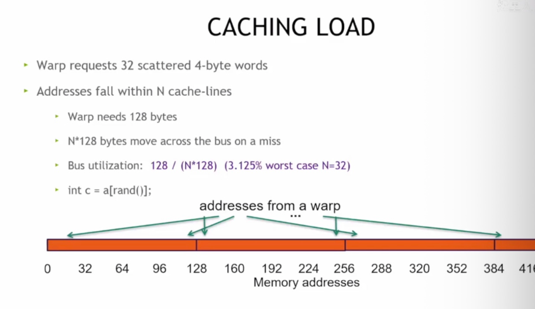

个 warp 请求 32 个零散的 4 字节数据，地址跨 N 个缓存行，需 128 字节，未命中时总线传输 N*128 字节，总线利用率为 128/(N*128)（最坏情况 N=32 时利用率 3.125%）。

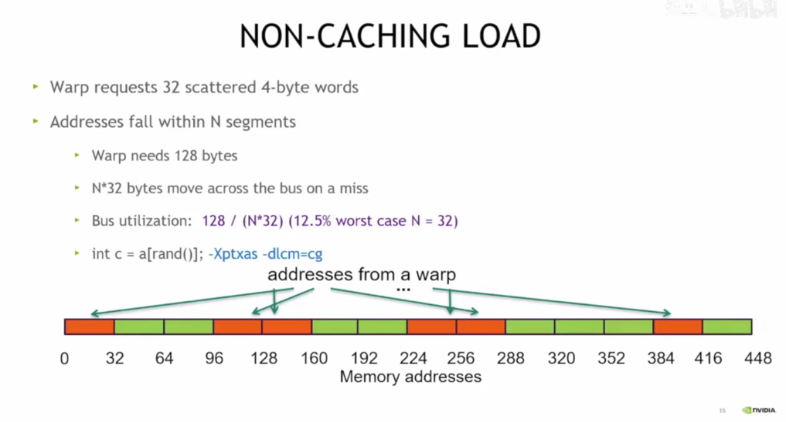

NVIDIA GPU 非缓存加载说明，一个 warp 请求 32 个零散的 4 字节数据，地址跨 N 个段，需 128 字节，未命中时总线传输 N*32 字节，总线利用率为 128/(N*32)（最坏情况 N=32 时利用率 12.5%），需通过特定编译选项启用。

把 GPU 取数据想象成 **“食堂打饭”**：

- **第一张（缓存加载，零散数据）**：你和 32 个同学（一个 warp）都要打不同位置的 “饭（4 字节数据）”，这些饭散在 N 个 “餐柜（缓存行）” 里。取的时候得把每个餐柜的 128 字节都搬过来，但其实只需要 128 字节的饭，相当于 “送饭车（总线）” 只装了一点点货（最坏情况利用率才 3.125%），效率特别低。
- **第二张（非缓存加载，零散数据）**：还是 32 个同学打零散的饭，但这次走 “不缓存” 的通道。送饭车每次搬 32 字节，虽然还是零散的，但利用率能到 12.5%（比上一种好点），不过得用特殊编译选项开启这种模式。

简单来说：**数据越零散，GPU 取数据时的 “送饭车” 就越空，效率就越低**。这些图就是在教你 —— ==写代码时尽量让数据 “扎堆”==，别让 GPU 的 “送饭车” 跑空车～

---

NVIDIA GPU 全局内存（GMEM）优化指南，建议追求完美数据合并（地址对齐、连续访问）、保证足够并发访问以饱和总线、充分利用各级缓存来提升性能。

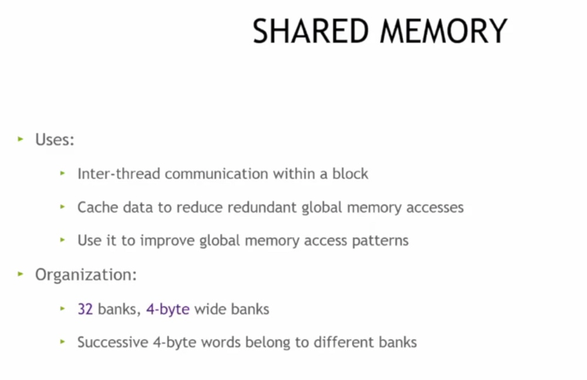

NVIDIA GPU 共享内存：其用于块内线程通信、缓存数据减少全局内存冗余访问及优化全局内存访问模式，组织上有 32 个 4 字节宽的存储体，连续 4 字节数据分属不同存储体。

NVIDIA GPU 共享内存性能：其每多处理器存储体通常每 1-2 时钟周期传输 4 字节，按 warp（32 线程）下发访问，==同存储体多线程访问会串行化，多线程访问同数据可一次获取==（多播）。

- **共享内存的作用**：就像班级里的公共储物柜，同一小组（线程块）的同学（线程）可以在里面存东西、传纸条（线程间通信），还能把常用的 “课本”（数据）存在这里，不用每次都跑回 “学校仓库（全局内存）” 取，省时间！
- **共享内存的结构**：这个储物柜被分成了 32 个 “小格子（存储体）”，每个格子宽 4 字节。连续的 4 字节数据会被分到不同小格子里，这样大家取的时候不会挤着。
- **共享内存的性能**：从每个小格子取数据很快，差不多 1-2 个时钟周期就能取 4 字节。但得按 32 人一组（warp）来取。如果一组人都去抢同一个小格子的东西，就得排着队取（串行化）；但如果大家取同一个 “课本” 的不同部分，就能一次取到（多播），特别高效！

简单来说：**共享内存是 GPU 里的 “高速==公共储物柜==”，让同组线程快速传数据、存常用数据，还得注意==别扎堆抢同一个== “小格子”，这样速度才最快**

## 矩阵转置

#### NVIDIA GPU 共享内存存储体寻址

两种无存储体冲突的情况，线程可分别或交叉访问不同存储体以实现高效数据读取。

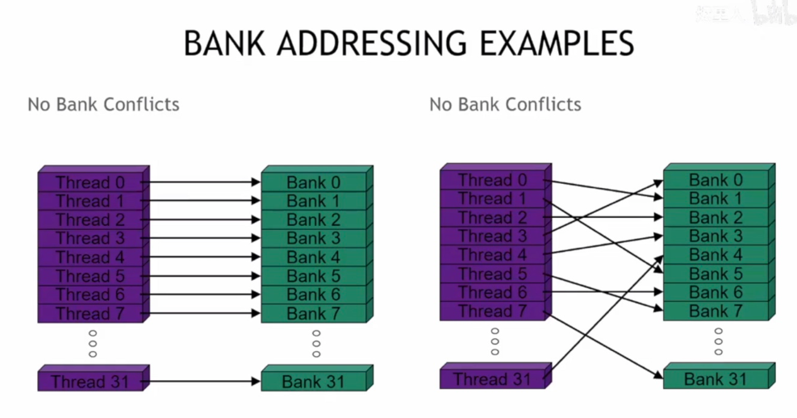

2 路和 16 路存储体冲突的情况，线程因访问同一存储体导致需串行化执行以完成数据读取。

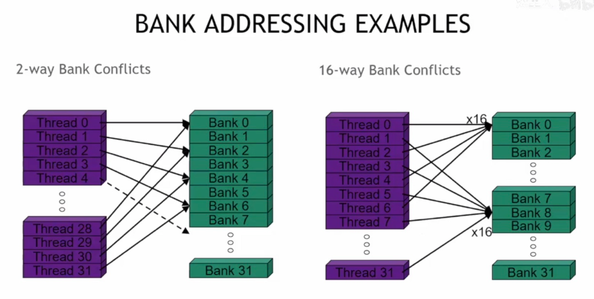

32×32 共享内存数组为例，当 warp 访问一列时会出现 32 路存储体冲突（warp 内线程访问同一存储体）。

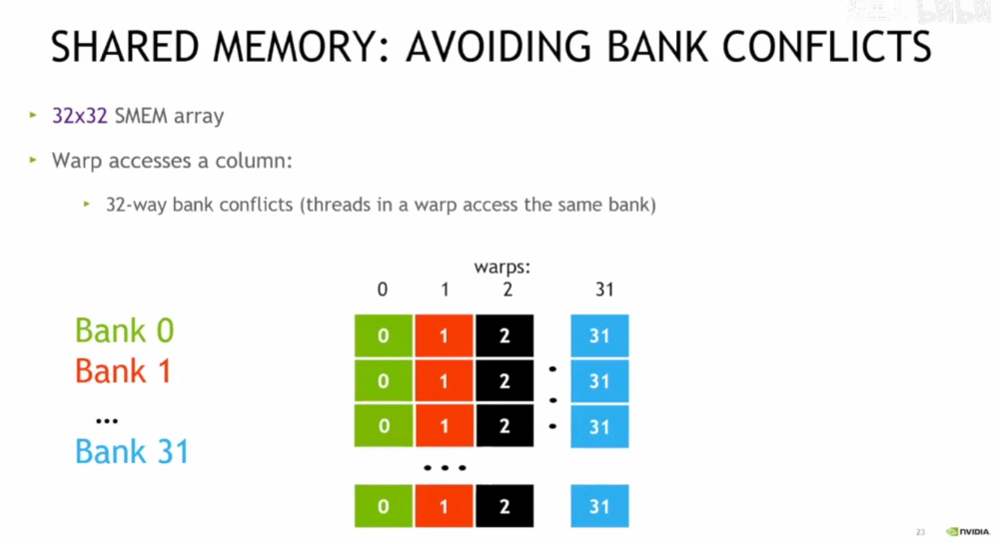

- **第一张图（无冲突）**：32 个同学（线程）一人一个 “储物柜格子（存储体）”，大家各取各的，不用排队，效率拉满！
- **第二张图（有冲突）**：同学扎堆抢少数格子了 —— 要么 2 个同学抢一个格子（2 路冲突），要么 16 个同学抢一个格子（16 路冲突）。抢同一个格子的同学得排队取东西，速度就慢了。
- **第三张图（避免冲突的反面教材）**：要是 32 个同学都去抢同一列的 “格子”，就会出现 32 路冲突，相当于全班挤一个格子取东西，那速度能慢到姥姥家……

> **共享内存的 “格子（存储体）” 得让线程分散着用，别扎堆抢，这样 GPU 取数据才会快～**

添加一列填充将共享内存数组设为 32×33，使 warp 访问列时能命中 32 个不同存储体，从而避免存储体冲突。

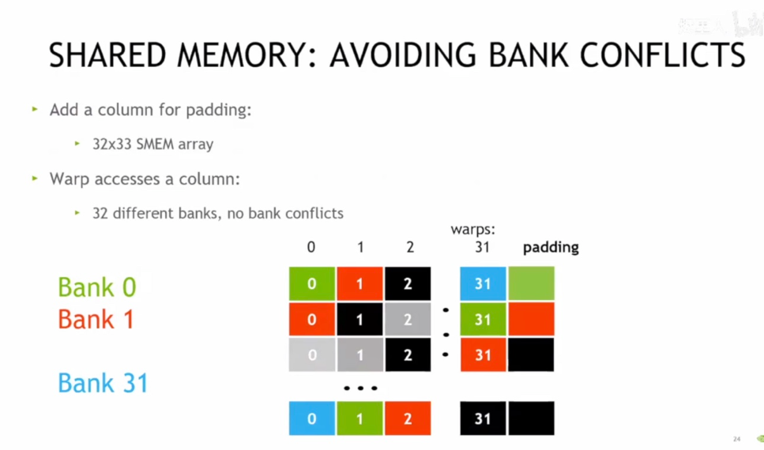

矩阵转置将矩阵的行与列互换的操作，可==用于数据布局优化==以提升 GPU 内存访问效率、线性代数计算（如矩阵乘法）、图像处理（如像素排列调整）等场景，是实现高性能计算和数据处理的基础手段。

#### sum

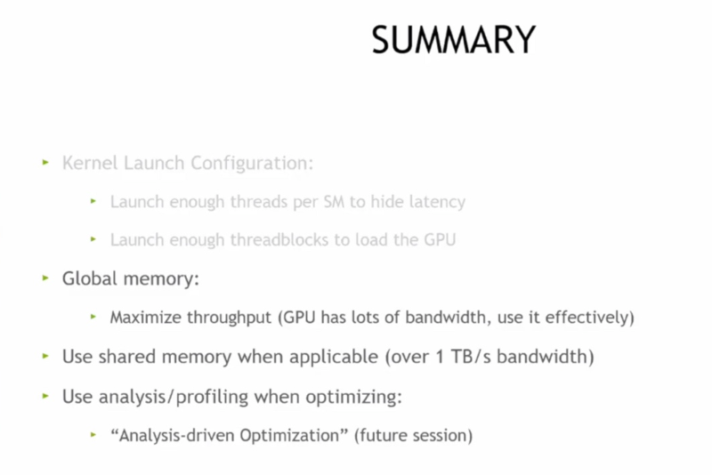

内核启动配置（足够线程和线程块隐藏延迟、满载 GPU）、全局内存（最大化吞吐量）、合理使用共享内存及基于分析的优化方法。

#### CUDA 性能分析的实操

通过 Nsight Compute 工具我们可以看到内核启动统计、占用率等指标，用于分析 GPU 程序的资源使用和性能瓶颈。

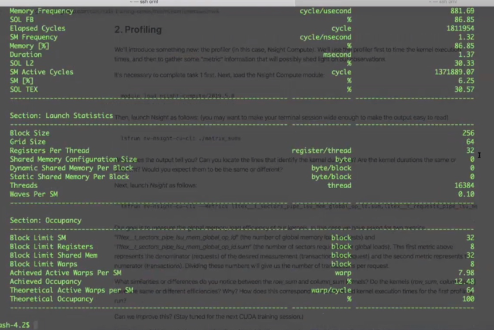