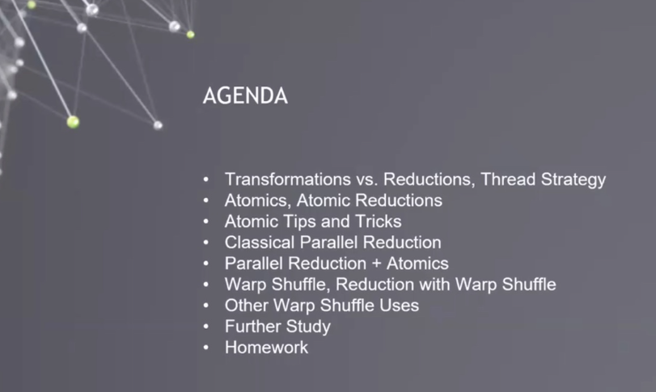
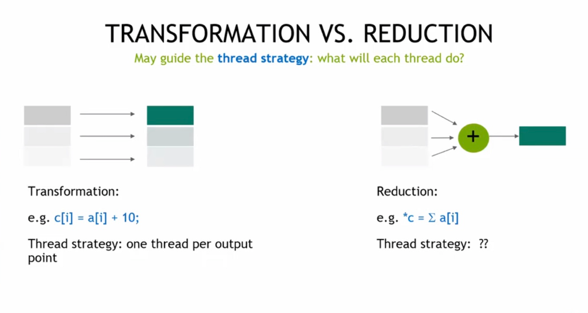
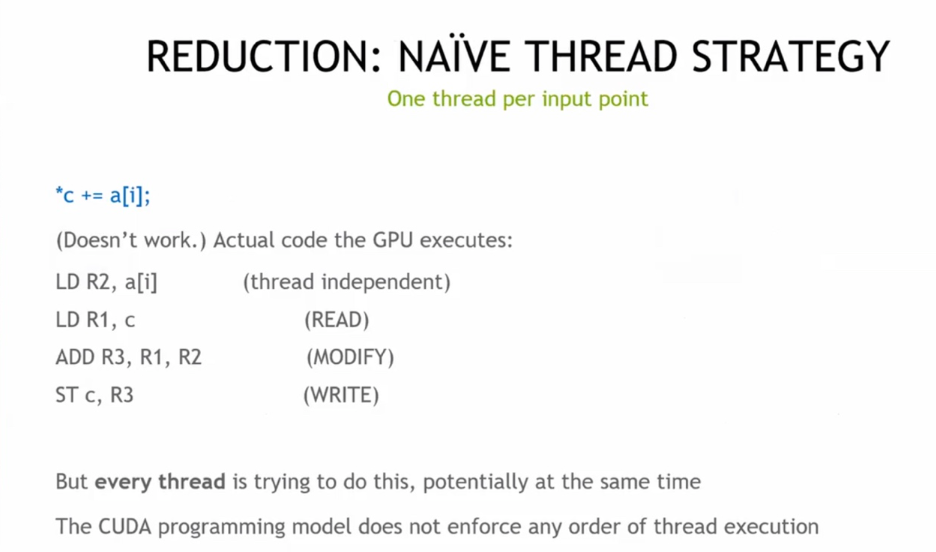
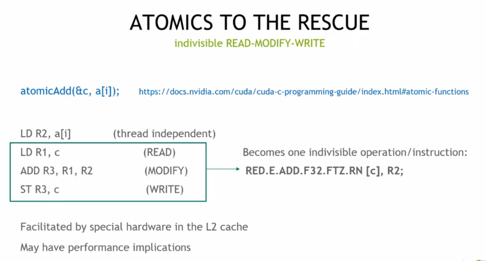
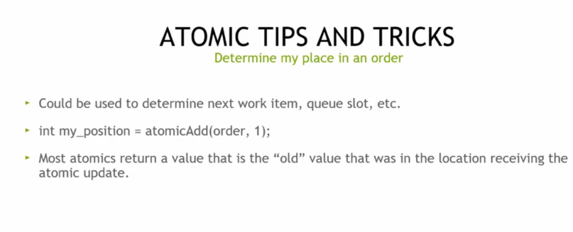
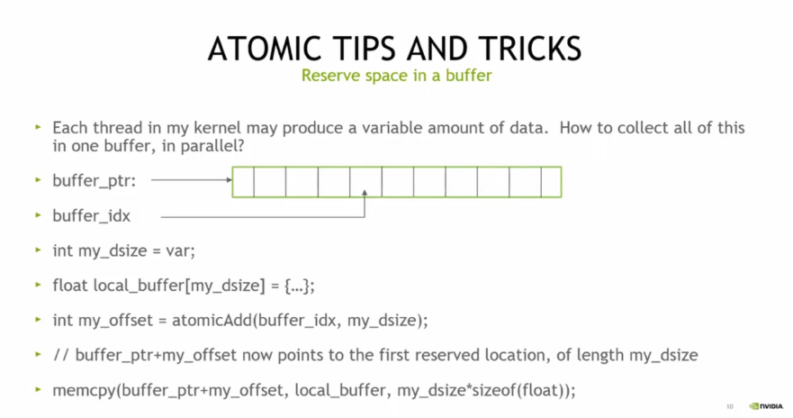

# lec5 Atomics, Reductions, and Warp Shuffle

GPU 并行计算的课程议程，涵盖变换与归约的线程策略、原子操作、并行归约、Warp Shuffle 等 GPU 编程核心技术要点，讲解如何高效利用 GPU 进行并行计算优化。

## 归约（Reduction）

GPU 并行计算中 “变换（Transformation）” 与 “归约（Reduction）” 的对比，变换是每个线程处理一个输出点（如`c[i] = a[i] + 10`），归约是多线程协作将多个输入归为一个结果（如求和`*c = Σa[i]`），用于指导 GPU 线程策略设计。

 GPU 并行归约的朴素线程策略：每个输入点分配一个线程执行`*c += a[i]`式操作，但因多线程同时读写共享变量且线程执行无固定顺序，这种策略实际不生效，用于说明 CUDA 编程中归约的线程竞争问题。

## Atomics

CUDA 中原子操作（如 atomicAdd）如何解决并行归约的线程竞争问题，它将读 - 改 - 写操作变为不可分割的指令，由 L2 缓存特殊硬件支持，虽能保证正确性但可能影响性能。

 CUDA 中的其他原子操作，包括求最大 / 最小、加减、增减、交换 / 比较交换、位运算等类型，支持 int、float 等多种数据类型，用于 GPU 并行编程中解决多线程数据竞争问题。

CUDA 原子操作的技巧，可通过`atomicAdd`确定线程执行顺序（如工作项、队列槽的位置），且原子操作通常返回操作前的 “旧值”，用于 GPU 并行编程中有序分配任务。

CUDA 原子操作的技巧，通过`atomicAdd`为每个线程在共享缓冲区中预留可变长度的空间，实现多线程并行收集可变数据到同一缓冲区。

