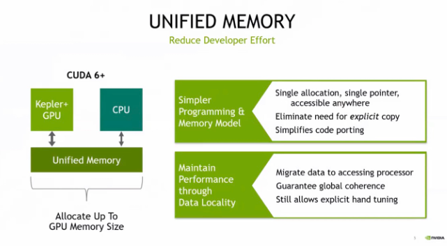
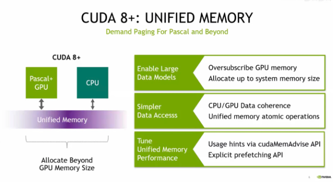
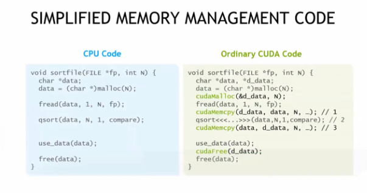
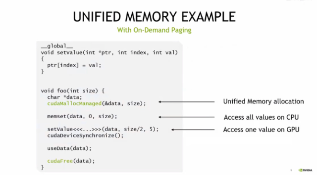
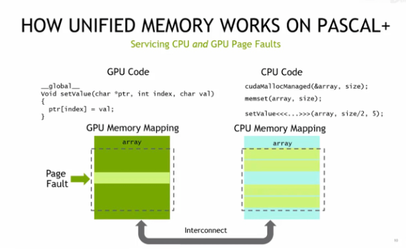
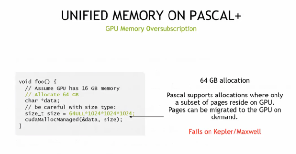
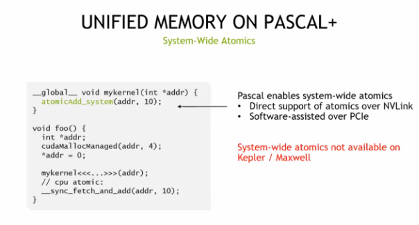

# lec6 Managed Memory

### CUDA 6 + 时代的统一内存（Unified Memory）

让 Kepler 架构 ==GPU 和 CPU 能通过单块内存区域协同工作==，既简化了编程模型（单分配、单指针、无需显式拷贝），又通过数据本地化保证性能，大幅降低了开发者在异构内存管理上的工作量。

CUDA 8 + 的统一内存技术支持 Pascal 及后续架构 GPU，==可超量使用 GPU 内存===（分配规模突破 GPU 自身显存限制），简化 CPU/GPU 数据访问与一致性管理，还能通过 API 调优性能，助力开发者高效处理大规模数据模型。

> 实现超量

系统==会自动把多余的内存页 “挪” 到 CPU 内存里==；要是想进一步优化，还可以用`cudaMemAdvise`这类 API 给内存访问 “提建议”，或者提前把数据 “搬” 到要用的设备上，这样能让性能更好些。

 CUDA 统一内存技术如何简化内存管理

- 左侧 CPU 代码无需显式处理 GPU 内存分配、拷贝

- 右侧传统 CUDA 代码需手动完成的内存操作（分配、拷贝、释放）被大幅简化，让开发者编写异构内存程序更高效。

（这张图算是cuda梦开始的地方了，cuda底层启发的感知机（雾

`qsort` 是 C 语言标准库的快速排序 API，能对任意类型数组按自定义比较规则进行高效排序，是灵活且实用的通用排序工具。

关于qsort，大一学C语言梦开始的地方，那时感觉脑子还不是很好，一点知识就要学挺久...但还是挺好玩的，回看感觉也挺神奇的，传送：[15.C与指针--超全总结](https://blog.csdn.net/2301_80171004/article/details/136834259?ops_request_misc=%257B%2522request%255Fid%2522%253A%25222ac4d7ab5e7508ebde1bab72b19ac85a%2522%252C%2522scm%2522%253A%252220140713.130102334.pc%255Fblog.%2522%257D&request_id=2ac4d7ab5e7508ebde1bab72b19ac85a&biz_id=0&utm_medium=distribute.pc_search_result.none-task-blog-2~blog~first_rank_ecpm_v1~rank_v31_ecpm-2-136834259-null-null.nonecase&utm_term=qsort&spm=1018.2226.3001.4450)

CUDA 统一内存（`cudaMallocManaged`）让同一块内存可在 CPU 和 GPU 代码中等效使用，==结合按需分页机制==，开发者==无需手动==处理内存跨设备访问，大幅简化异构编程的内存管理。

### Interconnect（互联）

在 Pascal + 架构上，CUDA 统一内存通过 Interconnect（互联）机制，为 GPU 和 CPU 分别==维护内存映射==，自动处理跨设备的页故障，实现 CPU 与 GPU 对同一块内存的协同访问。

Pascal 之前架构（或 Windows 下 CUDA 9.x+）的统一内存，在核函数启动时批量迁移数据，无并发访问和按需迁移，需用`cudaMallocManaged`替代`malloc`、`cudaFree`替代`free`，且核函数同步后数据才对 CPU 可见。

Pascal + 架构的 CUDA 统一内存支持超量使用 GPU 内存（如 16GB GPU 可分配 64GB），仅按需迁移部分内存页到 GPU，而 Kepler/Maxwell 架构不支持此特性。

> 16GB GPU可分配64GB

GPU 的显存就像它的 “小仓库”，本来只能装 16GB 东西。但==有了统一内存技术==，它==可以把暂时不用的东西先放到 CPU== 的 “大仓库”（系统内存）里，要用的时候再拿回来。

这样整体能调配的内存就不止 16GB 了，甚至能达到 64GB，就像==借了 CPU 的内存来扩展自己的可用空间==

Pascal + 架构的 CUDA 统一内存支持系统级原子操作，==GPU 和 CPU 可通过 NVLink 或 PCIe 协同执行原子指令==，而 Kepler/Maxwell 架构不具备此特性。