# lec7 CUDA Concurrency

 CUDA 编程中 GPU 数据处理的两种流程，对比了 naive 实现（三步串行）和理想的重叠执行（三步部分并行），通过任务并行来减少整体处理时长、提升 GPU 性能的优化思路。

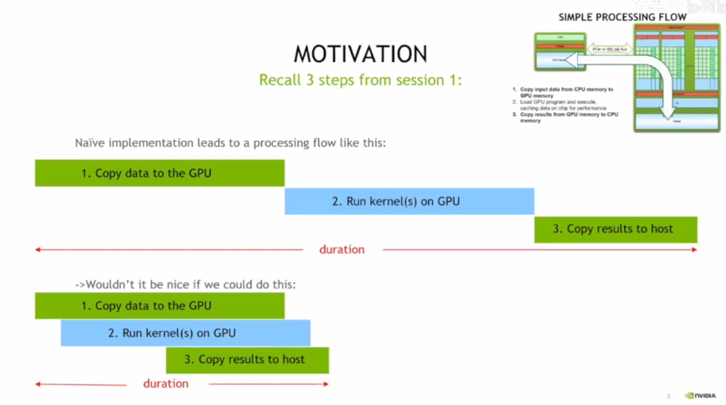

 CUDA 中的==页锁定（非分页）内存==，它能加速主机与设备间的数据拷贝，支持与 CPU、GPU 的异步内存复制，还介绍了其使用的 API（如 cudaHostAlloc 等）及 “从主机虚拟（分页）内存中移除” 的特性。

- 页锁定内存通过 **“固定在物理内存里” 和 “支持异步传输”** 这两个特性，避免了内存分页带来的额外开销，从而实现了数据拷贝的加速。

### CUDA Streams 和异步 API

下图介绍了默认 API 的特性，以及流和异步函数在实现 CPU 与 GPU 数据拷贝、内核执行并行化，进而提升并发性能的作用。

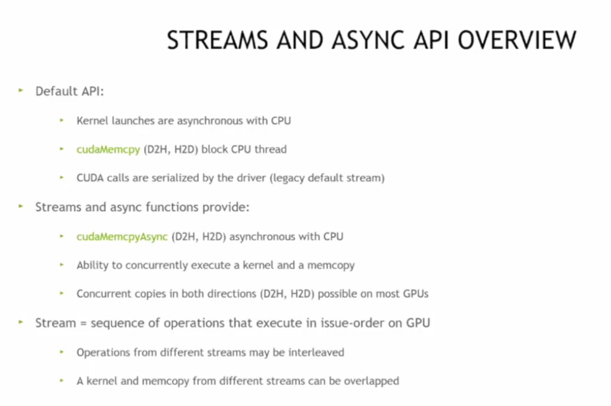

 CUDA 流的语义：同流操作按提交顺序执行，异流操作无固定执行顺序，操作通常指 cudaMemcpyAsync、内核调用等带流参数的 CUDA API 调用。

GPU 是个超级能干的 “流水线工厂”，CPU 是工厂的 “管理员”。

- **数据处理流程**：管理员先把原材料（数据）搬到工厂（GPU）→ 工厂开工生产（运行内核）→ 管理员再把成品搬回去。这三步如果一个接一个来，就很浪费时间；如果能在工厂生产时，管理员提前准备下一批材料或者提前搬一部分成品，效率就高了（这就是并行优化的思路）。
- **页锁定内存**：就像给原材料找了个 “固定仓库”，不会被随便挪走。这样工厂取材料、送成品时就不用到处找，速度自然快了。
- **流和异步 API**：把工厂的流水线分成好几个 “小生产线（流）”，不同生产线可以同时干活。比如生产线 1 在生产时，生产线 2 可以同时搬材料，这样整体效率就上去了。
- **流的语义**：同一个生产线（流）里的活儿，得一个接一个干；不同生产线的活儿，谁先谁后没规定，能同时来，这样更灵活。

### Code

让**数据拷贝和内核计算并行执行**，就像工厂里多条生产线同时干活一样：

```cpp
#include <stdio.h>

// 定义一个简单的GPU内核函数：给数组每个元素加1
__global__ void addOneKernel(int* d_arr, int size) {
    int idx = blockIdx.x * blockDim.x + threadIdx.x;
    if (idx < size) {
        d_arr[idx] += 1;
    }
}

int main() {
    int size = 1000;
    int* h_arr;    // 主机（CPU）上的数组
    int* d_arr1;   // GPU上的数组1
    int* d_arr2;   // GPU上的数组2

    // === 步骤1：分配内存 ===
    // 主机侧分配页锁定内存（让数据拷贝更快、支持异步）
    cudaMallocHost(&h_arr, size * sizeof(int));
    // GPU侧分配普通显存
    cudaMalloc(&d_arr1, size * sizeof(int));
    cudaMalloc(&d_arr2, size * sizeof(int));

    // 初始化主机数组的值
    for (int i = 0; i < size; i++) {
        h_arr[i] = i;
    }

    // === 步骤2：创建两个流，模拟两条“生产线” ===
    cudaStream_t stream1, stream2;
    cudaStreamCreate(&stream1);
    cudaStreamCreate(&stream2);

    // === 步骤3：异步执行“数据拷贝 + 内核计算”，让它们并行起来 ===
    // 流1：把主机数据拷贝到GPU的d_arr1，同时流2执行内核计算d_arr2
    cudaMemcpyAsync(d_arr1, h_arr, size * sizeof(int), cudaMemcpyHostToDevice, stream1);
    addOneKernel<<<(size + 255) / 256, 256, 0, stream2>>>(d_arr2, size);

    // === 步骤4：等待流执行完毕，再统一处理结果 ===
    cudaStreamSynchronize(stream1);
    cudaStreamSynchronize(stream2);

    // 把GPU结果拷贝回主机
    cudaMemcpy(h_arr, d_arr1, size * sizeof(int), cudaMemcpyDeviceToHost);
    printf("d_arr1第一个元素：%d\n", h_arr[0]); // 应该输出0（刚拷贝，还没计算）
    cudaMemcpy(h_arr, d_arr2, size * sizeof(int), cudaMemcpyDeviceToHost);
    printf("d_arr2第一个元素：%d\n", h_arr[0]); // 应该输出1（内核加了1）

    // === 步骤5：释放资源 ===
    cudaFree(d_arr1);
    cudaFree(d_arr2);
    cudaFreeHost(h_arr);
    cudaStreamDestroy(stream1);
    cudaStreamDestroy(stream2);

    return 0;
}
```

解读：

- ==**流（Stream）**：可以理解为 “独立的任务队列”==。`stream1`和`stream2`就像两条并行的生产线，`stream1`负责 “搬数据”，`stream2`负责 “跑计算”，==两者能同时干活==。
- **异步操作（Async）**：`cudaMemcpyAsync`和`<<<, , , stream>>>` 表示 “==不用等上一步完成，两条流可以同时执行==”，就像生产线 1 搬材料时，生产线 2 能同时开工生产。
- **同步（Synchronize）**：`cudaStreamSynchronize`是为了==确保 “所有异步任务完成后，再进行后续操作”==，避免程序出错。

**让 “数据拷贝” 和 “内核计算” 在不同流中并行执行**，从而提升 GPU 的整体效率，就像工厂多条生产线同时运转一样～


CUDA 流的多个执行，通过不同的内核（K）和内存拷贝（M）在时间轴上的排列，直观呈现了不同流组合下任务的并行与串行执行逻辑。

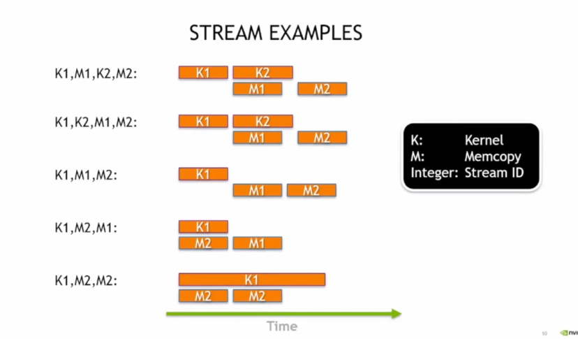

向量运算中 CUDA 流的行为，对比了非流和流模式下数据拷贝（H->D、D->H）与内核计算的执行流程，体现了通过流实现任务并行以提升性能的思路，类似视频处理流水线的并行逻辑。

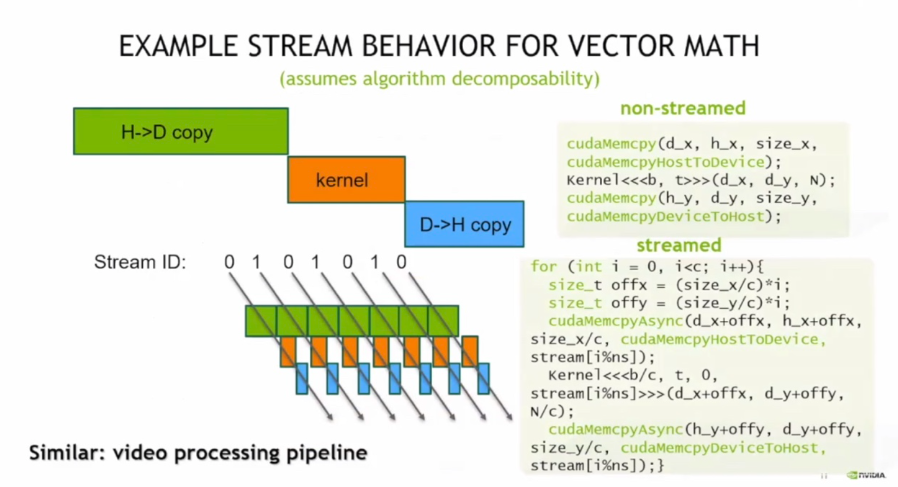

### Code

要实现图中**多流并行执行数据拷贝与内核计算**的逻辑，可以通过 CUDA 流（`cudaStream_t`）来组织任务，让不同流的 “数据拷贝（H→D、D→H）” 和 “内核计算” 并行执行

```cpp
#include <stdio.h>

// 定义一个简单的GPU内核：对数组元素做平方运算
__global__ void squareKernel(float* d_arr, int size) {
    int idx = blockIdx.x * blockDim.x + threadIdx.x;
    if (idx < size) {
        d_arr[idx] = d_arr[idx] * d_arr[idx];
    }
}

int main() {
    const int size = 1024 * 1024;  // 数组大小（1M元素）
    const int streamCount = 2;    // 流的数量（对应图中 Stream 0 和 Stream 1）
    float *h_arr, *d_arr_in, *d_arr_out;  // 主机、设备内存指针
    cudaStream_t streams[streamCount];    // 流数组

    // ========== 步骤1：分配内存 ==========
    // 主机侧：分配页锁定内存（支持异步拷贝）
    cudaMallocHost(&h_arr, size * sizeof(float));
    // 设备侧：分配输入、输出显存
    cudaMalloc(&d_arr_in, size * sizeof(float));
    cudaMalloc(&d_arr_out, size * sizeof(float));

    // 初始化主机数组（示例：填充0~size-1的浮点数）
    for (int i = 0; i < size; i++) {
        h_arr[i] = (float)i;
    }

    // ========== 步骤2：创建流 ==========
    for (int i = 0; i < streamCount; i++) {
        cudaStreamCreate(&streams[i]);
    }

    // ========== 步骤3：多流并行执行“拷贝→计算→拷贝” ==========
    const int blockSize = 256;
    const int chunkSize = size / streamCount;  // 每个流处理的“数据块大小”

    for (int i = 0; i < streamCount; i++) {
        int offset = i * chunkSize;  // 数据块在数组中的偏移量

        // 1. 异步拷贝：主机→设备（H→D），使用当前流
        cudaMemcpyAsync(
            d_arr_in + offset, 
            h_arr + offset, 
            chunkSize * sizeof(float), 
            cudaMemcpyHostToDevice, 
            streams[i]
        );

        // 2. 异步执行内核：对当前数据块做平方运算，使用当前流
        squareKernel<<<(chunkSize + blockSize - 1) / blockSize, blockSize, 0, streams[i]>>>(
            d_arr_out + offset, 
            chunkSize
        );

        // 3. 异步拷贝：设备→主机（D→H），使用当前流
        cudaMemcpyAsync(
            h_arr + offset, 
            d_arr_out + offset, 
            chunkSize * sizeof(float), 
            cudaMemcpyDeviceToHost, 
            streams[i]
        );
    }

    // ========== 步骤4：等待所有流执行完毕 ==========
    for (int i = 0; i < streamCount; i++) {
        cudaStreamSynchronize(streams[i]);
    }

    // 验证结果（取第一个元素和最后一个元素检查）
    printf("第一个元素平方：%.0f\n", h_arr[0]);    // 预期输出 0
    printf("最后一个元素平方：%.0f\n", h_arr[size-1]);  // 预期输出 (size-1)^2

    // ========== 步骤5：释放资源 ==========
    cudaFree(d_arr_in);
    cudaFree(d_arr_out);
    cudaFreeHost(h_arr);
    for (int i = 0; i < streamCount; i++) {
        cudaStreamDestroy(streams[i]);
    }

    return 0;
}
```

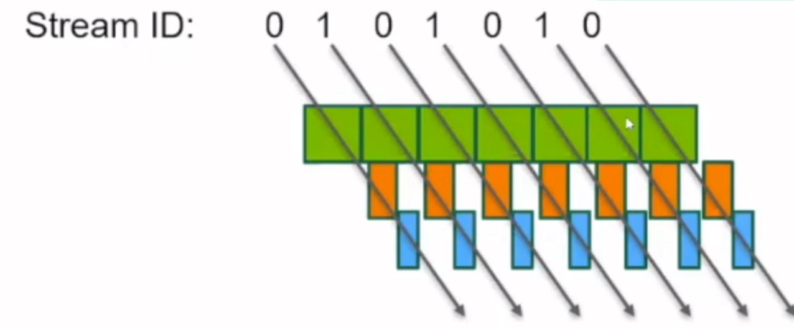

- **流（Stream）**：代码中创建了 `stream[0]` 和 `stream[1]`，对应图中的 Stream ID 0 和 1。
- **数据拷贝（绿色、蓝色块）**：`cudaMemcpyAsync` 实现**异步数据传输**，分别对应 “主机→设备（H→D）” 和 “设备→主机（D→H）”。
- **内核计算（橙色块）**：`squareKernel<<<..., streams[i]>>>` 表示**内核在指定流中异步执行**。
- **并行性**：由于两个流是独立的，`stream[0]` 的 “拷贝→计算→拷贝” 与 `stream[1]` 的对应操作会**并行重叠执行**，匹配图示的时间轴逻辑。

将代码保存为 `stream_example.cu`，使用 CUDA 编译器编译

```bash
nvcc stream_example.cu -o stream_example
./stream_example
```

运行后会输出数组首尾元素的平方结果，验证多流并行的正确性

### CUDA 默认流

说明`未指定流的内核或内存拷贝会使用默认流`，其遗留行为会同步设备活动，建议复杂并发场景避免使用，可通过编译选项修改为普通流。


==“流” 是**一组按顺序执行的 GPU 任务队列**==，不同流的任务可并行执行。它像多条独立的 “生产线”，能让数据拷贝、内核计算等任务在 GPU 上并行开展，从而提升整体性能。

### API

cudaLaunchHostFunc ()（流回调），它允许在 CUDA 流中插入主机函数，遵循流语义，用于延迟 CPU 工作直到 GPU 结果就绪，且需注意函数内不能使用 CUDA 运行时 API。

 CUDA 中托管内存结合按需分页实现拷贝 - 计算重叠的模式，需用 cudaMemPrefetchAsync 替代 cudaMemcpyAsync，流语义保证内存迁移顺序，同时指出该异步调用因需更新 CPU 和 GPU 页表，耗时更长且在忙碌流中可能有更好吞吐量。

 cudaEvent，它是流中的 “标记物”，可记录和标记流执行节点，常用于计时（通过创建、记录、同步事件来测量内核时长），也可用于复杂并发场景的调度。

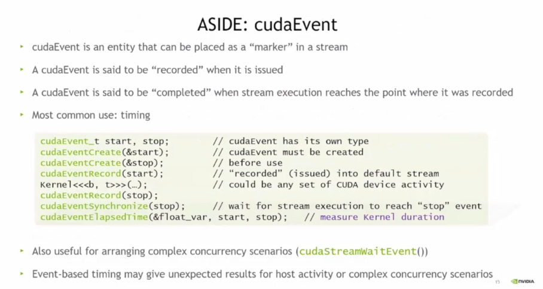

### Multi-GPU

CUDA 多 GPU 设备管理，说明其不替代 OpenMP、MPI 等，应用可通过 cudaGetDeviceCount 等 API 查询、选择 GPU，支持多主机线程共享设备或单主机线程管理多设备，还可通过 cudaMemcpyPeerAsync 实现设备间点对点拷贝。

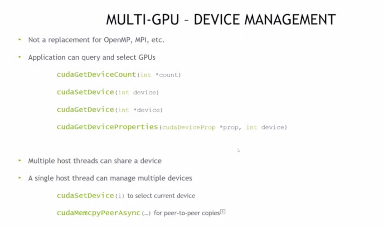

CUDA 多 GPU 流（含 cudaEvent），流与设备隐式关联且各设备有默认流，向非当前设备流发起核函数会失败；cudaStreamWaitEvent 可跨设备流同步，cudaEventQuery 可查事件完成状态；示例通过切换设备创建流实现多设备核函数并发执行。

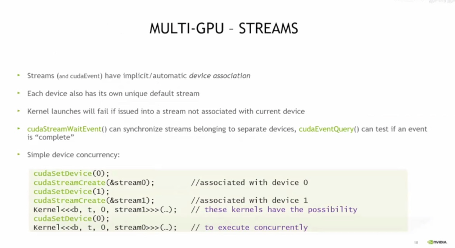

**多 GPU 设备并发执行核函数**的示例

- `cudaSetDevice(0);`：将当前操作的 GPU 设备切换为编号为 0 的设备。
- `cudaStreamCreate(&stream0);`：在设备 0 上创建一个流`stream0`，该流与设备 0 关联。
- `cudaSetDevice(1);`：将当前操作的 GPU 设备切换为编号为 1 的设备。
- `cudaStreamCreate(&stream1);`：在设备 1 上创建一个流`stream1`，该流与设备 1 关联。
- `kernel<<<b, t, 0, stream1>>>(...);`：在设备 1 的`stream1`流中启动核函数执行。
- `cudaSetDevice(0);`：再次将当前操作的 GPU 设备切换为设备 0。
- `kernel<<<b, t, 0, stream0>>>(...);`：在设备 0 的`stream0`流中启动核函数执行。

==让两个不同 GPU 设备上的核函数**并发执行**==，从而提升多 GPU 场景下的计算效率。

#### CUDA 并发场景

支持主机与设备执行并发（核函数与 CPU 代码可重叠执行），也支持同设备多流核函数并发（需核函数资源占用低、执行时间长且受硬件并发数限制，实际同设备并发核函数效率常低于单核函数饱和设备）。

- **多 GPU 流**：==每台计算器有自己的 “任务队列”（流）==，你得先指定用哪台计算器，再给它建队列，这样不同计算器的队列里的任务（核函数）就能同时跑。
- **设备间数据拷贝**：计算器之间要传数据，得先 “加好友”（建立对等关系），==加了好友就能直接传数据==，不用绕路（不经过系统内存），最后还能取消好友关系。
- **并发执行**：要么计算器在干活时，你（CPU）也能同时干别的（主机设备并发）；要么一台计算器开多个 “小队列”（多流），让多个任务同时跑（但同设备下这种并发实际很难见，还得满足资源、时间条件）。

安排多个工人（GPU）干活，得给他们分任务队列、处理他们之间的物料传递，还要让他们和你自己的工作能并行，差不多就是这个逻辑

#### CUDA 流优先级

流可定义优先级，仅影响并发核函数执行，GPU 调度器优先调度高优先级流的核函数块；当前实现有高低两种优先级且不支持抢占，示例代码展示了获取设备流优先级范围并创建高低优先级流的操作

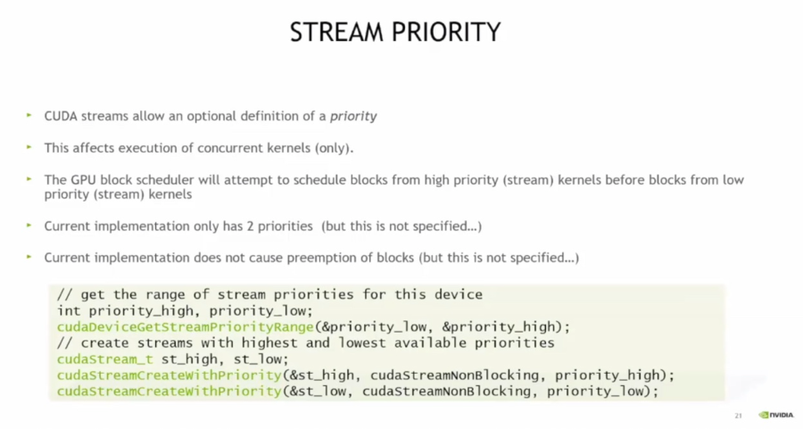

### hw

`nvvp`工具收集并处理数据后，生成的 CUDA API、核函数、内存操作等的时间、调用次数、性能统计信息，用于分析 CUDA 程序的性能瓶颈。

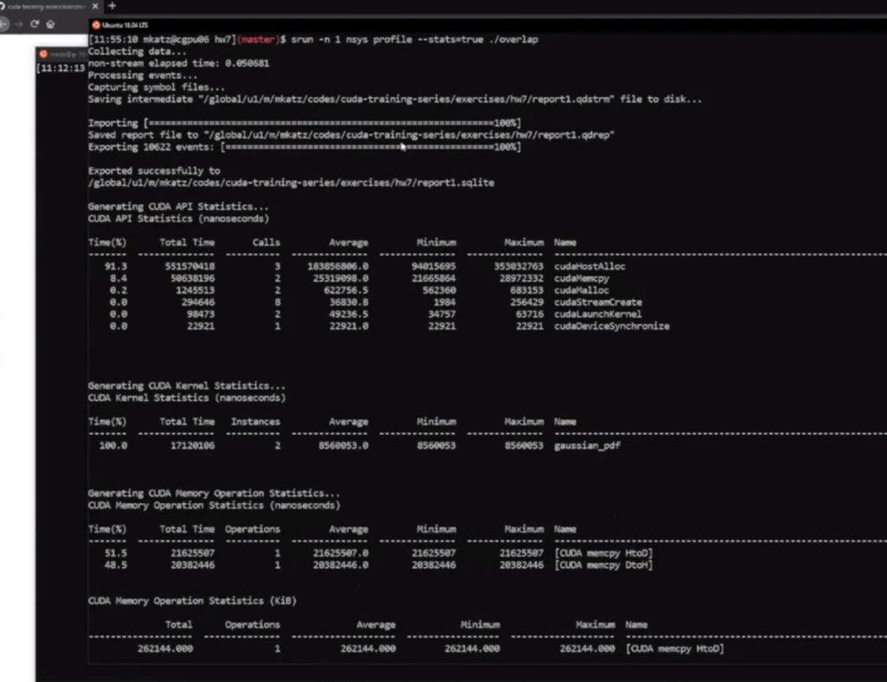

可视化界面，通过时序图呈现 CUDA 程序中核函数、内存操作等的执行时序与性能数据，用于分析程序性能瓶颈，助力优化 CUDA 程序性能

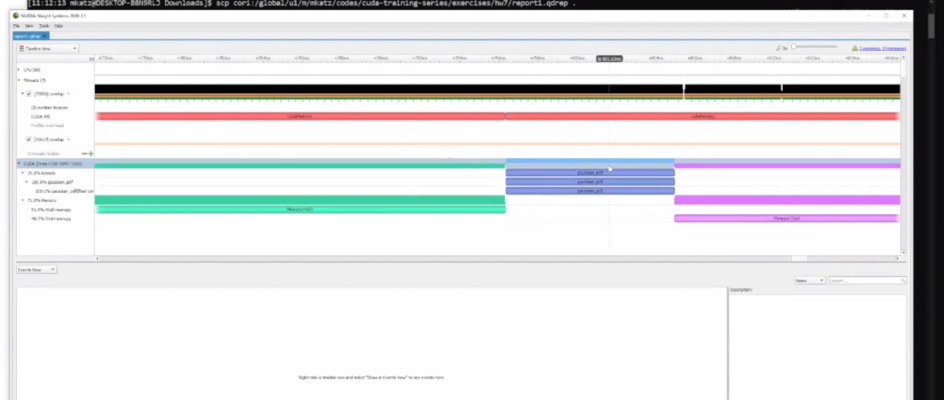

(轻量级性能分析工具 下一章将讲解更专业级的性能分析~)
