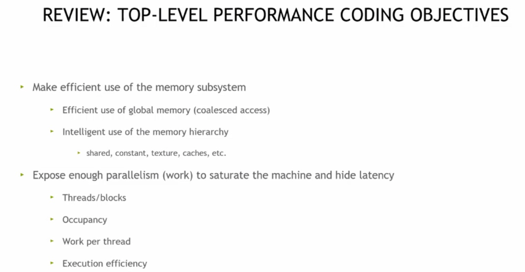
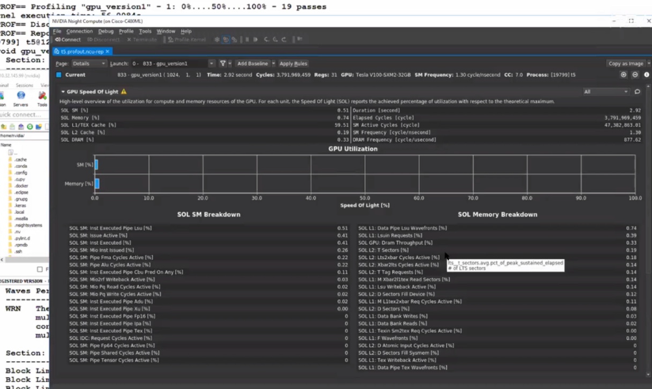
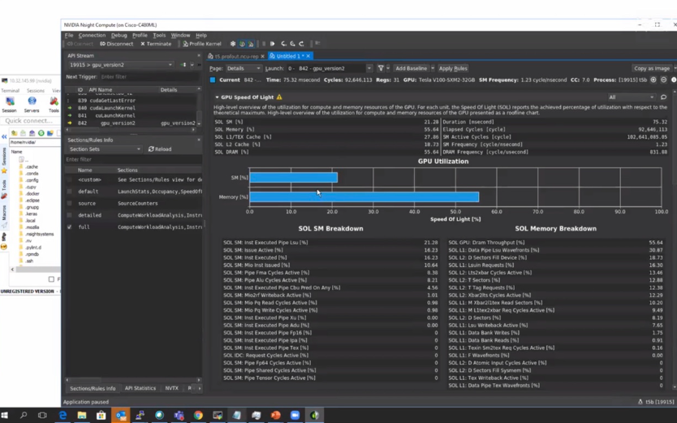
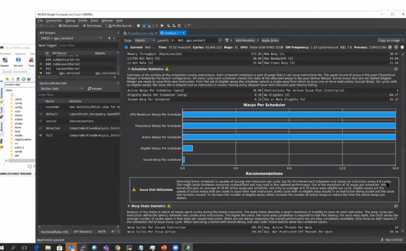
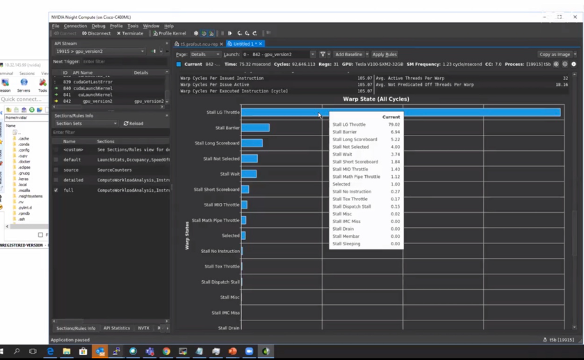
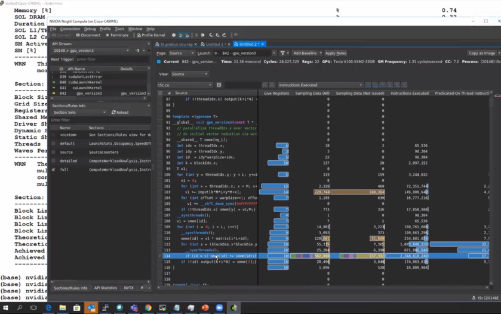

# lec8 GPU Performance Analysis

Nsight Compute（GUI）

>**==好的GPU代码不是写出来的，而是通过不断分析和优化迭代出来的==**。

在GPU编程的世界里，写出能跑的代码和写出跑得快的代码，中间隔着一道巨大的鸿沟。今天我们通过一个经典的矩阵-向量运算案例，来理解CUDA性能优化的核心思想。

## 问题背景：一个典型的科学计算场景

我们要解决的问题很常见：给定M个长度为L的输入向量，先计算它们的平均向量，然后用一个L×L的矩阵与这个平均向量相乘，得到一个输出向量。这个过程要重复N次，每次使用不同的输入向量组，但矩阵是复用的。

用数学语言描述就是：
- 输入：N组数据，每组包含M个长度为L的向量
- 处理：对每组的M个向量求平均 → 用矩阵与平均向量相乘
- 输出：N个长度为L的结果向量

这种计算模式在信号处理、机器学习特征提取等领域非常常见。

## CUDA性能优化的核心理念



在开始编码之前，我们需要理解CUDA性能优化的三大目标：

**第一目标：高效利用内存子系统**

- 全局内存的合并访问（Coalesced Access）
- 合理使用内存层级：共享内存、常量内存、纹理内存
- 最大化内存带宽利用率

**第二目标：暴露足够的并行性**
- 让GPU的所有计算单元都有活干
- 通过足够的线程数隐藏内存访问延迟
- 平衡每个线程的工作量

**第三目标：识别并消除性能瓶颈**
- 内存瓶颈：内存带宽或延迟限制了性能
- 计算瓶颈：计算单元吞吐量达到峰值
- 延迟瓶颈：既不是内存也不是计算瓶颈，而是指令调度和线程占用率问题

## 性能分析驱动的优化流程


NVIDIA推荐的优化方法论是一个循环过程：

1. **性能分析（Profile）**：使用Nsight Compute等工具测量关键指标
2. **确定瓶颈（Determine Limiter）**：判断是内存、计算还是延迟瓶颈
3. **研究学习（Study & Reflect）**：理解为什么会出现这个瓶颈
4. **优化实施（Optimize）**：针对性地改进代码
5. **重复循环**：因为优化一个瓶颈后，新的瓶颈可能会出现

关键性能指标包括：
- **延迟类指标**：SM效率（sm_efficiency）
- **内存类指标**：DRAM利用率（dram_utilization）、L2缓存利用率、共享内存利用率
- **计算类指标**：单精度/双精度/半精度/Tensor Core/整数运算利用率

## 占用率（Occupancy）的重要性

占用率是指SM上实际活跃线程数与理论最大线程数的比值。它受以下因素限制：
- 每个线程使用的寄存器数量
- 每个线程块的线程数量
- 共享内存的使用量

高占用率通常（但不总是）能提升性能，因为更多的活跃线程可以更好地隐藏内存延迟。CUDA提供了占用率计算器来帮助我们优化这些参数。

## 三个版本的实现与优化思路

现在让我们通过三个逐步优化的版本来实践这些理论。

**Version 1：CPU基准版本**
- 使用OpenMP并行化，为每个数据集分配一个CPU线程
- 存在的问题：CPU核心数有限，无法充分并行化N个数据集的处理

**Version 2：GPU初级版本**
- 直接将CPU逻辑移植到GPU
- 每个线程处理一个向量元素
- 使用共享内存进行归约（Reduction）
- 存在的问题：全局内存访问模式未优化，线程间同步开销大

**Version 3：GPU优化版本**
- 优化内存访问模式，确保合并访问
- 改进归约算法，减少同步次数
- 调整线程块大小以提高占用率
- 使用更高效的共享内存使用模式

## 实验代码

（Version 1，OpenMP 并行化）

```cpp
#include <vector>
#include <omp.h>

// 常量定义
const int MY_L = 1024;  // 向量长度
const int MY_M = 1024;  // 输入向量数量
const int MY_N = 1024;  // 重复次数

// ============================================================================
// Version 1: CPU基准版本（使用OpenMP并行化）
// 核心逻辑：计算M个输入向量的平均值，再执行矩阵-向量乘法
// ============================================================================
template <typename T>
void cpu_version1(const T* input, T* output, const T* matrix, 
                  int L, int M, int N) {
    #pragma omp parallel for
    for (int k = 0; k < N; k++) {
        // 步骤1：计算M个输入向量的平均
        std::vector<T> v1(L, 0);
        for (int i = 0; i < M; i++) {
            for (int j = 0; j < L; j++) {
                v1[j] += input[k * M * L + j * M + i];
            }
        }
        for (int j = 0; j < L; j++) {
            v1[j] /= M;
        }
        
        // 步骤2：矩阵-向量乘法
        for (int i = 0; i < L; i++) {
            T sum = 0;
            for (int j = 0; j < L; j++) {
                sum += matrix[i * L + j] * v1[j];
            }
            output[i * N + k] = sum;
        }
    }
}
```

（Version 2，直接移植 + 共享内存归约）

```cpp
#include <cuda_runtime.h>

// 常量定义
const int MY_L = 1024;  // 向量长度
const int MY_M = 1024;  // 输入向量数量
const int MY_N = 1024;  // 重复次数

// 错误检查宏（GPU代码必要依赖）
#define CUDA_CHECK(call) \
    do { \
        cudaError_t err = call; \
        if (err != cudaSuccess) { \
            std::cerr << "CUDA Error: " << cudaGetErrorString(err) \
                      << " at " << __FILE__ << ":" << __LINE__ << std::endl; \
            exit(1); \
        } \
    } while(0)

// ============================================================================
// Version 2: GPU初级版本（直接移植，使用共享内存归约）
// 核心逻辑：单线程处理向量一个元素的平均值，共享内存归约实现矩阵-向量乘法
// ============================================================================
template <typename T>
__global__ void gpu_version2(const T* __restrict__ input, 
                             T* __restrict__ output,
                             const T* __restrict__ matrix, 
                             int L, int M, int N) {
    __shared__ T smem[MY_L];
    
    int idx = blockIdx.x * blockDim.x + threadIdx.x;
    
    // 确保线程索引在有效范围内
    if (idx >= L) return;
    
    for (int k = 0; k < N; k++) {
        // 步骤1：计算平均向量（每个线程处理一个元素）
        T v1 = 0;
        for (int i = 0; i < M; i++) {
            v1 += input[k * M * L + idx * M + i];
        }
        v1 /= M;
        
        // 步骤2：矩阵-向量乘法（使用归约）
        for (int i = 0; i < L; i++) {
            __syncthreads();
            smem[threadIdx.x] = v1 * matrix[i * L + idx];
            __syncthreads();
            
            // 归约求和
            for (int s = blockDim.x >> 1; s > 0; s >>= 1) {
                if (threadIdx.x < s) {
                    smem[threadIdx.x] += smem[threadIdx.x + s];
                }
                __syncthreads();
            }
            
            // 第一个线程写入结果
            if (threadIdx.x == 0) {
                output[k + i * N] = smem[0];
            }
        }
    }
}
```

（Version 3，内存访问 + 归约算法优化）

```cpp
#include <cuda_runtime.h>

// 常量定义
const int MY_L = 1024;  // 向量长度
const int MY_M = 1024;  // 输入向量数量
const int MY_N = 1024;  // 重复次数

// 错误检查宏（GPU代码必要依赖）
#define CUDA_CHECK(call) \
    do { \
        cudaError_t err = call; \
        if (err != cudaSuccess) { \
            std::cerr << "CUDA Error: " << cudaGetErrorString(err) \
                      << " at " << __FILE__ << ":" << __LINE__ << std::endl; \
            exit(1); \
        } \
    } while(0)

// ============================================================================
// Version 3: GPU优化版本（优化内存访问和归约算法）
// 核心优化点：1. 全局内存合并访问 2. 减少共享内存bank冲突 3. Warp级无同步归约
// ============================================================================
template <typename T>
__global__ void gpu_version3(const T* __restrict__ input, 
                             T* __restrict__ output,
                             const T* __restrict__ matrix, 
                             int L, int M, int N) {
    __shared__ T smem[MY_L];
    
    int tid = threadIdx.x;
    int idx = blockIdx.x * blockDim.x + threadIdx.x;
    
    if (idx >= L) return;
    
    // 外层循环：处理N个数据集
    for (int k = 0; k < N; k++) {
        // 步骤1：优化的向量平均计算（合并访问全局内存）
        T v1 = 0;
        for (int i = 0; i < M; i++) {
            v1 += input[k * M * L + i * L + idx];  // 改变访问模式实现合并访问
        }
        v1 /= M;
        
        // 步骤2：优化的矩阵-向量乘法
        for (int row = 0; row < L; row++) {
            // 每个线程计算部分乘积
            T partial_sum = matrix[row * L + idx] * v1;
            smem[tid] = partial_sum;
            __syncthreads();
            
            // 优化的归约算法（减少bank conflicts）
            for (int s = blockDim.x >> 1; s > 32; s >>= 1) {
                if (tid < s) {
                    smem[tid] += smem[tid + s];
                }
                __syncthreads();
            }
            
            // Warp级别的归约（无需同步，32线程为一个Warp）
            if (tid < 32) {
                volatile T* vsmem = smem;
                if (blockDim.x >= 64) vsmem[tid] += vsmem[tid + 32];
                if (blockDim.x >= 32) vsmem[tid] += vsmem[tid + 16];
                if (blockDim.x >= 16) vsmem[tid] += vsmem[tid + 8];
                if (blockDim.x >= 8) vsmem[tid] += vsmem[tid + 4];
                if (blockDim.x >= 4) vsmem[tid] += vsmem[tid + 2];
                if (blockDim.x >= 2) vsmem[tid] += vsmem[tid + 1];
            }
            
            if (tid == 0) {
                output[row * N + k] = smem[0];
            }
            __syncthreads();
        }
    }
}
```

说明

1. **依赖保留**：每个代码块仅保留自身运行必需的头文件、常量和宏（如 GPU 版本依赖`cuda_runtime.h`和`CUDA_CHECK`宏，CPU 版本依赖`omp.h`和`vector`）。
2. **核心逻辑完整**：移除了测试、初始化、验证、计时等辅助代码，仅保留每个版本的核心算法实现。
3. **优化点标注**：在代码注释中明确了各版本的核心逻辑和优化点，便于理解不同版本的差异。

编译和运行指南

将代码保存为 `cuda_performance_test.cu`，然后使用以下命令编译：

```bash
nvcc -O3 -arch=sm_70 -Xcompiler -fopenmp cuda_performance_test.cu -o cuda_perf_test
```

运行程序：

```bash
./cuda_perf_test
```

## 差异分析

**Version 1（CPU版本）**



- 使用OpenMP的 `#pragma omp parallel for` 并行化N个数据集的处理
- 每个CPU线程独立处理一个数据集
- 内存访问模式：按列主序访问输入数据（`input[k*M*L + j*M + i]`）
- 性能瓶颈：CPU核心数有限（通常8-16核），无法充分利用数据并行性

**Version 2（GPU初级版本）**



- 每个线程处理向量的一个元素（线程索引对应向量索引）
- 使用共享内存进行归约求和
- 内存访问问题：`input[k*M*L + idx*M + i]` 导致非合并访问
- 同步开销：每次矩阵-向量乘法需要多次 `__syncthreads()`
- 归约效率：简单的二分归约，未优化warp级操作

**Version 3（GPU优化版本）**



- **内存访问优化**：改为 `input[k*M*L + i*L + idx]`，实现合并访问
  - 相邻线程访问相邻内存地址，充分利用内存带宽
- **归约算法优化**：
  - 当归约规模小于warp大小（32）时，使用volatile变量避免同步
  - 减少 `__syncthreads()` 调用次数
- **Bank conflict优化**：改进共享内存访问模式
- **占用率提升**：通过减少寄存器使用和共享内存使用，提高SM占用率

----

分析

在NVIDIA Nsight Compute  GUI 界面中， 我们可以看到CUDA 内核 “gpu_version2” 的 Warp 状态性能分析，通过 “Stall LG Throttle” 等多种停顿类型的周期占比数据，用于定位内核中 Warp 级别的性能瓶颈，指导代码优化。



还可以逐代码分析，这个软件可视化真的做的非常好😭



还有更轻量级的命令行工具 🕳

## 预期性能提升

根据典型的NVIDIA GPU（如RTX 3080或A100），预期性能表现：

- **CPU版本**：基准性能（假设为1x）
- **GPU v2版本**：5-10x加速（受限于非合并访问和同步开销）
- **GPU v3版本**：20-50x加速（优化后接近内存带宽上限）

实际性能取决于：
- GPU型号和计算能力
- 内存带宽
- L2缓存大小
- SM数量和占用率

## 性能分析建议

运行程序后，可以使用NVIDIA Nsight Compute进行深度分析：

```bash
ncu --set full -o profile_report ./cuda_perf_test
```

关注以下指标：
- **内存吞吐量**：对比实际带宽与理论峰值
- **SM效率**：查看计算单元利用率
- **占用率**：理论占用率 vs 实际占用率
- **Warp执行效率**：是否存在分支divergence
- **内存访问效率**：合并访问比例

## 总结

通过这个实验，我们验证了CUDA性能优化的核心原则：

1. **内存访问模式至关重要**：从非合并访问到合并访问，性能可以提升数倍
2. **减少同步开销**：优化归约算法，利用warp级原语减少同步
3. **分析驱动优化**：通过性能分析工具识别瓶颈，针对性优化
4. **迭代优化过程**：每次优化后，新的瓶颈可能出现，需要持续分析

