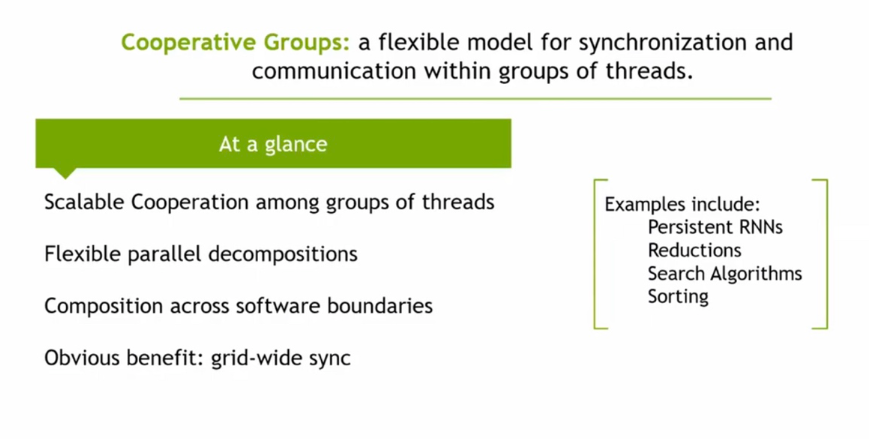
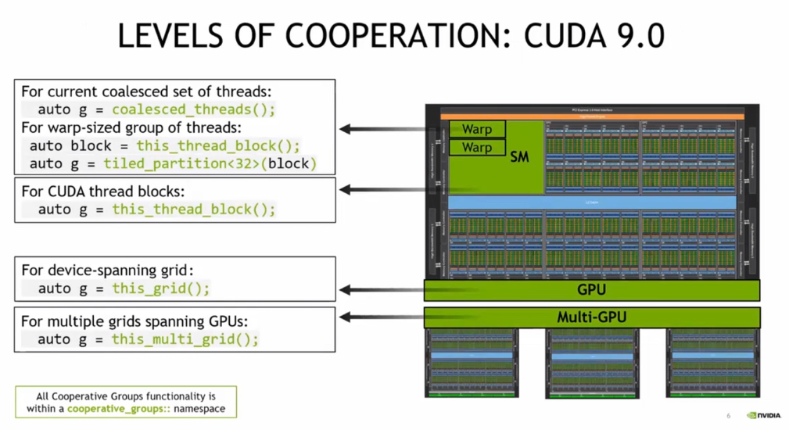
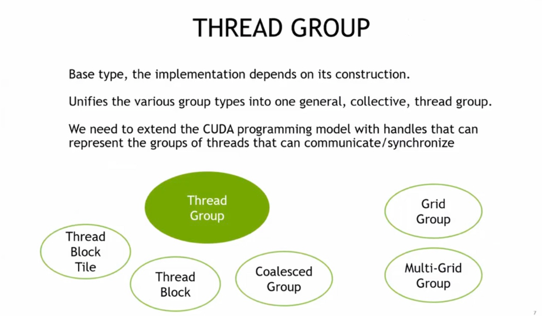
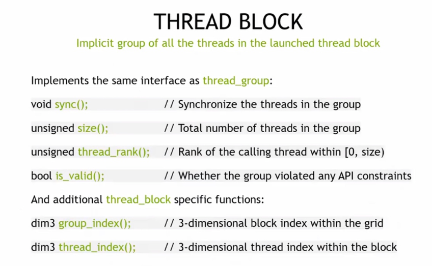
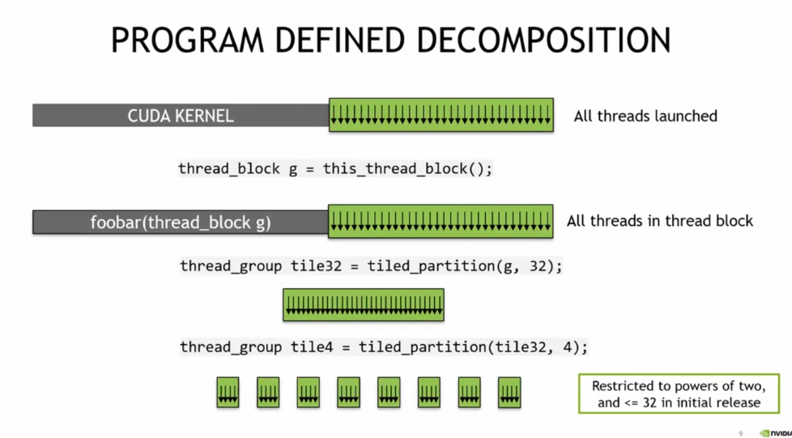
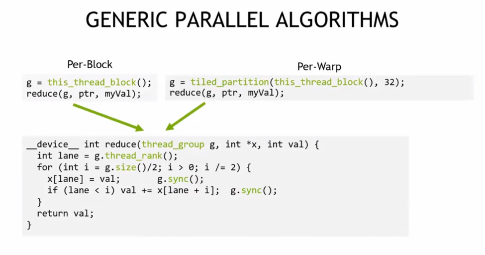
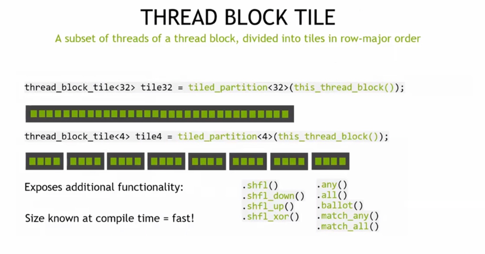

# lec9 CUDA Cooperative Groups

 Cooperative Groups 是==线程组内同步与通信==的灵活模型，支持线程组可扩展协作、灵活并行分解、跨软件边界组合，能实现全域同步，在持久化 RNN、归约、搜索算法、排序等场景有应用。

CUDA 9.0 的 Cooperative Groups 按线程协作范围分多个层级（凝聚线程组、warp 组、线程块、设备级网格、多 GPU 网格等），通过==不同 API 实现对应层级的同步通信==，为线程块及更广泛层级的并行计算提供灵活协作能力，且功能都在 cooperative_groups 命名空间内。

Thread Group 是统一各类线程组（线程块切片、线程块、凝聚组、网格组、多网格组等）的基础类型，用于扩展编程模型以表示可通信同步的线程组，其实现依赖构造方式，对程序员而言无需深究继承细节。

Thread Block 是启动的线程块内所有线程的隐式组，实现与 thread_group 相同的接口（含同步、线程数查询等），还具备获取块索引、线程索引等特有功能，用于线程块内的同步与信息查询。

Program Defined Decomposition 通过将线程块（thread_block）逐步划分为 tile（如 tile32、tile4）的方式，实现程序定义的线程组分解，初始版本中 tile 大小限制为 2 的幂且不超过 32，用于灵活管理线程协作范围。

“线程们的组队协作游戏”

- **Thread Group** 是“组队模板”，不管是小团队、大团队，都能用它来规范组队方式。
- **Thread Block** 是“默认小队”，启动时自动形成，里面的线程能同步、查人数、查自己在队里的位置，还能查小队在大地图（Grid）里的坐标。 - 
- **Program Defined Decomposition** 是“自定义组队”，可以把大部队拆成不同规模的小tile（比如32人一组、4人一组），方便针对不同任务调整协作方式。

CUDA让GPU==线程能像玩团队游戏一样，灵活组队、同步配合==，从而高效完成并行计算任务

#### Generic Parallel Algorithms 

通过线程组（如线程块级、Warp 级）实现归约算法，利用线程组的同步和线程排名等操作，实现高效的并行归约计算，示例代码展示了基于 thread_group 的归约函数实现。

Thread Block Tile 是线程块内按行优先划分的线程子集，可通过 tiled_partition 创建不同大小（如 32、4）的 tile，编译时已知大小因此高效，还提供移位、投票等额外功能。

