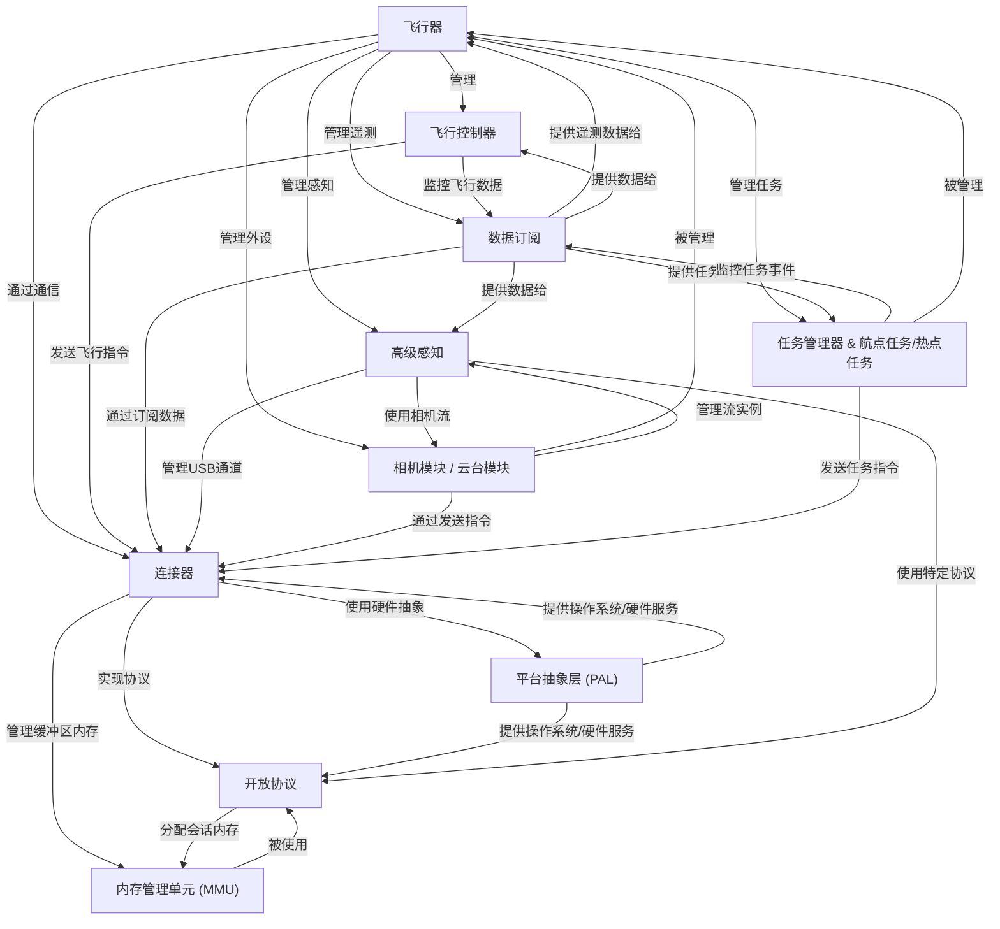
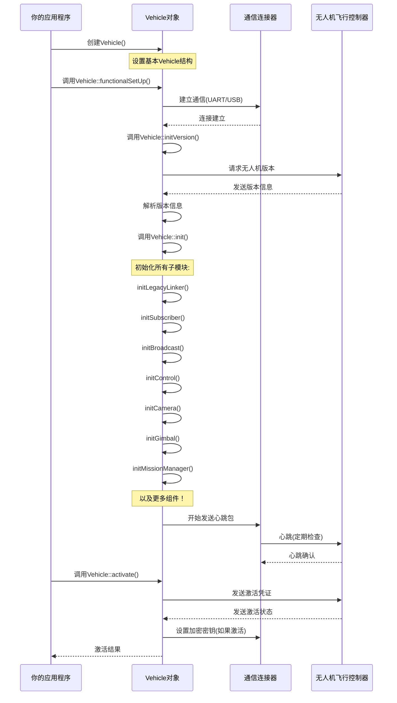

链接：[How to use OSDK ？ - DJI Onboard SDK Documentation](https://developer.dji.com/onboard-sdk/documentation/introduction/how-to-use-OSDK.html)


[10-17晚__湖南无人机烟花吉尼斯世界纪录](https://www.youtube.com/watch?v=zSGMC1o1c4w)

# docs：Onboard-SDK

`Onboard-SDK`作为大疆无人机的**中央控制系统**，可编程化地与其高级功能进行交互。

它充当无人机的*大脑*，协调从**飞行操控**和**相机操作**到接收*实时遥测数据*以及规划**自主任务**的一切功能。这是通过抽象复杂的底层通信并适配多种硬件平台实现的，为开发者提供了统一的接口。

## 可视化



## 章节

1. [飞行器](01_vehicle_.md)
2. [飞行控制器](02_flightcontroller_.md)
3. [任务管理器 & 航点任务/热点任务](03_missionmanager___waypointmission_hotpointmission_.md)
4. [相机模块 / 云台模块](04_cameramodule___gimbalmodule_.md)
5. [高级感知](05_advancedsensing_.md)
6. [数据订阅](06_datasubscription_.md)
7. [连接器](07_linker_.md)
8. [开放协议](08_open_protocol_.md)
9. [内存管理单元 (MMU)](09_memory_management_unit__mmu__.md)
10. [平台抽象层 (PAL)](10_platform_abstraction_layer__pal__.md)

---

# 第一章：飞行器

欢迎来到大疆机载SDK

如果你想用自己的代码控制大疆无人机，那么你来对地方了。在这第一章中，我们将认识`Onboard-SDK`中最重要的概念：**飞行器(Vehicle)**

## 什么是"飞行器"？（无人机的大脑）

想象你正在操控一架无人机。你有一个主遥控器，可以完成所有操作：让它飞行、拍照、移动相机、规划复杂航线，甚至查看无人机看到的画面。

在`Onboard-SDK`中，`Vehicle`对象就是这样的主遥控器——它是大疆无人机的**中央大脑**

这是你的代码与无人机所有高级系统交互的主要方式。从程序启动的那一刻起，`Vehicle`对象就是你调用几乎所有无人机功能的接口。

### 为什么需要`Vehicle`？

想想看：一架无人机有许多不同的部件。

有控制系统控制飞行，另一个系统控制相机，一个控制云台（相机稳定器），还有其他负责任务或获取数据的系统。

> 如果没有`Vehicle`对象，就必须分别与每个部件通信，这会非常复杂！

`Vehicle`抽象通过提供**统一接口**解决了这个问题。它==将所有功能集中在一个屋檐下==，让可以轻松地指挥无人机，而无需担心每个独立系统的复杂细节。

### 第一个任务：准备无人机

在让无人机起飞之前，你需要完成几个基本步骤：

1.  **连接无人机**：建立计算机与无人机之间的通信
2.  **初始化SDK**：准备好所有软件组件
3.  **激活无人机**：告诉大疆你的程序被授权控制这架特定无人机
4.  **识别无人机**：确定你的无人机型号和固件版本

`Vehicle`对象负责所有这些关键的第一步

## 如何使用`Vehicle`

让我们看看如何使用`Vehicle`对象开始与无人机交互。

### 第一步：创建`Vehicle`对象

首先，需要创建`Vehicle`类的实例。这就像从盒子里拿出你的遥控器。

```cpp
#include <dji_vehicle.hpp>
#include <dji_linux_helpers.hpp> // Linux设置

// ... 在你的主函数中 ...

// 设置环境（如串口、应用ID/密钥）
LinuxSetup linuxEnvironment(argc, argv);
DJI::OSDK::Vehicle* vehicle = linuxEnvironment.getVehicle();

if (vehicle == NULL) {
    std::cout << "飞行器未初始化，退出。\n";
    return -1;
}
```
*说明*：我们包含`dji_vehicle.hpp`，它定义了`Vehicle`类

`LinuxSetup`助手（针对Linux平台）为我们创建并初始化`Vehicle`对象，处理初始通信设置。如果`vehicle`是`NULL`，说明设置出了问题，我们无法继续。

### 第二步：激活无人机

激活无人机就像给你的遥控器一个特殊"密码"，让它知道它被允许发送指令。

这确保只有授权的应用程序可以控制大疆无人机。

> 需要从大疆开发者账户获取App ID和App Key。

```cpp
#include <dji_vehicle.hpp>
// ... 其他包含文件 ...

// ... 在主函数或辅助函数中 ...

// 从环境设置获取激活数据
DJI::OSDK::Vehicle::ActivateData* activateData = linuxEnvironment.getActivateData();

// 调用飞行器对象的activate方法
DJI::OSDK::ACK::ErrorCode ack = vehicle->activate(activateData, functionTimeout);

if (DJI::OSDK::ACK::getError(ack)) 
{
    DJI::OSDK::ACK::getErrorCodeMessage(ack, "activate");
    std::cout << "激活失败，退出。\n";
    return -1;
}
std::cout << "无人机激活成功！\n";
```
*说明*：`activate()`方法将你的凭证发送给无人机

它返回一个`ACK::ErrorCode`，告诉你激活是否成功或有错误（如错误的App ID）。我们检查这个`ack`以确保我们被授权。

- `functionTimeout`是一个参数，指定等待无人机响应的时长。

### 第三步：获取无人机版本信息

了解连接的无人机型号和固件版本通常很有用。这有助于代码适应不同的无人机型号或功能。

```cpp
#include <dji_vehicle.hpp>
// ... 其他包含文件 ...

// ... 在主函数或辅助函数中 ...

// 获取无人机版本信息
DJI::OSDK::ACK::DroneVersion droneVersion = vehicle->getDroneVersion(functionTimeout);

if (DJI::OSDK::ACK::getError(droneVersion.ack)) {
    DJI::OSDK::ACK::getErrorCodeMessage(droneVersion.ack, "getDroneVersion");
    std::cout << "获取无人机版本失败，退出。\n";
    return -1;
}

std::cout << "无人机硬件版本: " << droneVersion.data.hwVersion << std::endl;
std::cout << "无人机固件版本: "
          << (droneVersion.data.fwVersion >> 24) << "."
          << ((droneVersion.data.fwVersion >> 16) & 0xFF) << "."
          << ((droneVersion.data.fwVersion >> 8) & 0xFF) << "."
          << (droneVersion.data.fwVersion & 0xFF) << std::endl;
```
*说明*：`getDroneVersion()`请求无人机的型号和固件

`droneVersion.data`结构包含字段如`hwVersion`（硬件型号）和`fwVersion`（固件版本）。我们打印这些信息

`fwVersion`是一个整数，所以我们进行位操作提取主版本、次版本、补丁和构建号

## 内部机制：`Vehicle`如何工作

`Vehicle`对象不仅仅是一个占位符；它是一个协调者

当创建它并调用其初始化函数时，背后发生了很多事情来==建立稳健的通信并管理无人机的所有功能==。

### `Vehicle`初始化流程

以下是你的程序启动并初始化`Vehicle`对象时的简化流程：


*说明*：

1.  **你的应用程序**首先请求创建`Vehicle`对象。
2.  `Vehicle`然后==设置底层的**[连接器(Linker)](07_linker_.md)**，负责与无人机的物理通信==（如USB或串口）。
3.  `Vehicle`执行**版本协商**，了解连接的无人机型号和固件版本
4.  关键的是，==调用`Vehicle::init()`，然后创建并初始化所有专门的子模块==，如：
    *   **[飞行控制器(FlightController)](02_flightcontroller_.md)**：控制无人机移动。
    *   **[任务管理器(MissionManager)](03_missionmanager___waypointmission_hotpointmission_.md)**：规划和执行自动化任务。
    *   **[相机模块/云台模块(CameraModule/GimbalModule)](04_cameramodule___gimbalmodule_.md)**：相机和云台操作。
    *   **[数据订阅(DataSubscription)](06_datasubscription_.md)**：接收各种遥测数据。
    *   ... 以及更多！`Vehicle`是访问所有这些的中心点。
5.  建立**心跳**机制，持续检查与无人机的连接是否存活
6.  最后，当调用`Vehicle::activate()`时，`Vehicle`处理将凭证发送给无人机，如果成功，配置`连接器(Linker)`使用加密进行安全通信。

### 代码聚焦：构建"大脑"

让我们看看SDK中的一些简化代码片段，展示`Vehicle`是如何构建的。

#### `Vehicle`构造函数（简化自`osdk-core/api/src/dji_vehicle.cpp`）

`Vehicle`类的构造函数接收一个指向`Linker`对象的指针。这突出了`Vehicle`==从一开始就严重依赖`Linker`来建立和管理通信==。

```cpp
// osdk-core/api/src/dji_vehicle.cpp
Vehicle::Vehicle(Linker* linker)
  : linker(linker) // Vehicle存储一个指向Linker的指针
  // ... 许多其他模块指针初始化为NULL ...
{
  // 设置默认值和内部变量
}
```
*说明*：当创建`Vehicle`对象时，它立即获得一个与无人机通信的"通道"(`linker`)。这个`linker`对所有后续交互都至关重要。

#### `Vehicle::init()`（简化自`osdk-core/api/src/dji_vehicle.cpp`）

`Vehicle`类中的`init()`方法是"大脑"连接到所有"器官"或"肢体"的地方。它是一系列初始化各种子模块的调用。

```cpp
// osdk-core/api/src/dji_vehicle.cpp
bool Vehicle::init() {
  if (!initOSDKHeartBeatThread()) return false;
  if (!initLegacyLinker()) return false; // 用于旧协议
  if (!initSubscriber()) return false;   // 处理数据订阅
  if (!initBroadcast()) return false;    // 处理广播遥测
  if (!initControl()) return false;      // 基本飞行控制
  if (!initCamera()) return false;       // 相机操作
  if (!initGimbal()) return false;       // 云台操作
  if (!initMobileDevice()) return false; // 移动应用通信
  if (!initMissionManager()) return false; // 自动化任务
  // ... 以及其他许多模块的初始化调用 ...
  return true;
}
```
*说明*：这个函数展示了`Vehicle`如何精心设置无人机的每个功能部分。==每个`initXxx()`函数创建并配置一个特定模块==（如`Subscriber`、`Control`、`Camera`、`MissionManager`），让应用程序可以通过`Vehicle`对象使用它们。

## 结论

`Vehicle`对象是`Onboard-SDK`的基石

它充当中央控制面板，统一访问无人机的所有复杂系统。通过理解它在初始化、激活和管理子模块中的作用，已经掌握了使用SDK控制无人机的第一个重要步骤。

现在我们的`Vehicle`已经准备就绪，基本功能也已清晰，让我们深入了解如何让无人机真正动起来

---
[下一章：飞行控制器](02_flightcontroller_.md)

