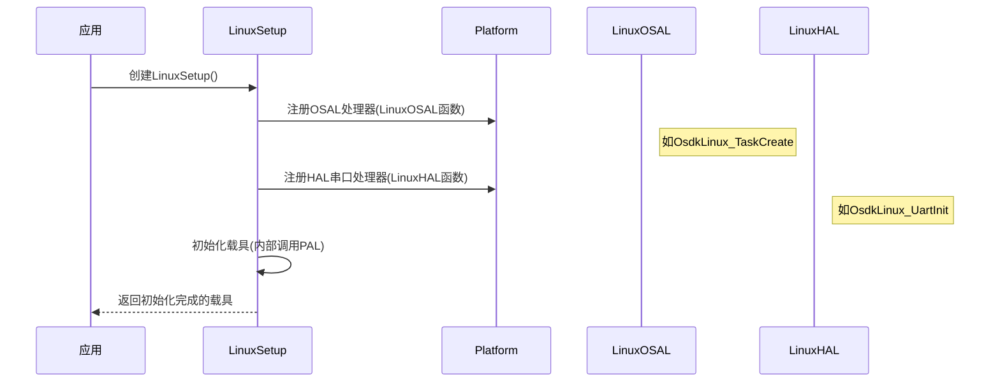

# 第十章：平台抽象层(PAL)

在[第九章：内存管理单元(MMU)](09_memory_management_unit__mmu__.md)中，我们探讨了SDK如何高效管理内部内存。Onboard-SDK通过高级C++接口实现无人机控制、数据获取甚至视频流功能，但计算机生态多样——我们可能需要在Linux工控机、STM32微控制器或Qt桌面应用等不同环境中运行无人机控制程序。

如何让同一套SDK代码无需重写就能跨平台运行？这就像电子设备通过**适配器**实现全球通用——**平台抽象层(PAL)**正是SDK的内置"万能适配器"。

## 什么是PAL？（SDK的通用适配器）

PAL是Onboard-SDK中提供标准化硬件/操作系统交互的特殊层，其核心任务是**屏蔽平台差异性**。类比说明：

* **核心SDK代码**：如同精心设计的电子设备（如无人机控制器），明确需要完成的任务（如创建线程、串口通信）
* **PAL接口**：如同设备的通用电源接口，不关心电力来源，只需符合标准规范
* **平台具体实现**：如同各地电源适配器（Linux/STM32/Qt实现），将本地能力转换为标准接口

当SDK需要"创建线程"时，不会直接调用Linux的`pthread_create()`或Qt的`QThread`，而是通过`OsdkOsal_TaskCreate()`这类通用接口，由PAL在底层转换为具体平台的实现。

### 为什么需要PAL？

若无PAL，核心代码将充斥大量平台判断逻辑：
* **开发困难**：每个功能需多平台重复实现
* **维护复杂**：修复问题需同步多个代码分支
* **稳定性差**：复杂代码更易产生错误

PAL通过以下方式解决问题：
* **确保可移植性**：核心代码一次编写，多平台运行
* **简化开发**：聚焦无人机功能而非平台差异
* **提升可靠性**：标准化接口更易于测试验证

## PAL的核心抽象

PAL分为两大功能层：

| 抽象层                   | 功能描述                     | 典型任务案例                                     |
| ------------------------ | ---------------------------- | ------------------------------------------------ |
| **硬件抽象层(HAL)**      | 提供与底层硬件交互的统一接口 | 串口通信、USB通信、定时器访问                    |
| **操作系统抽象层(OSAL)** | 封装不同操作系统的服务       | 线程管理、互斥锁、信号量、动态内存分配、时间获取 |

## 如何使用PAL（开发者无感调用）

开发者通常**无需直接操作PAL**，其主要通过SDK初始化环节隐式配置。以[第一章：载体](01_vehicle_.md)的Linux初始化为例：

```cpp
#include <dji_vehicle.hpp>
#include <dji_linux_helpers.hpp>

int main(int argc, char** argv) {
    // 1. 创建平台专属配置对象（自动注册PAL实现）
    DJI::OSDK::LinuxSetup linuxEnvironment(argc, argv);
    
    // 2. 获取已配置载具实例
    DJI::OSDK::Vehicle* vehicle = linuxEnvironment.getVehicle();
    if (!vehicle) return -1;
    
    // ... 应用代码 ...
    return 0;
}
```
*说明*：`LinuxSetup`构造函数会注册以下Linux专属实现：
- 串口通信：通过`LinuxSerialDevice`实现
- 线程管理：基于POSIX线程
- 时间同步：使用`gettimeofday`
- 内存分配：标准`malloc/free`

## 实现原理

PAL采用抽象接口定义**做什么**，各平台提供**如何做**的具体实现。

### PAL初始化流程



### 代码解析

#### 接口定义（`osdk_platform.h`）

```c
// OSAL接口结构体
typedef struct {
    E_OsdkStat (*TaskCreate)(T_OsdkTaskHandle *task, void *(*taskFunc)(void *), uint32_t stackSize, void *arg);
    E_OsdkStat (*MutexCreate)(T_OsdkMutexHandle *mutex);
    // ... 其他OSAL函数指针 ...
} T_OsdkOsalHandler;

// HAL串口接口结构体
typedef struct {
    E_OsdkStat (*UartInit)(const char *port, int baudrate, T_HalObj *obj);
    // ... 其他HAL函数指针 ...
} T_OsdkHalUartHandler;
```

#### Linux实现注册（`dji_linux_helpers.cpp`）

```cpp
void LinuxSetup::setupEnvironment() {
    // 填充Linux的OSAL实现
    static T_OsdkOsalHandler osalHandler = {
        .TaskCreate = OsdkLinux_TaskCreate, // POSIX线程实现
        .MutexCreate = OsdkLinux_MutexCreate,
        // ... 其他实现 ...
    };

    // 填充Linux的HAL串口实现
    static T_OsdkHalUartHandler halUartHandler = {
        .UartInit = OsdkLinux_UartInit, // Linux串口驱动
        // ... 其他实现 ...
    };

    // 注册到PAL核心
    DJI_REG_OSAL_HANDLER(&osalHandler);
    DJI_REG_UART_HANDLER(&halUartHandler);
}
```

#### 具体平台实现（`osdkosal_linux.c`）

```c
// Linux线程创建实现
E_OsdkStat OsdkLinux_TaskCreate(T_OsdkTaskHandle *task, void *(*taskFunc)(void *), uint32_t stackSize, void *arg) {
    int ret = pthread_create(task, NULL, taskFunc, arg); // 调用POSIX接口
    return (ret == 0) ? OSDK_STAT_OK : OSDK_STAT_ERR;
}
```

## 总结

PAL是Onboard-SDK跨平台能力的基石，通过：
1. **标准化接口**定义基础操作
2. **平台适配层**实现具体功能
3. **自动注册机制**实现"即插即用"

这种设计使开发者无需关注底层差异，专注无人机业务逻辑开发，同时保障代码的跨平台兼容性和运行可靠性

END*★,°*:.☆(￣▽￣)/.°★* 。