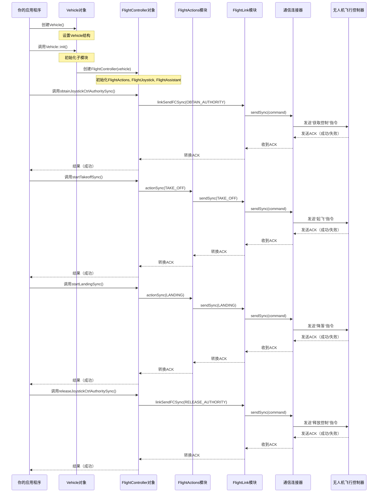

# 第二章：飞行控制器

在[第一章：飞行器](01_vehicle_.md)中，我们了解到`Vehicle`对象是无人机的中央大脑，是连接所有系统的主遥控器。现在我们的`Vehicle`已经激活并准备就绪，如何让它==真正起飞==呢？这就是**飞行控制器(FlightController)**的用武之地

## 什么是"飞行控制器"？（无人机的自动驾驶管理器）

想象你是无人机的机长，有一位熟练的自动驾驶副驾驶。你不会告诉副驾驶"将电机1的功率增加X量，将电机3的功率减少Y量，调整倾斜Z度"。

相反，你会给出高级指令，如"起飞"、"降落"、"返航"或"飞到这个位置"。

在`Onboard-SDK`中，`FlightController`对象正是这样的自动驾驶副驾驶。它是一个抽象层，为你提供对无人机飞行行为的**高级控制**。它==将你的简单指令转换为无人机实际飞行计算机所需的复杂底层指令==，而无需你操心电机转速或精确传感器读数等繁琐细节。

(还是我们经典的封装思想~)

### 为什么需要`FlightController`

控制无人机飞行涉及大量复杂的物理原理和实时调整

如果你必须直接向每个电机发送指令或不断计算完美角度，这将极其困难且容易出错。

`FlightController`极大地简化了这一过程。它提供了一个干净、易用的**API**（应用程序编程接口），让你==专注于*想要*无人机做什么，而不是*如何*实现==。它管理基本的飞行功能，使编程控制无人机移动变得安全高效。

## `FlightController`的主要职责

`FlightController`处理无人机飞行的各个方面。可以将其视为拥有多个专业部门，每个部门负责不同类型的飞行指令：

| 组件                | 职责                                   | 示例动作                                   |
| :------------------ | :------------------------------------- | :----------------------------------------- |
| **FlightActions**   | 执行预定义的高级飞行行为。             | 起飞、降落、返航、启动/停止电机。          |
| **FlightJoystick**  | 提供直接的实时控制（类似物理遥控器）。 | 设置速度、位置或姿态指令。                 |
| **FlightAssistant** | 管理飞行辅助功能和设置。               | 启用/禁用避障、设置RTK偏好、调整返航高度。 |

所有这些职责都捆绑在`FlightController`对象下，使其成为与==无人机移动相关的所有操作的首选接口==。

## 第一次飞行：起飞和降落

让我们让无人机执行一个基本的飞行序列：起飞、短暂悬停，然后降落。这是任何无人机操作的常见第一步

首先，确保已经准备好`Vehicle`对象，如我们在[第一章：飞行器](01_vehicle_.md)中创建的那样。

```cpp
#include <dji_vehicle.hpp>
#include <dji_linux_helpers.hpp> // Linux设置
#include <iostream>

// ... 在主函数中 ...

LinuxSetup linuxEnvironment(argc, argv);
DJI::OSDK::Vehicle* vehicle = linuxEnvironment.getVehicle();

if (vehicle == NULL) {
    std::cout << "飞行器未初始化，退出。\n";
    return -1;
}

// 假设激活已完成（如第一章所示）
// DJI::OSDK::ACK::ErrorCode activateAck = vehicle->activate(...);
// ... 错误检查 ...

int functionTimeout = 1; // SDK函数的通用超时时间
```

### 第一步：获取摇杆控制权限

在你的代码可以控制无人机飞行之前，必须明确**获取控制权限**

这是一个关键的安全特性。它告诉无人机："我的程序现在负责飞行，而不是物理遥控器。"

```cpp
// ... 飞行器初始化和激活后 ...

std::cout << "尝试获取摇杆控制权限...\n";
DJI::OSDK::ErrorCode::ErrorCodeType ret =
    vehicle->flightController->obtainJoystickCtrlAuthoritySync(functionTimeout);

if (ret != DJI::OSDK::ErrorCode::SysCommonErr::Success) 
{
    std::cout << "获取摇杆控制权限失败！错误: " << std::hex << ret << std::endl;
    return -1;
}
std::cout << "成功获取摇杆控制权限！\n";
```
*说明*：我们==在`flightController`对象上调用`obtainJoystickCtrlAuthoritySync()`==

`Sync`（同步）意味着程序将等待无人机响应后再继续。我们检查`ret`代码以确保成功。

### 第二步：起飞

有了控制权限，我们现在可以命令无人机起飞。

```cpp
// ... 获取控制权限后 ...

std::cout << "尝试启动起飞...\n";
DJI::OSDK::ErrorCode::ErrorCodeType takeoffRet =
    vehicle->flightController->startTakeoffSync(functionTimeout);

if (takeoffRet != DJI::OSDK::ErrorCode::SysCommonErr::Success) {
    std::cout << "起飞启动失败！错误: " << std::hex << takeoffRet << std::endl;
    
    // 如果起飞失败或在结束时，记得释放控制权限（cpp是这样的说）
    vehicle->flightController->releaseJoystickCtrlAuthoritySync(functionTimeout);
    return -1;
}

std::cout << "起飞指令已发送。无人机应正在上升！\n";

// 让无人机悬停几秒
sleep(8); // 等待8秒
```
*说明*：`startTakeoffSync()`方法发送起飞指令

无人机会自动上升到安全高度（通常1.2米）并悬停。我们添加`sleep()`调用，让无人机完成起飞并悬停片刻。

### 第三步：降落

悬停后，是时候让无人机安全降落了。

```cpp
// ... 悬停后 ...

std::cout << "尝试启动降落...\n";
DJI::OSDK::ErrorCode::ErrorCodeType landRet =
    vehicle->flightController->startLandingSync(functionTimeout);

if (landRet != DJI::OSDK::ErrorCode::SysCommonErr::Success) {
    std::cout << "降落启动失败！错误: " << std::hex << landRet << std::endl;
    vehicle->flightController->releaseJoystickCtrlAuthoritySync(functionTimeout);
    return -1;
}
std::cout << "降落指令已发送。无人机应正在下降！\n";

// 等待无人机降落
sleep(10); // 给它一些时间降落
```
*说明*：`startLandingSync()`启动降落序列。

无人机将下降并在接触地面时自动关闭电机。

### 第四步：释放控制权限

飞行操作完成后，必须释放控制权限。这允许物理遥控器重新接管或另一个授权应用程序控制无人机

```cpp
// ... 降落后 ...

std::cout << "尝试释放摇杆控制权限...\n";
DJI::OSDK::ErrorCode::ErrorCodeType releaseRet =
    vehicle->flightController->releaseJoystickCtrlAuthoritySync(functionTimeout);

if (releaseRet != DJI::OSDK::ErrorCode::SysCommonErr::Success) {
    std::cout << "释放摇杆控制权限失败！错误: " << std::hex << releaseRet << std::endl;
    return -1;
}

std::cout << "摇杆控制权限已成功释放！飞行完成。\n";
```
*说明*：调用`releaseJoystickCtrlAuthoritySync()`将无人机的飞行控制权返回给默认系统。

## 内部机制：`FlightController`如何工作

`FlightController`不仅仅是一个简单的指令发送器；它是一个复杂的协调器。

当要求它执行一个动作时，它会将任务委托给其专门的内部组件，并管理与无人机的通信。

### `FlightController`初始化流程

从[第一章：飞行器](01_vehicle_.md)中记得，`Vehicle`对象初始化了许多子模块。`FlightController`是这些关键模块之一。当调用`Vehicle::init()`时，它专门设置了`FlightController`及其内部部分。


*说明*：此图展示了"起飞"等指令的旅程。

应用程序调用`FlightController`方法。`FlightController`随后将其委托给适当的内部模块（如`FlightActions`或`FlightJoystick`）。该模块又使用`FlightLink`与低层[连接器(Linker)](07_linker_.md)通信，后者通过物理连接（USB/UART）向无人机的飞行控制器发送实际数据包。

> 一旦无人机响应，确认（ACK）会沿链返回。

### 代码聚焦：构建自动驾驶管理器

让我们看一些简化的代码片段，揭示`FlightController`的结构及其与内部模块的交互方式。

#### `FlightController`构造函数（简化自`osdk-core/api/src/dji_flight_controller.cpp`）

`FlightController`的构造函数清楚地表明，它立即创建了其子模块的实例：`FlightAssistant`、`FlightActions`和`FlightJoystick`。

每个子模块都接收`Vehicle`指针，允许它们访问无人机的通信通道。

```cpp
// osdk-core/api/src/dji_flight_controller.cpp
FlightController::FlightController(Vehicle* vehicle) 
{
  flightAssistant = new FlightAssistant(vehicle); // 管理飞行辅助
  flightActions = new FlightActions(vehicle);     // 处理基本飞行动作
  flightJoystick = new FlightJoystick(vehicle);   // 管理摇杆控制
}

FlightController::~FlightController() 
{
  delete this->flightAssistant;
  delete this->flightActions;
  delete this->flightJoystick;
}
```
*说明*：这表明`FlightController`像一个管理者，持有其专业工作者的指针

它本身不做繁重的工作，但知道==每个任务该找谁==。

#### `FlightController::startTakeoffSync()`（简化自`osdk-core/api/src/dji_flight_controller.cpp`）

当调用`FlightController`上的`startTakeoffSync()`时，它并不直接执行起飞。相反，它==将此指令委托给其`flightActions`模块==

```cpp
// osdk-core/api/src/dji_flight_controller.cpp
ErrorCode::ErrorCodeType FlightController::startTakeoffSync(int timeout) {
  if (flightActions) { // 检查FlightActions模块是否存在
    return flightActions->actionSync(FlightActions::FlightCommand::TAKE_OFF,
                                     timeout);
  } else 
    return ErrorCode::SysCommonErr::AllocMemoryFailed;
}
```
*说明*：此方法充当简单的传递。它在`flightActions`对象上调用`actionSync()`，提供`TAKE_OFF`指令和超时。

这种模块化==设计保持了代码的组织性==。(包装一层又一层 &传递)

#### `FlightActions::actionSync()`（简化自`osdk-core/modules/src/flight/dji_flight_actions_module.cpp`）

`FlightActions`模块随后获取`TAKE_OFF`指令，并使用`FlightLink`通过线路发送它。

```cpp
// osdk-core/modules/src/flight/dji_flight_actions_module.cpp
ErrorCode::ErrorCodeType FlightActions::actionSync(uint8_t req, int timeout) 
{
  if (flightLink) { // 检查FlightLink模块是否存在
    // 通过FlightLink向无人机的飞行控制器发送指令
    ACK::ErrorCode* rsp = (ACK::ErrorCode*)flightLink->sendSync(
        OpenProtocolCMD::CMDSet::Control::task, // 控制任务的指令集
        (void*)&req,                          // 实际的起飞请求
        sizeof(req),                          // 请求的大小
        timeout);                             // 响应的超时时间
    // ... 进一步处理响应 ...
  } else 
    return ErrorCode::SysCommonErr::AllocMemoryFailed;
}
```
*说明*：这是指令实际开始向无人机传输的地方

`flightLink->sendSync()`==处理低层通信==，打包`TAKE_OFF`请求（由`req`表示）并将其发送到无人机的飞行控制器

## 结论

`FlightController`对象是强大的副驾驶，通过==提供高级API简化无人机飞行控制==，用于复杂动作如起飞、降落和动态机动。

- 通过==将任务委托给专门模块并通过[连接器(Linker)](07_linker_.md)管理通信，它抽象了底层复杂性，让你专注于应用程序的逻辑==。

现在我们知道如何让无人机飞行，让我们探索如何让它执行更复杂的==自动化任务并遵循预定义路径==

---
[下一章：任务管理器 & 航点任务/热点任务](03_missionmanager___waypointmission_hotpointmission_.md)

