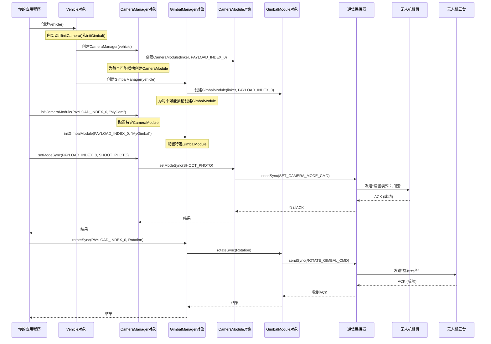

# 第四章：相机模块与云台模块

在[第三章：任务管理器与航点任务/热点任务](03_missionmanager___waypointmission_hotpointmission_.md)中，我们学会了如何为无人机规划复杂的自动化飞行路径

既然无人机已经能够自主飞行，那么它的"视觉"系统呢？如何让它拍照、录像或将相机指向特定方向？

这就是**相机模块(CameraModule)**和**云台模块(GimbalModule)**的用武之地！它们是无人机的"眼睛"和"颈部"，让你能够通过编程控制相机及其稳定云台。

## 什么是"相机模块"和"云台模块"？（无人机的视觉与指向控制系统）

想象你的无人机配备了一个连接在可移动头部（云台）上的高品质相机。你有一个==相机控制面板，上面有"拍照"、"开始录像"、"调整曝光"等按钮，以及变焦旋钮==。

你还有另一个==云台控制面板，可以俯仰、平移或复位云台位置==。

在`Onboard-SDK`中，`CameraModule`和`GimbalModule`对象正是这些专属控制面板。

*   **`CameraModule`**：代表无人机上的单个相机，提供所有相机专属功能的控制权，例如：
    *   拍照（单张、连拍、间隔拍摄）
    *   录像
    *   调整曝光参数（ISO、快门速度、光圈、EV值）
    *   控制变焦
    *   设置对焦

*   **`GimbalModule`**：代表单个云台（固定相机的机械稳定器），可精确控制相机朝向，例如：
    *   旋转相机（俯仰、横滚、偏航）
    *   将云台复位到默认位置

### 为什么需要这些模块？

现代大疆无人机可能配备多个相机和云台（例如主相机、热成像相机或上视相机，各带独立云台）。`CameraModule`和`GimbalModule`为每个设备提供了清晰独立的接口。

这些模块由两个更高级的组件管理：
*   **`CameraManager`**：统管所有`CameraModule`实例
*   **`GimbalManager`**：统管所有`GimbalModule`实例

可以把`CameraManager`想象成主摄影部门，`GimbalManager`是主摄像部门。每个部门都有随时待命的专家（即各个`CameraModule`和`GimbalModule`对象）来执行具体指令。

## 第一个视觉任务：==拍照并下视相机==

让我们为无人机布置一个简单的视觉任务：用主相机拍摄单张照片，然后将相机向下倾斜

首先确保已准备好`Vehicle`对象（如[第一章：飞行器](01_vehicle_.md)所示）。本示例不需要飞行控制权限，因为相机/云台操作通常无需飞行权限（但如需边飞行边拍照则需获取权限）。

```cpp
#include <dji_vehicle.hpp>
#include <dji_linux_helpers.hpp>
#include <dji_camera_manager.hpp> // CameraManager
#include <dji_gimbal_manager.hpp> // GimbalManager
#include <iostream>

// ... 在主函数中 ...

LinuxSetup linuxEnvironment(argc, argv);
DJI::OSDK::Vehicle* vehicle = linuxEnvironment.getVehicle();

if (vehicle == NULL) {
    std::cout << "飞行器未初始化，退出。\n";
    return -1;
}

// 假设已完成激活（如第一章所示）
// DJI::OSDK::ACK::ErrorCode activateAck = vehicle->activate(...);
// ... 错误检查 ...

int functionTimeout = 1; // SDK函数通用超时时间

// 主相机/云台通常位于PAYLOAD_INDEX_0
const DJI::OSDK::PayloadIndexType mainPayloadIndex = DJI::OSDK::PAYLOAD_INDEX_0;
```

### 第一步：初始化相机和云台模块

使用相机或云台前，需要通过各自的管理器初始化其模块。这告诉SDK你要控制的具体设备。

```cpp
// ... 飞行器初始化后 ...

// 从Vehicle获取CameraManager和GimbalManager
DJI::OSDK::CameraManager* cameraManager = vehicle->cameraManager;
DJI::OSDK::GimbalManager* gimbalManager = vehicle->gimbalManager;

// 初始化主相机模块
std::cout << "初始化主相机模块...\n";
DJI::OSDK::ErrorCode::ErrorCodeType cameraInitRet =
    cameraManager->initCameraModule(mainPayloadIndex, "MyMainCamera");
if (cameraInitRet != DJI::OSDK::ErrorCode::SysCommonErr::Success) {
    std::cout << "初始化相机模块失败！错误: " << std::hex << cameraInitRet << std::endl;
    return -1;
}
std::cout << "主相机模块初始化完成。\n";

// 初始化主云台模块
std::cout << "初始化主云台模块...\n";
DJI::OSDK::ErrorCode::ErrorCodeType gimbalInitRet =
    gimbalManager->initGimbalModule(mainPayloadIndex, "MyMainGimbal");
if (gimbalInitRet != DJI::OSDK::ErrorCode::SysCommonErr::Success) {
    std::cout << "初始化云台模块失败！错误: " << std::hex << gimbalInitRet << std::endl;
    return -1;
}
std::cout << "主云台模块初始化完成。\n";
```

### 第二步：设置相机为拍照模式并拍摄单张照片

相机通常有"拍照"、"录像"或"回放"等模式。要拍照，我们需先确保相机处于`SHOOT_PHOTO`模式，然后发出`SINGLE`拍照指令。

```cpp
// ... 模块初始化后 ...

// 设置相机工作模式为拍照
std::cout << "设置相机模式为拍照...\n";
DJI::OSDK::ErrorCode::ErrorCodeType setModeRet =
    cameraManager->setModeSync(mainPayloadIndex, DJI::OSDK::CameraModule::WorkMode::SHOOT_PHOTO, functionTimeout);
if (setModeRet != DJI::OSDK::ErrorCode::SysCommonErr::Success) {
    std::cout << "设置相机模式失败！错误: " << std::hex << setModeRet << std::endl;
    return -1;
}
std::cout << "相机模式已设为拍照。\n";
sleep(1); // 给相机切换模式的时间

// 开始拍摄单张照片
std::cout << "拍摄单张照片...\n";
DJI::OSDK::ErrorCode::ErrorCodeType shootPhotoRet =
    cameraManager->startShootPhotoSync(mainPayloadIndex, DJI::OSDK::CameraModule::ShootPhotoMode::SINGLE, functionTimeout);
if (shootPhotoRet != DJI::OSDK::ErrorCode::SysCommonErr::Success) {
    std::cout << "拍照失败！错误: " << std::hex << shootPhotoRet << std::endl;
    return -1;
}
std::cout << "照片已拍摄！请检查无人机SD卡。\n";
sleep(2); // 给无人机处理照片的时间
```

### 第三步：旋转云台使相机向下

现在让我们控制云台使相机垂直向下。通常这是-90度的俯仰角。

```cpp
// ... 拍照后 ...

// 定义云台旋转参数
DJI::OSDK::GimbalModule::Rotation gimbalRotation;
gimbalRotation.pitch        = -90.0f; // 俯仰90度向下
gimbalRotation.roll         = 0.0f;   // 无横滚
gimbalRotation.yaw          = 0.0f;   // 无偏航
gimbalRotation.rotationMode = 0;      // 0: 相对于机体坐标系
gimbalRotation.time         = 1.0f;   // 完成旋转的时间(秒)

// 旋转云台
std::cout << "旋转云台至俯仰-90度...\n";
DJI::OSDK::ErrorCode::ErrorCodeType rotateGimbalRet =
    gimbalManager->rotateSync(mainPayloadIndex, gimbalRotation, functionTimeout);
if (rotateGimbalRet != DJI::OSDK::ErrorCode::SysCommonErr::Success) {
    std::cout << "旋转云台失败！错误: " << std::hex << rotateGimbalRet << std::endl;
    return -1;
}
std::cout << "云台已旋转至向下位置。\n";
sleep(2); // 等待云台完成移动

// 可选：将云台复位至默认前视位置
std::cout << "将云台复位至默认位置...\n";
DJI::OSDK::ErrorCode::ErrorCodeType resetGimbalRet =
    gimbalManager->resetSync(mainPayloadIndex, functionTimeout);
if (resetGimbalRet != DJI::OSDK::ErrorCode::SysCommonErr::Success) {
    std::cout << "复位云台失败！错误: " << std::hex << resetGimbalRet << std::endl;
    return -1;
}
std::cout << "云台已复位至默认位置。\n";
sleep(2);
```

## 内部机制：相机/云台模块如何通信

与其他核心SDK组件一样，`CameraManager`、`GimbalManager`及其各自的`Module`对象都由`Vehicle`对象精心协调，并依赖底层的[连接器(Linker)](07_linker_.md)与无人机硬件通信。

### 初始化流程

从[第一章：飞行器](01_vehicle_.md)可知，==`Vehicle::init()`是主初始化器。它会创建相机和云台的管理器==。



## 结论

`CameraModule`和`GimbalModule`是无人机实现视觉与指向控制的专业工具。通过与各自的管理器交互，可以精确控制拍照、录像、曝光参数、变焦和云台朝向。

这种模块化设计让你能轻松控制特定设备，实现高级成像与检测任务。

现在我们已经能够控制无人机飞行及其相机，接下来让我们探索如何获取==超越基础遥测的高级感知==能力

---
[下一章：高级感知](05_advancedsensing_.md)

