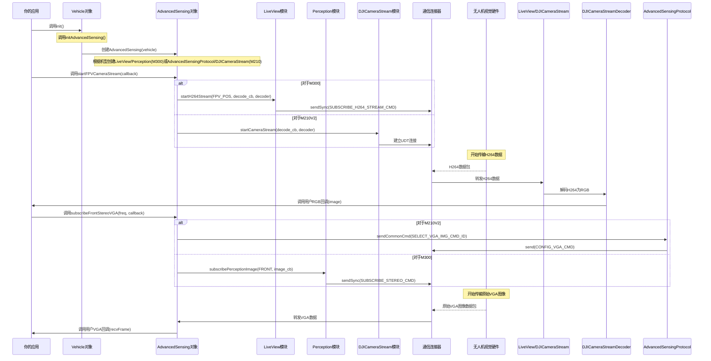

# 第五章：高级感知

在[第四章：相机模块/云台模块](04_cameramodule___gimbalmodule_.md)中，我们学会了如何控制无人机相机拍照录像，以及通过云台调整拍摄角度。这对于==捕捉特定瞬间==非常有用，但如果==无人机需要**实时观察和理解周围环境==呢？

想象你需要无人机自主导航、避障或生成区域3D地图。这些高级任务仅靠拍照是不够的，你需要==实时、连续的视频信息流，包括深度感知能力==

这就是**高级感知(AdvancedSensing)**模块的用武之地。它如同为无人机装上了能实时传输视频、感知深度并详细理解周边环境的"眼睛"，其能力远超普通相机。

## 什么是"高级感知"？（无人机的智能视觉系统）

`AdvancedSensing`模块是连接无人机高级感知能力的桥梁，尤其适用于M210 V2和M300系列等先进无人机，提供高保真视觉数据流。

可以这样理解：
*   普通相机负责拍照，`CameraModule`帮你按下快门
*   `AdvancedSensing`则持续传输视频流，提供原始或处理后的立体图像，甚至生成有助于理解**深度**和3D场景结构的数据

### 为什么需要`AdvancedSensing`？

高级机器人应用需要的不只是静态图像，它们需要：

*   **实时视频流**：像飞行员通过FPV（第一人称视角）相机那样持续监控环境
*   **立体视觉**：许多大疆无人机配备多摄像头（如人眼般的"双目"系统）来计算深度。`AdvancedSensing`让能获取这些原始图像或预处理深度信息（视差图）
*   **空间信息**：通过==立体数据==，应用可以构建3D点云、计算物体距离，实现高级导航或检测
*   **解码功能**：无人机原始视频流通常采用H264等压缩格式。`AdvancedSensing`包含将这些流解码为标准图像格式（如RGB）的工具，便于应用处理

前文传送：[[GICP\] 点云数据结构 | 点云配准 | KD树 | 常见树状搜索结构_kd树点云配准](https://blog.csdn.net/2301_80171004/article/details/149220275?ops_request_misc=%7B%22request%5Fid%22%3A%225063b4b27868e57a6962589c0bf690b9%22%2C%22scm%22%3A%2220140713.130102334.pc%5Fblog.%22%7D&request_id=5063b4b27868e57a6962589c0bf690b9&biz_id=0&utm_medium=distribute.pc_search_result.none-task-blog-2~blog~first_rank_ecpm_v1~rank_v31_ecpm-2-149220275-null-null.nonecase&utm_term=GICP&spm=1018.2226.3001.4450)

该模块对需要环境感知的应用至关重要，例如：
*   避障（超越内置传感器能力）
*   3D建模与重建
*   视觉里程计
*   高级物体检测与追踪

## `AdvancedSensing`核心功能

该模块提供多项强大功能：

| 功能           | 描述                                                     | 示例数据                        |
| :------------- | :------------------------------------------------------- | :------------------------------ |
| **H264视频流** | 获取不同相机（FPV、主相机等）的实时压缩视频流            | 原始H264帧、解码后的RGB图像     |
| **立体图像流** | 从立体摄像头对（如前视、下视）获取原始或校正图像         | 左右灰度图像（VGA或240p分辨率） |
| **视差图**     | 从立体图像计算深度信息，显示物体距离                     | 像素灰度值代表深度的灰度图      |
| **解码与处理** | 内置工具将H264视频转为标准图像格式，处理原始立体图像缓冲 | RGB矩阵、OpenCV的`Mat`对象      |

## 首个感知任务：获取实时视频流

让我们从获取无人机FPV（第一人称视角）相机的实时视频流开始。这相当于开启无人机的"行车记录仪"并将画面传输到计算机。

首先确保`Vehicle`对象已就绪（如[第一章：飞行器](01_vehicle_.md)所示）。关键是在设置`LinuxSetup`（或其他平台的等效项）时需明确**启用高级感知功能**。

```cpp
#include <dji_vehicle.hpp>
#include <dji_linux_helpers.hpp>
#include <dji_advanced_sensing.hpp> // 高级感知模块
#include <iostream>
#include <vector> // 图像数据存储

// 可选：引入OpenCV显示图像
// #include "opencv2/opencv.hpp"

// 定义回调函数，当新RGB图像就绪时触发
void processFPVImage(DJI::OSDK::CameraRGBImage img, void* userData) {
    std::string cameraName = "FPV_CAM";
    if (userData) {
        cameraName = std::string(reinterpret_cast<char*>(userData));
    }
    std::cout << "#### 获取新RGB图像来自: " << cameraName
              << " - 分辨率: " << img.width << "x" << img.height << std::endl;

    // 实际应用中可在此处理'img'
    // 例如使用OpenCV：
    // #ifdef OPEN_CV_INSTALLED
    // cv::Mat mat(img.height, img.width, CV_8UC3, img.rawData.data(), img.width * 3);
    // cv::cvtColor(mat, mat, cv::COLOR_RGB2BGR); // 转换RGB为OpenCV的BGR格式
    // cv::imshow(cameraName, mat);
    // cv::waitKey(1);
    // #endif
}

int main(int argc, char** argv) {
    // 重要：在设置中启用高级感知
    bool enableAdvancedSensing = true;
    DJI::OSDK::LinuxSetup linuxEnvironment(argc, argv, enableAdvancedSensing);
    DJI::OSDK::Vehicle* vehicle = linuxEnvironment.getVehicle();

    if (vehicle == NULL) {
        std::cout << "飞行器未初始化，退出。\n";
        return -1;
    }

    // 假设已完成激活（如第一章所示）
    // DJI::OSDK::ACK::ErrorCode activateAck = vehicle->activate(...);
    // ... 错误检查 ...

    // 设置相机流ACM设备路径（通常用于Linux系统的M210V2）
    // 对于M300可能非必需，或内部处理方式不同
    const char *acm_dev = linuxEnvironment.getEnvironment()->getDeviceAcm().c_str();
    vehicle->advancedSensing->setAcmDevicePath(acm_dev);
```

### 第一步：启动相机视频流

现在，我们指示`AdvancedSensing`模块开始传输FPV相机视频流。通过提供`processFPVImage`回调函数，SDK知道将解码后的图像发送到哪里。

```cpp
    // ... main函数内设置完成后 ...

    char fpvCamName[] = "FPV_CAM_Stream";
    std::cout << "启动FPV相机视频流...\n";
    bool streamResult = vehicle->advancedSensing->startFPVCameraStream(&processFPVImage, &fpvCamName);

    if (!streamResult) {
        std::cout << "开启FPV相机流失败！退出。\n";
        return -1;
    }
    std::cout << "FPV相机流已启动。图像将通过回调处理。\n";

    // 让视频流运行几秒
    sleep(10); // 根据需要调整时长
```

### 第二步：停止相机视频流

完成图像采集后，最好停止视频流以释放资源。

```cpp
    // ... main函数内视频流运行后 ...

    std::cout << "停止FPV相机视频流...\n";
    vehicle->advancedSensing->stopFPVCameraStream();
    std::cout << "FPV相机流已停止。\n";

    // 可选：短暂延迟确保所有线程正确关闭
    sleep(1);

    return 0;
}
```

### 获取立体图像（VGA分辨率）

更高级的感知应用可能需要直接访问无人机立体摄像头图像（如前视立体摄像头对）。这些通常是VGA（640x480）或240p（320x240）的灰度图像。

以下是订阅前视立体VGA图像的示例：

```cpp
// ... (包含头文件、main函数、飞行器设置、激活、acm_dev路径同前) ...

// 此回调接收原始VGA立体图像数据
// 实际应用中需进一步解码/处理（如计算视差图）
void processStereoVGAImages(DJI::OSDK::Vehicle *vehiclePtr, DJI::OSDK::RecvContainer recvFrame, DJI::OSDK::UserData userData) {
    if (recvFrame.recvInfo.cmd_id == DJI::OSDK::AdvancedSensingProtocol::PROCESS_VGA_CMD_ID) {
        auto stereoVGAImg = recvFrame.recvData.stereoVGAImgData;
        std::cout << "收到立体VGA图像 - 帧序号: " << stereoVGAImg->frame_index
                  << ", 时间戳: " << stereoVGAImg->time_stamp << std::endl;
        // stereoVGAImg->img_vec[0] 包含左图原始数据
        // stereoVGAImg->img_vec[1] 包含右图原始数据
        // 这是480x640的灰度图像（uint8_t缓冲区）
        // 通常在此使用OpenCV创建cv::Mat对象
        // 并进行校正、视差计算等处理
    }
}

// ... main函数内 ...

std::cout << "订阅前视立体VGA图像(20Hz)...\n";
// '20'表示期望频率(Hz)
vehicle->advancedSensing->subscribeFrontStereoVGA(20, &processStereoVGAImages, NULL);

sleep(15); // 运行一段时间

std::cout << "取消订阅VGA图像...\n";
vehicle->advancedSensing->unsubscribeVGAImages();

// ... main函数其余部分 ...
```

## 内部机制：`AdvancedSensing`如何"看见"

`AdvancedSensing`模块是==管理多数据流和无人机专用硬件的复杂协调器，通过底层[连接器(Linker)](07_linker_.md)（见[第一章：飞行器](01_vehicle_.md)）与不同感知组件通信==。

### `AdvancedSensing`数据流

当请求高级感知流时，以下是简化的处理流程：



## 结论

`AdvancedSensing`模块赋予无人机应用强大的实时视觉能力。通过提供实时视频流、原始/处理后的立体图像和深度信息访问，它让无人机能"看见"并"理解"环境，实现高级自主任务。

掌握如何订阅这些数据流并通过回调处理，是构建智能无人机应用的关键步骤。

现在我们的无人机已具备==环境感知能力==，接下来让我们探索==如何管理它能发送的各类数据==

---
[下一章：数据订阅](06_datasubscription_.md)

