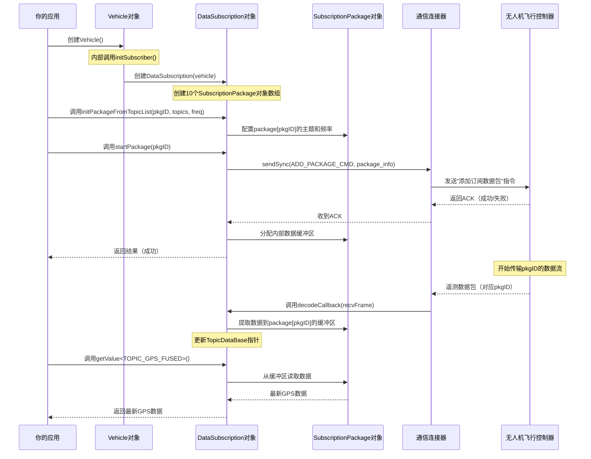

# 第六章：数据订阅

在[第五章：高级感知](05_advancedsensing_.md)中，我们探索了如何从无人机相机==获取丰富的视觉和深度数据流==。

这对于测绘或避障等视觉任务非常有用。但如果需要==实时获取无人机==的精确GPS坐标、电池电量、当前速度或飞行模式呢？这些基础数值信息（或称**遥测数据**）是`AdvancedSensing`模块无法提供的。

这就是**数据订阅(DataSubscription)**模块的用武之地！它是无人机专属的系统，用于将各类实时数值信息直接传输到你的应用程序。

## 什么是"数据订阅"？（无人机的实时数据推送服务）

想象你对各类新闻感兴趣，但只想订阅特定主题（如"科技"、"体育"或"天气"）的更新，并且希望以特定频率（如每日、每小时或每分钟）接收。

在`Onboard-SDK`中，`DataSubscription`对象的工作方式非常相似：

*   它允许**订阅**无人机各类遥测数据，这些数据如同新闻简报中的"主题"
*   你可以选择每个主题的**更新频率**（如每秒1次、每秒10次等）
*   系统会持续将这些数据发送到你的应用，让你掌握无人机的实时状态

### 为什么需要`DataSubscription`？

为了做出智能决策、控制无人机或监控其状态，你的应用需要持续获取最新数值信息。

`DataSubscription`提供了一种灵活高效的方式，==按需获取必要数据，而不会因冗余信息堵塞通信链路==。

它让你能够：
*   **监控飞行状态**：了解无人机处于飞行、悬停、降落或地面状态
*   **追踪位置与速度**：获取精确的GPS、高度和速度读数
*   **检查设备健康度**：监控电池百分比、电机状态或异常情况
*   **响应事件**：根据无人机状态变化触发操作

## 数据订阅核心概念

`DataSubscription`围绕三个核心概念组织遥测数据：

| 概念       | 描述                                                         | 示例                                                         |
| :--------- | :----------------------------------------------------------- | :----------------------------------------------------------- |
| **主题**   | 无人机提供的特定类型遥测数据。可以理解为单一信息单元，如"GPS位置"或"电池电量"。每个主题有唯一ID（如`TOPIC_GPS_FUSED`） | `TOPIC_GPS_FUSED`（融合GPS位置与高度），`TOPIC_BATTERY_INFO`（电池电压、百分比等），`TOPIC_STATUS_FLIGHT`（当前飞行状态），`TOPIC_QUATERNION`（无人机朝向） |
| **频率**   | 接收主题更新的频率。SDK支持多种频率（如1Hz、10Hz、50Hz、200Hz），可根据应用需求定制数据速率 | `1`（1Hz - 每秒1次），`10`（10Hz - 每秒10次），`50`（50Hz），`200`（200Hz - 每秒200次） |
| **数据包** | 一个或多个主题的集合，以单一频率订阅。通过将主题打包，可以简化管理并确保相关信息的同步更新 | 可创建"FlightMonitoring"数据包，包含`TOPIC_GPS_FUSED`、`TOPIC_BATTERY_INFO`和`TOPIC_STATUS_FLIGHT`，均以10Hz更新。SDK支持多个数据包（上限为`MAX_NUMBER_OF_PACKAGE`） |

## 首个遥测数据流：获取无人机状态

让我们设置一个基础数据订阅，接收无人机GPS位置、电池信息和飞行状态，并以10Hz（每秒10次）的频率打印到控制台。

首先确保`Vehicle`对象已就绪（如[第一章：飞行器](01_vehicle_.md)所示）。

```cpp
#include <dji_vehicle.hpp>
#include <dji_linux_helpers.hpp>
#include <dji_subscription.hpp> // 数据订阅模块
#include <iostream>
#include <unistd.h> // sleep函数

// ... 主函数内 ...

int main(int argc, char** argv) 
  {
    LinuxSetup linuxEnvironment(argc, argv);
    DJI::OSDK::Vehicle* vehicle = linuxEnvironment.getVehicle();

    if (vehicle == NULL) {
        std::cout << "飞行器未初始化，退出。\n";
        return -1;
    }

    // 假设已完成激活（如第一章所示）
    // DJI::OSDK::ACK::ErrorCode activateAck = vehicle->activate(...);
    // ... 错误检查 ...

    int functionTimeout = 1; // SDK函数通用超时时间
    const int pkgIndex = 0;  // 使用数据包ID 0
```

### 第一步：验证订阅功能

订阅前最好先确认无人机支持该功能。

```cpp
    // ... 飞行器初始化后 ...

    // 获取订阅管理器
    DJI::OSDK::DataSubscription* subscribe = vehicle->subscribe;

    std::cout << "验证数据订阅功能...\n";
    DJI::OSDK::ACK::ErrorCode verifyStatus = subscribe->verify(functionTimeout);
    if (DJI::OSDK::ACK::getError(verifyStatus) != DJI::OSDK::ACK::SUCCESS) {
        DJI::OSDK::ACK::getErrorCodeMessage(verifyStatus, __func__);
        std::cout << "数据订阅验证失败，退出。\n";
        return -1;
    }
    std::cout << "数据订阅验证成功！\n";
```

### 第二步：定义并初始化订阅数据包

专栏传送：[实现Json-Rpc](https://blog.csdn.net/2301_80171004/category_12880936.html?spm=1001.2014.3001.5482)

现在定义需要的主题、频率并初始化数据包。

```cpp
    // ... 验证成功后 ...

    // 定义要订阅的主题
    DJI::OSDK::Telemetry::TopicName topicList[] = {
        DJI::OSDK::Telemetry::TOPIC_GPS_FUSED,
        DJI::OSDK::Telemetry::TOPIC_BATTERY_INFO,
        DJI::OSDK::Telemetry::TOPIC_STATUS_FLIGHT
    };
    int numTopics = sizeof(topicList) / sizeof(topicList[0]);
    int freq = 10; // 10Hz更新

    std::cout << "初始化订阅数据包 " << pkgIndex << "，包含 "
              << numTopics << "个主题，频率 " << freq << " Hz...\n";
    bool enableTimestamp = false; // 不需要数据内的时间戳字段

    bool pkgStatus = subscribe->initPackageFromTopicList(
        pkgIndex, numTopics, topicList, enableTimestamp, freq);

    if (!pkgStatus) {
        std::cout << "订阅数据包初始化失败！退出。\n";
        return -1;
    }
    std::cout << "订阅数据包初始化完成。\n";
```

### 第三步：启动订阅数据包

数据包初始化后，通知无人机开始发送数据。

```cpp
    // ... 数据包初始化后 ...

    std::cout << "启动订阅数据包 " << pkgIndex << "...\n";
    DJI::OSDK::ACK::ErrorCode startStatus = subscribe->startPackage(pkgIndex, functionTimeout);

    if (DJI::OSDK::ACK::getError(startStatus) != DJI::OSDK::ACK::SUCCESS) {
        DJI::OSDK::ACK::getErrorCodeMessage(startStatus, __func__);
        std::cout << "启动订阅数据包失败！退出。\n";
        // 出错时清理资源
        subscribe->removePackage(pkgIndex, functionTimeout);
        return -1;
    }
    std::cout << "订阅数据包已启动。数据开始传输！\n";

    // 等待数据填充缓冲区（约1秒）
    sleep(1);
```

### 第四步：循环获取并打印数据

现在进入激动人心的环节：读取实时数据！初学者最简单的方式是使用`getValue<主题名称>()`。

```cpp
    // ... 数据包启动并初始等待后 ...

    int printCount = 0;
    int maxPrints = 50; // 打印50次

    std::cout << "\n开始数据打印循环...\n";
    while (printCount < maxPrints) {
        // 直接获取各主题最新值
        DJI::OSDK::Telemetry::GPSFused          gpsData     = subscribe->getValue<DJI::OSDK::Telemetry::TOPIC_GPS_FUSED>();
        DJI::OSDK::Telemetry::Battery           batteryData = subscribe->getValue<DJI::OSDK::Telemetry::TOPIC_BATTERY_INFO>();
        DJI::OSDK::Telemetry::VehicleStatus::FlightStatus flightStatus = subscribe->getValue<DJI::OSDK::Telemetry::TOPIC_STATUS_FLIGHT>();

        // 打印数据
        std::cout << "--- 数据更新 " << (printCount + 1) << " ---\n";
        std::cout << "GPS (纬度,经度,高度): " << gpsData.latitude << ", "
                  << gpsData.longitude << ", " << gpsData.altitude << " 米\n";
        std::cout << "电池电量: " << (int)batteryData.percentage << "%\n";
        std::cout << "飞行状态: " << (int)flightStatus << "\n";
        std::cout << "---------------------\n\n";

        usleep(100000); // 等待100毫秒（10Hz更新率）
        printCount++;
    }
    std::cout << "数据打印循环结束。\n";
```

### 第五步：移除订阅数据包

完成数据采集后，必须移除数据包以释放无人机资源。

```cpp
    // ... 数据打印循环后 ...

    std::cout << "移除订阅数据包 " << pkgIndex << "...\n";
    DJI::OSDK::ACK::ErrorCode removeStatus = subscribe->removePackage(pkgIndex, functionTimeout);

    if (DJI::OSDK::ACK::getError(removeStatus) != DJI::OSDK::ACK::SUCCESS) {
        DJI::OSDK::ACK::getErrorCodeMessage(removeStatus, __func__);
        std::cout << "移除订阅数据包失败！（可能需要重启无人机）\n";
        return -1;
    }
    std::cout << "订阅数据包移除成功。遥测数据流已停止。\n";

    return 0;
}
```

## 内部机制：`DataSubscription`如何工作

`DataSubscription`模块是==管理数据请求、接收原始数据并处理的高级系统==，高度依赖[连接器(Linker)](07_linker_.md)（见[第一章：飞行器](01_vehicle_.md)）进行底层通信。

### `DataSubscription`数据流

以下是设置和获取订阅数据的简化流程：



## 结论

`DataSubscription`模块是任何需要监控和响应无人机实时数值遥测的`Onboard-SDK`应用的核心组件

通过允许自定义主题包和频率，它提供了强大而灵活的方式来掌握无人机的飞行状态、位置、健康度等信息。掌握如何设置、启动、获取和移除这些==订阅==，是开发智能无人机应用的关键技能。

现在我们已经能够控制无人机并获取其关键数据，接下来让我们了解==连接应用与无人机的核心通信组件：连接器==。

---
[下一章：连接器](07_linker_.md)

