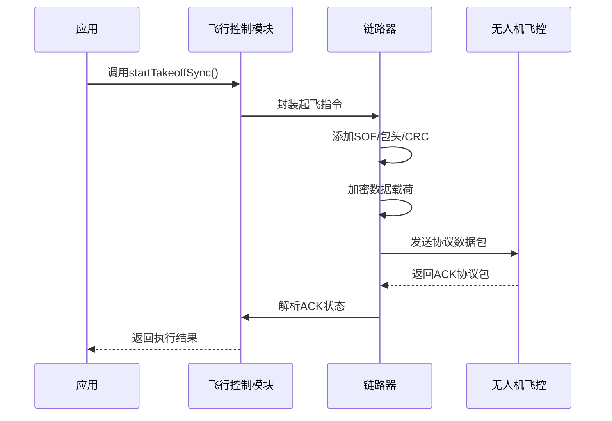

# 第八章：开放协议(Open Protocol)

在[第七章：链路器](07_linker_.md)中，我们了解到链路器是连接应用与DJI无人机的关键信使

但信使需要一种特定的"语言"来沟通——这就是**开放协议(Open Protocol)**，它是链路器与无人机飞控通信的标准化语言。

## 什么是开放协议？（无人机的母语）

将DJI无人机视为使用独特语言的智能机器。开放协议就是这种**飞控系统的原生语言**，定义了信息打包与交换的精确规则：

### 为什么需要开放协议？

可靠的通信协议至关重要：
* **准确性**：确保无人机正确解析每条指令
* **可靠性**：提供错误检测与重传机制
* **安全性**：支持加密防止未授权访问
* **模块化**：标准化通信层使各模块无需了解彼此实现细节

## 协议数据包核心结构

每个开放协议数据包都遵循严格格式：

| 组件             | 描述                                                         |
| ---------------- | ------------------------------------------------------------ |
| **帧头(SOF)**    | 固定字节`0xAA`标记数据包起始                                 |
| **包头(Header)** | 包含数据包长度、协议版本、会话ID、ACK标志、加密标志和序列号等元数据 |
| **CRC16校验**    | 包头校验码，用于验证传输完整性                               |
| **指令ID**       | 由指令集（如飞行控制）和具体指令（如起飞）组成的双字节编码   |
| **数据载荷**     | 指令相关参数，如起飞高度或航点坐标                           |
| **加密/填充**    | 加密后的数据可能添加填充字节以满足加密块大小要求             |
| **CRC32校验**    | 完整数据载荷的校验码                                         |

## 如何使用开放协议（间接调用）

开发者通常**无需直接操作协议层**，SDK已封装所有底层细节。例如：

```cpp
// 来自第二章：飞行控制
vehicle->flightController->startTakeoffSync(functionTimeout);

// 来自第六章：数据订阅
auto gpsData = subscribe->getValue<DJI::OSDK::Telemetry::TOPIC_GPS_FUSED>();
```

高层API调用会被自动转换为开放协议数据包，经由链路器发送至无人机，响应数据也会被自动解析。

## 底层原理：协议工作流程

### 通信流程示例（起飞指令）



### 核心代码解析

#### 协议包构造（简化自`dji_open_protocol.cpp`）

```cpp
uint16_t OpenProtocol::encrypt(uint8_t* pdest, const uint8_t* psrc, uint16_t w_len) {
    OpenHeader* p_head = (OpenHeader*)pdest;
    p_head->sof = OpenProtocol::SOF; // 设置帧头
    p_head->length = data_len;       // 设置包长度
    p_head->enc = is_enc ? 1 : 0;    // 设置加密标志
    
    memcpy(pdest + sizeof(OpenHeader), psrc, w_len); // 填充数据载荷
    encodeData(p_head, aes256_encrypt_ecb);         // 加密数据
    calculateCRC(pdest);                            // 计算校验码
    return data_len;
}
```

#### 数据包验证（简化自`dji_open_protocol.cpp`）

```cpp
bool OpenProtocol::verifyData() {
    OpenHeader* p_head = (OpenHeader*)(p_filter->recvBuf);
    if (crcTailCheck((uint8_t*)p_head, p_head->length) == 0) {
        encodeData(p_head, aes256_decrypt_ecb); // 解密数据
        return callApp(); // 调用应用层处理
    } else {
        reuseDataStream(); // 数据损坏时尝试恢复
    }
    return false;
}
```

## 结论

开放协议是Onboard-SDK与无人机通信的基石，虽然开发者无需直接操作协议层，但理解其帧结构、加密机制和校验流程有助于深入掌握SDK工作原理。这种标准化协议确保了指令传输的可靠性与安全性。

接下来我们将探索SDK如何高效管理协议数据包的内存使用！

---
[下一章：内存管理单元(MMU)](09_memory_management_unit__mmu__.md)

