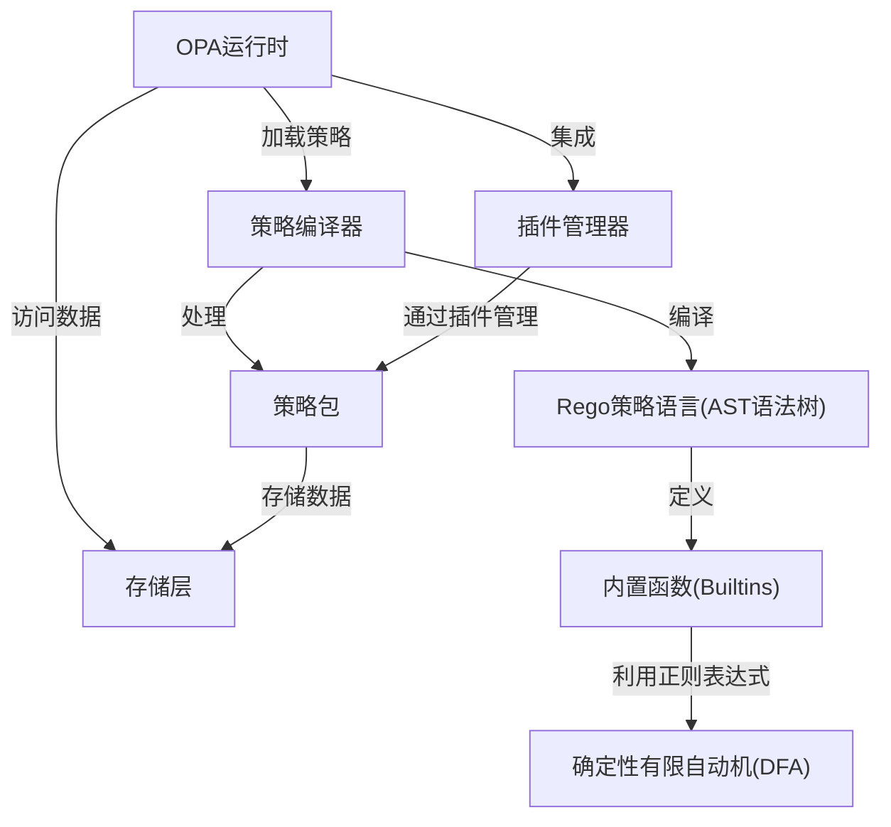
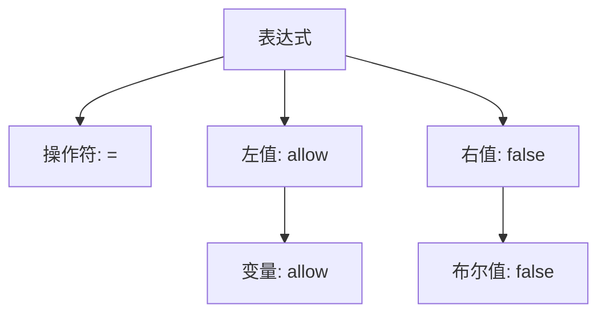
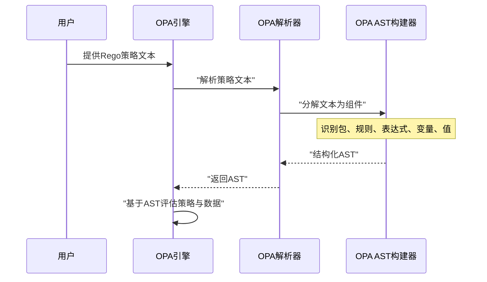

链接：[Open Policy Agent - Homepage | Open Policy Agent](https://www.openpolicyagent.org/)

# OPA  docs

OPA是一款**开源策略引擎**，允许我们使用**Rego策略语言**定义*细粒度策略*

它将人类可读的策略编译成*可执行格式*，并在**运行时环境**中基于数据进行评估以做出实时决策

策略及相关数据可*打包成策略包*以便分发和管理，==同时**灵活的插件系统**扩展了其核心能力==。

## 可视化



## 章节

1. [Rego策略语言(AST语法树)
](01_rego_policy_language__ast__.md)
2. [策略包
](02_policy_bundles_.md)
3. [策略编译器
](03_policy_compiler_.md)
4. [OPA运行时
](04_opa_runtime_.md)
5. [存储层
](05_storage_layer_.md)
6. [内置函数(Builtins)
](06_built_in_functions__builtins__.md)
7. [插件管理器
](07_plugins_manager_.md)
8. [确定性有限自动机(DFA)
](08_dfa__deterministic_finite_automaton__.md)

---

运用：[[Agent可视化\] 策略引擎(OPA) | Rego规则 | 多级执行模式(dry-run/enforce)](https://lvynote.blog.csdn.net/article/details/153635370?spm=1001.2014.3001.5502)

# 第一章：Rego策略语言（AST语法树）

欢迎来到Open Policy Agent（OPA）

如果想了解OPA如何做出决策，这里是最佳起点。本章将介绍Rego——OPA用于编写策略的专用语言，以及OPA理解策略的"秘密武器"：抽象语法树（AST）。

## 为什么需要Rego和AST？策略蓝图解析

假设我们正在为在线商店构建安全系统，一个常见需求是："只有角色为'admin'的用户才能访问'/admin'路径下的资源"。

如何让机器理解这条规则？我们无法直接用自然语言输入。这时就需要**Rego**登场。==Rego是OPA专门设计的高级声明式语言，用于编写此类策略==。它能让我们清晰简洁地表达规则。

以下是用Rego实现该规则的示例：

```rego
package authz

# 默认拒绝访问
default allow = false

# 定义允许访问的条件
allow {
    input.path = ["admin"]
    "admin" in input.user.roles
}
```

这段Rego策略对人类可读，但对OPA而言只是文本。在OPA真正*执行*策略前，==需要完全理解其结构。这就是**抽象语法树（AST）**的作用==。

可以这样理解：当我们用英语写句子时，大脑会自动解析其语法结构（主语、谓语、宾语）。AST就是OPA理解Rego策略"语法结构"的方式。这种树状数据结构以OPA易于处理的方式呈现策略中的规则、导入和表达式，是策略的解析蓝图，供OPA引擎解释和评估数据。

## 什么是AST？

AST本质上是代码的地图或示意图。以前述Rego片段为例：

`allow = false`

OPA读取时不仅看到字符串，还会将其分解为基本组成部分并分层组织：



该图显示"allow = false"是一个**表达式**，包含**操作符**（`=`）、**左值**（`allow`变量）和**右值**（`false`布尔值）

==这种树状表示就是AST==。

从包声明到规则再到具体值，策略的每个部分都会被转换为这种树结构

## OPA如何使用AST

向OPA提供Rego策略时



1. **编写Rego**：创建包含策略规则的`.rego`文件
2. **OPA解析**：内部**解析器**组件读取策略文本
3. **构建AST**：解析器不仅识别文本，还理解其语义关系，通过**AST构建器**创建树结构
4. **执行AST**：==OPA评估引擎直接操作结构化AST，高效解释策略并应用于输入数据==

## OPA内部：AST的构建模块

OPA的`ast`包使用多种数据结构表示AST中的策略组件，构成策略树的"节点"和"叶子"。

例如，完整的Rego文件表示为`Module`，包含`Package`声明、`Import`语句和`Rule`集合。每个`Rule`有定义目标的`Head`和条件判断的`Body`，`Body`是`Expr`ession列表，而`Expr`ession由`Term`（变量、数字或引用等基础构件）组成。

以下是简化后的核心构建模块示例（理解结构关系即可）：

**1. `Module`（完整策略文件）：**

```go
type Module struct {
	Package *Package  // 'package'声明
	Imports []*Import // 'import'语句列表
	Rules   []*Rule   // 所有规则定义
}
```

**2. `Rule`（单条策略规则）：**

```go
type Rule struct {
	Head *Head  // 规则目标（如'allow'）
	Body Body   // 生效条件
}
```

**3. `Body`与`Expr`（条件语句）：**

```go
type Body []*Expr  // 必须全部为真的表达式列表

type Expr struct {
	Terms []*Term  // 表达式组件（操作符、操作数等）
}
```

**4. `Term`与`Value`（基础构件）：**

```go
type Term struct {
	Value Value  // 实际内容（变量/字符串/数字/引用等）
}

type Value interface {
	// 由具体类型实现：
	// Var（变量）、Ref（引用）、Boolean（布尔值）
	// String（字符串）、Number（数字）
	// Array（数组）、Set（集合）、Object（对象）
}
```

当OPA解析Rego时，会构建这些Go对象并链接成完整树结构，该过程由`Parser`处理：

```go
func main() {
    parser := ast.NewParser()  // 创建解析器对象
    // 实际场景中解析器将策略文本转换为*ast.Module对象
}
```

通过将策略转换为AST，OPA获得了易于导航、分析和执行的结构化表示，从而高效做出策略决策

## 结论

本章探讨了OPA的声明式策略语言Rego和抽象语法树（AST）的核心概念。我们了解到==Rego用于表达策略，而AST是OPA内部的结构化策略蓝图==，这种表示方式使OPA能高效理解和处理规则。

理解AST是掌握OPA底层原理的关键。下一章我们将了解这些Rego策略（及其AST）==如何被打包交付给OPA==，引入[策略包](02_policy_bundles_.md)的概念

