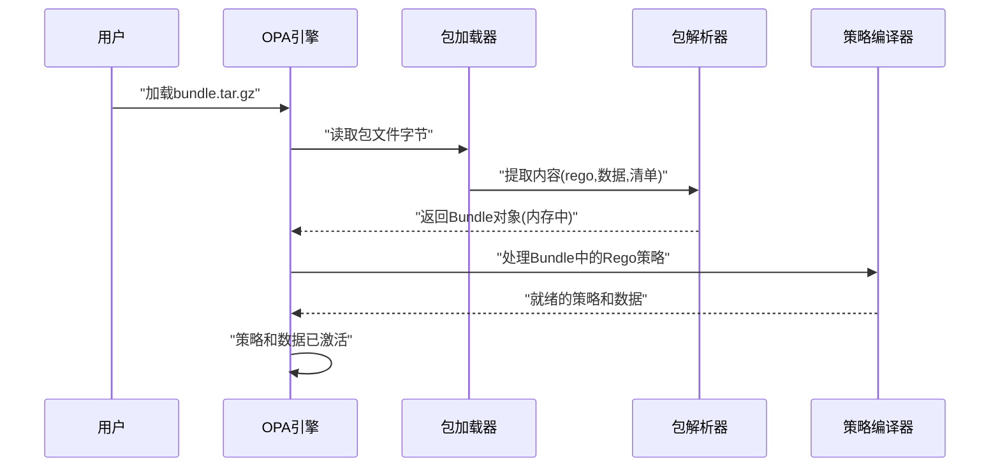

# 第二章：策略包

欢迎回来

在[第一章：Rego策略语言（AST语法树）](01_rego_policy_language__ast__.md)中，我们学习了如何使用Rego编写策略规则，以及OPA如何将这些规则表示为抽象语法树（AST）。

现在假设我们有许多Rego策略文件，甚至还有一些配套的数据文件。

> 如何高效地将这些策略和数据加载到OPA中？

尤其是在OPA运行在远程服务器上时，手动逐个复制文件简直是噩梦

## 为什么需要策略包？策略的"压缩包"

想象一下我们通常如何共享文件集合（比如旅行照片或项目文档）。我们不会逐个发送文件，而是将它们打包成单个`.zip`文件，便于传输、下载和管理。

策略包为OPA解决了同样的问题。**策略包**就是Rego策略文件、决策所需数据以及重要元数据（如清单和签名）的==集合包==，本质上就是OPA策略基础设施的"压缩包"。

使用策略包的主要优势包括：
* **便捷分发**：将所有策略和数据打包成单个文件，分发给多个OPA实例
* **高效部署**：OPA可以快速加载整个包，无需逐个处理文件
* **远程更新**：对于运行在服务器上的OPA实例，可以轻松从中央位置（如HTTP服务器或容器仓库）下载和更新策略包

## 第一个策略包：打包策略与数据

假设我们有两个文件：
1. 名为`authz.rego`的Rego策略文件，定义访问权限规则
2. 名为`users.json`的数据文件，列出用户角色

文件内容示例：

**`authz.rego`**:
```rego
package authz

default allow = false

allow {
    input.path = ["admin"]
    data.users[input.user].role = "admin"
}
```
该策略表示：当访问路径为`/admin`且用户角色为`admin`时允许访问。

**`data/users.json`**:
```json
{
    "alice": {"role": "admin"},
    "bob": {"role": "guest"}
}
```

使用OPA命令行工具`opa build`打包：
```bash
opa build . -o bundle.tar.gz
```
该命令会在当前目录生成`bundle.tar.gz`文件，包含策略文件和数据文件。

## 策略包内部结构

策略包不是简单的文件压缩包，它具有特定的结构：
* **Rego策略**：所有`.rego`文件，加载时会被解析为AST
* **数据文件**：JSON/YAML格式的决策数据
* **清单文件（.manifest）**：包含版本标识、策略和数据存储路径等元数据
* **签名文件（.signatures.json）**：可选但建议的生产环境配置，提供加密签名验证包完整性
* **其他文件**：可能包含编译后的WebAssembly模块等优化文件

## OPA加载和使用策略包

加载策略包有两种主要方式：

1. **从本地文件加载**：
```bash
opa run bundle.tar.gz
```

2. **从远程服务器加载**：
```bash
opa run --server \
    --set bundles.default.resource=/bundle.tar.gz \
    --set services.default.url=http://localhost:8080
```

## OPA内部加载流程

当OPA加载策略包时，内部处理流程如下：



## 底层实现：bundle包

OPA源代码中的`bundle`包负责处理所有与策略包相关的操作：

**Bundle对象结构**：
```go
type Bundle struct {
    Manifest *Manifest     // 元数据
    Data     Raw           // 原始JSON/YAML数据 
    Modules  []*ModuleFile // Rego策略文件列表
}
```

**读取器(Reader)**：
```go
type Reader = v1.Reader

func NewReader(r io.Reader) *Reader {
    return v1.NewReader(r)
}
```

**安全签名**：
* `bundle.GenerateSignedToken`：创建包内容的加密签名
* `bundle.VerifyBundleSignature`：验证签名确保包完整性

## 结论

本章我们探讨了策略包的概念。策略包是OPA将Rego策略、数据和元数据打包成单个可分发单元的方式，类似于`.zip`文件。

这使得策略的部署和更新（无论是本地还是远程）都变得高效且安全。我们还介绍了用于创建策略包的`opa build`命令，并了解了OPA加载策略包的内部流程。

现在我们已经知道策略如何打包和交付，下一步自然是要了解OPA如何将这些原始策略（及其[AST语法树](01_rego_policy_language__ast__.md)）转换为可高效执行的内容。在下一章中，我们将深入探讨[策略编译器](03_policy_compiler_.md)。

