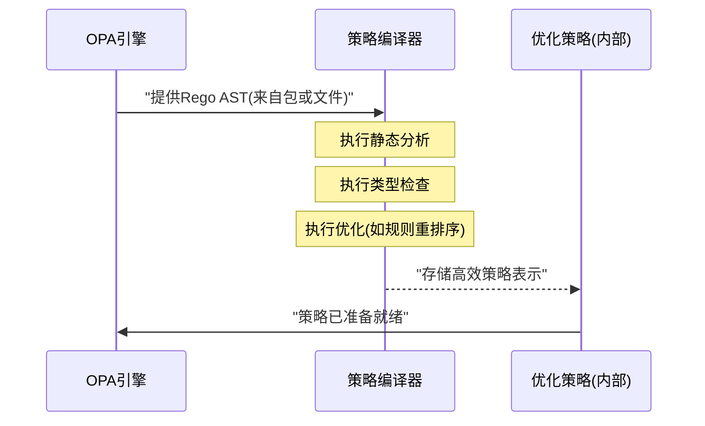
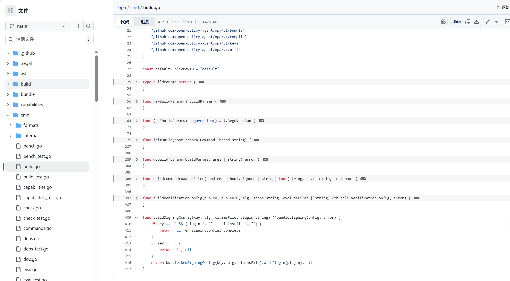

# 第三章：策略编译器

欢迎回来

在[第一章：Rego策略语言（AST语法树）](01_rego_policy_language__ast__.md)中，我们学习了OPA如何通过将策略规则转换为抽象语法树（AST）来理解它们。

接着在[第二章：策略包](02_policy_bundles_.md)中，我们看到了这些Rego策略和必要数据如何被打包以便分发。

现在，我们已经有了Rego策略文本，OPA也已将其转换为结构化的AST。但这样就够了吗？并非

就像食谱需要提前准备（切菜、混合等）才能最终烹饪，我们的策略也需要一个关键的准备步骤来==确保它们能流畅高效地运行==。这就是**策略编译器**的用武之地。

## 为什么需要策略编译器？让策略准备就绪

假设我们为应用编写了详细的Rego策略。这个策略可能包含许多规则、复杂条件，并与各种数据交互。虽然AST为OPA提供了策略的清晰*结构*，但它仍然是一个"蓝图"。OPA引擎需要更"可执行"的内容来快速做出决策，尤其是在每秒处理数千个请求时。

策略编译器就像是Rego策略的智能"准备器"或"翻译器"，主要职责包括：
1. **错误检查**：在策略实际运行前捕获错误，避免意外行为
2. **速度优化**：通过重组或简化内部结构使策略运行更快
3. **转换为可执行格式**：将人类可读（且以AST表示的）Rego转换为OPA引擎能直接理解和执行的高效格式

这类似于将Python或Java等高级语言编写的程序编译为运行更快的低级可执行文件。策略编译器对Rego策略也执行类似操作。

## 策略编译器的工作："准备"步骤

策略编译器执行多个重要步骤来准备策略：
* **静态分析**：类似策略的语法检查，编译器会查找无需实际运行就能发现的明显错误，如未定义变量或永远为假的规则
* **类型检查**：确保数据使用正确。例如尝试将数字与文本字符串相加时，编译器会标记这种类型不匹配
* **优化**：重组规则、简化表达式或预计算不变部分，生成更高效的内部表示
* **目标编译**：根据配置将策略编译为不同目标格式，最常见是优化后的内部AST，某些场景下也可编译为WebAssembly（Wasm）模块以获得更高性能

## 使用策略编译器（间接方式）

作为OPA用户，通常不会直接通过`opa compile`命令与策略编译器交互，而是在以下场景中间接使用：
1. **构建策略包**：使用`opa build`创建[策略包](02_policy_bundles_.md)时，编译器在幕后处理和优化Rego文件
   ```bash
   opa build . -o bundle.tar.gz
   ```
2. **检查策略**：使用`opa check`验证Rego文件时，编译器执行静态分析和类型检查
   ```bash
   opa check authz.rego
   ```

## 底层原理：编译器工作流

当OPA使用策略编译器时，简化流程如下：


## OPA的`compile`包



OPA内部代码有专门的`compile`包包含策略编译器核心逻辑。`opa build`命令使用该包的示例：
```go
// cmd/build.go (简化示例)
compiler := compile.New().
    WithCapabilities(params.capabilities.C).
    WithTarget(params.target.String()).
    WithOptimizationLevel(params.optimizationLevel).
    WithEntrypoints(params.entrypoints.v...).
    WithPaths(args...).
    WithRegoVersion(params.regoVersion())

err := compiler.Build(context.Background())
```

解耦的包管理 架构

## 结论

> 策略编译器是OPA架构中的关键组件，它将人类可读的Rego策略（以[AST语法树](01_rego_policy_language__ast__.md)表示）转换为高效可执行格式

通过静态分析、类型检查和优化等关键任务，确保策略的正确性和高性能

虽然主要通过`opa build`和`opa check`命令间接使用，但理解其作用有助于认识OPA如何高效实现策略决策。

现在策略已编译完成，下一步是了解==OPA如何针对传入请求和数据实际运行它们以做出实时决策==。下一章我们将探索[OPA运行时](04_opa_runtime_.md)
