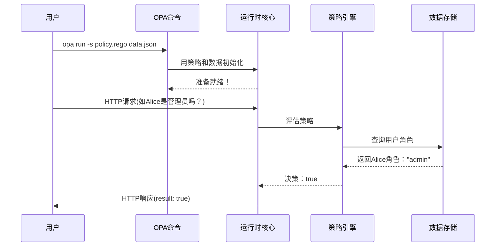

# 第四章：OPA运行`opa run`

欢迎回来

在[第一章：Rego策略语言（AST语法树）](01_rego_policy_language__ast__.md)中，我们学习了如何用Rego编写策略规则以及OPA如何将其理解为抽象语法树。

接着在[第二章：策略包](02_policy_bundles_.md)中，我们看到了这些策略及其数据如何被打包整合。

最后在[第三章：策略编译器](03_policy_compiler_.md)中，我们探索了OPA如何优化策略以高效执行。

现在万事俱备：==结构良好的策略、相关数据以及所有内容都已编译优化==。但OPA如何实际*运用*这些组件来做出实时决策？这就是**OPA运行**的舞台——它是让策略真正运转的核心引擎！

## 为什么需要OPA运行？策略执行的中枢

假设我们运行一个在线服务（如用户档案微服务）。每当用户尝试查看或编辑档案时，服务都需要询问："该用户是否有权限执行此操作？"这个决策需要即时、可靠地基于我们精心定义的策略做出。

问题在于，仅拥有编译好的策略是不够的。我们需要能够：
* **加载**这些编译好的策略和数据到内存
* **监听**传入请求（如"用户Alice能编辑Bob的档案吗？"）
* **执行**相关策略处理请求和当前数据
* **返回**明确的"允许"或"拒绝"（或其他策略决策）

**OPA运行时**正是这个核心组件。==它像是策略的操作系统==，或是协调策略加载、存储和评估的"大脑"，管理策略与数据、外部服务及其他OPA组件的交互以实现实时鉴权决策。

## OPA运行时的职责：策略的实际执行

OPA运行时具有以下关键职能：
1. **策略与数据加载**：将[策略包](02_policy_bundles_.md)（含编译后的Rego和数据）加载到OPA活动内存
2. **策略评估引擎**：运行时核心，接收查询后定位相关策略并执行评估
3. **数据管理接口**：与[存储层](05_storage_layer_.md)交互获取策略决策所需数据
4. **插件协调**：通过[插件管理器](07_plugins_manager_.md)集成外部服务（如数据库查询或审计日志）
5. **服务模式**：支持交互式shell(REPL)用于测试开发，或高性能HTTP API服务器用于生产环境

## 使用OPA运行时：运行策略

通过`opa`命令与OPA运行时交互，最常用的是`opa run`启动运行时。

### 1. 交互模式(REPL)
开发测试时可用交互式shell直接输入Rego查询：
```bash
opa run authz.rego data/users.json
```
在`>`提示符下查询策略：
```
> data.authz.allow with input as {"path": ["admin"], "user": "alice"}
true
```

### 2. 服务模式(HTTP API)
生产环境通常运行HTTP服务：
```bash
opa run -s authz.rego data/users.json
```
通过curl发送查询请求：
```bash
curl -X POST http://localhost:8181/v1/data/authz/allow \
  -H "Content-Type: application/json" \
  -d '{"input": {"path": ["admin"], "user": "alice"}}'
```
响应示例：
```json
{"result": true}
```

## 底层原理：运行时工作流
`opa run`执行时的简化内部流程：


## 代码解析：runtime包
OPA源码中的核心`runtime`包定义了运行时结构：
1. **`runtime.Params`**：保存OPA实例配置（监听地址/TLS设置/日志级别等）
2. **`runtime.NewRuntime`**：创建运行时实例，加载编译策略和数据
3. **`rt.Serve`/`rt.StartREPL`**：启动HTTP服务或交互式shell

## 结论
本章探讨了作为OPA策略执行中枢的运行时，它负责加载编译好的策略和数据、评估策略处理请求，并协调与其他组件的交互。我们学习了通过`opa run`以交互模式或服务模式激活策略。

既然策略已在运行时中运行，接下来自然要问：==策略依赖的数据存储在哪里==？下一章我们将深入[存储层](05_storage_layer_.md)的奥秘。

