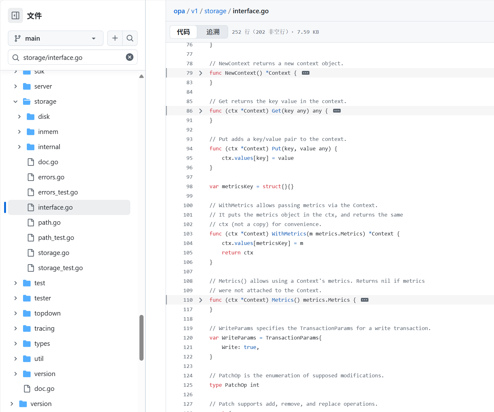
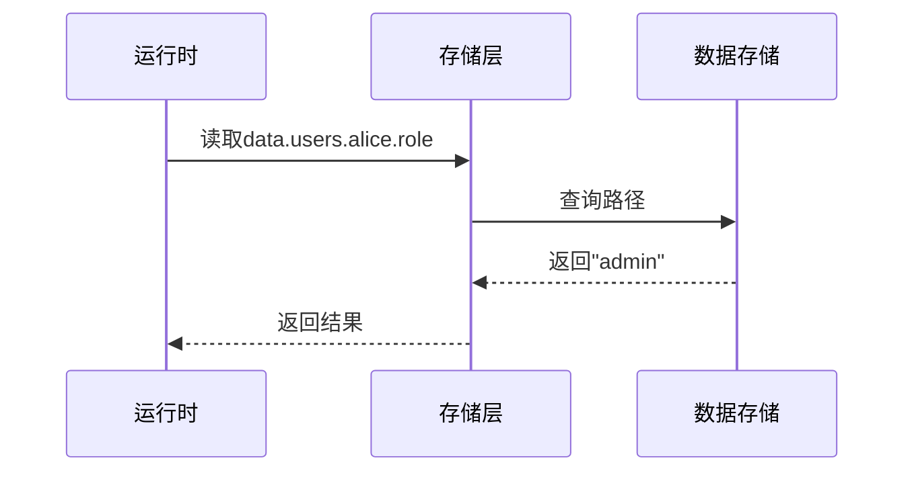

# 第五章：存储层

欢迎回来

在[第四章：OPA运行时](04_opa_runtime_.md)中，我们了解了OPA如何让策略"活"起来，对传入请求进行评估。但任何策略要做出决策，通常都需要*数据*。例如我们的`authz.rego`策略需要从`data.users`获取用户角色。那么这些关键信息存储在哪里？

这就是**存储层**的舞台

它是OPA专用于存储所有策略相关数据的"数据库"，就像中央储藏室或冰箱，存放着策略"烹饪"决策所需的所有"食材"。

## 为什么需要存储层？策略的储藏室

将OPA比作繁忙餐厅中的厨师。[OPA运行时](04_opa_runtime_.md)是接收订单（策略评估请求）并烹饪菜肴（做出策略决策）的厨师，Rego策略则是食谱。

但食材呢？厨师需要储备充足且井井有条的食材才能快速取用。如果食材散落各处或缺失，厨师就无法高效烹饪。

**存储层**对OPA而言正是这样的存在：
* 存储所有**策略数据**（如用户角色、资源所有权、权限列表）
* 保存**编译后的策略**（优化后的[AST语法树](01_rego_policy_language__ast__.md)）
* 确保策略读取数据时获得**一致性视图**
* 提供内存（超快）或磁盘（持久化）等不同存储方式

没有可靠的存储层，OPA就无法持续高效地执行规则。

## 存储层的核心功能

存储层主要处理以下任务：
1. **存储策略数据**：Rego通过`data.<路径>`查询的外部数据
2. **存储编译后策略**：优化后的策略内部表示形式
3. **组织数据**：采用层级结构，支持类似文件路径的访问方式
4. **确保一致性（事务）**：通过事务机制保证读写操作的原子性
5. **灵活存储选项**：
   - **内存存储**：默认选项，速度极快但进程退出后数据丢失
   - **磁盘存储**：数据持久化，适合有状态场景

## 存储层的使用（幕后）

用户不直接调用存储层，而是通过[OPA运行时](04_opa_runtime_.md)间接使用。以示例说明：

**`authz.rego`**:
```rego
package authz
default allow = false
allow {
    input.path = ["admin"]
    data.users[input.user].role = "admin" # 查询存储层
}
```

**`data/users.json`**:
```json
{
    "alice": {"role": "admin"},
    "bob": {"role": "guest"}
}
```

启动OPA时：
```bash
opa run authz.rego data/users.json
```

幕后过程：
1. `authz.rego`被编译后存入存储层
2. `users.json`数据被加载到`data`路径下
3. 查询时运行时通过存储层获取`alice`的角色信息

## 实现原理

存储层通过定义通用接口支持不同存储后端：



### 1. `storage.Store`接口
核心接口定义在`storage/interface.go`，规定所有存储实现必须提供的方法：
```go
type Store interface {
    Read(ctx, txn, path) (any, error)
    Write(ctx, txn, op, path, value) error
    // 其他事务管理和策略操作方法
}
```

### 2. 数据访问路径
数据以树形结构组织，通过`storage.Path`访问：
```go
// 路径示例对应Rego中的data.users.alice.role
path := storage.MustParsePath("users/alice/role")
```

### 3. 存储实现

#### a) 内存存储(`inmem.Store`)
默认后端，数据存于内存：
```go
// 从JSON对象创建内存存储
store := inmem.NewFromObject(map[string]any{
    "users": map[string]any{
        "alice": map[string]any{"role": "admin"}
    }
})
```

#### b) 磁盘存储(`disk.Store`)
持久化存储实现：
```go
// 创建磁盘存储
store, err := disk.New(ctx, logger, prometheus.DefaultRegisterer, disk.Options{
    Dir: "./opa-data"
})
```

### 4. 事务与错误处理
存储层通过事务保证操作原子性，并定义特定错误类型如`storage.NotFoundErr`。

## 交互流程
运行时与存储层交互的简化过程：


## 结论
存储层是OPA架构的基础组件，作为策略数据和编译后策略的安全存储库。它提供数据组织、事务支持和灵活存储选项等关键服务。虽然主要通过[OPA运行时](04_opa_runtime_.md)间接交互，但理解其工作原理有助于掌握OPA管理决策信息的机制。

现在策略和数据已高效存储，接下来我们将探索OPA更强大的能力：[内置函数(Builtins)](06_built_in_functions__builtins__.md)。

