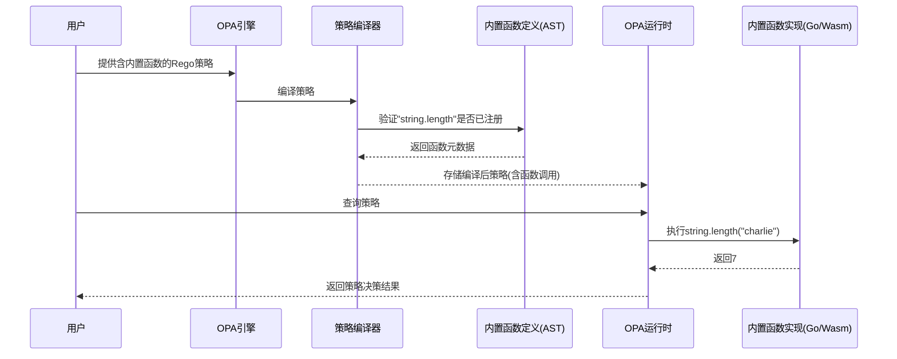

# 第六章：内置函数(Builtins)

欢迎回来

在[第五章：存储层](05_storage_layer_.md)中，我们探讨了OPA如何高效==存储决策所需的数据和编译后的策略==。

但如果策略需要的不只是查询数据或比较值呢？如果需要==计算==、操作文本或执行==复杂==加密操作呢？

这就是**内置函数(Builtins)**的舞台

它们如同OPA的强大工具箱，为Rego策略提供执行常见、复杂或计算密集型任务的能力，显著扩展了Rego的基础功能，就像编程语言的扩展库一样。

## 为什么需要内置函数？Rego的专属工具箱

假设正在编写管理用户访问的策略，其中一条规则是："仅当用户名长度超过5个字符、仅含字母且符合管理员模式时，才允许访问敏感资源。"

如何在Rego中表达"超过5个字符"或"仅含字母"？Rego擅长定义*规则*和*关系*，但原生不支持字符串长度统计或复杂文本模式匹配。

这正是内置函数的用武之地。它们是OPA原生集成的预定义操作，可直接在Rego策略中调用，无需自行实现复杂逻辑。

内置函数的典型能力包括：
* **字符串处理**：检查长度、转小写、分割文本、替换内容或正则匹配
* **数学运算**：求和、乘积、取整或绝对值计算
* **JSON操作**：序列化(转JSON字符串)或反序列化(JSON字符串转Rego值)
* **加密操作**：哈希计算(MD5/SHA)、JWT验证或Base64解码
* **网络检查**：判断IP地址是否属于某CIDR范围
* **时间操作**：获取当前时间、解析日期或计算时间差

这些函数在OPA核心中实现（通常用Go或WebAssembly以保证性能），供策略评估时调用。

## 使用内置函数：为策略赋能

回到案例需求，可通过`string.length`、`regex.match`等内置函数实现：

```rego
package authz.users

valid_username {
    # 检查是否为字符串
    is_string(input.user.name)

    # 检查长度是否超过5
    string.length(input.user.name) > 5

    # 检查是否仅含字母(正则匹配a-z，不区分大小写)
    regex.match("^[a-zA-Z]+$", input.user.name)
}
```

在OPA交互式shell中测试：
```bash
opa run users.rego
```
查询示例：
```
> data.authz.users.valid_username with input as {"user": {"name": "alice"}}
false  # "alice"长度未超过5
> data.authz.users.valid_username with input as {"user": {"name": "charlie"}}
true   # "charlie"符合所有条件
> data.authz.users.valid_username with input as {"user": {"name": "Bob123"}}
false  # 含数字，正则匹配失败
```

## 实现原理：OPA如何处理内置函数

当策略调用内置函数时，OPA执行以下流程：



### 解析：定义与实现

#### 1. 函数定义(`ast/builtins.go`)
作为内置函数注册中心，定义函数名称、参数和返回类型（非具体逻辑）：
```go
// ast/builtins.go (简化示例)
var Builtins = []*Builtin{
    {Name: "string.length"}, 
    {Name: "regex.match"},
    {Name: "is_string"},
    // 其他内置函数...
}
```

#### 2. 函数实现(`topdown/builtins.go`和`wasm/src/`)
将函数名称映射到具体实现逻辑。高性能需求函数通常用Wasm实现，例如字符串长度计算的C代码：
```c
// wasm/src/aggregates.c (简化)
OPA_BUILTIN
opa_value *opa_agg_count(opa_value *v) {
    if (opa_value_type(v) == OPA_STRING) {
        opa_string_t *s = opa_cast_string(v);
        return opa_number_int(s->len); // 返回字符串长度
    }
    return NULL;
}
```

## 结论
内置函数是OPA不可或缺的组件，为Rego策略==提供字符串处理、加密运算等高级能力==。我们学习了如何在策略中使用它们，以及OPA通过[策略编译器](03_policy_compiler_.md)和[运行时](04_opa_runtime_.md)协作执行这些函数的架构设计。

理解内置函数后，下一章我们将探索OPA如何通过[插件管理器](07_plugins_manager_.md)集成外部服务和自定义逻辑。

