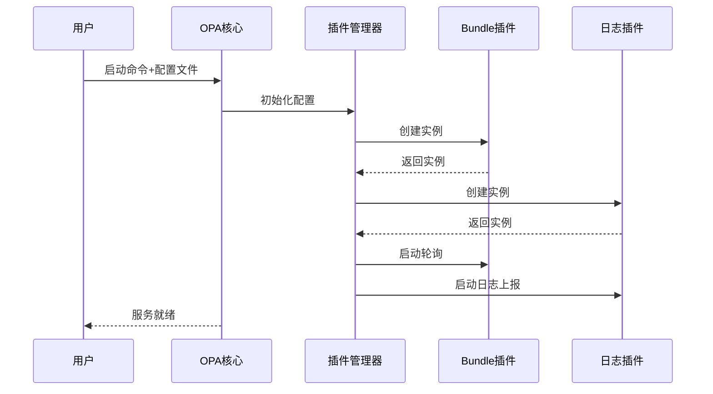

# 第七章：插件管理器

欢迎回来

在[第六章：内置函数](06_built_in_functions__builtins_.md)中，我们学习了OPA如何通过内置函数扩展Rego的能力。但当OPA需要==与外部系统集成==或执行超出策略评估范畴的任务（如从服务器获取策略更新、发送决策日志到监控系统）时，就需要**插件管理器**登场了——它是OPA扩展功能的灵活中枢。

## 为什么需要插件管理器？OPA的可扩展架构

将OPA比作汽车引擎：虽然引擎（策略评估）是核心，但完整车辆还需要油路、排气系统等组件。类似地，生产环境中的OPA需要以下"附件"：
* **获取策略更新**：定期从远程服务器下载新[策略包](02_policy_bundles_.md)
* **记录决策日志**：将每次`allow`/`deny`决策发送到审计系统
* **上报状态**：向监控系统报告健康状态
* **动态配置**：支持远程更新OPA自身配置

插件管理器通过模块化方式管理这些功能，避免核心系统臃肿。

## 插件管理器的核心职能

作为扩展功能的中枢，插件管理器负责：
1. **插件发现**：启动时注册所有可用插件
2. **配置管理**：解析配置文件并分发到各插件
3. **生命周期管理**：控制插件的启动、重配置和停止
4. **资源协调**：为插件提供[存储层](05_storage_layer_.md)等核心组件访问权限
5. **状态汇总**：收集插件健康状态

OPA内置关键插件包括：
* **Bundle插件**：从远程源获取策略包
* **日志插件**：批量上传决策日志
* **状态插件**：上报运行指标
* **发现插件**：动态获取OPA全局配置

## 使用插件管理器：配置OPA扩展

通过YAML配置文件定义插件行为，例如设置策略包轮询和日志上报：

**`config.yaml`**:
```yaml
services:
  my_bundle_server:
    url: http://localhost:8080/

plugins:
  bundle:
    resource: /mybundle.tar.gz
    service: my_bundle_server
    polling:
      min_delay_seconds: 10  # 每10秒检查更新

  logs:
    service: my_log_server
    reporting:
      max_batch_size: 100    # 每批最多100条日志
      max_delay_seconds: 5   # 每5秒发送一次
```

启动时加载配置：
```bash
opa run --server --config-file config.yaml
```

## 实现原理：管理器与插件协作

启动时的核心流程：


### 核心代码

#### 1. 管理器(`plugins/plugins.go`)
```go
// 创建管理器实例
func New(raw []byte, store storage.Store) (*Manager, error) {
    // 解析配置并初始化插件
}
```

#### 2. 工厂接口
```go
type Factory interface {
    Validate([]byte) error      // 验证配置
    New(any) (Plugin, error)    // 创建插件实例
}
```

#### 3. 插件接口
```go
type Plugin interface {
    Start(context.Context) error  // 启动插件
    Reconfigure(any) error        // 动态重配置
}
```

#### 示例：Bundle插件实现
```go
// plugins/bundle/plugin.go
const Name = "bundle"

func New(cfg *Config) *Plugin {
    // 创建具体插件实例
}

func (p *Plugin) Start(ctx context.Context) error {
    // 启动后台轮询任务
}
```

## 扩展机制

通过`hooks`包实现配置预处理等深度定制：
```go
type ConfigHook interface {
    OnConfig(map[string]any) (map[string]any, error)
}
```

## 结论

插件管理器是OPA实现生产级功能扩展的核心组件，==通过模块化架构支持策略更新、监控上报等关键运维能力==。理解其工作原理有助于充分发挥OPA在复杂场景下的灵活性。

接下来我们将探索OPA的另一种优化技术：[确定性有限自动机(DFA)](08_dfa__deterministic_finite_automaton_.md)。

