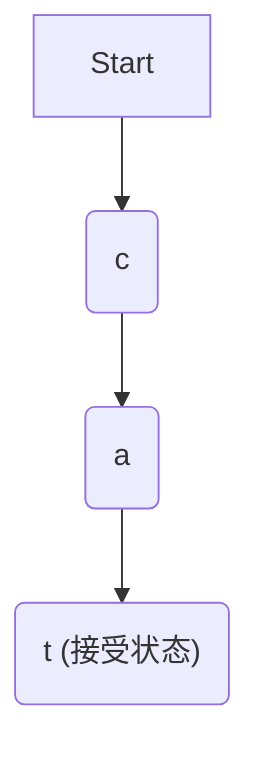
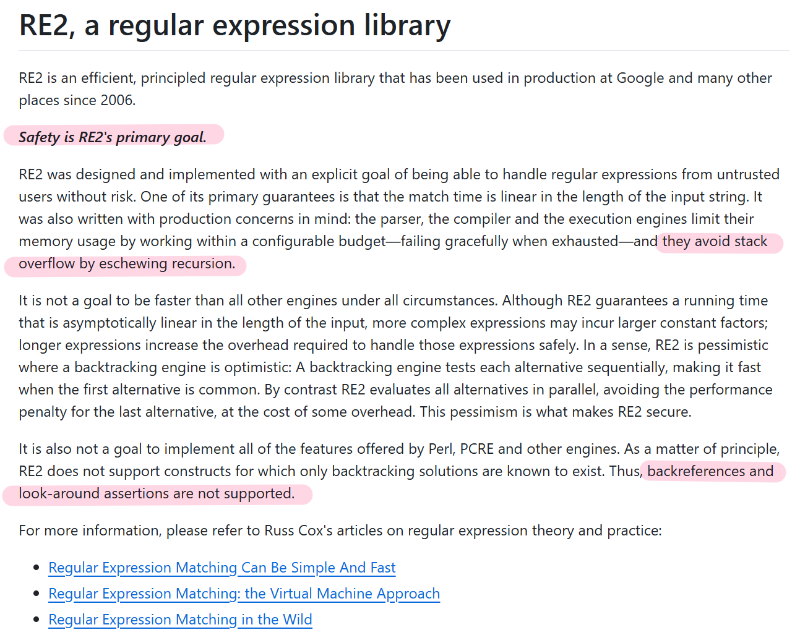

# 第八章：确定性有限自动机(DFA)

欢迎回来

在[第七章：插件管理器](07_plugins_manager_.md)中，我们了解了OPA如何通过==插件扩展功能==。

现在让我们深入探讨OPA用于加速策略==评估==的内部优化技术：**确定性有限自动机(DFA)**。

## 为什么需要DFA？OPA的文本扫描机器人

假设需要编写检查用户ID或资源路径是否匹配特定模式的策略，例如：
- "`resource_id`是否以`proj-`开头并跟随6位数字？"
- "`email`是否以`@example.com`结尾？"

虽然可以用`string.starts_with`等函数实现，但复杂模式会变得冗长低效。这时**正则表达式(Regex)**就派上用场了。OPA通过`regex.match`内置函数（见[第六章：内置函数](06_built_in_functions__builtins_.md)）支持正则匹配：

```rego
package example

allow_access {
    input.method = "GET"
    input.path = ["api", "resources", resource_id]
    regex.match("proj-[0-9]{6}", resource_id)  # 检查资源ID模式
}
```

> DFA就像精密的"文本扫描机器人"，无需回溯猜测即可快速判断文本是否匹配模式，这是计算机科学中高效模式匹配的基础技术。

## DFA是什么？模式的状态机

DFA是一种**状态机**，其核心概念包括：
- **状态**：模式匹配过程中的检查点
- **转移**：根据输入字符确定转移到哪个状态（确定性）
- **起始状态**：开始扫描的初始位置
- **接受状态**：到达即表示匹配成功

以匹配"cat"为例：

该过程高效==无回溯==，适合OPA的Wasm运行时等==高性能==场景。

## OPA如何用DFA加速正则匹配

当编写如下策略时：
```rego
package example

allow_admin_resource {
    regex.match("^admin-report-[A-Z]{3}$", input.resource_id)
}
```
OPA的处理流程：
1. **策略编译**：将正则表达式编译为优化后的DFA
2. **运行时执行**：用DFA快速扫描输入字符串
3. **返回结果**：判断是否匹配模式

在OPA交互式shell中测试：
```bash
opa run policy.rego
> data.example.allow_admin_resource with input as {"resource_id": "admin-report-ABC"}
true
```

## 底层实现：re2库中的DFA

OPA使用Google的高性能正则库`re2`，其核心是基于DFA的匹配引擎。

[Syntax · google/re2 Wiki](https://github.com/google/re2/wiki/Syntax)



关键实现包括：

### 1. 正则编译(`regex.cc`)
```c++
// 编译正则表达式为re2::RE2对象
re2::RE2* re = new re2::RE2(pattern);
// 执行匹配
bool match = re2::RE2::PartialMatch(input, *re);
```

### 2. DFA状态结构(`dfa.cc`)
```c++
struct State {
    std::atomic<State*> next_[256];  // 每个字符对应的转移状态
};
```

### 3. 字节映射优化
通过将256个字节分类为少量"字节类"，大幅减少内存占用：
```c++
uint8_t bytemap_[256];  // 字节到类别ID的映射
```

### 4. DFA执行流程
`DFA::RunStateOnByte`等函数实现高效的状态转移扫描。

## 结论

DFA是OPA实现高性能正则匹配的核心技术，通过状态机模型避免回溯，配合字节分类等优化技术，使复杂模式匹配也能在微秒级完成。理解DFA工作机制有助于编写高效的正则策略。

至此我们完成了OPA核心架构的探索之旅，从==策略编写、编译打包到运行时优化，全面了解了OPA的策略执行机制==。

END *★,°*:.☆(￣▽￣)/*.°★* 。

