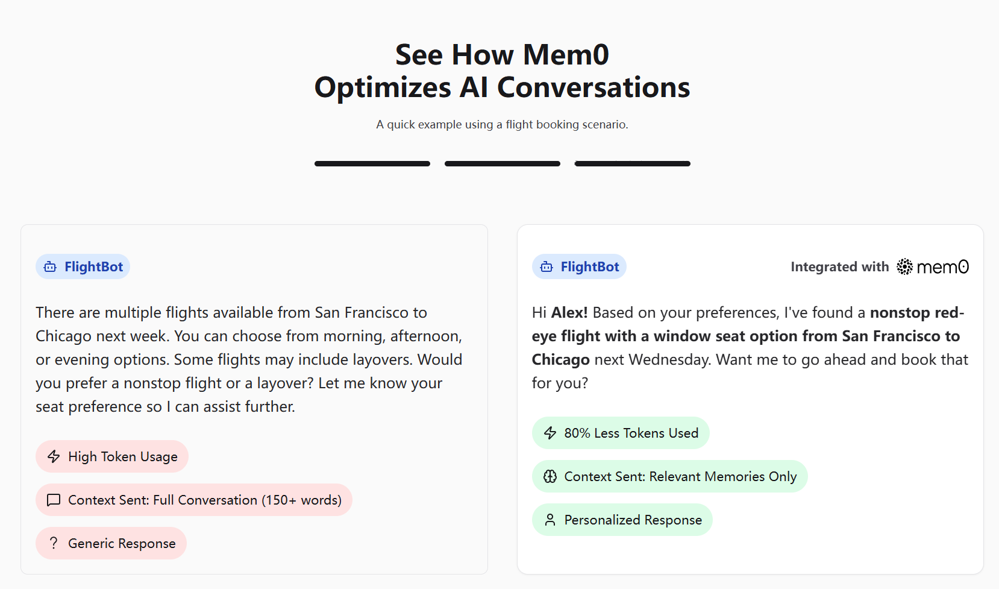
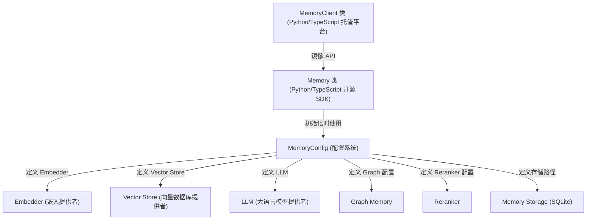
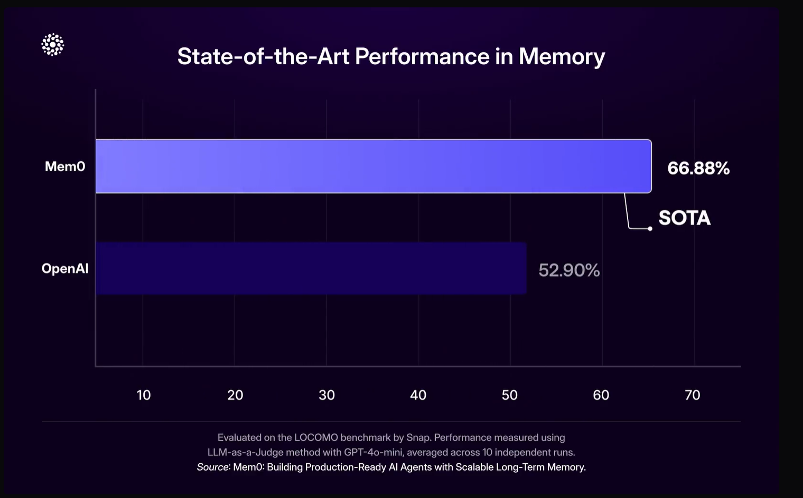
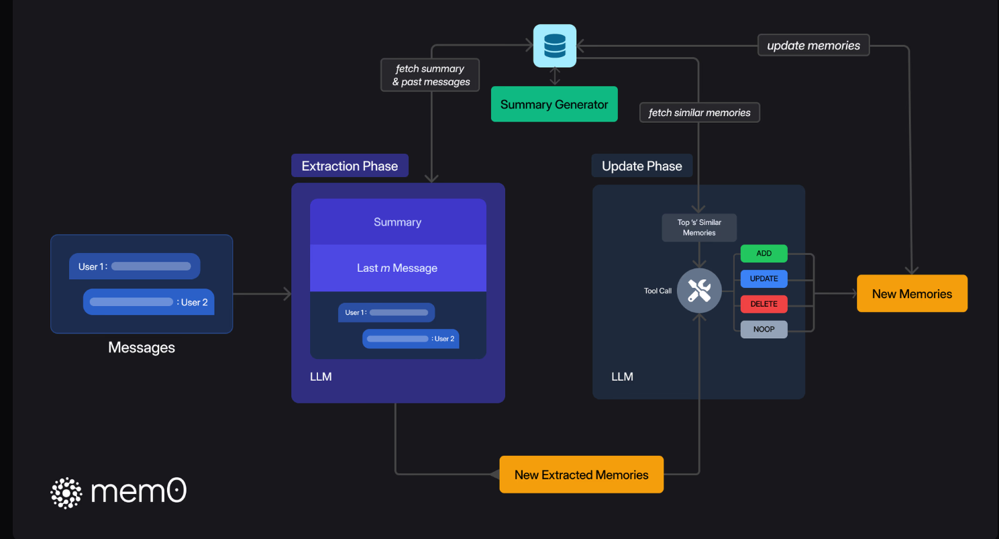
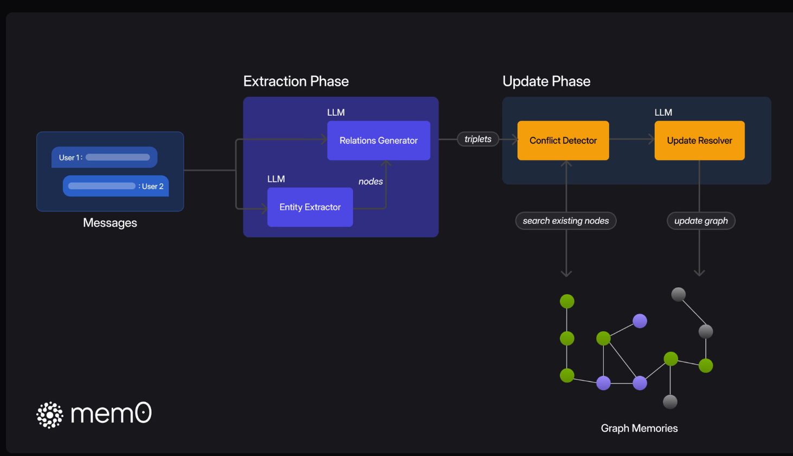
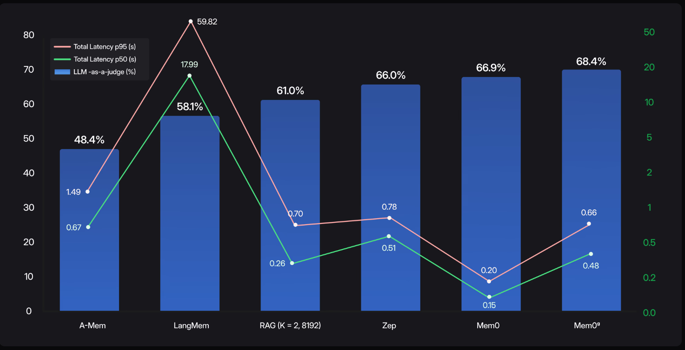
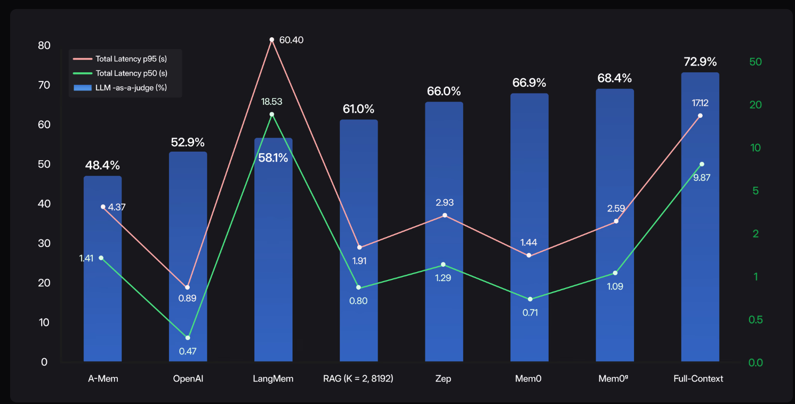

链接：[Mem0 - The Memory Layer for your AI Apps](https://mem0.ai/)

[[2504.19413\] Mem0: Building Production-Ready AI Agents with Scalable Long-Term Memory](https://arxiv.org/abs/2504.19413)

# docs：mem0

Mem0 是一个**智能记忆层**，旨在为 AI 助手和智能体==提供*持久化*和*个性化*的记忆能力==。

使 AI 系统能够**记住用户偏好**、事实和对话历史，从而随着时间的推移学习和适应。

用户可以选择**自托管的 SDK**（`Memory` 类）以获得完全控制权，或选择**云托管的平台**（`MemoryClient` 类）以实现可扩展性管理，两者均通过灵活的系统（`MemoryConfig`）进行配置，该系统集成了多种 AI 和数据组件。

## 可视化

## 章节

1. [MemoryConfig (配置系统)
](01_memoryconfig__configuration_system__.md)
2. [Memory 类 (Python/TypeScript 开源 SDK)
](02_memory_class__python_typescript_oss_sdk__.md)
3. [MemoryClient 类 (Python/TypeScript 托管平台)
](03_memoryclient_class__python_typescript_hosted_platform__.md)
4. [Embedder (嵌入提供者)
](04_embedder__embedding_providers__.md)
5. [Vector Store (向量数据库提供者)
](05_vector_store__vector_database_providers__.md)
6. [LLM (大语言模型提供者)
](06_llm__large_language_model_providers__.md)
7. [Reranker
](07_reranker_.md)
8. [Graph Memory
](08_graph_memory_.md)
9. [Memory Storage (SQLite)
](09_memory_storage__sqlite__.md)

---

# Mem0：构建具备可扩展长期记忆的生产级AI代理

一种以记忆为中心的可扩展算法，能够动态提取和检索关键对话事实——在LOCOMO基准测试中相比OpenAI实现了26%的相对准确率提升，同时降低91%的p95延迟和90%的token消耗。

## 摘要

### Mem0基准测试
> 当今的AI系统在长时间交互中会遗忘关键事实，破坏上下文并削弱信任。单纯扩大LLM上下文窗口只会延缓问题——模型变得更慢、更昂贵，却仍然忽略关键细节。

Mem0通过可扩展的记忆架构直面这一问题，==动态提取、整合和检索对话中的重要信息==。增强版Mem0通过基于==图的存储层来捕获更丰富的多会话关系==。

在LOCOMO基准测试中，Mem0持续优于六种领先的记忆方法，实现了：

- 相比OpenAI记忆功能提升26%的响应准确率
- 相比全上下文方法降低91%的延迟
- 节省90%的token使用，使大规模记忆变得实用且经济

通过==实现持久化、结构化的可扩展记忆==，Mem0为AI代理铺平了道路——这些代理不仅能即时反应，更能真正记住、适应并随着时间推移进行协作。

## 研究方法

### 底层原理
采用两阶段记忆管道，==仅提取、整合和检索最显著的对话事实==——实现可扩展的长期推理。

Mem0的管道包含两个阶段——提取和更新——确保仅存储和检索最相关的事实，最小化token消耗和延迟。

在提取阶段，系统处理三种上下文来源——最新对话、滚动摘要和最近的m条消息——使用LLM提取一组简洁的候选记忆。后台模块异步刷新长期摘要，确保推理永不中断。

在更新阶段，每个新事实都与向量数据库中最相似的s个条目进行比较。然后LLM选择四种操作之一：

- 添加新记忆
- 更新现有条目
- 删除矛盾内容
- 无操作（如无需更改）

这些步骤保持记忆存储的一致性、非冗余性，并随时准备响应下一个查询。

Mem0ᵍ通过将记忆存储为有向标记图来增强Mem0。在提取阶段，传入消息输入实体提取器识别节点实体，关系生成器推断标记边——将文本转化为结构化图。

在更新阶段，冲突检测器标记重叠或矛盾的节点/边，由LLM驱动的更新解析器决定是添加、合并、无效化还是跳过图元素。最终的知识图支持高效的子图检索和语义三元组匹配，实现复杂的多跳、时序和开放域推理。

## 性能结果

### 性能亮点
严格的LOCOMO基准测试显示Mem0在准确性、速度和效率方面表现出色。

- 相比OpenAI记忆准确率提升26%
- 相比全上下文方法p95延迟降低91%
- 相比全上下文方法token成本节省90%

在LOCOMO基准测试中，Mem0相比OpenAI记忆功能实现了26%的相对提升（66.9% vs 52.9%）——突显其卓越的事实准确性和一致性。除了质量，Mem0的选择性检索管道通过处理简洁的记忆事实而非重新处理完整聊天历史，将p95延迟降低了91%（1.44秒 vs 17.12秒）。这种聚焦方法还实现了90%的token消耗减少，每次对话仅需约1.8K token，而全上下文方法需要26K。这些结果共同证明了Mem0如何平衡最先进的推理能力、实时响应性和成本效率——使长期对话记忆在大规模应用中变得实用。

该图表比较了每种方法的搜索延迟（粉色中位数p50，绿色尾部p95）与推理准确率（蓝色柱状图）。Mem0实现了66.9%的准确率，中位数搜索延迟为0.20秒，p95延迟为0.15秒，使记忆检索保持在实时范围内。相比之下，标准RAG设置仅实现61.0%的准确率，中位数搜索时间为0.70秒，p95为0.26秒。图增强变体Mem0ᵍ将准确率进一步提升至68.4%，中位数延迟0.66秒，p95延迟0.48秒。通过仅提取和索引最显著的事实，Mem0在最小化搜索开销的同时提供了接近最先进的长期推理能力。

端到端测量（记忆检索+答案生成）展示了Mem0的生产就绪性。全上下文方法可能达到72.9%的准确率，但中位数延迟为9.87秒，p95延迟17.12秒。相比之下，Mem0实现66.9%的准确率，仅需0.71秒中位数和1.44秒p95端到端响应时间。其图增强变体Mem0ᵍ将准确率提升至68.4%，同时保持1.09秒中位数和2.59秒p95延迟。通过仅提取和索引最相关的事实，Mem0以真正的生产速度提供了接近最先进的长期推理能力。

## 结论

通过实现26%的准确率提升、91%的p95延迟降低和90%的token节省，Mem0证明了持久化、结构化的记忆可以既强大又可扩展。这些结果开启了一个未来——AI代理不仅能即时反应，更能真正记住：在医疗、教育到企业支持等领域中，持续数周保留用户偏好、适应不断变化的上下文并保持连贯的个性化交互。基于这一基础，下一代记忆系统可以探索分层和多模态表示、设备端记忆和动态整合机制——为真正与用户共同成长和进化的AI铺平道路。

