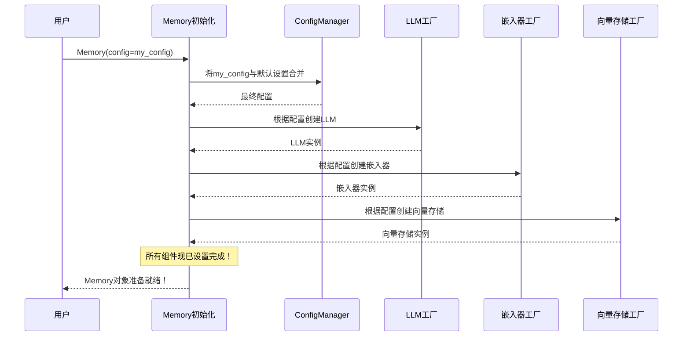

# 第1章：MemoryConfig（配置系统）

欢迎来到`mem0`

在这第一章中，我们将探索`MemoryConfig`，它就像是**AI大脑的蓝图**。

## 设计AI的大脑

想象你正在构建一个个人AI助手。你希望它能记住关于你的事情，比如你喜欢的食物或爱好。但同时你也想决定*它如何记住*：
*   它应该使用一个超级智能但昂贵的大语言模型来理解你的想法吗？还是一个更快、更本地化的模型？
*   它应该在哪里存储这些记忆？在你电脑上的一个简单文件中，还是一个强大的在线数据库中？

`MemoryConfig`正是你做出这些决定的地方。它是定制`mem0`实例工作方式的核心位置。可以把它看作是编写一份详细的说明书，指导如何构建AI的记忆系统。

本章的目标是理解如何告诉`mem0`精确设置其记忆，以便你的AI能够按照你想要的方式记住事情。

### 什么是`MemoryConfig`？

本质上，`MemoryConfig`只是一组指令。它是一个==Python对象==（如果你使用JavaScript，则是TypeScript对象），==包含了`mem0`的所有设置==。当你启动`mem0`时，它会读取这些指令来构建其记忆组件。

让我们分解一下你可以通过`MemoryConfig`定制的关键部分：

1.  **大语言模型（LLM）**：这是帮助AI理解你在说什么并提取重要事实的"大脑"。它对理解对话和决定记住什么至关重要。
    *   **类比**：餐厅的主厨。他们接收你的订单（你的对话），理解你想要什么，并决定哪些食材（事实）对这道菜（记忆）是重要的。

2.  **嵌入器（Embedding Model）**：计算机不能直接理解像"pizza"这样的单词。嵌入器将文本转换为称为"向量"的数字表示。这些向量捕捉单词的含义，使得即使没有使用完全相同的单词，也能搜索到相似的概念。
    *   **类比**：一个神奇的翻译器，将你的==语言转换==为一种特殊的数字代码。两个含义相似的句子会有非常相似的代码。

3.  **向量存储（Vector Database）**：一旦你的文本被转换为数字向量，你需要一个高效的地方来存储它们。向量存储是一个专门设计的数据库，用于快速找到与你的搜索查询相似的向量。这就是`mem0`如何"记住"相关的过去信息。
    *   **类比**：一个超级有条理的图书馆，==根据书籍的"编码"含义而非标题==来存储书籍。如果你要求"关于幸福的书籍"，它可以找到所有代码与"幸福"相似的书籍，==即使它们使用了不同的词汇==。

4.  **图记忆（可选）**：有时，仅仅记住事实是不够的。你可能希望AI理解事物之间的*关系*。例如，"John *在* OpenAI *工作*"和"John *与* Sarah *是朋友*"。图记忆帮助AI构建一个连接信息的网络。
    *   **类比**：侦探的白板，上面写满了==名字和连接线==，展示谁认识谁、谁在哪里工作等。

5.  **自定义提示（可选）**：这些允许你向LLM提供特定指令，告诉它如何提取事实或更新记忆。就像给厨师提供一道菜的特殊说明。

## 第一个`MemoryConfig`

让我们看看`MemoryConfig`的实际应用。首先，确保你已经安装了`mem0`（如果没有，可以运行`pip install mem0ai`）。

当你创建一个没有任何配置的`Memory`实例时，`mem0`会使用默认设置。这对于快速上手非常方便：

```python
from mem0 import Memory

# 使用默认设置初始化记忆
memory = Memory()

# 它记住了关于我的什么？
# 它使用默认的OpenAI模型和一个内存中的向量存储。
print("记忆已使用默认配置初始化。")
```
**解释**：这段代码创建了一个`Memory`对象。在幕后，`mem0`自动设置了一个OpenAI LLM、一个OpenAI嵌入器和一个简单的临时向量存储（仅在程序运行时存在），因为我们没有告诉它其他设置。

### 定制AI记忆

现在，让我们创建一个个性化的AI，使用特定的`MemoryConfig`来记住你的食物偏好。我们将配置它使用OpenAI来理解语言和创建嵌入，并使用一个临时的"memory"向量存储以简化操作。

```python
from mem0 import Memory
from mem0.configs.base import MemoryConfig

# 1. 定义你的自定义配置
my_config = MemoryConfig(
    llm={
        "provider": "openai", # 使用OpenAI理解语言
        "config": {"model": "gpt-4-turbo-preview", "api_key": "YOUR_OPENAI_API_KEY"}
    },
    embedder={
        "provider": "openai", # 使用OpenAI将文本转换为向量
        "config": {"model": "text-embedding-3-small", "api_key": "YOUR_OPENAI_API_KEY"}
    },
    vector_store={
        "provider": "memory", # 在程序内存中存储向量（临时）
        "config": {"dimension": 1536} # OpenAI嵌入有1536维
    }
)

# 2. 使用你的自定义配置初始化Memory
memory = Memory(config=my_config)

# 3. 添加关于食物偏好的记忆
memory.add("我喜欢披萨，讨厌西兰花", user_id="user123")

# 4. 搜索食物偏好
results = memory.search("我的食物偏好是什么？", user_id="user123")

# 打印记住的偏好
if results["results"]:
    print("AI记得：", results["results"][0]["memory"])
else:
    print("AI不记得任何食物偏好。")
```
**解释**：
1.  我们导入`MemoryConfig`。这是一个蓝图类。
2.  我们创建`my_config`，一个`MemoryConfig`的实例。在其中，我们告诉`mem0`具体使用哪个`llm`、`embedder`和`vector_store`。我们为LLM和嵌入器指定`openai`作为`provider`，为向量存储指定`memory`。
3.  然后我们将这个`my_config`传递给`Memory`构造函数。现在，这个`memory`实例是根据*我们的*规格构建的。
4.  我们添加了一个关于食物的记忆，然后搜索它。因为我们正确配置了`mem0`，它将使用指定的模型来处理和检索这些信息。

**输出（简化）**：
```
AI记得：用户喜欢披萨，讨厌西兰花。
```
*（注意：具体措辞可能因LLM而异，但核心事实会被记住。）*

## 幕后：`MemoryConfig`如何工作

当你创建`Memory(config=my_config)`时，`mem0`并不是"神奇地"知道该做什么。它遵循一个特定的过程，根据你的`MemoryConfig`设置所有组件。

让我们一步步来看：

1.  **你的蓝图（MemoryConfig）**：你将`my_config`对象交给`mem0`，其中包含你所有的期望设置（例如，"使用OpenAI作为LLM，使用'memory'作为向量存储"）。
2.  **与默认设置合并**：`mem0`首先将你的`my_config`与其[默认设置](mem0-ts/src/oss/src/config/defaults.ts)合并。这确保即使你只指定了少数内容，其余部分也会自动填充。
3.  **组件工厂**：对于每个核心组件（LLM、嵌入器、向量存储），`mem0`都有一个"工厂"。这些工厂就像是专门的建造者。它们从合并后的`MemoryConfig`中读取提供者和配置详情，然后创建实际的LLM、嵌入器和向量存储对象。
4.  **准备就绪**：一旦所有组件构建并连接完成，你的`Memory`实例就可以存储、搜索和管理记忆了！

以下是这个过程的简化图示：



### 代码

让我们看看`mem0`中处理这些的实际代码。

**1. 定义`MemoryConfig`（Python）**

Python中的`MemoryConfig`类就像一个结构化的表单，你为每个组件填写详细信息。

*(来自`mem0/configs/base.py`)*
```python
# 简化片段
class MemoryConfig(BaseModel):
    vector_store: VectorStoreConfig = Field( # 向量存储的配置
        default_factory=VectorStoreConfig,
    )
    llm: LlmConfig = Field( # 语言模型的配置
        default_factory=LlmConfig,
    )
    embedder: EmbedderConfig = Field( # 嵌入模型的配置
        default_factory=EmbedderConfig,
    )
    # ... 其他可选字段如图存储、重排器、提示等 ...
```
**解释**：这段Python代码定义了`MemoryConfig`蓝图。它说明一个`MemoryConfig`需要一个`vector_store`、一个`llm`和一个`embedder`（每个都有其特定的配置蓝图，如`VectorStoreConfig`、`LlmConfig`等）。

**2. 初始化`Memory`（Python）**

当你创建一个`Memory`对象时，它的`__init__`方法（构造函数）使用`MemoryConfig`来设置所有部分。

*(来自`mem0/memory/main.py`)*
```python
# 来自Memory.__init__的简化片段
class Memory(MemoryBase):
    def __init__(self, config: MemoryConfig = MemoryConfig()):
        self.config = config # 存储你的配置

        # 使用工厂根据配置创建组件
        self.embedding_model = EmbedderFactory.create(
            self.config.embedder.provider, # 例如，"openai"
            self.config.embedder.config,   # 例如，{"model": "text-embedding-3-small", ...}
            # ... 其他参数 ...
        )
        self.vector_store = VectorStoreFactory.create(
            self.config.vector_store.provider, # 例如，"memory"
            self.config.vector_store.config    # 例如，{"dimension": 1536}
        )
        self.llm = LlmFactory.create(
            self.config.llm.provider,      # 例如，"openai"
            self.config.llm.config         # 例如，{"model": "gpt-4-turbo-preview", ...}
        )
        # ... 其他设置如图、重排器、数据库等 ...
```
**解释**：这段代码展示了`Memory`类如何获取你的`config`，然后使用`EmbedderFactory`、`VectorStoreFactory`和`LlmFactory`来构建记忆系统的实际工作部分。每个工厂接收`provider`名称（如"openai"或"memory"）及其特定的`config`详情，以创建正确的组件。

**3. 默认配置（TypeScript/JavaScript）**

`mem0`项目也提供了TypeScript/JavaScript SDK。默认配置的管理方式类似。

*(来自`mem0-ts/src/oss/src/config/defaults.ts`)*
```typescript
// 简化片段
export const DEFAULT_MEMORY_CONFIG: MemoryConfig = {
  disableHistory: false,
  version: "v1.1",
  embedder: {
    provider: "openai",
    config: {
      apiKey: process.env.OPENAI_API_KEY || "",
      model: "text-embedding-3-small",
    },
  },
  vectorStore: {
    provider: "memory",
    config: {
      collectionName: "memories",
      dimension: 1536,
    },
  },
  llm: {
    provider: "openai",
    config: {
      baseURL: "https://api.openai.com/v1",
      apiKey: process.env.OPENAI_API_KEY || "",
      model: "gpt-4-turbo-preview",
      modelProperties: undefined,
    },
  },
  // ... graphStore, historyStore等 ...
};
```
**解释**：这段TypeScript代码展示了如果你不提供自己的`MemoryConfig`，`mem0`会使用的默认设置。注意它默认使用OpenAI作为LLM和嵌入器，以及一个内存中的向量存储，类似于Python的默认设置。

## 结论

在本章中，你已经了解到`MemoryConfig`是设计AI记忆系统的强大而灵活的蓝图。你可以指定它使用哪个LLM来理解语言，哪个嵌入器将文本转换为可搜索的向量，以及哪个向量数据库存储这些向量。通过定制`MemoryConfig`，你可以精细控制AI如何记住和处理信息。

这个配置系统是基础，因为它设置了`Memory`类将使用的核心组件。在下一章中，我们将深入探讨如何与[Memory类（Python/TypeScript开源SDK）](02_memory_class__python_typescript_oss_sdk__.md)交互，让你的定制记忆配置发挥作用

准备好开始构建并与你的AI大脑互动了吗？让我们继续前进

[下一章：Memory类（Python/TypeScript开源SDK）](02_memory_class__python_typescript_oss_sdk__.md)

