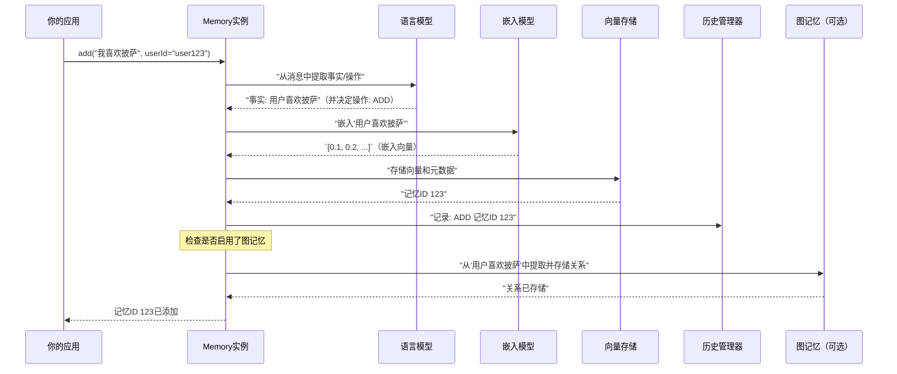

# 第2章：Memory类（Python/TypeScript开源SDK）

欢迎回来

在[第1章：MemoryConfig（配置系统）](01_memoryconfig__configuration_system__.md)中，我们学习了如何使用`MemoryConfig`为AI设计"大脑蓝图"。你选择了具体的组件，比如用哪个语言模型来理解，用哪个数据库来存储记忆。

现在，在这一章中，我们将把这个蓝图变为现实！我们将探索**`Memory`类**，这是你的AI用来记忆和与世界交互的实际"大脑"。可以把它看作是所有配置组件汇聚的中心枢纽，执行实际的记忆操作。

## AI的个人笔记本

想象你的AI助手需要记住你最喜欢的咖啡订单。它如何存储这些信息？当你稍后询问咖啡时，它又如何检索？

`Memory`类是AI与其记忆交互的核心接口。它就像一个个人笔记本，你的AI可以：
*   **添加**新的事实、偏好或对话片段。
*   **搜索**笔记以在需要时找到相关信息。
*   **更新**现有的笔记（如果某些内容发生变化）。
*   **删除**不再需要的笔记。

它是任何个性化AI助手的支柱，使其能够超越简单的无状态对话，真正*了解*用户和环境。

本章的目标是理解如何使用`Memory`类为你的AI提供这些基本的记忆能力。

## 开始使用`Memory`类

首先，确保你已经安装了`mem0`：
```bash
# Python
pip install mem0ai

# TypeScript/JavaScript
npm install mem0ai
```

### 初始化Memory

`Memory`类使用我们在前一章讨论的`MemoryConfig`。你可以通过两种主要方式初始化它：

**1. 使用默认设置（快速开始）**

如果你没有为`Memory`构造函数提供`config`，`mem0`会自动使用合理的默认值（通常是OpenAI模型和一个内存中的向量存储）。这非常适合快速实验！

**Python:**
```python
from mem0 import Memory

# 使用默认设置初始化记忆
memory = Memory()
print("记忆已使用默认配置初始化。")
```
**解释**：这会创建一个`Memory`实例。在幕后，它使用默认的`MemoryConfig`来设置其组件。

**TypeScript:**
```typescript
import { Memory } from 'mem0ai/oss';

// 使用默认设置初始化记忆
const memory = new Memory();
console.log("记忆已使用默认配置初始化。");
```
**解释**：与Python类似，这会创建一个`Memory`实例，准备使用默认组件。

**2. 使用自定义`MemoryConfig`（个性化AI）**

为了获得精细控制，你可以将自定义的`MemoryConfig`传递给`Memory`类。这是告诉你的AI*如何*记忆的方式。

**Python:**
```python
from mem0 import Memory
from mem0.configs.base import MemoryConfig

# （来自第1章）定义你的自定义配置
my_config = MemoryConfig(
    llm={"provider": "openai", "config": {"model": "gpt-4-turbo-preview", "api_key": "YOUR_OPENAI_API_KEY"}},
    embedder={"provider": "openai", "config": {"model": "text-embedding-3-small", "api_key": "YOUR_OPENAI_API_KEY"}},
    vector_store={"provider": "memory", "config": {"dimension": 1536}}
)

# 使用你的自定义配置初始化Memory
memory = Memory(config=my_config)
print("记忆已使用自定义配置初始化。")
```
**解释**：我们定义`my_config`（我们的蓝图），然后将其传递给`Memory`构造函数。现在，这个`memory`对象将使用我们选择的特定OpenAI模型和内存中的向量存储。

**TypeScript:**
```typescript
import { Memory } from 'mem0ai/oss';

// 定义你的自定义配置
const myConfig = {
  embedder: { provider: 'openai', config: { apiKey: 'YOUR_OPENAI_API_KEY', model: 'text-embedding-3-small' } },
  vectorStore: { provider: 'memory', config: { dimension: 1536 } },
  llm: { provider: 'openai', config: { apiKey: 'YOUR_OPENAI_API_KEY', model: 'gpt-4-turbo-preview' } }
};

// 使用你的自定义配置初始化Memory
const memory = new Memory(myConfig);
console.log("记忆已使用自定义配置初始化。");
```
**解释**：TypeScript版本的工作方式类似，使用一个与`MemoryConfig`结构匹配的对象来配置`Memory`实例。

## 核心记忆操作

`Memory`类提供了简单而强大的方法来与AI的记忆交互。让我们用"食物偏好"的例子来演示这些方法。我们将使用Python SDK作为示例，但TypeScript SDK有等效的方法和参数。

### 1. `add()`：存储新记忆

`add()`方法是你的AI学习新事物的方式。你可以给它一个简单的字符串或一个消息列表（如对话）。

```python
# 假设'memory'已经如上所示初始化

# 添加一个简单的事实
add_result_1 = memory.add("我喜欢披萨，讨厌西兰花", user_id="user123")
print("添加的记忆:", add_result_1)

# 添加一个对话片段
add_result_2 = memory.add([
    {"role": "user", "content": "我最喜欢的颜色是蓝色。"},
    {"role": "assistant", "content": "明白了，我会记住你最喜欢的颜色是蓝色。"}
], user_id="user123")
print("添加的对话:", add_result_2)
```
**解释**：
*   第一个`add()`调用存储了用户的食物偏好。
*   第二个`add()`调用存储了一个关于最喜欢的颜色的简短对话。
*   `user_id`对于`mem0`组织不同用户或会话的记忆至关重要。

**输出（简化）**：
```
添加的记忆: {'results': [{'id': '...', 'memory': '用户喜欢披萨，讨厌西兰花', 'event': 'ADD'}]}
添加的对话: {'results': [{'id': '...', 'memory': '用户喜欢蓝色', 'event': 'ADD'}]}
```
*（注意：`id`将是一个唯一标识符，`memory`内容可能是LLM提取的总结事实，而不是确切的输入字符串（如果`infer=True`（默认））。）*

### 2. `search()`：检索相关记忆

`search()`方法就像问你的AI："你知道关于这个的什么？"它使用高级技术（嵌入和向量存储）来找到与你的查询语义相似的记忆，即使没有使用完全相同的单词。

```python
# 假设'memory'中已经有"user123"的一些内容

# 搜索食物偏好
food_results = memory.search("我的食物偏好是什么？", user_id="user123")
print("\n食物偏好搜索结果:")
for res in food_results["results"]:
    print(f"- {res['memory']} (分数: {res['score']:.2f})")

# 搜索最喜欢的颜色
color_results = memory.search("我喜欢什么颜色？", user_id="user123")
print("\n最喜欢的颜色搜索结果:")
for res in color_results["results"]:
    print(f"- {res['memory']} (分数: {res['score']:.2f})")
```
**解释**：
*   我们使用`search()`方法进行自然语言查询。
*   `mem0`处理这个查询，将其转换为数值向量（嵌入），并在[向量存储（向量数据库提供者）](05_vector_store__vector_database_providers__.md)中搜索相似的记忆向量。
*   它返回一个匹配的记忆列表，每个记忆都有一个`score`表示其相关性。

**输出（简化）**：
```
食物偏好搜索结果:
- 用户喜欢披萨，讨厌西兰花 (分数: 0.95)

最喜欢的颜色搜索结果:
- 用户喜欢蓝色 (分数: 0.98)
```

### 3. `update()`：修改现有记忆

事情会变化！如果用户的偏好发生变化，你可以更新现有的记忆。你需要要更改的记忆的`id`，可以从`add()`或`search()`中获取。

```python
# 获取食物偏好记忆的ID
food_memory_id = memory.search("披萨偏好", user_id="user123")["results"][0]["id"]
print(f"\n原始食物记忆ID: {food_memory_id}")

# 更新记忆：现在讨厌披萨，喜欢意大利面！
update_result = memory.update(food_memory_id, "我喜欢意大利面，讨厌披萨")
print("更新记忆结果:", update_result)

# 再次搜索以查看变化
updated_food_results = memory.search("我的食物偏好是什么？", user_id="user123")
print("\n更新后的食物偏好搜索结果:")
for res in updated_food_results["results"]:
    print(f"- {res['memory']} (分数: {res['score']:.2f})")
```
**解释**：
*   我们首先执行搜索以获取要更新的记忆的`id`。
*   然后，我们调用`update()`，传入记忆`id`和新内容。`mem0`会自动重新嵌入新内容，并在[向量存储（向量数据库提供者）](05_vector_store__vector_database_providers__.md)中更新它。
*   后续搜索确认了变化。

**输出（简化）**：
```
原始食物记忆ID: 4a2e...
更新记忆结果: {'message': '记忆更新成功！'}

更新后的食物偏好搜索结果:
- 用户喜欢意大利面，讨厌披萨 (分数: 0.96)
```

### 4. `delete()` & `delete_all()`：删除记忆

有时需要忘记某些记忆。`delete()`通过其ID删除特定记忆，而`delete_all()`删除与`user_id`、`agent_id`或`run_id`关联的所有记忆。

```python
# 删除更新后的食物偏好记忆
delete_result = memory.delete(food_memory_id)
print("\n删除特定记忆结果:", delete_result)

# 再次搜索食物偏好
no_food_results = memory.search("我的食物偏好是什么？", user_id="user123")
print("\n删除后的食物偏好搜索结果（应为空）:", no_food_results["results"])

# 删除'user123'的所有记忆
delete_all_result = memory.delete_all(user_id="user123")
print("\n删除user123的所有记忆结果:", delete_all_result)

# 确认user123的所有记忆已删除
all_memories_for_user = memory.get_all(user_id="user123")
print("\n删除所有记忆后user123的记忆:", all_memories_for_user["results"])
```
**解释**：
*   我们使用`delete()`和记忆ID来删除单个条目。
*   然后使用`delete_all()`清除`user123`的所有剩余记忆。这对于隐私或重置AI对特定会话的知识非常有用。

**输出（简化）**：
```
删除特定记忆结果: {'message': '记忆删除成功！'}

删除后的食物偏好搜索结果（应为空）: []

删除user123的所有记忆结果: {'message': '记忆删除成功！'}

删除所有记忆后user123的记忆: []
```

## 幕后：`Memory`类如何工作

`Memory`类是你`MemoryConfig`中定义的所有组件的指挥者。当你调用`add()`或`search()`等方法时，它会在[LLM（大语言模型提供者）](06_llm__large_language_model_providers__.md)、[嵌入器（嵌入提供者）](04_embedder__embedding_providers__.md)、[向量存储（向量数据库提供者）](05_vector_store__vector_database_providers__.md)以及其他可选组件（如[图记忆](08_graph_memory_.md)或[记忆存储（SQLite）](09_memory_storage__sqlite__.md)）之间协调。

### 简单流程：添加记忆

让我们追踪当你调用`memory.add("用户喜欢披萨", user_id="user1")`时发生的事情：

1.  **接收输入**：`Memory`实例接收你的文本和`user_id`。
2.  **事实提取（LLM）**：`Memory`将你的输入发送到配置的[LLM（大语言模型提供者）](06_llm__large_language_model_providers__.md)（如OpenAI的GPT-4）。LLM的任务是从你的自然语言输入中智能提取核心事实或"记忆"。对于"用户喜欢披萨"，它可能会确认事实"用户喜欢披萨"。它还决定这是一个*新*记忆、对现有记忆的*更新*，还是应该*删除*旧记忆。
3.  **嵌入（嵌入器）**：一旦提取了事实，`Memory`将它们发送到配置的[嵌入器（嵌入提供者）](04_embedder__embedding_providers__.md)（如OpenAI的`text-embedding-3-small`）。嵌入器将这些事实转换为数值向量（嵌入），这是其含义的数学表示。
4.  **向量存储（向量存储）**：这些嵌入随后被发送到配置的[向量存储（向量数据库提供者）](05_vector_store__vector_database_providers__.md)（如内存存储或Qdrant）。向量存储存储嵌入以及原始文本和任何元数据（如`user_id`）。它针对快速"相似性搜索"进行了优化。
5.  **历史记录（记忆存储）**：为了审计和调试，`Memory`还将记忆操作（ADD、UPDATE、DELETE）及其更改记录到[记忆存储（SQLite）](09_memory_storage__sqlite__.md)数据库。
6.  **图更新（可选图记忆）**：如果启用了[图记忆](08_graph_memory_.md)，`Memory`类还会将提取的事实发送到图数据库，以识别和存储实体之间的关系（如"John *在* OpenAI *工作*"）。

以下是`add`操作的简化序列图：



### 深入代码（简化）

让我们看看`Memory`类如何连接这些组件。

**1. `Memory`类初始化（Python）**

当调用`Memory()`时，它的`__init__`方法使用我们通过`MemoryConfig`配置的工厂来设置所有组件。

*(来自`mem0/memory/main.py`的简化片段)*
```python
# mem0/memory/main.py
class Memory(MemoryBase):
    def __init__(self, config: MemoryConfig = MemoryConfig()):
        self.config = config # 存储配置

        # 根据配置使用工厂创建组件
        self.embedding_model = EmbedderFactory.create(self.config.embedder.provider, self.config.embedder.config)
        self.vector_store = VectorStoreFactory.create(self.config.vector_store.provider, self.config.vector_store.config)
        self.llm = LlmFactory.create(self.config.llm.provider, self.config.llm.config)
        self.db = SQLiteManager(self.config.history_db_path) # 用于记忆存储
        # ... 其他组件如图、重排器等 ...
        # （如果self.config.graph_store.config存在，则初始化图）
```
**解释**：这展示了`Memory`作为中心类，持有`Embedder`、`VectorStore`、`LLM`和`SQLiteManager`（用于历史记录）的实际实例的引用。这些实例是基于你在`MemoryConfig`中设置的`provider`和`config`创建的。

**2. `add()`方法逻辑（Python）**

`add()`方法随后协调步骤，调用这些组件实例。

*(来自`mem0/memory/main.py`的简化片段 - 关注核心流程)*
```python
# mem0/memory/main.py（在add方法内部）
def add(self, messages, *, user_id, ...):
    # 1. 准备消息和元数据（user_id等）
    parsed_messages = parse_messages(messages) # 内部工具

    # 2. 事实提取（LLM）
    system_prompt, user_prompt = get_fact_retrieval_messages(parsed_messages)
    llm_response = self.llm.generate_response(
        messages=[{"role": "system", "content": system_prompt}, {"role": "user", "content": user_prompt}],
        response_format={"type": "json_object"}
    )
    # ... 解析LLM响应以获取'facts'和'actions'（ADD/UPDATE/DELETE）...

    # 3. 处理每个事实/操作
    for action in memory_actions:
        if action["event"] == "ADD":
            # 4. 嵌入（嵌入器）和存储（向量存储）
            embeddings = self.embedding_model.embed(action["text"], "add")
            memory_id = str(uuid.uuid4())
            self.vector_store.insert(vectors=[embeddings], ids=[memory_id], payloads=[metadata])
            self.db.add_history(memory_id, None, action["text"], "ADD", ...) # 5. 历史记录
            # ... 类似处理UPDATE/DELETE操作...

    # 6. 图更新（如果启用）
    if self.enable_graph:
        self.graph.add(parsed_messages, filters) # 使用图记忆
    # ... 返回结果...
```
**解释**：这段代码展示了`add()`的工作流程：它首先使用`self.llm`处理消息，然后对于每个结果操作（如"ADD"），它从`self.embedding_model`获取嵌入，将它们存储在`self.vector_store`中，记录到`self.db`（我们的[记忆存储（SQLite）](09_memory_storage__sqlite__.md)），最后如果配置了，与`self.graph`（我们的[图记忆](08_graph_memory_.md)）交互。

**3. `Memory`类初始化（TypeScript）**

TypeScript SDK的结构非常相似：

*(来自`mem0-ts/src/oss/src/memory/index.ts`的简化片段)*
```typescript
// mem0-ts/src/oss/src/memory/index.ts
export class Memory {
  private config: MemoryConfig;
  private embedder: Embedder;
  private vectorStore: VectorStore;
  private llm: LLM;
  private db: HistoryManager; // 用于记忆存储
  private graphMemory?: MemoryGraph; // 用于图记忆

  constructor(config: Partial<MemoryConfig> = {}) {
    this.config = ConfigManager.mergeConfig(config); // 与默认值合并

    // 使用工厂创建组件
    this.embedder = EmbedderFactory.create(this.config.embedder.provider, this.config.embedder.config);
    this.vectorStore = VectorStoreFactory.create(this.config.vectorStore.provider, this.config.vectorStore.config);
    this.llm = LLMFactory.create(this.config.llm.provider, this.config.llm.config);
    // 初始化历史管理器（SQLite或Dummy）
    this.db = HistoryManagerFactory.create("sqlite", { config: { historyDbPath: this.config.historyDbPath } });

    // 如果配置了，初始化图记忆
    if (this.config.enableGraph && this.config.graphStore) {
      this.graphMemory = new MemoryGraph(this.config);
    }
  }
  // ... add, search, update, delete方法...
}
```
**解释**：TypeScript的`Memory`类也作为中心协调者，基于提供的或默认的`MemoryConfig`创建`Embedder`、`VectorStore`、`LLM`、`HistoryManager`和`MemoryGraph`的实例。方法调用（`embedder.embed`、`vectorStore.insert`、`llm.generateResponse`）在概念上与Python对应部分相同。

## 结论

`Memory`类是`mem0`自托管记忆系统的心脏。它是你用来赋予AI记忆、学习和个性化响应能力的实用工具。通过调用它的`add()`、`search()`、`update()`和`delete()`方法，你正在指挥一个由[LLM（大语言模型提供者）](06_llm__large_language_model_providers__.md)、[嵌入器（嵌入提供者）](04_embedder__embedding_providers__.md)和[向量存储（向量数据库提供者）](05_vector_store__vector_database_providers__.md)组成的复杂管道，所有这些都由你的[MemoryConfig（配置系统）](01_memoryconfig__configuration_system__.md)蓝图配置。

现在你理解了如何使用`Memory`类进行自托管应用，你可能想知道关于托管、托管平台的情况。在下一章中，我们将介绍`MemoryClient`类，它提供了类似的接口，但连接到`mem0`托管平台，简化了部署和可扩展性！

[下一章：MemoryClient类（Python/TypeScript托管平台）](03_memoryclient_class__python_typescript_hosted_platform__.md)

