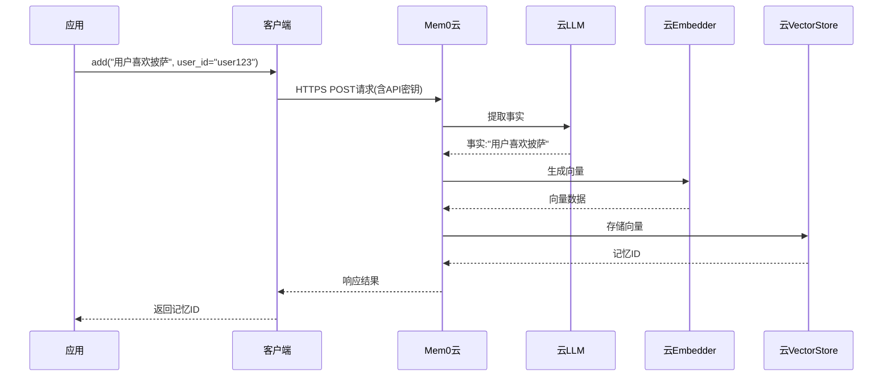

# 第3章：MemoryClient类（Python/TypeScript托管平台）

欢迎回来

在[第1章：MemoryConfig（配置系统）](01_memoryconfig__configuration_system__.md)中，我们学习了如何设计AI记忆的蓝图。在[第2章：Memory类（Python/TypeScript开源SDK）](02_memory_class__python_typescript_oss_sdk__.md)中，将这个蓝图变为现实，学会了如何使用`Memory`类为AI构建一个能在本地计算机或服务器上存储和检索信息的大脑。

但如果不想操心数据库设置、AI模型管理或系统负载问题呢？如果只想专注于AI开发，而将复杂的内存基础设施交给专业平台呢？

这就是**`MemoryClient`类**的用武之地

## 云托管的AI记忆服务

想象您热爱烹饪。享受挑选食材、遵循食谱和亲手烹制的过程。这就像使用第2章的`Memory`类——您完全掌控每个环节。

再想象您事务繁忙或要筹办大型宴会，此时只想享用专业烹饪并配送上门的佳肴。您只需向餐厅下单，他们就会处理一切：采购、烹饪和配送。

`MemoryClient`类正是为AI记忆提供的专业配送服务。它不需要您本地部署[LLM（大语言模型供应商）](06_llm__large_language_model_providers__.md)、[Embedder（嵌入供应商）](04_embedder__embedding_providers__.md)和[Vector Store（向量数据库供应商）](05_vector_store__vector_database_providers__.md)等组件，而是直接将记忆请求发送给**Mem0云托管平台**。

Mem0平台会为您：
* 安全接收请求
* 用托管的高性能AI模型和数据库处理
* 确保服务随AI需求自动扩展
* 处理所有更新维护

这是理想的无基础设施托管方案，让您专注创新而非运维。

本章将学习如何使用`MemoryClient`连接Mem0云记忆服务，轻松实现AI智能化。

## 快速入门`MemoryClient`类

相比自托管的`Memory`类，`MemoryClient`的初始化极其简单。

首先确保已安装`mem0`：
```bash
# Python
pip install mem0ai

# TypeScript/JavaScript
npm install mem0ai
```

### 初始化`MemoryClient`

最大区别在于不需要传递包含LLM/Embedder/Vector Store配置的`MemoryConfig`对象，只需提供`api_key`凭证（可在Mem0官网如`app.mem0.ai`获取）。

**Python:**
```python
from mem0 import MemoryClient

# 1. 用API密钥初始化MemoryClient
client = MemoryClient(api_key="您的MEM0_API密钥")
print("MemoryClient已初始化，连接至Mem0云平台")
```
**说明**：创建`MemoryClient`对象后，`api_key`会告知系统连接Mem0云服务，所有复杂组件均已就绪。

**TypeScript:**
```typescript
import { MemoryClient } from 'mem0ai';

// 1. 用API密钥初始化MemoryClient
const client = new MemoryClient({ apiKey: '您的MEM0_API密钥' });
console.log("MemoryClient已初始化，连接至Mem0云平台");
```

## `MemoryClient`核心记忆操作

初始化后，`MemoryClient`提供与第2章`Memory`类相似的方法，方便在自托管和云服务间切换。

我们继续用"饮食偏好"示例演示（以Python为例，TypeScript有等效方法）。

### 1. `add()`: 存储新记忆

```python
# 添加饮食偏好事实
add_result = client.add("我喜欢披萨但讨厌西兰花", user_id="user123")
print("已添加记忆(云):", add_result)
```
**输出**：
```
已添加记忆(云): {'results': [{'id': 'mem_...', 'memory': '用户喜欢披萨讨厌西兰花', 'event': 'ADD'}]}
```

### 2. `search()`: 检索相关记忆

```python
# 在云端检索饮食偏好
food_results = client.search("我的饮食偏好是什么？", user_id="user123")
print("\n饮食偏好检索结果(云):")
for res in food_results["results"]:
    print(f"- {res['memory']} (匹配度: {res['score']:.2f})")
```
**输出**：
```
饮食偏好检索结果(云):
- 用户喜欢披萨讨厌西兰花 (匹配度: 0.95)
```

### 3. `update()`: 修改现有记忆

```python
# 获取要更新的记忆ID
food_memory_id = client.search("披萨偏好", user_id="user123")["results"][0]["id"]
print(f"\n原始饮食记忆ID: {food_memory_id}")

# 在云端更新记忆
update_result = client.update(food_memory_id, text="我喜欢意大利面但讨厌披萨")
print("更新记忆结果(云):", update_result)

# 验证更新
updated_results = client.search("我的饮食偏好是什么？", user_id="user123")
print("\n更新后检索结果(云):")
for res in updated_results["results"]:
    print(f"- {res['memory']} (匹配度: {res['score']:.2f})")
```
**输出**：
```
原始饮食记忆ID: mem_...
更新记忆结果(云): {'message': '记忆更新成功！'}

更新后检索结果(云):
- 用户喜欢意大利面讨厌披萨 (匹配度: 0.96)
```

### 4. `delete()` & `delete_all()`: 删除记忆

```python
# 删除特定记忆
delete_result = client.delete(food_memory_id)
print("\n删除特定记忆结果(云):", delete_result)

# 删除用户所有记忆
delete_all_result = client.delete_all(user_id="user123")
print("\n删除user123全部记忆结果(云):", delete_all_result)
```
**输出**：
```
删除特定记忆结果(云): {'message': '记忆删除成功！'}

删除user123全部记忆结果(云): {'message': '记忆删除成功！'}
```

## 底层原理：`MemoryClient`如何连接云端

`MemoryClient`本质上是向Mem0云API发送HTTP请求的封装器，类似浏览器访问网站的过程。

### 记忆添加流程示例

跟踪`client.add("用户喜欢披萨", user_id="user1")`的完整流程：

1. **应用发起请求**：调用`client.add()`
2. **客户端准备请求**：添加`api_key`认证信息，组成HTTPS POST请求
3. **云端处理**：
   - 认证API密钥
   - 通过托管LLM提取事实
   - 使用托管Embedder生成向量
   - 存入托管Vector Store
4. **返回响应**：将处理结果返回客户端



### 代码解析

**Python初始化逻辑** (`mem0/client/main.py`)：
```python
class MemoryClient:
    def __init__(self, api_key: str, host: str = "https://api.mem0.ai"):
        self.client = httpx.Client(
            base_url=self.host,
            headers={"Authorization": f"Token {api_key}"},  # 认证头
            timeout=300
        )
```

**TypeScript初始化逻辑** (`mem0-ts/src/client/mem0.ts`)：
```typescript
this.client = axios.create({
    baseURL: this.host,
    headers: { Authorization: `Token ${this.apiKey}` }
});
```

## `Memory` vs `MemoryClient`：如何选择？

| 特性         | `Memory`(自托管SDK)                      | `MemoryClient`(托管平台)  |
| :----------- | :--------------------------------------- | :------------------------ |
| **部署方式** | 需自行管理所有组件                       | Mem0云端全托管            |
| **初始化**   | 需详细配置`MemoryConfig`                 | 仅需`api_key`             |
| **运维**     | 需自主维护更新                           | 自动维护升级              |
| **扩展性**   | 需专业知识==手动==扩展                   | ==自动==弹性扩展          |
| **定制性**   | 完全自主控制                             | 通过平台API有限定制       |
| **适用场景** | 需要完全控制/本地部署/数据主权要求的场景 | 追求快速部署/免运维的场景 |

## 总结

==`MemoryClient`类通过简洁的`api_key`验证，轻松接入Mem0云端记忆服务==，无需关心底层基础设施。无论是选择高度可控的`Memory`类，还是便捷托管的`MemoryClient`，都能为AI赋予智能持久记忆。

下一章我们将深入两者共同依赖的核心组件：[Embedder（嵌入供应商）](04_embedder__embedding_providers__.md)，了解文本如何转换为计算机可理解的语言。

[下一章：Embedder（嵌入供应商）](04_embedder__embedding_providers__.md)

