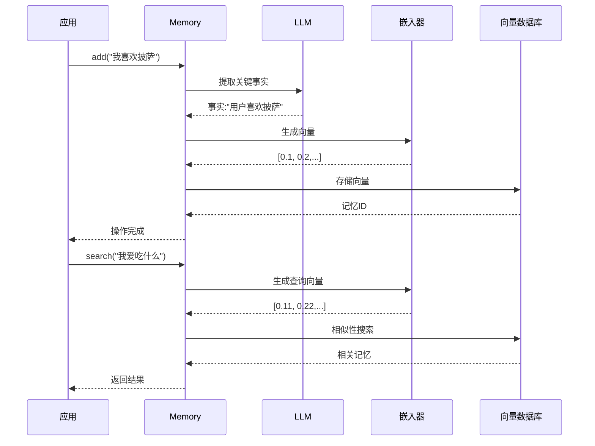

# 第4章：嵌入器（嵌入服务提供商）

欢迎回来

在[第3章：MemoryClient类（Python/TypeScript托管平台）](03_memoryclient_class__python_typescript_hosted_platform__.md)中，我们学习了如何通过`MemoryClient`连接Mem0云记忆服务，轻松实现AI的记忆功能。

无论是使用自托管的`Memory`类还是云托管的`MemoryClient`，背后都有一个关键组件在默默工作：**嵌入器（Embedder）**。

## AI的通用语义翻译器

假设我们试图让计算机理解"我喜欢在山间徒步"这句话。

当后续询问"我喜欢什么户外活动？"时，人类能立即建立这两者的关联。但计算机原生只理解数字，如何让它明白"山间徒步"与"户外活动"的语义关联？

这就是**嵌入器**要解决的核心问题

嵌入器如同文本的通用翻译器，将单词、句子甚至整个文档转化为称为"嵌入向量"的特殊数字编码。这些编码并非随机数字，而是精心设计以捕捉语义关联——含义相近的文本会生成数学上"接近"的向量。

可以这样理解：
* 每个文本单元被赋予"语义城市"中的唯一坐标
* 相似含义的句子（如"我喜欢猫"和"猫科动物是我的最爱"）会获得邻近坐标
* 无关句子（如"我喜欢猫"和"巴黎是法国首都"）则坐标相距甚远

这种机制==让计算机能够理解上下文和语义相似性==，使得`mem0`的`search()`功能不仅能匹配关键词，更能捕捉**概念**和**意图**。

## 嵌入器核心概念

让我们拆解嵌入器的关键要素：

1. **嵌入向量**：代表文本的数字编码（如`[0.1, -0.5, 0.9,...]`），每个数字代表一个"维度"。==维度数越多通常表征能力越强==，但也会增加存储和计算开销。
2. **嵌入模型**：==执行翻译任务的专用AI模型==。不同模型在语义理解、推理速度和本地部署等方面各有侧重。
3. **嵌入服务商**：提供这些模型的平台，如OpenAI、Ollama（本地模型）、Hugging Face和Google等。`mem0`可无缝对接多种服务商。

> ==通过`mem0`的抽象层，我们可以灵活切换不同的"翻译器"==（服务商和模型），而无需修改应用核心逻辑，只需更新[MemoryConfig（配置系统）](01_memoryconfig__configuration_system__.md)。

## 在`mem0`中配置嵌入器

如[第1章](01_memoryconfig__configuration_system__.md)所示，嵌入器通过`MemoryConfig`进行配置。

以下示例展示如何配置OpenAI的嵌入模型。

### Python配置示例

```python
from mem0 import Memory
from mem0.configs.base import MemoryConfig

# 1. 定义自定义配置
my_config = MemoryConfig(
    embedder={
        "provider": "openai",  # 使用OpenAI嵌入服务
        "config": {
            "model": "text-embedding-3-small",  # 指定嵌入模型
            "api_key": "您的OPENAI_API密钥",  # 认证密钥
            "embedding_dims": 1536  # 向量维度长度
        }
    },
    vector_store={
        "provider": "memory",
        "config": {"dimension": 1536}  # 必须与嵌入器维度一致！
    }
)

# 2. 初始化Memory实例
memory = Memory(config=my_config)

# 此时所有记忆操作都将使用配置的OpenAI嵌入器
memory.add("我喜欢在山间徒步", user_id="user456")
results = memory.search("我喜欢的户外活动是什么？", user_id="user456")

print("AI关联记忆:", results["results"][0]["memory"])
```
**关键点**：
- `embedder.provider`指定服务商（此处为OpenAI）
- `embedding_dims`必须与所选模型的输出维度一致（此处1536维）
- `vector_store.dimension`必须严格匹配嵌入器维度
- 当调用`add()`时，文本会被转换为1536维向量存储
- 当调用`search()`时，查询文本也会被转换为同维度向量进行相似性搜索

### TypeScript配置示例

```typescript
import { Memory } from 'mem0ai/oss';
import { MemoryConfig } from 'mem0ai/oss/dist/src/types';

// 1. 定义配置
const myConfig: Partial<MemoryConfig> = {
  embedder: {
    provider: 'openai',
    config: {
      apiKey: '您的OPENAI_API密钥',
      model: 'text-embedding-3-small',
      embeddingDims: 1536
    }
  },
  vectorStore: {
    provider: 'memory',
    config: { dimension: 1536 } // 维度必须匹配！
  },
  llm: { // 需提供最低限度的LLM配置
    provider: 'openai',
    config: { apiKey: '您的OPENAI_API密钥', model: 'gpt-4-turbo-preview' }
  }
};

// 2. 初始化Memory
const memory = new Memory(myConfig);

// 使用示例
async function demo() {
  await memory.add('我喜欢在山间徒步', { userId: 'user456' });
  const results = await memory.search('我喜欢的户外活动是什么？', { userId: 'user456' });
  
  if (results.results?.length) {
    console.log('AI关联记忆:', results.results[0].memory);
  }
}
demo();
```

## 工作原理：嵌入器在`mem0`中的工作流程

当调用`add()`或`search()`时，嵌入器在`mem0`内部的工作流程如下：

### 记忆存储流程（add()）

1. 应用发送文本到`Memory`实例
2. 通过[LLM（大语言模型）](06_llm__large_language_model_providers__.md)提取关键事实
3. 将事实文本发送给嵌入器生成向量
4. 将向量与元数据存储到[向量数据库](05_vector_store__vector_database_providers__.md)

### 记忆检索流程（search()）

1. 将查询文本发送给嵌入器生成查询向量
2. 在向量数据库中查找相似向量
3. 返回最相关的记忆内容



## 代码实现

### Python实现核心

**1. 基础配置类（mem0/configs/embeddings/base.py）**
```python
class BaseEmbedderConfig:
    def __init__(self, model=None, api_key=None, embedding_dims=None):
        self.model = model          # 模型名称
        self.api_key = api_key      # 服务商API密钥
        self.embedding_dims = embedding_dims  # 向量维度
```

**2. 嵌入器接口（mem0/embeddings/base.py）**
```python
class EmbeddingBase(ABC):
    @abstractmethod
    def embed(self, text, memory_action=None):
        """文本转向量的核心方法"""
        pass
```

**3. OpenAI嵌入器实现（mem0/embeddings/openai.py）**
```python
class OpenAIEmbedding(EmbeddingBase):
    def embed(self, text, memory_action=None):
        response = client.embeddings.create(
            input=[text],
            model=self.config.model,
            dimensions=self.config.embedding_dims
        )
        return response.data[0].embedding
```

**4. 工厂模式动态加载（mem0/utils/factory.py）**
```python
class EmbedderFactory:
    provider_to_class = {
        "openai": "mem0.embeddings.openai.OpenAIEmbedding",
        "ollama": "mem0.embeddings.ollama.OllamaEmbedding"
    }

    @classmethod
    def create(cls, provider_name, config):
        embedder_class = load_class(cls.provider_to_class[provider_name])
        return embedder_class(config)
```

### TypeScript实现核心

**1. 嵌入器接口（mem0-ts/src/oss/src/embeddings/base.ts）**
```typescript
export interface Embedder {
  embed(text: string): Promise<number[]>;
}
```

**2. OpenAI嵌入器实现（mem0-ts/src/oss/src/embeddings/openai.ts）**
```typescript
export class OpenAIEmbedder implements Embedder {
  async embed(text: string): Promise<number[]> {
    const response = await this.openai.embeddings.create({
      model: this.model,
      input: text
    });
    return response.data[0].embedding;
  }
}
```

**3. 工厂模式（mem0-ts/src/oss/src/utils/factory.ts）**
```typescript
export class EmbedderFactory {
  static create(provider: string, config: EmbeddingConfig): Embedder {
    switch(provider) {
      case "openai": return new OpenAIEmbedder(config);
      case "ollama": return new OllamaEmbedder(config);
      default: throw new Error(`不支持的嵌入器: ${provider}`);
    }
  }
}
```

## 总结

嵌入器是`mem0`实现语义化记忆的核心组件，通过==将文本转化为富含语义的向量编码，使AI能够理解上下文和概念关联==。

借助`mem0`灵活的配置系统，我们可以根据需求选择最适合的嵌入服务商和模型。

理解了文本如何转化为可搜索的向量后，下一步自然要探索这些向量的存储和检索机制。下一章我们将深入[向量数据库（向量存储服务商）](05_vector_store__vector_database_providers__.md)，了解支撑高效语义搜索的专用数据库系统

[下一章：向量数据库（向量存储服务商）](05_vector_store__vector_database_providers__.md)

