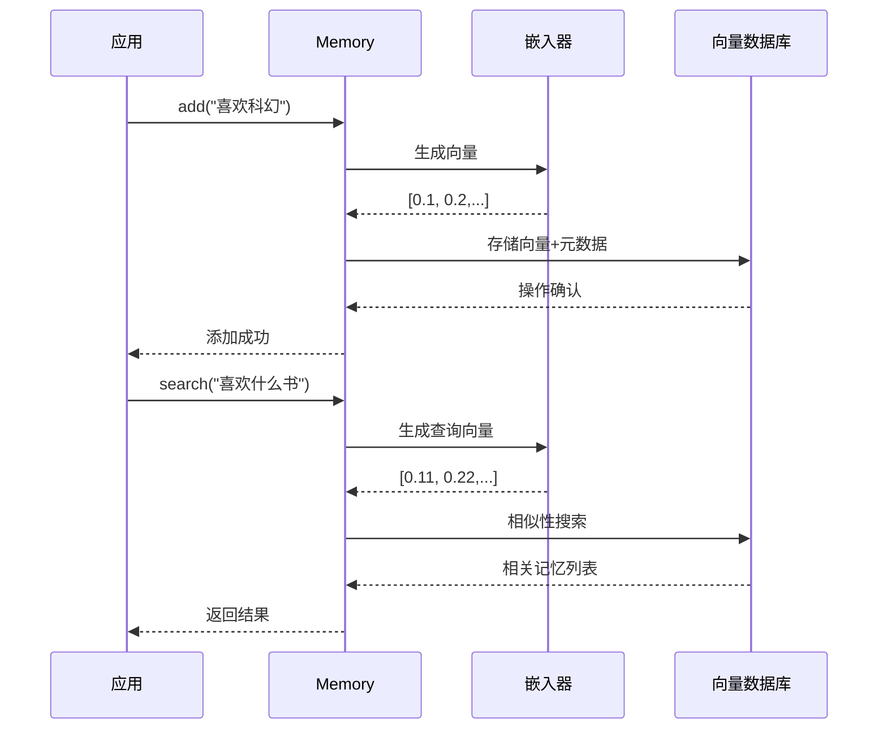

# 第5章：向量数据库（向量存储服务商）

欢迎回来

在[第4章：嵌入器（嵌入服务提供商）](04_embedder__embedding_providers__.md)中，我们了解了将AI文本记忆转化为数字编码（嵌入向量）的"通用翻译器"。这些嵌入向量之所以重要，是因为它们让计算机能够理解记忆的**语义**。

现在有了这些强大的数字编码，但应该将它们存放在哪里才能被AI有效利用？想象我们需要管理成千上万个这样的编码，当AI需要"回忆"时，如何快速找到**最相关**的部分？

这就是**向量数据库**的用武之地。

## AI的超高效记忆仓库

将向量数据库视为**AI的长期记忆仓库**。这不是普通的仓库，而是专门为存储和快速检索那些代表语义的数字编码而设计的超级图书馆。

其核心价值在于：
1. **嵌入向量的存储**：当[嵌入器](04_embedder__embedding_providers__.md)将文本转化为数字编码后，向量数据库会像高度组织的图书馆一样，安全存储这些编码。每个向量都会与原始文本、用户ID、时间戳等元数据一起存储。
2. **智能快速检索**：当AI需要回忆时（例如询问"我的饮食偏好是什么？"），问题会先被转化为查询向量。向量数据库通过数学计算快速找出语义最相近的存储向量。
3. **多仓库系统**：就像实体图书馆有不同的分类系统（按主题、作者或杜威十进制法），`mem0`支持多种向量数据库方案，如Qdrant、Chroma、Pinecone等。您可以根据性能、扩展性或部署需求选择最适合的方案。

简而言之，向量数据库是`mem0`实现智能语义搜索的基石，让AI能高效检索相关历史信息。

## 向量数据库核心概念

让我们解析关键概念：
* **向量数据库**：专为基于相似性（而非关键词匹配）存储和检索向量而设计的数据库系统
* **集合(Collection)**：类似图书馆的分区，可按记忆类型或用户分组管理向量
* **相似性搜索**：通过余弦相似度等算法，找出与查询向量最接近的存储向量
* **维度匹配**：嵌入器输出的向量维度**必须**与数据库配置完全一致（如1536维）

## 在`mem0`中配置向量数据库

通过`MemoryConfig`指定向量数据库服务商及其参数。以下是使用Qdrant的配置示例，重点展示维度匹配的重要性。

### Python配置示例

```python
from mem0 import Memory
from mem0.configs.base import MemoryConfig

# 1. 定义配置
my_config = MemoryConfig(
    embedder={
        "provider": "openai",
        "config": {
            "model": "text-embedding-3-small",
            "embedding_dims": 1536  # 嵌入器输出1536维向量
        }
    },
    vector_store={
        "provider": "qdrant",  # 使用Qdrant数据库
        "config": {
            "collection_name": "ai_memories",  # 集合名称
            "host": "localhost",              # 服务器地址
            "port": 6333,                     # 服务端口
            "dimension": 1536,                # 必须与嵌入器维度一致！
            "on_disk": True                   # 持久化存储
        }
    },
    llm={  # 需提供基础LLM配置
        "provider": "openai",
        "config": {"model": "gpt-4-turbo-preview"}
    }
)

# 2. 初始化Memory实例
memory = Memory(config=my_config)

# 添加记忆（将自动存储到Qdrant）
memory.add("我喜欢阅读科幻小说", user_id="user789")

# 语义搜索
results = memory.search("我偏爱哪类书籍？", user_id="user789")
print("关联记忆:", results["results"][0]["memory"])
```
**关键点**：
- `vector_store.provider`指定服务商（此处为Qdrant）
- `dimension`必须严格匹配`embedding_dims`
- `add()`操作会将文本转化为1536维向量存入Qdrant
- `search()`会先将查询文本转化为同维度向量再进行相似性搜索

### TypeScript配置示例

```typescript
import { Memory } from 'mem0ai/oss';
import { MemoryConfig } from 'mem0ai/oss/dist/src/types';

const myConfig: Partial<MemoryConfig> = {
  embedder: {
    provider: 'openai',
    config: {
      apiKey: '您的OPENAI_API密钥',
      model: 'text-embedding-3-small',
      embeddingDims: 1536
    }
  },
  vectorStore: {
    provider: 'qdrant',
    config: {
      collectionName: 'ai_memories',
      host: 'localhost',
      port: 6333,
      dimension: 1536,  // 必须匹配！
      onDisk: true
    }
  },
  llm: {
    provider: 'openai',
    config: { apiKey: '您的OPENAI_API密钥', model: 'gpt-4-turbo-preview' }
  }
};

const memory = new Memory(myConfig);

async function demo() {
  await memory.add('我喜欢阅读科幻小说', { userId: 'user789' });
  const results = await memory.search('我偏爱哪类书籍？', { userId: 'user789' });
  console.log('关联记忆:', results.results?.[0]?.memory);
}
demo();
```

## 工作原理：向量数据库在`mem0`中的工作流程

### 记忆存储流程（add()）
1. 应用输入文本（如"用户喜欢科幻"）
2. 通过LLM提取关键事实
3. 嵌入器将事实转化为向量
4. 向量与元数据存入配置的数据库

### 记忆检索流程（search()）
1. 将查询文本转化为查询向量
2. 在向量数据库中执行相似性搜索
3. 返回最相关的记忆内容



## 代码实现解析

### Python核心实现

**1. 基础接口（mem0/vector_stores/base.py）**
```python
class VectorStoreBase(ABC):
    @abstractmethod
    def insert(self, vectors, payloads=None, ids=None):
        """存储向量及元数据"""
        pass

    @abstractmethod 
    def search(self, query, limit=5):
        """相似性搜索"""
        pass
```

**2. Qdrant实现（mem0/vector_stores/qdrant.py）**
```python
class Qdrant(VectorStoreBase):
    def __init__(self, collection_name, embedding_model_dims, **kwargs):
        self.client = QdrantClient(**kwargs)
        self.dimension = embedding_model_dims  # 严格校验维度

    def insert(self, vectors, payloads, ids):
        points = [PointStruct(id=id, vector=vec, payload=payload) 
                 for id, vec, payload in zip(ids, vectors, payloads)]
        self.client.upsert(collection_name=self.collection_name, points=points)
```

**3. 工厂模式（mem0/utils/factory.py）**
```python
class VectorDBFactory:
    provider_to_class = {
        "qdrant": "mem0.vector_stores.qdrant.Qdrant",
        "chroma": "mem0.vector_stores.chroma.ChromaDB"
    }

    @classmethod
    def create(cls, provider_name, config):
        vector_db_class = load_class(cls.provider_to_class[provider_name])
        return vector_db_class(**config)  # 动态实例化
```

### TypeScript核心实现

**1. 基础接口（mem0-ts/src/oss/src/vector_stores/base.ts）**
```typescript
interface VectorStore {
  insert(vectors: number[][], ids: string[], payloads: any[]): Promise<void>;
  search(query: number[], limit?: number): Promise<VectorStoreResult[]>;
}
```

**2. Qdrant实现（mem0-ts/src/oss/src/vector_stores/qdrant.ts）**
```typescript
export class Qdrant implements VectorStore {
  private dimension: number;

  constructor(config: VectorStoreConfig) {
    this.dimension = config.dimension;  // 维度校验
    this.client = new QdrantClient(config);
  }

  async insert(vectors: number[][], ids: string[], payloads: any[]) {
    await this.client.upsert(this.collectionName, {
      points: vectors.map((v, i) => ({
        id: ids[i], vector: v, payload: payloads[i]
      }))
    });
  }
}
```

## 总结

向量数据库作为AI记忆的存储与检索引擎，通过高效存储嵌入向量并执行相似性搜索，使AI具备真正的"回忆"能力。`mem0`的多服务商支持架构，让您能根据场景需求选择最佳解决方案。

理解了文本如何转化为向量并存储后，接下来我们将探索AI的"思考中枢"——[大语言模型（LLM服务商）](06_llm__large_language_model_providers__.md)，了解其如何理解问题并生成智能响应。

[下一章：大语言模型（LLM服务商）](06_llm__large_language_model_providers__.md)

