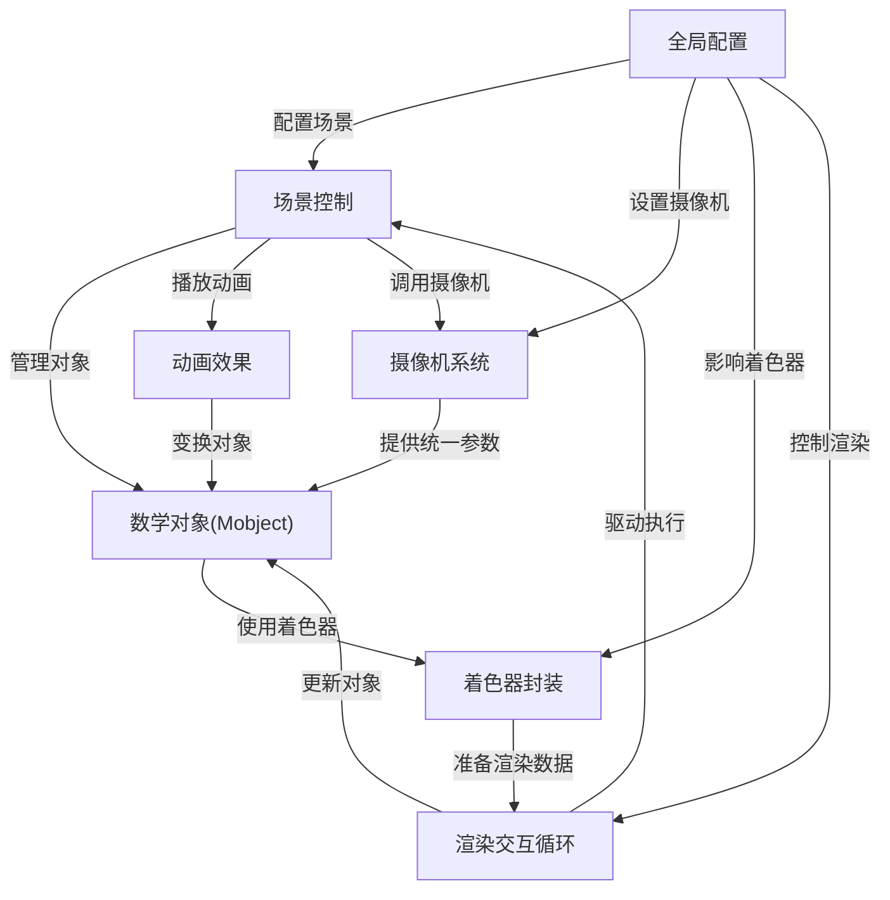
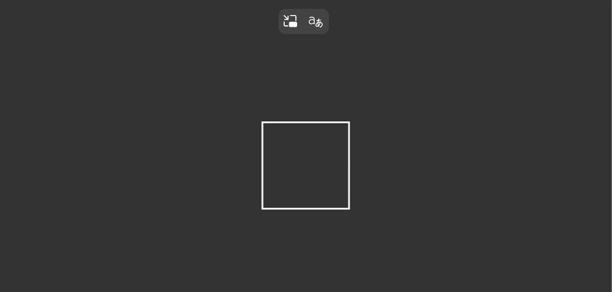
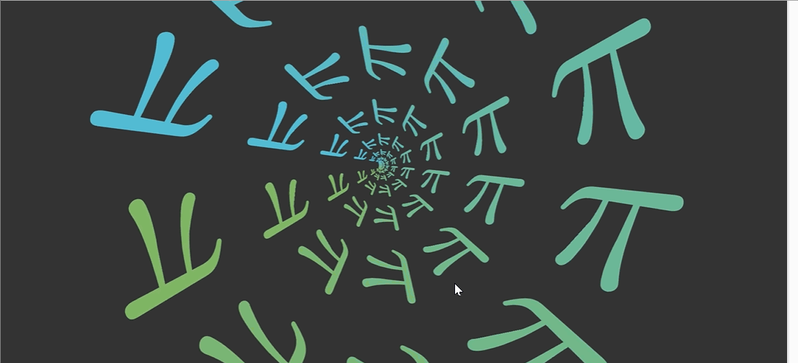
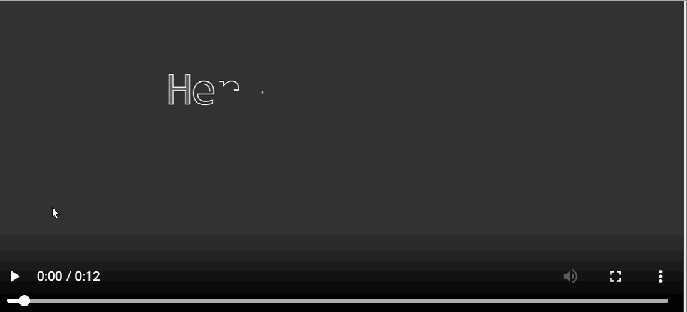

链接：[Quick Start - manim documentation](https://3b1b.github.io/manim/getting_started/quickstart.html)

# Manim docs：数学动画引擎

Manim是一个专为**数学可视化**设计的**强大动画引擎**

允许用户在**场景**(主画布)上==定义称为**Mobjects**的*可视化元素*==，通过**动画**进行动态展示，最终将这些动画渲染成视频。该系统包含以下核心组件：

1. **摄像机系统** - 控制观察视角
2. **着色器封装器** - 实现高效GPU渲染
3. **配置系统** - 提供灵活的自定义选项
4. **渲染与交互循环** - 驱动整个动画流程

## 架构



## 目录

1. [数学对象(Mobject)详解](01_mobject__mathematical_object__.md)
2. [场景控制系统](02_scene_.md)
3. [动画效果实现](03_animation_.md)
4. [全局配置管理](04_configuration_.md)
5. [摄像机系统原理](05_camera_system_.md)
6. [渲染与交互机制](06_rendering___interaction_loop_.md)
7. [着色器封装技术](07_shaderwrapper_.md)

---

# Quick Start

# 快速入门指南

按照安装页面的说明配置好manim环境后，我们可以尝试从头开始创建一个场景。

首先根据以下目录结构创建新的.py文件（例如start.py）：

```
manim/
├── manimlib/
│   ├── animation/
│   ├── ...
│   ├── default_config.yml
│   └── window.py
├── custom_config.yml
└── start.py
```

并粘贴以下代码（后续将逐行解释其功能）：

```python
from manimlib import *

class SquareToCircle(Scene):
    def construct(self):
        circle = Circle()
        circle.set_fill(BLUE, opacity=0.5)
        circle.set_stroke(BLUE_E, width=4)

        self.add(circle)
```

运行命令：
```
manimgl start.py SquareToCircle
```

此时屏幕将弹出窗口，我们可以：
- 滚动鼠标中键上下移动画面
- 按住键盘z键同时滚动中键缩放画面
- 按住s键移动鼠标平移画面
- 按住d键移动鼠标改变三维视角
- 按q键关闭窗口退出程序

再次运行命令：
```
manimgl start.py SquareToCircle -os
```
此时不会弹出窗口，程序运行完成后会自动打开渲染的图片（默认保存在start.py同级目录的images/子目录下）。

## 代码解析

第1行：
```python
from manimlib import *
```
导入manim可能用到的所有类。

第3行：
```python
class SquareToCircle(Scene):
```
创建Scene的子类SquareToCircle，这将是我们编写和渲染的场景。

第4行：
```python
def construct(self):
```
定义construct()方法，其内容决定如何在画面中创建图形对象及执行操作。

第5行：
```python
circle = Circle()
```
创建Circle类的实例circle。

第6-7行：
```python
circle.set_fill(BLUE, opacity=0.5)
circle.set_stroke(BLUE_E, width=4)
```
设置圆形样式：
- set_fill()设置填充色为蓝色(BLUE)，透明度0.5
- set_stroke()设置描边色为深蓝(BLUE_E)，宽度4

第9行：
```python
self.add(circle)
```
通过Scene的add()方法将圆形添加到画面。

## 添加动画

修改代码添加动画效果：

```python
from manimlib import *

class SquareToCircle(Scene):
    def construct(self):
        circle = Circle()
        circle.set_fill(BLUE, opacity=0.5)
        circle.set_stroke(BLUE_E, width=4)
        square = Square()

        self.play(ShowCreation(square))
        self.wait()
        self.play(ReplacementTransform(square, circle))
        self.wait()
```

运行命令：
```
manimgl start.py SquareToCircle
```
窗口将播放绘制正方形并变形为圆形的动画。如需保存视频：
```
manimgl start.py SquareToCircle -o
```

## 新增代码解析

第8行创建Square类的实例square。

第10行：
```python
self.play(ShowCreation(square))
```
通过ShowCreation动画展示square的创建过程。

第11行：
```python
self.wait()
```
暂停1秒（可传入参数指定时长，如self.wait(3)暂停3秒）。

第12行：
```python
self.play(ReplacementTransform(square, circle))
```
播放将square变形替换为circle的动画。

## 启用交互功能

在代码末尾添加：
```python
self.embed()
```
运行后动画播放完毕会开启ipython终端，可以即时执行代码：
```python
# 垂直方向拉伸4倍
play(circle.animate.stretch(4, dim=0))
# 旋转90度
play(Rotate(circle, TAU/4))
# 右移2单位并缩小至1/4
play(circle.animate.shift(2*RIGHT), circle.animate.scale(0.25))
# 应用复数变换f(z)=z^2
play(circle.animate.apply_complex_function(lambda z: z**2))
# 退出程序
exit()
```

也可以直接运行命令进入交互模式：
```
manimgl
```

至此我们已经掌握manim的基本用法，接下来可以查看示例场景页面，但建议先了解manim的命令行参数和配置选项。

# Example

在理解前面的知识后，我们可以分析更多场景案例。`example_scenes.py`中提供了许多示例场景，让我们从最简单的开始逐一解析。

## 交互式开发场景

## 

```python
class InteractiveDevelopment(Scene):
    def construct(self):
        circle = Circle()
        circle.set_fill(BLUE, opacity=0.5)
        circle.set_stroke(BLUE_E, width=4)
        square = Square()

        self.play(ShowCreation(square))
        self.wait()

        # 这里会打开iPython终端，您可以继续编写代码
        # 就像它们是construct方法的一部分
        self.embed()

        # 尝试将以下代码复制粘贴到交互式shell中
        self.play(ReplacementTransform(square, circle))
        self.play(circle.animate.stretch(4, 0))
        self.play(Rotate(circle, 90 * DEGREES))
        self.play(circle.animate.shift(2 * RIGHT).scale(0.25))
```

这个场景展示了交互式开发功能，注释中已详细说明交互方式，此处不再赘述。

## 动画方法示例



```python
class AnimatingMethods(Scene):
    def construct(self):
        grid = OldTex(r"\pi").get_grid(10, 10, height=4)
        
        # 使用.animate语法动画化方法调用
        self.play(grid.animate.shift(LEFT))
        
        # 也可以使用传统语法
        self.play(grid.shift, LEFT)
        
        # 设置颜色动画
        self.play(grid.animate.set_color(YELLOW))
        self.play(grid.animate.set_submobject_colors_by_gradient(BLUE, GREEN))
        
        # 应用复数函数变换
        self.play(grid.animate.apply_complex_function(np.exp), run_time=5)
```

新用法是`.get_grid()`和`self.play(mob.animate.method(args))`，注释中已详细说明。

## 文本示例



```python
class TextExample(Scene):
    def construct(self):
        # 创建基础文本
        text = Text("示例文本", font="Consolas", font_size=90)
        
        # 创建带样式映射的文本
        styled_text = Text(
            "可以按单词设置不同字体和颜色",
            font="Arial",
            t2f={"font": "Consolas", "words": "Consolas"},
            t2c={"font": BLUE, "words": GREEN}
        )
        
        # 使用VGroup组合文本
        group = VGroup(text, styled_text).arrange(DOWN, buff=1)
        self.play(Write(group))
```

新类包括`Text`、`VGroup`、`Write`等，代码示例中展示了它们的用法。

## 公式变换示例
```python
class TexTransformExample(Scene):
    def construct(self):
        # 创建公式组
        formulas = VGroup(
            OldTex("A^2 + B^2 = C^2"),
            OldTex("A = \\sqrt{(C+B)(C-B)}")
        )
        
        # 使用公式匹配变换
        self.play(TransformMatchingTex(formulas[0], formulas[1]))
```

引入了`Tex`、`TransformMatchingTex`等类，用于处理LaTeX公式的智能变换。

## 更新器示例
```python
class UpdatersExample(Scene):
    def construct(self):
        square = Square()
        brace = always_redraw(Brace, square, UP)
        
        # 使用always自动更新位置
        label = always(Text("宽度").next_to, brace, UP)
        
        self.play(square.animate.scale(2))
```

展示了`always_redraw()`、`always()`等更新器的使用方式。

## 坐标系示例
```python
class CoordinateSystemExample(Scene):
    def construct(self):
        axes = Axes(x_range=(-1,10), y_range=(-2,2,0.5))
        dot = Dot().move_to(axes.c2p(0,0))
        
        # 创建动态参考线
        h_line = always_redraw(lambda: axes.get_h_line(dot.get_left()))
        
        self.play(dot.animate.move_to(axes.c2p(3,2)))
```

演示了坐标系和动态元素的结合使用。

## 3D曲面示例
```python
class SurfaceExample(Scene):
    def construct(self):
        # 创建3D对象
        sphere = Sphere(radius=3)
        textured_sphere = TexturedSurface(
            sphere, 
            day_texture="earth.jpg",
            night_texture="night_earth.jpg"
        )
        
        # 设置3D视角
        self.camera.frame.set_euler_angles(theta=-30*DEGREES)
        
        self.play(Create(textured_sphere))
```

展示了3D场景和纹理贴图的基本用法。

## 综合示例
```python
class OpeningManimExample(Scene):
    def construct(self):
        # 创建网格和矩阵
        grid = NumberPlane()
        matrix = [[1,1],[0,1]]
        
        # 线性变换演示
        self.play(grid.animate.apply_matrix(matrix))
        
        # 复数平面变换
        c_grid = ComplexPlane()
        self.play(c_grid.animate.apply_complex_function(lambda z: z**2))
```

这个场景综合运用了2D图形变换和复数平面操作。

通过以上示例，已经了解了manim的部分核心功能。更多高级用法可以参考3b1b的视频源代码~
