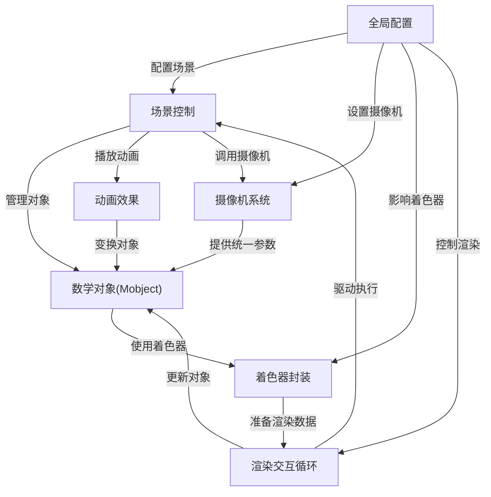

链接：[Quick Start - manim documentation](https://3b1b.github.io/manim/getting_started/quickstart.html)

# Manim docs：数学动画引擎

Manim是一个专为**数学可视化**设计的**强大动画引擎**

允许用户在**场景**(主画布)上==定义称为**Mobjects**的*可视化元素*==，通过**动画**进行动态展示，最终将这些动画渲染成视频。该系统包含以下核心组件：

1. **摄像机系统** - 控制观察视角
2. **着色器封装器** - 实现高效GPU渲染
3. **配置系统** - 提供灵活的自定义选项
4. **渲染与交互循环** - 驱动整个动画流程

## 架构

## 目录

1. [数学对象(Mobject)详解](01_mobject__mathematical_object__.md)
2. [场景控制系统](02_scene_.md)
3. [动画效果实现](03_animation_.md)
4. [全局配置管理](04_configuration_.md)
5. [摄像机系统原理](05_camera_system_.md)
6. [渲染与交互机制](06_rendering___interaction_loop_.md)
7. [着色器封装技术](07_shaderwrapper_.md)

---
