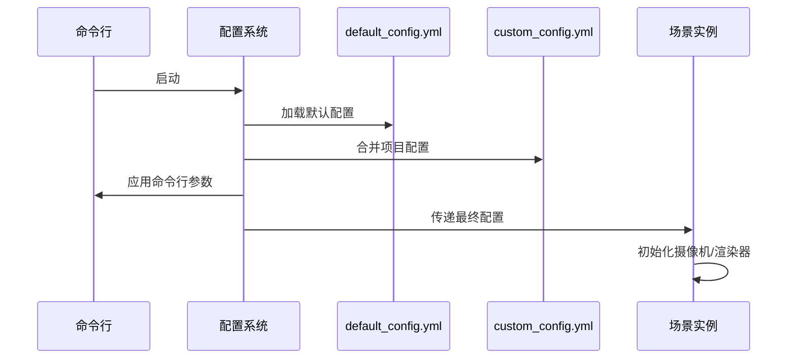

# 第3章：动画系统

欢迎回到Manim

在[上一章](02_scene_.md)中，我们掌握了`Scene`场景系统——这是`Mobject`（来自[第1章](01_mobject__mathematical_object__.md)的图形元素）表演的舞台。我们甚至用`self.play(Create(my_circle))`让蓝色圆形出现在屏幕上。

但如果想让元素动起来呢？比如移动、变色、缩放或变形？这正是`Animation`动画系统的使命。

## 动画的核心价值

想象仍在导演舞台剧。演员（`Mobject`）和舞台（`Scene`）已就位，但精彩演出需要动态表演！动画系统解决的关键问题是：
- **状态过渡**：定义元素从起始到目标状态的渐变过程
- **时序控制**：精确管理变化速度与节奏
- **复合动作**：支持多元素协同动画

## 动画的本质

`Animation`是描述`Mobject`状态变化的指令集，包含四大要素：
1. **目标元素**：被操作的`Mobject`
2. **目标状态**：动画结束时的元素形态
3. **持续时间**：`run_time`参数（默认1秒）
4. **速率函数**：`rate_func`控制变化曲线（如匀速/缓入缓出）

### 动画类型速查
| 类别       | 典型动画类    | 效果描述                        |
| ---------- | ------------- | ------------------------------- |
| **创建类** | `Create`      | 绘制元素轮廓并填充              |
|            | `FadeIn`      | 淡入效果                        |
|            | `Write`       | 逐笔书写文字                    |
| **变换类** | `ApplyMethod` | 动态执行元素方法（如移动/旋转） |
|            | `Transform`   | 元素A变形为元素B                |
|            | `Rotate`      | 旋转元素                        |
| **消失类** | `FadeOut`     | 淡出效果                        |
|            | `Uncreate`    | 逆向绘制消除元素                |

## 让圆形动起来

下面实现蓝色圆形从左侧移动到右侧的动画：

```python
from manimlib.scene.scene import Scene
from manimlib.mobject.geometry import Circle
from manimlib.constants import BLUE, RIGHT, LEFT
from manimlib.animation.fading import FadeIn
from manimlib.animation.transform import ApplyMethod

class MovingCircle(Scene):
    def construct(self):
        # 1. 创建蓝色圆形并定位到左侧
        circle = Circle(color=BLUE).to_edge(LEFT)
        
        # 2. 淡入显示
        self.play(FadeIn(circle))
        self.wait(0.5)  # 短暂停顿
        
        # 3. 向右移动4单位
        self.play(ApplyMethod(circle.shift, 4*RIGHT))
        self.wait(1)
```

**执行命令**：
```bash
manimgl animation_demo.py MovingCircle -p
```

### 代码解析
- `to_edge(LEFT)`：立即将元素定位到屏幕左侧（非动画）
- `ApplyMethod`：动态执行`shift`移动方法
- `4*RIGHT`：表示向右移动4单位（`RIGHT`是向量(1,0,0)）

## 高级动画控制

通过参数定制动画效果：

```python
from manimlib.utils.rate_functions import ease_out_bounce

class CustomAnimation(Scene):
    def construct(self):
        circle = Circle(color=BLUE).to_edge(LEFT)
        
        # 快速淡入(0.5秒)
        self.play(FadeIn(circle, run_time=0.5))
        
        # 3秒弹性移动
        self.play(
            ApplyMethod(
                circle.shift, 4*RIGHT,
                run_time=3,
                rate_func=ease_out_bounce  # 弹性效果
            )
        )
```

### 核心参数
| 参数        | 作用             | 默认值   | 示例                    |
| ----------- | ---------------- | -------- | ----------------------- |
| `run_time`  | 动画持续时间(秒) | 1.0      | `run_time=2.5`          |
| `rate_func` | 变化速率曲线     | `smooth` | `rate_func=linear`      |
| `remover`   | 动画后移除元素   | `False`  | `FadeOut(remover=True)` |

## 技术实现

### 动画生命周期
1. **准备阶段**  
   - 复制元素初始状态(`starting_mobject`)
   - 计算目标状态(`target_mobject`)

2. **插值阶段**  
   ```mermaid
   sequenceDiagram
       participant Scene as 场景
       participant Anim as 动画实例
       loop 每帧处理
           Scene->>Anim: 传递当前进度alpha(0→1)
           Anim->>Anim: 应用rate_func计算真实进度
           Anim->>Mobject: 根据进度插值更新状态
       end
   ```

3. **收尾阶段**  
   - 确保元素精确到达目标状态
   - 执行清理操作（如移除元素）

### 关键代码
```python
class Animation:
    def interpolate(self, alpha):
        # 应用速率函数
        t_alpha = self.rate_func(alpha)
        
        # 更新元素状态
        self.mobject.interpolate(
            self.starting_mobject,
            self.target_mobject,
            t_alpha
        )
```

现在已掌握动画基础，接下来将学习[配置系统](04_configuration_.md)，精细控制渲染效果

[下一章：配置系统](04_configuration_.md)

---
# 第4章：配置系统

在[上一章](03_animation_.md)中，我们通过`Animation`让`Mobject`动了起来，实现了蓝色圆形的淡入和移动。但如果想全局调整动画的视觉风格呢？比如将默认的深灰背景改为纯白，或是让所有图形默认显示为绿色？这正是**配置系统**的用武之地。

## 配置系统的核心价值

想象你是一家电影工作室的导演。每部作品都需要统一的视觉规范：固定机位、标准配色、输出路径甚至字体样式。如果每拍一个镜头都重复设置这些参数，效率将极其低下。

配置系统解决的正是这类问题：
- **统一管理**：集中定义渲染参数
- **层级覆盖**：支持全局默认→项目自定义→临时调整的优先级
- **灵活控制**：涵盖分辨率、色彩、文件输出等核心参数

## 配置加载机制

Manim的配置采用三级优先级（后者覆盖前者）：
1. **默认配置**  
   `manimlib/default_config.yml`  
   *注：严禁直接修改此文件*
2. **项目配置**  
   脚本同目录下的`custom_config.yml`  
   *推荐用于项目级定制*
3. **命令行参数**  
   执行命令时通过`-c`等参数传入  
   *适合临时调整*

### 配置示例
```yaml
# custom_config.yml
camera:
  background_color: "#FFFFFF"  # 白色背景

vmobject:
  default_stroke_color: "#00FF00"  # 绿色描边
```

## 实战：修改默认配色

### 目标效果
- 场景背景：纯白
- 圆形默认：绿色填充

#### 方法1：命令行临时调整
```bash
manimgl scene.py MyScene -p -c "#0000FF"
```
*效果：本次运行背景变为蓝色*

#### 方法2：项目级配置
1. 创建`custom_config.yml`：
```yaml
camera:
  background_color: "#FFFFFF"

vmobject:
  default_stroke_color: "#00FF00"
  default_fill_color: "#00FF00"  # 绿色填充
```
2. 运行脚本：
```bash
manimgl scene.py MyScene -p
```
*效果：所有场景默认白底绿圆*

## 配置参数速查

| 配置模块      | 典型参数                     | 示例值                |
| ------------- | ---------------------------- | --------------------- |
| `camera`      | `background_color`           | `"#FFFFFF"` (纯白)    |
|               | `pixel_width`/`pixel_height` | `1920`/`1080` (1080p) |
| `vmobject`    | `default_stroke_width`       | `4` (描边粗细)        |
|               | `fill_opacity`               | `0.5` (半透明填充)    |
| `file_writer` | `output_directory`           | `"./renders"`         |
|               | `movie_file_extension`       | `".mp4"`              |

## 技术实现解析

### 配置加载流程


### 核心代码结构
```python
# manimlib/config.py
def initialize_config():
    # 1. 加载默认配置
    config = load_yaml("manimlib/default_config.yml")
    
    # 2. 合并项目配置
    if os.path.exists("custom_config.yml"):
        config.update(load_yaml("custom_config.yml"))
    
    # 3. 应用命令行参数
    if args.background_color:
        config["camera"]["background_color"] = args.background_color
    
    return config
```

掌握配置系统后，我们将深入[摄像机系统](05_camera_system_.md)，学习如何控制画面构图与视角变换！

[下一章：摄像机系统](05_camera_system_.md)

