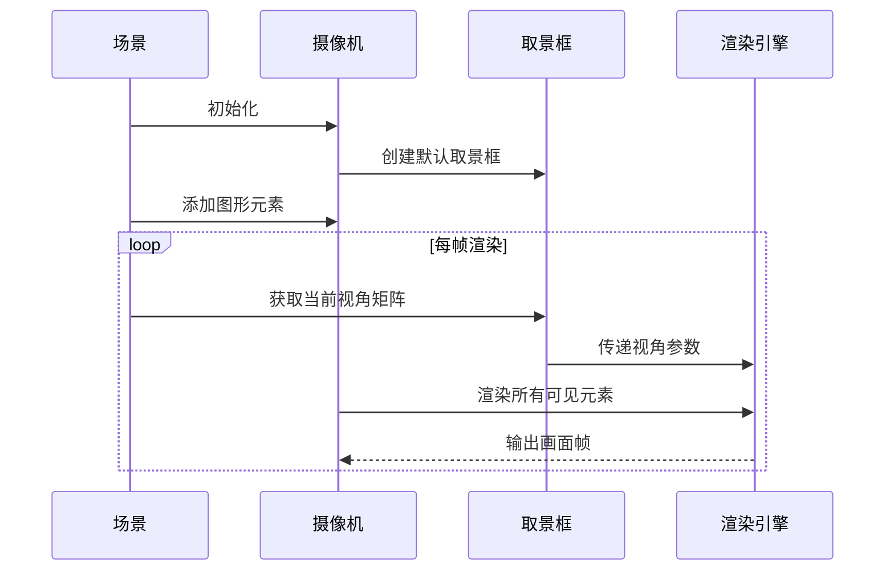

# 第5章：摄像机系统

欢迎回到Manim

在[上一章](04_configuration_.md)中，我们通过配置系统定制了动画的全局样式。现在我们将探索如何==控制观众的视角==——这正是**摄像机系统**的职责所在。

## 摄像机系统的核心价值

想象你是一名电影导演。

演员（`Mobject`）已就位，动作（`Animation`）已编排，但如何决定观众看到的画面范围？是否需要特写镜头、全景展示或是动态运镜？摄像机系统解决的关键问题包括：

- **可视范围**：控制画面中显示的内容
- **缩放级别**：调整观察距离
- **空间定位**：实现平移/旋转等运镜效果
- **3D视角**：管理三维场景的观察角度

## 摄像机系统组成

Manim的摄像机系统由两大组件构成：

1. **摄像机本体**  
   `self.camera`  
   负责实际渲染，管理分辨率、背景色等硬件级参数

2. **取景框**  
   `self.camera.frame`  
   作为特殊`Mobject`，控制视角的定位/缩放/旋转，支持动画化操作

### 关键控制方法
| 方法              | 作用                           | 示例                    |
| ----------------- | ------------------------------ | ----------------------- |
| `set_height(h)`   | 垂直缩放（数值越小放大越明显） | `frame.set_height(3)`   |
| `move_to(target)` | 聚焦到指定元素                 | `frame.move_to(circle)` |
| `shift(vector)`   | 相对位移                       | `frame.shift(RIGHT*2)`  |
| `reorient(theta)` | 3D旋转（设置俯仰角）           | `frame.reorient(45)`    |

## 实战：实现镜头运动

### 基础场景搭建
```python
class BasicScene(Scene):
    def construct(self):
        # 左侧蓝色圆形
        circle = Circle(color=BLUE).shift(LEFT*2)
        # 右侧红色方形
        square = Square(color=RED).shift(RIGHT*2)
        
        self.add(circle, square)
        self.wait(1)
```
*默认显示效果：同时展示两个元素的全景画面*

### 镜头推进特写
```python
# 在self.wait(1)后添加：
self.play(
    self.camera.frame.animate
    .move_to(circle)       # 聚焦圆形
    .set_height(3)         # 放大3倍
)
```
*效果：镜头平滑推进到蓝色圆形特写*

### 横向运镜转场
```python
# 在特写动画后添加：
self.play(
    self.camera.frame.animate
    .move_to(square)       # 移动到方形
    .set_height(4)         # 调整缩放级别
)
```
*效果：从圆形特写横向滑动到方形，伴随轻微变焦*

## 技术实现

### 运作流程


### 核心代码结构
```python
class CameraFrame(Mobject):
    def get_view_matrix(self):
        # 计算当前视角的变换矩阵
        matrix = compute_projection_matrix(
            self.position,
            self.orientation,
            self.scale
        )
        return matrix

class Camera:
    def capture(self):
        view_matrix = self.frame.get_view_matrix()
        for mobject in self.scene.mobjects:
            mobject.render(view_matrix)  # 基于视角矩阵渲染每个元素
```

掌握摄像机系统后，我们将深入[渲染与交互循环](06_rendering___interaction_loop__.md)，解析Manim的帧生成机制与交互控制

[下一章：渲染与交互循环](06_rendering___interaction_loop__.md)

---
# 第6章：渲染与交互循环

在[上一章](05_camera_system_.md)中，我们掌握了摄像机系统的运镜技巧。现在我们将揭示Manim实时呈现动画的核心机制——**渲染与交互循环**。

## 循环机制的核心价值

想象一位画家正在你面前逐帧绘制动画，同时还能即时响应你的指令。这种持续绘制（渲染）与即时响应（交互）的协同工作，正是Manim实时预览模式（`-p`参数）的基石。该循环解决了两大核心问题：
1. **==动态更新==**：如何持续刷新画面以实现平滑动画
2. **==实时交互==**：如何即时响应键盘/鼠标事件

## 循环的三步周期

### 1. 状态更新阶段
- **时间推进**：更新场景时间戳`self.time`
- **元素更新**：执行所有`Mobject`的`updater`函数
```python
def update_circle(mob, dt):
    mob.rotate(dt)  # 每帧旋转dt弧度
circle.add_updater(update_circle)
```

### 2. 画面渲染阶段
- **摄像机捕捉**：根据当前取景框状态生成画面
- **帧缓冲处理**：将渲染结果送入显示队列

### 3. 输入处理阶段
- **事件检测**：轮询键盘/鼠标输入
- **回调触发**：执行绑定的事件处理器
```python
def on_key_press(self, symbol, modifiers):
    if chr(symbol) == "S":
        self.pause_animation()
```

## 实战示例：交互式时钟

### 动态秒针
```python
class InteractiveClock(Scene):
    def construct(self):
        # 创建表盘和秒针
        face = Circle(radius=2, color=WHITE)
        hand = Line(ORIGIN, UP, stroke_width=4)
        
        # 秒针旋转更新器
        def update_hand(mob, dt):
            mob.rotate(dt * TAU/60, about_point=ORIGIN)
        hand.add_updater(update_hand)
        
        self.add(face, hand)
```

### 空格键暂停控制
```python
        # 添加场景级更新器检测按键
        self.add_updater(lambda dt: self.check_space_press())

    def check_space_press(self):
        if self.window.is_key_pressed(PygletWindowKeys.SPACE):
            if self.is_playing:
                self.stop_animation()  # 暂停所有动画
```

## 技术实现解析

### 核心循环流程


### 代码结构
```python
# manimlib/scene/scene.py
class Scene:
    def interact(self):
        while not self.should_quit:
            dt = 1/self.camera.fps
            self.update_frame(dt)  # 更新+渲染
            self.process_events()  # 处理输入
            
    def update_frame(self, dt):
        self.time += dt
        for mob in self.mobjects:
            mob.update(dt)  # 驱动所有updater
```

理解渲染循环后，我们将深入[着色器封装](07_shaderwrapper_.md)，探索Manim如何利用GPU加速图形渲染。

[下一章：着色器封装](07_shaderwrapper_.md)

---
# 第7章：着色器封装

在[上一章](06_rendering___interaction_loop__.md)中，我们探索了渲染与交互循环的运作机制

现在我们将深入GPU渲染的核心组件——**着色器封装**（ShaderWrapper）。

## 核心价值：GPU的翻译官

想象你正在指挥一场数学动画的演出：
- **演员**：`Mobject`图形元素
- **剧本**：`Animation`动画指令
- **舞台监督**：`ShaderWrapper`负责：
  1. **元素分组**：将相似渲染特性的图形归类
  2. **指令翻译**：将高级图形描述转换为GPU指令
  3. **资源管理**：处理纹理等视觉资源

## 核心功能

### 1. 着色器程序管理
- **顶点着色器**：计算图形空间位置
- **片段着色器**：确定像素颜色值
```glsl
// 示例顶点着色器代码（简化）
void main() {
    gl_Position = camera_matrix * point_position;
}
```

### 2. 数据组织
将`Mobject`的几何数据转换为GPU缓冲区格式：
```python
# 顶点数据结构示例
vert_data = np.array([
    [x1, y1, z1, r1, g1, b1, a1],  # 坐标+颜色
    [x2, y2, z2, r2, g2, b2, a2],
    ...
], dtype='float32')
```

### 3. 渲染优化
- **批次渲染**：合并相似图形的绘制调用
- **纹理管理**：自动绑定图片资源

## 运作流程

### 1. 初始化阶段


### 2. 渲染阶段
1. 更新统一变量（如摄像机矩阵）
2. 提交顶点数据
3. 执行绘制指令

## 技术实现

### 代码结构
```python
class ShaderWrapper:
    def __init__(self, ctx, shader_folder):
        self.program = self._compile_shaders(shader_folder)
        self.vao = self._init_vertex_array()
        
    def render(self):
        self.vao.render(moderngl.TRIANGLES)
```

### 着色器示例
```glsl
// 片段着色器（颜色计算）
uniform vec4 fill_color;
out vec4 frag_color;

void main() {
    frag_color = fill_color;
}
```

## 下章预告

接下来我们将探索[场景图系统](08_scene_graph_.md)，了解如何高效管理复杂场景的层级关系。

[下一章：场景图系统](08_scene_graph_.md)

