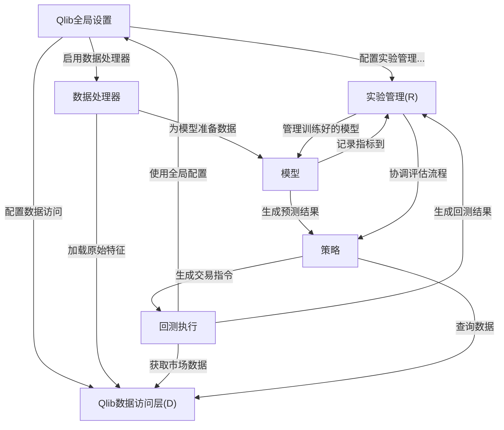
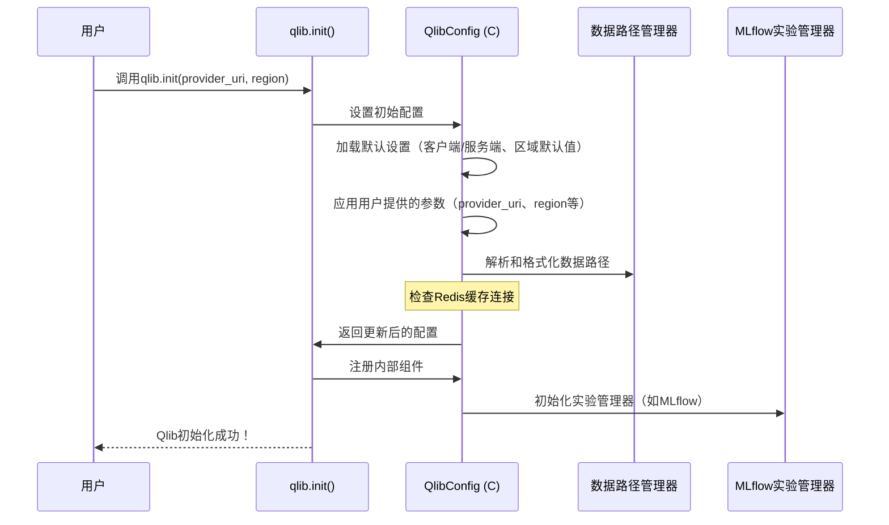

链接：[Qlib Documentation — QLib 0.9.6.99 documentation](https://qlib.readthedocs.io/en/latest/index.html)

# docs：Qlib

Qlib是一个*开源量化投资平台*，旨在==简化金融研究的全流程工作==。

帮助用户配置全局设置，高效*访问和处理多样化金融数据*，开发和*训练预测模型*，实施复杂*交易策略*，并基于历史数据严格*模拟交易活动*。

所有研究实验都会==自动记录和管理==，便于比较、分析和复现。

## 可视化



## 章节

1. [Qlib全局设置](01_qlib_global_setup_.md)
2. [Qlib数据访问层(D)](02_qlib_data_access_layer__d__.md)
3. [数据处理器](03_data_handler_.md)
4. [模型](04_model_.md)
5. [策略](05_strategy_.md)
6. [回测执行](06_backtest_execution_.md)
7. [实验管理(R)](07_experiment_management__r__.md)

---

# 第1章：Qlib全局设置

想象刚购置了一台用于量化金融研究的设备——我们称之为"Qlib研究引擎"。在开始分析股票、运行模拟或测试策略之前，首先需要做什么？你需要进行设置！必须告诉它在哪里获取燃料（金融数据）、在哪个区域运行（如美国市场vs中国市场）以及如何组织操作（比如记录研究实验）。

这个初始配置正是"Qlib全局设置"的核心内容。这是为后续所有量化研究任务准备Qlib的关键第一步。通过从一开始正确设置Qlib，可以确保从数据访问到模型训练和回测的所有组件都能无缝协作。

## 核心：`qlib.init()`

Qlib全局设置的核心是一个特殊函数`qlib.init()`。可以将其视为Qlib研究引擎的主控制面板。调用此函数时，需要传入Qlib开始工作所需的所有关键信息。

让我们逐步了解最常见和重要的设置步骤。

### 步骤1：准备金融数据

Qlib分析数据前，你需要准备好数据！Qlib需要知道这些数据的存储位置。为方便演示，Qlib提供了下载示例数据集的脚本。

首先在终端（非Python环境）运行命令：

```bash
python scripts/get_data.py qlib_data --target_dir ~/.qlib/qlib_data/cn_data --region cn
```

**作用**：
此命令下载中国市场的股票样本数据集（来自Yahoo Finance），存储在`~/.qlib/qlib_data/`下的`cn_data`文件夹中（`--target_dir`）。`~`符号通常指用户主目录，因此在Windows上是`C:\Users\YourUser\.qlib\qlib_data\cn_data`，在Linux/macOS上是`/home/youruser/.qlib/qlib_data/cn_data`。Qlib后续将在此路径查找金融信息。

### 步骤2：在Python中初始化Qlib

下载数据后，可以告诉Qlib数据位置和运行方式。在Python代码中调用`qlib.init()`实现：

```python
import qlib
from qlib.constant import REG_CN # REG_CN表示"中国区域"

# 步骤1中下载数据的路径
data_folder_path = "~/.qlib/qlib_data/cn_data"

# 用数据路径和区域初始化Qlib
qlib.init(provider_uri=data_folder_path, region=REG_CN)
```

**作用**：
1. `import qlib`：将Qlib库导入Python脚本
2. `from qlib.constant import REG_CN`：导入中国区域的预定义常量，使代码更清晰
3. `provider_uri=data_folder_path`：告诉Qlib金融数据的"地址"。Qlib将用此路径加载股价、成交量等市场信息，应与`get_data.py`命令中的`target_dir`一致
4. `region=REG_CN`：配置Qlib为中国股票市场，影响交易规则和节假日等

运行此代码后，Qlib即成功设置！虽然不会有直接输出，但Qlib已根据参数完成自我配置，准备好进行数据访问、构建模型和运行回测。

### 其他重要参数

`qlib.init()`非常灵活，还有其他高级配置参数：

* **`redis_host`和`redis_port`**：Qlib可使用Redis（快速内存数据存储）进行缓存，显著加速大数据集的数据加载和特征计算
  * 如果未运行Redis或Qlib无法连接，将不使用缓存继续运行，这对初学者没问题
* **`exp_manager`**：配置Qlib如何管理研究实验，常用MLflow等工具，对跟踪模型、结果和参数至关重要
  * 将在[实验管理(R)](07_experiment_management__r__.md)深入探讨

## 底层原理：`qlib.init()`如何工作

调用`qlib.init()`不仅是简单函数调用，它还协调了一系列配置步骤。可以视为Qlib内部设置的"指挥中心"。

简化流程如下：



1. **默认值与覆盖**：`qlib.init()`首先加载默认配置集（如"client"或"server"模式），然后用传入的`provider_uri`、`region`等参数*覆盖*这些默认设置
2. **路径解析**：Qlib需要智能处理数据路径。如果`provider_uri`是相对路径（如`~/.qlib/qlib_data/cn_data`），Qlib会解析为系统绝对路径，还能处理不同频率数据（如日线、分钟数据）
3. **服务设置**：基于配置，Qlib设置各种内部服务：
   * **缓存**：检查Redis是否可用，按需配置缓存机制
   * **实验管理**：初始化选择的实验管理器（如MLflow）以跟踪研究
   * **日志**：设置日志级别以查看Qlib的重要消息
   * **市场参数**：应用区域特定交易规则（如最小交易单位、每日涨跌幅限制）

### 代码

`qlib.init()`的核心逻辑位于`qlib/__init__.py`，配置管理由`qlib/config.py`处理。

在`qlib/__init__.py`中，`init`函数协调一切：

```python
# 来自qlib/__init__.py
import qlib.config as C_module # 为解释清晰重命名

def init(default_conf="client", **kwargs):
    # ... 其他代码 ...
    from .config import C # C是全局QlibConfig实例

    # 1. 按需清除内存缓存
    # H.clear() # 简化

    # 2. 更新全局配置对象(C)
    C.set(default_conf, **kwargs)

    # 3. 设置日志级别
    # get_module_logger.setLevel(C.logging_level) # 简化

    # 4. 处理NFS挂载（高级，初学者跳过）
    # ...

    # 5. 注册所有内部组件和服务
    C.register()

    # ... 其他日志 ...
    # logger.info("qlib成功初始化...")
```

`C.set()`调用特别重要，它触发`qlib/config.py`中`QlibConfig`类的配置过程。

`QlibConfig`类管理所有Qlib设置，包含`_default_config`、`MODE_CONF`（用于`client`/`server`模式）和`_default_region_config`。

```python
# 来自qlib/config.py
class QlibConfig(Config):
    # ... __init__和其他方法 ...

    def set_mode(self, mode):
        # 应用"client"或"server"模式特定配置
        self.update(MODE_CONF[mode])

    def set_region(self, region):
        # 应用选定区域（如REG_CN、REG_US）特定配置
        self.update(_default_region_config[region])

    def set(self, default_conf: str = "client", **kwargs):
        # 1. 重置为基础默认值
        self.reset()
        # 2. 应用模式特定配置
        self.set_mode(default_conf)
        # 3. 应用区域特定配置（未指定则默认REG_CN）
        self.set_region(kwargs.get("region", self["region"]))

        # 4. 用qlib.init()的显式参数覆盖
        for k, v in kwargs.items():
            self[k] = v

        # 5. 解析数据路径
        self.resolve_path()

        # 6. 检查Redis缓存连接
        # ... 简化 ...

    def register(self):
        # 实例化和注册实际组件的地方
        # 例如：
        # register_all_ops(self) # 数据操作
        # exp_manager = init_instance_by_config(self["exp_manager"])
        # R.register(QlibRecorder(exp_manager)) # 实验管理
        # ...
        self._registered = True

# 全局QlibConfig实例
C = QlibConfig(_default_config)
```

`数据路径管理器`（嵌套在`QlibConfig`中）负责从`provider_uri`智能推断实际文件路径并确保有效。

### 区域配置

`region`参数至关重要，它使Qlib行为适配特定市场条件。简单比较：

| 参数              | `REG_CN`（中国） | `REG_US`（美国） |
| :---------------- | :--------------- | :--------------- |
| `trade_unit`      | 100股            | 1股              |
| `limit_threshold` | ~9.5%涨跌幅限制  | 无涨跌幅限制     |
| `deal_price`      | 收盘价           | 收盘价           |

如你所见，只需在`qlib.init()`中更改`region`，即可自动调整多项核心设置以匹配分析的市场。

## 总结

`qlib.init()`函数是有效使用Qlib的入口。通过提供`provider_uri`（数据位置）和`region`（所在市场），为所有量化研究任务准备Qlib。它处理数据路径、缓存和实验管理的底层复杂性，让你专注于研究。

现在Qlib研究引擎已正确配置，下一步是了解它如何实际访问和管理指向的金融数据。让我们继续探索[Qlib数据访问层(D)](02_qlib_data_access_layer__d__.md)！

