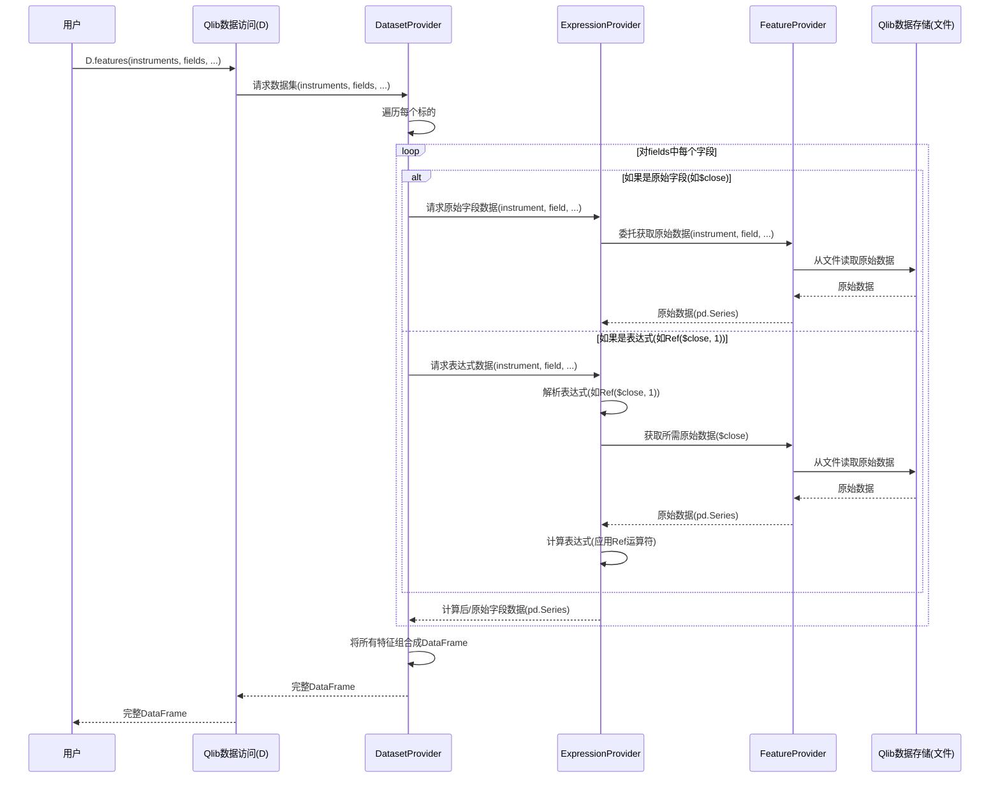

# 第2章：Qlib数据访问层(D)

在[第1章：Qlib全局设置](01_qlib_global_setup_.md)中，我们通过指定金融数据存储位置和关注市场，成功启动了"Qlib研究引擎"。引擎运行后，下一步是什么？我们需要实际*获取*数据！没有相关金融信息，就无法分析股票或构建模型。

这就是"Qlib数据访问层"的用武之地，它以特殊全局对象`D`为代表。将`D`想象成Qlib金融数据图书馆中高效博学的图书管理员。这位管理员不仅能提供原始书籍，还能提取特定章节、整合不同书籍信息，甚至实时计算新洞察。`D`是你查询各类金融数据的主要工具，从简单股价到复杂的衍生特征和市场日历。

## 数据管理员：`D`对象

`D`对象（"Data"缩写）是Qlib中的全局实例，为数据检索提供统一接口。调用`qlib.init()`后，`D`即可响应数据请求。

让我们看看数据管理员`D`的常见任务。

### 1. 查看市场日历

首先可能需要了解交易日。`D.calendar()`可提供帮助。

```python
import qlib
from qlib.constant import REG_CN
import pandas as pd # 用pandas美化输出

# 确保Qlib已初始化！（如第1章所示）
data_folder_path = "~/.qlib/qlib_data/cn_data" # 数据下载路径
qlib.init(provider_uri=data_folder_path, region=REG_CN)

# 向D请求交易日历
# 获取2010年前几个交易日
calendar_days = D.calendar(start_time='2010-01-01', end_time='2010-01-07', freq='day')
print("交易日：")
print(calendar_days)
```

**输出：**
```
交易日：
[Timestamp('2010-01-04 00:00:00'), Timestamp('2010-01-05 00:00:00'),
 Timestamp('2010-01-06 00:00:00'), Timestamp('2010-01-07 00:00:00')]
```
显示2010年1月4日、5日、6日和7日为交易日（跳过周末和节假日）。

### 2. 识别标的（股票）

常需要了解特定市场或指数包含哪些股票。`D.instruments()`和`D.list_instruments()`专为此设计。

```python
# 向D请求'csi300'市场（中国沪深300指数）配置
csi300_config = D.instruments(market='csi300')
print("沪深300市场配置：")
print(csi300_config)

# 列出该市场特定时段内的实际股票代码
# 查看2010年初沪深300成分股
csi300_stocks = D.list_instruments(
    instruments=csi300_config,
    start_time='2010-01-01',
    end_time='2010-01-05',
    as_list=True # 返回简单股票代码列表
)
print("\n前5支沪深300股票（示例）：")
print(csi300_stocks[:5])
```

**输出：**
```
沪深300市场配置：
{'market': 'csi300', 'filter_pipe': []}

前5支沪深300股票（示例）：
['SH600000', 'SH600010', 'SH600011', 'SH600015', 'SH600016'] # 实际列表可能略有不同
```
`D.instruments()`返回*配置*（包含股票的规则），而`D.list_instruments()`应用该规则返回实际股票代码（如平安银行`SH600000`）。

### 3. 获取特征：数据访问核心

这是`D`真正闪耀之处！`D.features()`是获取特定股票、时段金融数据甚至计算复杂指标的首选函数。

获取单支股票的收盘价和成交量。

```python
# 获取'SH600000'（平安银行）2010年1月4日至8日的收盘价和成交量
stock_data = D.features(
    instruments=['SH600000'],
    fields=['$close', '$volume'], # '$'前缀表示原始特征
    start_time='2010-01-04',
    end_time='2010-01-08',
    freq='day'
)
print("\nSH600000收盘价和成交量：")
print(stock_data.to_string())
```

**输出：**
```
                           $close     $volume
instrument datetime
SH600000   2010-01-04  86.778313  16162960.0
           2010-01-05  87.433578  28117442.0
           2010-01-06  85.713585  23632884.0
           2010-01-07  83.788803  20813402.0
           2010-01-08  84.730675  16044853.0
```
注意输出是带`MultiIndex`（`instrument`和`datetime`）的`pandas.DataFrame`，这是Qlib中处理多资产时间序列数据的常用格式。

### 超越原始数据：计算特征

`D.features()`不限于原始数据，还能使用Qlib强大的表达式引擎计算*衍生特征*。可直接在`fields`列表中定义公式！

常见衍生特征是前一日价格。Qlib中`$close`指当日收盘价，`Ref($close, 1)`指**1天前**的收盘价。

```python
# 获取'SH600000'2010年1月4日至8日的当日收盘价和前一日收盘价
derived_data = D.features(
    instruments=['SH600000'],
    fields=['$close', 'Ref($close, 1)'], # 'Ref($close, 1)'是衍生特征
    start_time='2010-01-04',
    end_time='2010-01-08',
    freq='day'
)
print("\nSH600000收盘价和Ref($close, 1)：")
print(derived_data.to_string())
```

**输出：**
```
                           $close  Ref($close, 1)
instrument datetime
SH600000   2010-01-04  86.778313       88.825928  # 2010-01-04的Ref($close, 1)是2010-01-01价格（前一交易日）
           2010-01-05  87.433578       86.778313  # 2010-01-05的Ref($close, 1)是2010-01-04价格
           2010-01-06  85.713585       87.433578  # 2010-01-06的Ref($close, 1)是2010-01-05价格
           2010-01-07  83.788803       85.713585  # 2010-01-07的Ref($close, 1)是2010-01-06价格
           2010-01-08  84.730675       83.788803  # 2010-01-08的Ref($close, 1)是2010-01-07价格
```
注意`Ref($close, 1)`显示*前一交易日*收盘价。首行的`Ref($close, 1)`显示2010年1月4日*之前*的最后一个交易日（1月1日）收盘价。

Qlib提供丰富运算符（`Ref`、`Mean`、`Std`等），可直接在`D.features()`中构建复杂特征。

## 底层原理：`D`如何工作

单个`D`对象如何实现这么多功能？`D`实际上是智能**包装器**，将请求委托给后台的专业"提供者"。想象它是将请求分派给正确部门的图书管理员：

* **CalendarProvider**：管理交易日历
* **InstrumentProvider**：处理股票列表和市场定义
* **FeatureProvider**：访问原始数据字段（如`$close`、`$volume`）
* **ExpressionProvider**：基于公式计算特征（如`Ref($close, 1)`）
* **DatasetProvider**：组合所有内容获取完整数据集（如`D.features()`的返回）

调用`D`的方法时，它会确定哪个专业提供者能处理该请求并进行传递。

调用`D.features()`的简化流程：



### 深入代码

`D`对象及其底层提供者定义在`qlib/data/data.py`。

`D`对象本身是`BaseProvider`实例（若连接Qlib服务器则为`ClientProvider`）：

```python
# 来自qlib/data/data.py（简化）
# D是全局实例，在qlib.init()中配置
D: BaseProviderWrapper = Wrapper() # 'Wrapper'是Qlib工具类
```

`BaseProvider`类调用其他全局提供者对象（如`Cal`、`Inst`、`DatasetD`）的方法，这些也是各自具体提供者实现（如`LocalCalendarProvider`、`LocalDatasetProvider`）的`Wrapper`实例。

例如，`D.features()`内部调用`DatasetD.dataset()`：

```python
# 来自qlib/data/data.py（BaseProvider类，简化）
class BaseProvider:
    def features(
        self,
        instruments,
        fields,
        start_time=None,
        end_time=None,
        freq="day",
        disk_cache=None,
        inst_processors=[],
    ):
        # ... 磁盘缓存逻辑 ...
        return DatasetD.dataset( # <--- D在此委托调用
            instruments, fields, start_time, end_time, freq, inst_processors=inst_processors
        )

# 同文件中定义DatasetD：
DatasetD: DatasetProviderWrapper = Wrapper() # 另一个全局包装器
```

`DatasetD.dataset()`随后协调获取单个特征/表达式：

```python
# 来自qlib/data/data.py（LocalDatasetProvider类，简化）
class LocalDatasetProvider(DatasetProvider):
    # ... __init__方法 ...

    def dataset(
        self,
        instruments,
        fields,
        start_time=None,
        end_time=None,
        freq="day",
        inst_processors=[],
    ):
        # ... 预处理步骤 ...
        data = self.dataset_processor( # <--- 调用静态方法处理标的
            instruments_d, column_names, start_time, end_time, freq, inst_processors=inst_processors
        )
        return data

    @staticmethod
    def inst_calculator(inst, start_time, end_time, freq, column_names, spans=None, g_config=None, inst_processors=[]):
        # 对每个标的执行，通常并行
        obj = dict()
        for field in column_names:
            # ExpressionD.expression()处理原始字段和表达式
            obj[field] = ExpressionD.expression(inst, field, start_time, end_time, freq)
        data = pd.DataFrame(obj)
        # ... 进一步处理 ...
        return data

# ExpressionD是表达式提供者的全局包装器：
ExpressionD: ExpressionProviderWrapper = Wrapper()
```

调用`ExpressionD.expression()`时，首先用`eval()`和`qlib.data.ops`（包含`Feature`、`Ref`等类）解析`field`字符串（如`"$close"`或`"Ref($close, 1)"`）。然后对结果表达式对象调用`load()`方法，递归从`FeatureProvider`获取所需原始数据。

这种模块化设计使Qlib能轻松切换数据源（如本地文件vs远程服务器）或实现自定义缓存策略，而无需改变与`D`对象的交互方式。

## 总结

`D`对象是Qlib中强大、统一的数据访问入口。

通过简单直观的命令，可轻松检索金融数据、查询市场日历、列出标的及计算复杂特征。掌握`D.calendar()`、`D.list_instruments()`和`D.features()`的使用，就能直接控制量化研究所需的金融信息。

了解如何使用`D`==直接访问和获取数据==后，下一步是学习如何为机器学习模型准备这些数据。让我们继续探索[数据处理器](03_data_handler_.md)！

