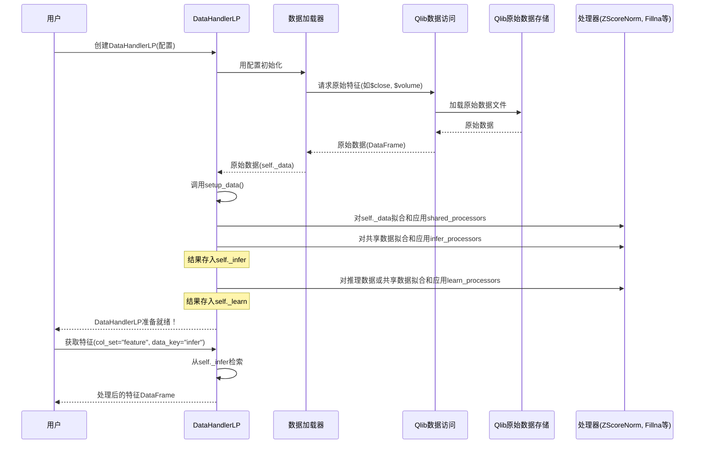

# 第3章：数据处理器

在[第2章：Qlib数据访问层(D)](02_qlib_data_access_layer__d__.md)中，我们学习了如何使用`D`对象访问原始金融数据，如股票收盘价(`$close`)和成交量(`$volume`)

甚至能直接计算简单衍生特征，比如获取昨日价格的`Ref($close, 1)`。

但想象你是一位厨师，原始数据只是基础食材（面粉、鸡蛋、糖）。要烘焙美味蛋糕（你的机器学习模型），不能简单混合原料！你需要：
* 按特定比例调配
* 打发鸡蛋
* 过筛面粉
* 可能还需添加特殊风味

这一整套食材准备流程正是Qlib中"==数据处理器=="的职责。它是专业的厨房助手，负责将原始金融数据转化为干净、==结构化==且特征丰富的数据集，完美适配机器学习模型

## 为什么需要数据处理器？

==机器学习模型（尤其是深度学习模型）对输入数据质量和格式非常敏感==。原始金融数据常存在以下问题：

* **缺失值(NaNs)**：股票停牌或数据未记录的日子
* **异常值**：价格剧烈波动或成交量暴增，可能扭曲模型学习
* **量纲差异**：股价从个位数到上千元不等，而成交量可能达数百万。模型通常偏好相似量纲范围的数据（如0到1之间，或均值为0、标准差为1）
* **复杂特征**：模型可能受益于比原始价格更复杂的特征，如移动平均线、波动率指标或相对强弱指数

数据处理器自动化执行所有这些关键的数据准备步骤。它对原始数据应用一系列"配方"（称为**处理器**），确保模型始终获得最佳"餐食"。

让我们看看Qlib的数据处理器如何实现这一点。

## 数据准备流程

假设要训练模型预测沪深300指数次日走势。模型需要：
1. **特征**：调整后价格、成交量等金融指标，以及历史收益率等计算特征
2. **标签**：模型预测目标变量，如两天后的股票收益率

同时要求数据：
* **清洗过**：无缺失值
* **标准化**：所有特征缩放至相似范围
* **无泄漏**：标准化参数仅从历史数据（"训练期"）学习，再应用于未来数据（"测试期"），避免模型意外获取未来信息

数据处理器处理所有这些需求。

## 数据处理器的核心组件

Qlib数据处理器通常结合两大核心概念：

### 1. 数据加载器（食材采购员）

该组件负责从Qlib数据源实际获取数据。它内部使用`D`对象（第2章已介绍）获取原始特征，甚至计算基础表达式。

Qlib提供强大的`QlibDataLoader`，知晓如何与Qlib数据存储交互并检索指定特征。

### 2. 处理器（烹饪步骤）

这些是应用于数据的独立转换步骤。可视为具体配方："标准化价格"、"填充缺失值"、"去除异常值"。每个`Processor`都是独立操作。

Qlib内置多种处理器：
* `DropnaLabel`：删除标签（预测目标）缺失的行
* `ZScoreNorm`：使用Z-score方法标准化数据（均值0，标准差1）
* `Fillna`：用指定值（如0）填充缺失值(NaNs)
* `CSZScoreNorm`：横截面Z-score标准化（对单日所有股票标准化）
* 还有许多用于鲁棒缩放、tanh变换等的处理器

关键点在于部分处理器是"可学习的"

例如`ZScoreNorm`需要从训练数据中*学习*均值和标准差，然后*应用*这些学习参数到新数据（如测试或推理数据）而不重新计算。这是防止**数据泄漏**的关键。

### 用`DataHandlerLP`编排流程

整合这些组件的核心类是`qlib.data.dataset.handler.DataHandlerLP`（LP代表"可学习处理器"）。此类充当"主厨"角色：
* 使用`data_loader`获取原始数据
* 分别定义`infer_processors`（实时推理/预测数据）和`learn_processors`（模型训练数据）列表
* 管理处理器学习参数的时间段（`fit_start_time`，`fit_end_time`）
* 编排这些处理器的应用流程

对初学者，Qlib提供预构建的数据处理器如`Alpha158`和`Alpha360`（名称源于量化金融常见alpha因子），包含预定义特征集和处理器，让入门变得极其简单

## 使用预构建数据处理器(`Alpha158`)

让我们用`Alpha158`数据处理器准备模型数据。

首先确保Qlib已初始化（如第1、2章所示）：

```python
import qlib
from qlib.constant import REG_CN
from qlib.contrib.data.handler import Alpha158 # 导入Alpha158处理器

# 初始化Qlib（假设数据已下载到此路径）
data_folder_path = "~/.qlib/qlib_data/cn_data"
qlib.init(provider_uri=data_folder_path, region=REG_CN)
```
**作用**：
从`qlib.contrib.data.handler`导入`Alpha158`。这是预配置的数据处理器，已知如何==加载158个常见特征并应用标准预处理==。然后初始化Qlib指向下载的数据。

现在配置并实例化`Alpha158`：

```python
# 1. 定义数据处理器配置
data_handler_config = {
    "start_time": "2010-01-01",  # 数据获取的起始时间
    "end_time": "2021-01-22",    # 数据获取的结束时间
    "fit_start_time": "2010-01-01", # 处理器学习参数的起始时间
    "fit_end_time": "2015-12-31",  # 处理器学习参数的结束时间
    "instruments": "csi300",     # 考虑的股票池（沪深300指数成分股）
}

# 2. 创建Alpha158数据处理器实例
handler = Alpha158(**data_handler_config)

print("数据处理器初始化成功！")
```
**作用**：

* `start_time`和`end_time`：指定数据处理器获取数据的总时间段
* `fit_start_time`和`fit_end_time`：关键配置！告知"可学习"处理器（如`ZScoreNorm`）*仅*从此特定训练期数据计算参数（均值、标准差）。防止测试期数据**泄漏**
* `instruments`：让处理器仅关注'csi300'市场的股票
* `handler = Alpha158(...)`：创建数据处理器实例。后台已加载数据并应用配置的处理器

创建`handler`后，数据已完成处理并内部存储。可`fetch`获取不同部分的处理后数据：

```python
# 3. 获取所有列名（特征和标签）
all_columns = handler.get_cols()
print("\n前10列（特征和标签）：")
print(all_columns[:10])

# 4. 获取标签数据（模型预测目标）
labels_df = handler.fetch(col_set="label", start_time="2020-01-01", end_time="2020-01-05")
print("\n标签样本（2020-01-01至2020-01-05）：")
print(labels_df.to_string())

# 5. 获取特征数据（模型输入）
features_df = handler.fetch(col_set="feature", start_time="2020-01-01", end_time="2020-01-05")
print("\nSH600000特征样本（2020-01-01至2020-01-05）：")
print(features_df.loc(axis=0)["SH600000"].head().to_string())
```

**输出（实际输出可能因数据更新略有不同）**：

```
数据处理器初始化成功！

前10列（特征和标签）：
['FEATURE0', 'FEATURE1', 'FEATURE2', 'FEATURE3', 'FEATURE4', 'FEATURE5', 'FEATURE6', 'FEATURE7', 'FEATURE8', 'FEATURE9']

标签样本（2020-01-01至2020-01-05）：
                           LABEL0
instrument datetime
SH600000   2020-01-02 -0.007629
           2020-01-03 -0.016399
SH600004   2020-01-02 -0.009949
           2020-01-03 -0.012586
...

SH600000特征样本（2020-01-01至2020-01-05）：
                FEATURE0  FEATURE1  FEATURE2  FEATURE3  FEATURE4  FEATURE5  FEATURE6  FEATURE7  FEATURE8  FEATURE9
datetime
2020-01-02      -0.0186   -0.0135   -0.0137   -0.0179   -0.0186   -0.0135   -0.0137   -0.0179   -0.0186   -0.0135
2020-01-03      -0.0199   -0.0130   -0.0123   -0.0177   -0.0199   -0.0130   -0.0123   -0.0177   -0.0199   -0.0130
```
**作用**：

* `handler.get_cols()`：返回处理后数据集的所有列名。`Alpha158`使用通用名称如`FEATURE0`、`FEATURE1`等表示特征，`LABEL0`表示目标
* `handler.fetch(col_set="label", ...)`：获取特定时间范围内的`label`列（预测目标）
* `handler.fetch(col_set="feature", ...)`：获取特定时间范围内的`feature`列（模型输入）

注意特征已从原始`$close`或`$volume`转换为`FEATURE0`、`FEATURE1`等，并如小数值所示已完成==标准化==。标签也是标准化收益率。此==数据现已完美格式化供模型使用==。

## 原理：数据处理器工作流

创建并使用`DataHandlerLP`（如`Alpha158`）时，它协调复杂但逻辑清晰的步骤序列：



**逐步说明**：

1. **初始化**：创建`Alpha158(...)`时调用`DataHandlerLP`的`__init__`方法
2. **数据加载**：`__init__`中初始化`数据加载器`（如`QlibDataLoader`）。该加载器调用`D.features()`（第2章）获取配置中指定的所有原始金融数据和基础衍生特征。原始数据存储为`self._data`
3. **处理器配置**：`Alpha158`（或任何`DataHandlerLP`子类）预定义`infer_processors`和`learn_processors`，实例化为`Processor`对象
4. **拟合处理器**：调用`setup_data()`方法。对每个"可学习"处理器（如`ZScoreNorm`），用`self._data`中`fit_start_time`和`fit_end_time`范围内的数据调用其`fit()`方法。此处计算参数（如均值/标准差）
5. **应用处理器**：`fit()`后（如适用），调用每个处理器的`__call__()`方法转换数据。依次对`shared_processors`、`infer_processors`（创建`self._infer`）和`learn_processors`（创建`self._learn`）重复此过程
   * `self._infer`存储用于推理（如实时预测）的处理后数据
   * `self._learn`存储用于模型训练的处理后数据，可能包含额外处理步骤（如删除标签缺失的样本）
6. **获取数据**：调用`handler.fetch(col_set="feature", data_key="infer")`时，`DataHandlerLP`简单检索预处理的`self._infer` DataFrame，过滤返回指定时间范围的特征列

这种模块化设计意味着一旦数据处理器初始化，它已高效准备所有必要数据，模型可快速获取用于训练或推理。

### 代码

`Alpha158`类（位于`qlib/contrib/data/handler.py`）继承自`DataHandlerLP`，定义其特定的`data_loader`配置、`infer_processors`和`learn_processors`。

```python
# 来自qlib/contrib/data/handler.py（简化）
class Alpha158(DataHandlerLP):
    def __init__(
        self,
        instruments="csi500",
        start_time=None,
        end_time=None,
        freq="day",
        infer_processors=[], # 推理数据的处理器列表
        learn_processors=_DEFAULT_LEARN_PROCESSORS, # 训练数据的处理器列表
        fit_start_time=None,
        fit_end_time=None,
        # ... 其他参数 ...
    ):
        # ... 处理器验证 ...

        data_loader = { # 数据加载器配置
            "class": "QlibDataLoader",
            "kwargs": {
                "config": {
                    "feature": self.get_feature_config(), # Alpha158特定特征集
                    "label": kwargs.pop("label", self.get_label_config()), # Alpha158特定标签
                },
                # ... 其他data_loader参数 ...
            },
        }
        super().__init__(
            instruments=instruments,
            start_time=start_time,
            end_time=end_time,
            data_loader=data_loader,
            infer_processors=infer_processors,
            learn_processors=learn_processors,
            # ... 传递给DataHandlerLP的其他参数 ...
        )

    def get_feature_config(self):
        # 将158个特征定义为Qlib表达式
        # ... 返回表达式字典 ...
        pass

    def get_label_config(self):
        # 将标签定义为Qlib表达式
        return ["Ref($close, -2)/Ref($close, -1) - 1"], ["LABEL0"]
```
**代码片段说明**：
* `Alpha158`以`DataHandlerLP`为基类
* 明确定义`infer_processors`和`learn_processors`（默认`Alpha158`对标签使用`CSZScoreNorm`，对`learn_processors`使用`DropnaLabel`）
* 设置带独特`feature`和`label`配置的`QlibDataLoader`（转换为`D.features()`调用）
* `super().__init__(...)`调用将所有配置传递给父类`DataHandlerLP`

`DataHandlerLP`类本身（位于`qlib/data/dataset/handler.py`）包含管理和应用处理器的核心逻辑：

```python
# 来自qlib/data/dataset/handler.py（简化）
class DataHandlerLP(DataHandler):
    _data: pd.DataFrame # 原始数据
    _infer: pd.DataFrame # 推理用处理数据
    _learn: pd.DataFrame # 训练用处理数据

    def __init__(self, data_loader, infer_processors, learn_processors, shared_processors, **kwargs):
        # ... 处理器初始化 ...
        super().__init__(data_loader=data_loader, **kwargs) # 调用父类DataHandler.__init__
        # 将调用self.setup_data()

    def setup_data(self, init_type: str = IT_FIT_SEQ, **kwargs):
        # 1. 用data_loader加载原始数据
        super().setup_data(**kwargs) # 设置self._data

        # 2. 用定义处理器拟合和处理数据
        if init_type == DataHandlerLP.IT_FIT_SEQ:
            self.fit_process_data() # 编排运行所有处理器的方法
        # ... 其他init_types ...

    def fit_process_data(self):
        # 管理处理器应用流程
        # 调用_run_proc_l处理shared、infer和learn处理器
        # ... 简化逻辑 ...
        _shared_df = self._run_proc_l(self._data, self.shared_processors, with_fit=True, check_for_infer=True)
        self._infer = self._run_proc_l(_shared_df.copy(), self.infer_processors, with_fit=True, check_for_infer=True)
        self._learn = self._run_proc_l(self._infer.copy(), self.learn_processors, with_fit=True, check_for_infer=False)
        # ... 结束简化逻辑 ...

    @staticmethod
    def _run_proc_l(df: pd.DataFrame, proc_l: List[Processor], with_fit: bool, check_for_infer: bool) -> pd.DataFrame:
        # 遍历处理器列表
        for proc in proc_l:
            if with_fit:
                proc.fit(df) # 从数据学习参数
            df = proc(df) # 应用转换
        return df

    def fetch(self, data_key: DATA_KEY_TYPE = DataHandlerLP.DK_I, **kwargs) -> pd.DataFrame:
        # 根据data_key从_infer或_learn检索数据
        df = getattr(self, self.ATTR_MAP[data_key]) # 获取_infer或_learn
        return self._fetch_data(data_storage=df, **kwargs)
```
**代码片段说明**：
* `DataHandlerLP`存储原始数据(`_data`)和两个处理后版本(`_infer`, `_learn`)
* `setup_data()`是触发整个数据加载和处理流程的入口
* `fit_process_data()`中`_run_proc_l`静态方法被重复调用，依次应用`shared`、`infer`和`learn`处理器
* `_run_proc_l`是辅助方法，遍历处理器列表，按需调用`fit()`和`__call__()`
* `fetch()`方法提供便捷方式获取已处理的`_infer`或`_learn` DataFrame

示例处理器如`ZScoreNorm`（来自`qlib/data/dataset/processor.py`）：

```python
# 来自qlib/data/dataset/processor.py（简化）
class ZScoreNorm(Processor):
    def __init__(self, fit_start_time, fit_end_time, fields_group=None):
        self.fit_start_time = fit_start_time
        self.fit_end_time = fit_end_time
        self.fields_group = fields_group
        self.mean_train = None # fit()期间学习
        self.std_train = None  # fit()期间学习

    def fit(self, df: pd.DataFrame = None):
        # 从拟合期选择数据
        df_fit_period = df.loc[self.fit_start_time:self.fit_end_time]
        cols = self.fields_group # 获取需标准化的列
        self.mean_train = np.nanmean(df_fit_period[cols].values, axis=0)
        self.std_train = np.nanstd(df_fit_period[cols].values, axis=0)
        # ... 处理std_train == 0防止除零错误 ...

    def __call__(self, df: pd.DataFrame):
        # 应用学习的均值和标准差标准化数据
        cols = self.fields_group
        df.loc(axis=1)[cols] = (df[cols].values - self.mean_train) / self.std_train
        return df
```
**代码片段说明**：
* `ZScoreNorm`处理器在构造函数中接受`fit_start_time`和`fit_end_time`
* `fit()`方法*仅*从指定拟合期数据计算`mean_train`和`std_train`
* `__call__()`方法使用这些*学习*的`mean_train`和`std_train`值标准化输入DataFrame `df`，确保不同时间段的一致性，防止数据泄漏

## 总结

数据处理器是Qlib中强大且关键的组件，用于量化研究。

它==自动化执行数据准备的复杂关键任务==，将原始金融数据转化为干净、==标准化==且特征丰富的数据集。通过利用数据处理器（尤其是==预构建==的如`Alpha158`），可确保机器学习模型获得高质量输入，专注于模型开发而非繁琐的数据整理。

现在数据已完美准备就绪，下一步是深入==构建和定义机器学习==[模型](04_model_.md)
