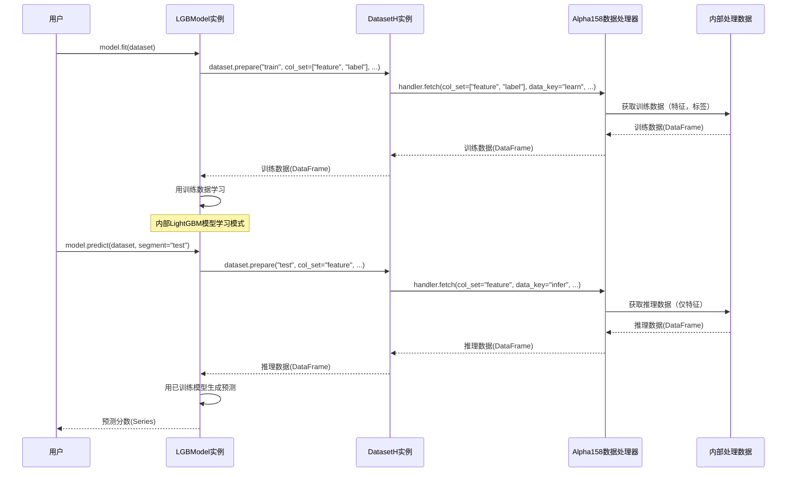

# 第4章：模型

在[第3章：数据处理器](03_data_handler_.md)中，我们学习了如何将原始金融数据转化为干净、标准化且特征丰富的数据集，为机器学习模型做好完美准备。现在所有食材已精心切配、混合完毕，整装待发。量化研究厨房的下一步是什么？是时候构建从数据中学习的"大脑"了——**模型**。

Qlib中的"模型"抽象是任何预测或分析引擎的蓝图。将其视为精密科学仪器：输入历史数据后，它会**学习**数据中的复杂模式和关系（称为`fit`）。学习完成后，这台校准好的仪器就能用于对新观测值或未来**预测**（`predict`）。

Qlib提供所有模型继承的基类，确保无论是简单线性回归还是复杂深度学习架构，都能以统一方式交互。

## 预测大脑：`Model`

模型的核心目的是从预处理数据中学习并生成预测。以下是Qlib中这一流程的工作原理。

### 1. 模型核心方法：`fit`与`predict`

Qlib中所有模型无论复杂度如何，都必须实现两个基础方法：

* **`fit(dataset)`**：模型从此方法提供的`dataset`历史数据中"学习"。它接收准备好的特征和对应标签（需预测的目标），调整内部参数以发现模式。
* **`predict(dataset, segment)`**：模型`fit`后，此方法用于生成新预测。提供`dataset`（通常是"测试"或"验证"段），输出该数据的预测结果。

### 2. Qlib模型库：开箱即用模型

Qlib自带"模型库"——包含常用预测模型如LightGBM、MLP（多层感知机）、LSTM（长短期记忆网络）等。这些预建模型是优秀基线，非常适合快速上手。

我们以`LGBModel`（轻量梯度提升机模型）为例，演示其速度和准确性优势。

## 使用模型：训练与预测

首先确保Qlib已初始化且数据处理器设置完成（同前几章）。

```python
import qlib
from qlib.constant import REG_CN
from qlib.contrib.model.gbdt import LGBModel # 导入LightGBM模型
from qlib.contrib.data.handler import Alpha158 # 导入Alpha158数据处理器
from qlib.data.dataset import DatasetH # 导入连接数据与模型的DatasetH
from qlib.utils import init_instance_by_config # 创建对象的工具函数

# 1. 初始化Qlib（同第1章）
data_folder_path = "~/.qlib/qlib_data/cn_data"
qlib.init(provider_uri=data_folder_path, region=REG_CN)
```
**作用**：
导入必要Qlib组件。`LGBModel`是选择的预测模型，`Alpha158`（来自[第3章：数据处理器](03_data_handler_.md)）准备特征和标签，`DatasetH`作为适配器组织处理器数据供模型使用。

接着实例化`Alpha158`数据处理器并用`DatasetH`包装。`DatasetH`将数据分段（训练、验证、测试）供模型使用。

```python
# 2. 准备数据处理器（同第3章）
data_handler_config = {
    "start_time": "2010-01-01",
    "end_time": "2021-01-22",
    "fit_start_time": "2010-01-01", # 处理器学习参数的时间段
    "fit_end_time": "2015-12-31",
    "instruments": "csi300",
}
handler = Alpha158(**data_handler_config)

# 3. 从处理器创建DatasetH实例
# 将处理后的数据组织为训练、验证和测试集
dataset = DatasetH(
    handler=handler,
    segments={
        "train": ("2010-01-01", "2015-12-31"), # 模型训练数据
        "valid": ("2016-01-01", "2016-12-31"), # 模型验证数据（调优超参数）
        "test": ("2017-01-01", "2017-03-31"),   # 最终预测评估数据
    },
)
print("数据处理器与数据集准备完毕！")
```
**作用**：
配置并创建`Alpha158`数据处理器（同[第3章：数据处理器](03_data_handler_.md)），用`DatasetH`包装此`handler`，定义训练、验证和测试的`segments`时间分段。`dataset`对象将传递给模型。

现在创建LightGBM模型并训练

```python
# 4. 初始化模型
# 使用init_instance_by_config标准化创建Qlib对象
model_config = {
    "class": "LGBModel",
    "module_path": "qlib.contrib.model.gbdt",
    "kwargs": {
        "loss": "mse",              # 均方误差作为损失函数
        "num_threads": 1,           # 本例简化使用单线程
        "num_boost_round": 50,      # 提升轮次（树数量）
        "early_stopping_rounds": 10,# 验证性能10轮未改善则停止
    },
}
model = init_instance_by_config(model_config)
print("\nLGBModel初始化完成！")

# 5. 用'fit'方法训练模型
print("训练模型中...")
model.fit(dataset) # 模型从数据集'train'和'valid'段学习
print("模型训练完成！")
```
**作用**：
* 定义字典`model_config`指定模型。Qlib常用此配置字典格式，尤其运行工作流时。
* `init_instance_by_config()`根据配置创建对象（此处为`LGBModel`）。
* `model.fit(dataset)`：魔法发生之处！`LGBModel`用`dataset`的"train"和"valid"段学习特征到标签的映射模式。训练时打印进度信息。

训练完成后，用`predict`方法获取未见数据的预测。

```python
# 6. 用'predict'方法在测试集生成预测
print("\n在测试集生成预测...")
predictions = model.predict(dataset, segment="test") # 预测'test'段
print("预测样本（前5个）：")
print(predictions.head().to_string())
```

**输出（实际值可能不同）**：

```
数据处理器与数据集准备完毕！

LGBModel初始化完成！

训练模型中...
[LightGBM] [Info] 自动选择列并行多线程，测试开销为0.003936秒。
...（LightGBM训练日志）...
[LightGBM] [Info] 0.001905秒内完成50叶子学习
模型训练完成！

在测试集生成预测...
预测样本（前5个）：
instrument datetime
SH600000   2017-01-03   -0.002874
           2017-01-04   -0.003501
           2017-01-05   -0.003182
           2017-01-06   -0.002995
           2017-01-09   -0.002801
SH600004   2017-01-03   -0.001563
...
```
**作用**：
* `model.predict(dataset, segment="test")`：调用`predict`方法，要求对`dataset`的"test"段数据生成预测。
* `predictions`变量现为`pandas.Series`对象，索引是`instrument`和`datetime`的`MultiIndex`，值为模型对每个股票每个测试日的预测未来收益率。这就是"科学仪器"的输出！

这些预测分数通常代表模型对标的的评级。分数越高，预期收益越高。

## 底层原理：模型与数据交互

调用`model.fit(dataset)`或`model.predict(dataset)`时，模型不直接与原始文件或`D`对象交互，而是==依赖`DatasetH`对象（包装`DataHandler`）提供正确格式的数据==。

以下是模型训练（`fit`）和预测（`predict`）的简化流程：



**逐步说明**：

1. **`model.fit(dataset)`**:
   * 调用`LGBModel`的`fit`方法。
   * `fit`内部要求`dataset`准备"train"段数据。
   * `DatasetH`让底层`DataHandler`获取`col_set=["feature", "label"]`且`data_key="learn"`的数据。`learn`确保获取专为训练预处理的数据（如删除缺失标签行）。
   * `DataHandler`从内部存储获取已处理数据（特征和标签）。
   * 处理后的训练数据返回给`LGBModel`。
   * `LGBModel`用此数据训练内部LightGBM模型。

2. **`model.predict(dataset, segment="test")`**:
   * 调用`LGBModel`的`predict`方法。
   * `predict`内部要求`dataset`准备"test"段数据。
   * `DatasetH`让`DataHandler`获取`col_set="feature"`且`data_key="infer"`的数据。`infer`确保获取推理专用数据（仅特征），可能与训练数据预处理不同。
   * `DataHandler`从内部存储获取已处理特征数据。
   * 处理后的特征数据返回给`LGBModel`。
   * `LGBModel`用*已训练*模型生成测试数据预测分数。
   * 预测分数返回给用户。

这种关注点分离意味着`Model`无需关心数据加载、清洗或特征工程，只需专注于从`DatasetH`和`DataHandler`提供的完美数据中学习和预测。

### 代码

基础`Model`接口定义于`qlib/model/base.py`，具体实现如`LGBModel`在`qlib/contrib/model/gbdt.py`。

`qlib/model/base.py`中的`Model`基类简化如下：

```python
# 来自qlib/model/base.py（简化）
import abc
from typing import Text, Union
from ..utils.serial import Serializable
from ..data.dataset import Dataset # 示例中的DatasetH

class BaseModel(Serializable, metaclass=abc.ABCMeta):
    @abc.abstractmethod
    def predict(self, *args, **kwargs) -> object:
        pass

class Model(BaseModel):
    @abc.abstractmethod
    def fit(self, dataset: Dataset):
        # 所有模型必须实现fit方法
        raise NotImplementedError()

    @abc.abstractmethod
    def predict(self, dataset: Dataset, segment: Union[Text, slice] = "test") -> object:
        # 所有模型必须实现predict方法
        raise NotImplementedError()

class ModelFT(Model): # 可微调模型
    @abc.abstractmethod
    def finetune(self, dataset: Dataset):
        # 支持微调的模型实现此方法
        raise NotImplementedError()
```
**代码片段说明**：
* `Model`是`abstract`类，不能直接实例化。
* 定义`fit`和`predict`为`abstractmethod`，强制继承类（如`LGBModel`）实现这些方法。

`LGBModel`（`qlib/contrib/model/gbdt.py`）简化实现：

```python
# 来自qlib/contrib/model/gbdt.py（简化）
import pandas as pd
import lightgbm as lgb
from ...model.base import ModelFT # 继承自ModelFT（继承自Model）
from ...data.dataset import DatasetH
from ...data.dataset.handler import DataHandlerLP # 访问数据键

class LGBModel(ModelFT):
    def __init__(self, loss="mse", early_stopping_rounds=50, num_boost_round=1000, **kwargs):
        self.params = {"objective": loss, "verbosity": -1}
        self.params.update(kwargs)
        self.early_stopping_rounds = early_stopping_rounds
        self.num_boost_round = num_boost_round
        self.model = None # 存储训练好的LightGBM模型

    def fit(self, dataset: DatasetH, **kwargs):
        # 1. 为LightGBM准备数据
        df_train = dataset.prepare("train", col_set=["feature", "label"], data_key=DataHandlerLP.DK_L)
        df_valid = dataset.prepare("valid", col_set=["feature", "label"], data_key=DataHandlerLP.DK_L)

        x_train, y_train = df_train["feature"], df_train["label"]
        x_valid, y_valid = df_valid["feature"], df_valid["label"]

        # 2. 创建LightGBM Dataset对象
        lgb_train = lgb.Dataset(x_train.values, label=y_train.values.squeeze())
        lgb_valid = lgb.Dataset(x_valid.values, label=y_valid.values.squeeze())

        # 3. 训练LightGBM模型
        self.model = lgb.train(
            self.params,
            lgb_train,
            num_boost_round=self.num_boost_round,
            valid_sets=[lgb_train, lgb_valid],
            valid_names=["train", "valid"],
            callbacks=[lgb.early_stopping(self.early_stopping_rounds)]
        )

    def predict(self, dataset: DatasetH, segment: str = "test"):
        if self.model is None:
            raise ValueError("模型尚未训练！")

        # 1. 准备预测用特征数据
        x_test = dataset.prepare(segment, col_set="feature", data_key=DataHandlerLP.DK_I)

        # 2. 用训练好的LightGBM模型预测
        predictions_array = self.model.predict(x_test.values)

        # 3. 返回带正确索引的pandas Series
        return pd.Series(predictions_array, index=x_test.index)
```
**代码片段说明**：
* `__init__`中，`LGBModel`设置LightGBM参数并初始化`self.model`为`None`。
* `fit()`用`dataset.prepare()`获取训练和验证特征（`x_train`, `x_valid`）及标签（`y_train`, `y_valid`），转为`lgb.Dataset`对象供LightGBM使用，训练`lightgbm.Booster`模型并存入`self.model`。
* `predict()`同样用`dataset.prepare()`获取需预测段（如"test"）的特征，调用`self.model.predict()`生成预测，包装为带`MultiIndex`的`pandas.Series`返回。

此实现直接满足`qlib.model.base.Model`定义的抽象方法，展示Qlib模块化设计如何确保不同模型类型的一致性。

## 总结

`Model`抽象是Qlib量化研究的"大脑"。==通过`fit`方法从历史数据学习，通过`predict`方法生成预测==。利用Qlib的`Model`接口及其丰富模型库，可快速实现和测试多种预测方法。

现在有了能生成预测的模型，下一步自然是将这些==预测转化为可执行的交易决策==。让我们继续探索[策略](05_strategy_.md)！

