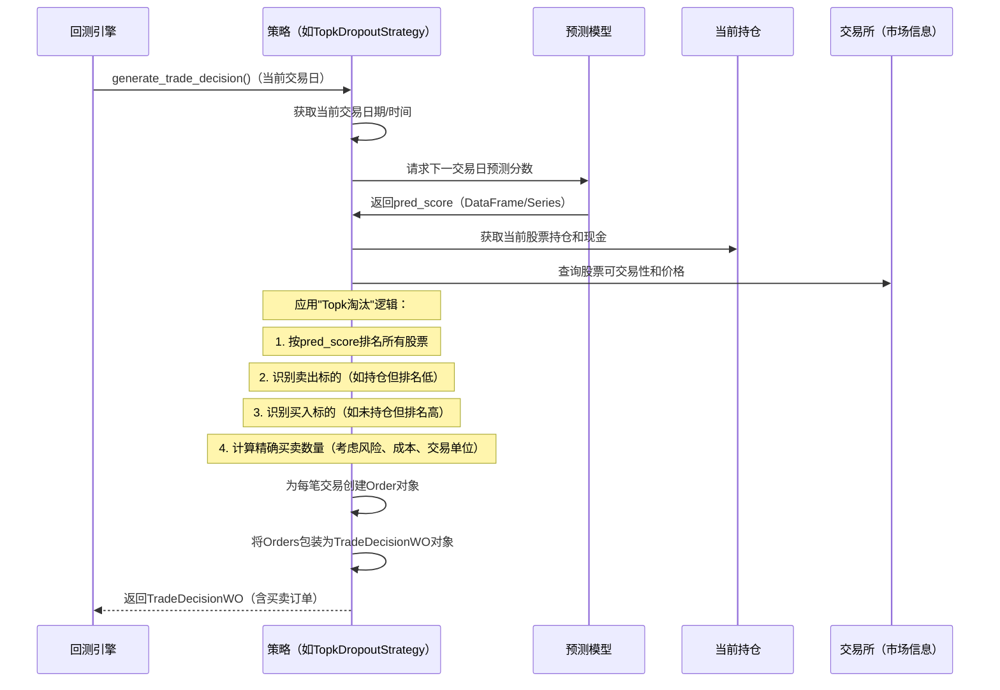

# 第5章：策略

在[第4章：模型](04_model_.md)中，我们成功训练了机器学习模型并生成预测。

这些预测通常是分数（如-0.5或0.8），表示股票价格可能的变动幅度或预期表现。但这些数字如何转化为实际交易？显然不能直接把`0.8`发给股票市场并期待交易

这时就需要"策略"。

将策略视为量化投资系统的**决策大脑**：它接收模型的原始预测（如"该股票分数高，可能上涨"），转化为具体的可执行交易指令（如"买入100股A股票"、"卖出所有B股票"）。

策略需考虑许多现实因素：
* **风险容忍度**：总资金中愿意分配多少给单只股票或股票组合？
* **组合分配**：应持有多少不同股票？每只股票占组合的比例？
* **交易成本**：买卖股票会产生费用（佣金、滑点）。智能策略需最小化这些成本。
* **市场条件**：股票今日是否可交易？当前价格多少？

通过整合这些考量，策略精确决定*交易标的*、*执行时机*和*交易数量*，以实现特定投资目标

## 决策大脑：`Strategy`

Qlib策略的核心是处理预测信号和当前市场条件，输出交易订单列表。

### 1. 策略核心方法：`generate_trade_decision`

Qlib中所有策略必须实现一个核心方法：

* **`generate_trade_decision(execute_result)`**：回测引擎（见[第6章：回测执行](06_backtest_execution_.md)）在每个交易日或间隔重复调用此方法。它基于最新市场信息、当前持仓和模型预测决定交易，返回包含具体`Order`指令的"交易决策"对象

### 2. Qlib策略类型：`BaseStrategy`与`WeightStrategyBase`

Qlib提供策略类的层级结构：

* **`BaseStrategy`**：最基础的抽象类。所有自定义策略必须继承此类并实现`generate_trade_decision`。它提供对`trade_position`（当前持仓和现金）和`trade_exchange`（价格、可交易性等市场详情）等重要信息的访问。

* **`WeightStrategyBase`**：`BaseStrategy`的常用子类，专注于**目标组合权重**。无需直接创建买卖订单，只需告诉`WeightStrategyBase`"希望组合中X股票占5%，Y股票占3%等"，它会自动计算达到目标权重所需的买卖订单。额外抽象方法：
    * **`generate_target_weight_position(score, current, trade_start_time, trade_end_time)`**：定义如何根据模型`score`（预测）和`current`持仓计算每只股票的期望权重。

Qlib为初学者提供开箱即用的预建策略，如流行的`TopkDropoutStrategy`。

## 使用预建策略：`TopkDropoutStrategy`

以常见策略**"Top-K淘汰"**为例：
1. **持有`Topk`股票**：维持一个组合，例如模型预测排名前50的股票。
2. **淘汰`N_drop`股票**：每个交易日，若当前持仓股票跌出表现最佳行列（且是当前组合中最差的`N_drop`只），则卖出。
3. **买入`N_drop`股票**：为维持`Topk`目标，买入当前排名最高且未持有的股票。

此策略旨在通过管理换手率保持组合由高表现股票组成。

首先确保Qlib已初始化且模型预测就绪。此处用模拟`pred_score`聚焦策略部分。

```python
import qlib
import pandas as pd
from qlib.constant import REG_CN
from qlib.contrib.strategy import TopkDropoutStrategy
from qlib.backtest.decision import Order, OrderDir, TradeDecisionWO # 理解输出
from qlib.backtest.position import Position # 模拟当前持仓
from qlib.backtest.utils import TradeCalendarManager # 模拟交易日历
from qlib.backtest.exchange import Exchange # 模拟交易所

# 1. 初始化Qlib（同第1章）
data_folder_path = "~/.qlib/qlib_data/cn_data"
qlib.init(provider_uri=data_folder_path, region=REG_CN)
```
**作用**：
导入`TopkDropoutStrategy`和Qlib其他必要类。初始化Qlib并指向数据。

接着需要一些预测分数。实际场景中这些来自训练好的[模型](04_model_.md)。本例创建模拟预测分数DataFrame。

```python
# 2. 模拟预测分数（通常来自模型）
# 这是带MultiIndex(datetime, instrument)和'score'列的pandas Series
pred_score_data = {
    ('2021-01-04', 'SH600000'): 0.85,
    ('2021-01-04', 'SH600001'): 0.10,
    ('2021-01-04', 'SH600002'): 0.92,
    ('2021-01-04', 'SH600003'): -0.20,
    ('2021-01-04', 'SH600004'): 0.70,
    ('2021-01-04', 'SH600005'): 0.05,
}
mock_pred_score = pd.Series(pred_score_data).unstack(level='instrument')
mock_pred_score.index = pd.to_datetime(mock_pred_score.index)
mock_pred_score.columns.name = None
mock_pred_score = mock_pred_score.stack().to_frame("score")
print("2021-01-04的模拟预测分数：")
print(mock_pred_score.to_string())
```
**输出**：
```
2021-01-04的模拟预测分数：
                           score
datetime   instrument
2021-01-04 SH600000        0.85
           SH600001        0.10
           SH600002        0.92
           SH600003       -0.20
           SH600004        0.70
           SH600005        0.05
```
**作用**：
创建`mock_pred_score`，格式为Qlib策略预期的`MultiIndex` `(datetime, instrument)`和`score`列，代表模型对某日各股票的预测。

现在配置并实例化`TopkDropoutStrategy`，观察其生成的交易决策。为在完整回测外测试，需模拟`TopkDropoutStrategy`依赖的一些Qlib内部对象。

```python
# 3. 为策略模拟Qlib内部组件
# 实际回测中这些由Qlib框架提供
mock_trade_date = pd.Timestamp('2021-01-04')
mock_exchange = Exchange(freq='day', limit_threshold=0.095, deal_price='close')
mock_position = Position(cash=1000000.0, stock_value={}, current_kdata={'SH600000': 1000, 'SH600001': 500})
# 假设当前持有SH600000和SH600001
mock_position.add_stock(stock_id='SH600000', amount=1000, price=100.0, stock_value_pre=1000*100)
mock_position.add_stock(stock_id='SH600001', amount=500, price=50.0, stock_value_pre=500*50)

# 4. 实例化TopkDropoutStrategy
strategy_config = {
    "topk": 3,      # 持有前3名股票
    "n_drop": 1,    # 每日淘汰1只股票（并买入1只）
    "signal": mock_pred_score, # 预测分数
}
strategy = TopkDropoutStrategy(
    trade_exchange=mock_exchange,
    common_infra={"trade_account": {"current_position": mock_position}},
    level_infra={"trade_calendar": TradeCalendarManager(start_time=mock_trade_date, end_time=mock_trade_date, freq='day')},
    **strategy_config
)
print("\nTopkDropoutStrategy初始化完成！")

# 5. 模拟调用generate_trade_decision
# 回测中自动调用，此处模拟其输出
# 基于mock_pred_score、Topk=3、N_drop=1和当前持仓(SH600000, SH600001)：
# 排名：SH600002(0.92)、SH600000(0.85)、SH600004(0.70)、SH600001(0.10)、SH600005(0.05)、SH600003(-0.20)
# 前3名：SH600002、SH600000、SH600004
# 当前持仓：SH600000(0.85)、SH600001(0.10)
# 为达到Top3：
# 卖出：SH600001（持仓中表现最差且不在前3）
# 买入：SH600002（未持仓中表现最佳）
# 策略会调整SH600000数量以维持总topk数量

# 直接调用generate_trade_decision较复杂，因其依赖完整回测环境更新持仓和交易所状态
# 此处描述策略逻辑
print("\n--- 策略对2021-01-04的模拟决策（Topk=3, N_drop=1）---")
print("预期卖出订单：SH600001（持仓中表现最差且不在前3）")
print("预期买入订单：SH600002（未持仓中表现最佳）")
print("其他股票（如SH600000）会调整以维持组合分配")

# TradeDecisionWO示例（简化）
example_orders = [
    Order(stock_id='SH600001', amount=500.0, direction=OrderDir.SELL, start_time=mock_trade_date, end_time=mock_trade_date),
    Order(stock_id='SH600002', amount=5000.0, direction=OrderDir.BUY, start_time=mock_trade_date, end_time=mock_trade_date),
]
example_decision = TradeDecisionWO(example_orders, strategy)
print("\nTradeDecision输出示例（简化）：")
print(example_decision)
for order in example_decision.get_decision():
    print(f"  - 股票：{order.stock_id}, 数量：{order.amount}, 方向：{'买入' if order.direction == OrderDir.BUY else '卖出'}")
```
**输出**：

```
TopkDropoutStrategy初始化完成！

--- 策略对2021-01-04的模拟决策（Topk=3, N_drop=1）---
预期卖出订单：SH600001（持仓中表现最差且不在前3）
预期买入订单：SH600002（未持仓中表现最佳）
其他股票（如SH600000）会调整以维持组合分配

TradeDecision输出示例（简化）：
class: TradeDecisionWO; strategy: <qlib.contrib.strategy.signal_strategy.TopkDropoutStrategy object at ...>; trade_range: None; order_list[2]
  - 股票：SH600001, 数量：500.0, 方向：卖出
  - 股票：SH600002, 数量：5000.0, 方向：买入
```
**作用**：
* 创建`Exchange`、`Position`和`TradeCalendarManager`的模拟版本供`TopkDropoutStrategy`使用，使其能在完整回测外实例化。
* 用`topk`、`n_drop`和`mock_pred_score`实例化`TopkDropoutStrategy`。
* *描述*基于模拟数据的`TopkDropoutStrategy`逻辑：识别`SH600001`为卖出标的，`SH600002`为买入标的。
* 展示`example_decision`，即`TradeDecisionWO`对象。此对象包含`Order`对象列表，每个`Order`指定单笔交易（股票代码、数量、方向、时间）。`TradeDecisionWO`是`generate_trade_decision`方法的*输出*。

## 底层原理：策略如何决策

回测引擎调用`strategy.generate_trade_decision()`时，策略并非孤立运作。它依赖多个Qlib内部组件收集信息并输出决策。

以下是策略（如`TopkDropoutStrategy`）处理信息的简化流程：



**逐步说明**：

1. **回测引擎调用**：`回测引擎`（运行模拟）通过调用`generate_trade_decision()`通知`策略`需为当前交易间隔做决策。
2. **获取预测**：策略查询`模型`（通过`self.signal.get_signal()`）获取所有相关股票的最新预测分数。
3. **访问当前组合**：检查`self.trade_position`了解当前持仓、股数和可用现金。
4. **访问市场信息**：咨询`self.trade_exchange`获取股票是否可交易、当前价格等市场规则（如最小交易单位、日涨跌幅限制）。
5. **应用策略逻辑**：策略核心。基于预测分数、当前持仓和市场规则，计算需买卖的股票以实现目标（如维持Top-K组合）。
6. **创建订单**：为每笔计划交易创建`Order`对象，指定股票代码、数量、方向（买入/卖出）等细节。
7. **返回交易决策**：所有`Order`对象打包为`TradeDecisionWO`对象，返回给`回测引擎`执行。

### 代码

`BaseStrategy`类和`TradeDecision`对象分别定义于`qlib/strategy/base.py`和`qlib/backtest/decision.py`。`TopkDropoutStrategy`实现在`qlib/contrib/strategy/signal_strategy.py`。

`BaseStrategy`简化如下：

```python
# 来自qlib/strategy/base.py（简化）
from abc import ABCMeta, abstractmethod

class BaseStrategy:
    def __init__(self, level_infra=None, common_infra=None, trade_exchange=None, **kwargs):
        # ... 设置内部变量 ...
        self.level_infra = level_infra # 含trade_calendar、executor
        self.common_infra = common_infra # 含trade_account（含current_position）、trade_exchange
        self._trade_exchange = trade_exchange # 若提供则覆盖common_infra的exchange

    @property
    def trade_position(self):
        # 访问当前组合持仓
        return self.common_infra.get("trade_account").current_position

    @property
    def trade_exchange(self):
        # 访问市场交易所
        return getattr(self, "_trade_exchange", None) or self.common_infra.get("trade_exchange")

    @abstractmethod
    def generate_trade_decision(self, execute_result=None):
        # 任何具体策略必须实现此方法
        raise NotImplementedError("generate_trade_decision未实现！")
```
**代码片段说明**：
* `BaseStrategy`是抽象基类。
* 提供便捷的`@property`方法访问`trade_position`（当前持仓和现金）和`trade_exchange`（市场信息）。这些通过`common_infra`在回测初始化时传递给策略。
* `generate_trade_decision`是`abstract`方法，继承`BaseStrategy`的类必须实现此方法。

`TopkDropoutStrategy`的`generate_trade_decision`实现（高度简化，聚焦核心逻辑）：

```python
# 来自qlib/contrib/strategy/signal_strategy.py（简化）
import copy
from qlib.backtest.decision import Order, OrderDir, TradeDecisionWO

class TopkDropoutStrategy(BaseSignalStrategy): # BaseSignalStrategy继承自BaseStrategy
    def __init__(self, *, topk, n_drop, signal=None, **kwargs):
        super().__init__(signal=signal, **kwargs) # 设置self.signal获取预测
        self.topk = topk
        self.n_drop = n_drop
        # ... 其他初始化 ...

    def generate_trade_decision(self, execute_result=None):
        trade_start_time, trade_end_time = self.trade_calendar.get_step_time(self.trade_calendar.get_trade_step())
        pred_score = self.signal.get_signal(start_time=trade_start_time, end_time=trade_end_time)

        if pred_score is None:
            return TradeDecisionWO([], self) # 无预测则无交易

        current_temp = copy.deepcopy(self.trade_position) # 获取当前持仓
        current_stock_list = current_temp.get_stock_list()

        # 1. 按预测分数排名所有股票
        # （TopkDropoutStrategy实际有更复杂的排名和过滤逻辑）
        ranked_scores = pred_score.loc[trade_start_time].sort_values(ascending=False).index

        # 2. 识别卖出标的（如持仓但不在topK）
        sell_candidates = [s for s in current_stock_list if s not in ranked_scores[:self.topk]]
        # 实际TopkDropoutStrategy对'n_drop'有更复杂逻辑
        stocks_to_sell = sell_candidates[:self.n_drop] # 简化

        # 3. 识别买入标的（如在前topK但未持仓）
        buy_candidates = [s for s in ranked_scores[:self.topk] if s not in current_stock_list]
        stocks_to_buy = buy_candidates[:len(stocks_to_sell)] # 卖出多少则买入多少（简化）

        sell_order_list = []
        buy_order_list = []

        for code in stocks_to_sell:
            # 检查可交易性、获取当前数量、创建SELL Order
            sell_amount = current_temp.get_stock_amount(code=code)
            sell_order = Order(
                stock_id=code, amount=sell_amount, direction=OrderDir.SELL,
                start_time=trade_start_time, end_time=trade_end_time
            )
            # 实际策略会检查self.trade_exchange.check_order()
            sell_order_list.append(sell_order)

        # 计算可用于买入的资金（简化）
        cash_for_buying = current_temp.get_cash() * self.risk_degree # self.risk_degree来自BaseSignalStrategy
        if len(stocks_to_buy) > 0:
            value_per_stock = cash_for_buying / len(stocks_to_buy)
        else:
            value_per_stock = 0

        for code in stocks_to_buy:
            # 检查可交易性、获取成交价、计算数量、创建BUY Order
            buy_price = self.trade_exchange.get_deal_price(
                stock_id=code, start_time=trade_start_time, end_time=trade_end_time, direction=OrderDir.BUY
            )
            if buy_price > 0: # 避免除零
                buy_amount = value_per_stock / buy_price
                # 按交易单位舍入数量
                buy_amount = self.trade_exchange.round_amount_by_trade_unit(buy_amount, 1) # 简化：factor=1
                buy_order = Order(
                    stock_id=code, amount=buy_amount, direction=OrderDir.BUY,
                    start_time=trade_start_time, end_time=trade_end_time
                )
                buy_order_list.append(buy_order)

        return TradeDecisionWO(sell_order_list + buy_order_list, self)
```
**代码片段说明**：
* `TopkDropoutStrategy`存储配置（`topk`、`n_drop`）。
* `generate_trade_decision`中，首先从`self.signal`获取`pred_score`。
* 访问`self.trade_position`了解当前持仓，`self.trade_exchange`获取价格和可交易性等市场数据。
* 核心逻辑包括按`pred_score`排名股票，对比当前持仓和期望`topk`，识别`stocks_to_sell`和`stocks_to_buy`。
* 为每个识别出的股票创建`Order`对象（`OrderDir.SELL`或`OrderDir.BUY`）并计算数量。
* 返回包含所有生成`Order`的`TradeDecisionWO`对象。

`Order`类是单笔交易的简单数据结构：

```python
# 来自qlib/backtest/decision.py（简化）
from dataclasses import dataclass
from enum import IntEnum
import pandas as pd

class OrderDir(IntEnum):
    SELL = 0
    BUY = 1

@dataclass
class Order:
    stock_id: str
    amount: float # 调整后的交易数量
    direction: OrderDir
    start_time: pd.Timestamp # 订单生效时间
    end_time: pd.Timestamp   # 订单过期时间
    # ... 其他字段如deal_amount、factor（由回测系统设置） ...
```
**代码片段说明**：
* `Order`是简单的`dataclass`，保存单笔交易详情。
* 指定`stock_id`、`amount`（股数）、`direction`（`OrderDir.BUY`或`OrderDir.SELL`）和订单时间窗口。

## 总结

策略是将模型抽象预测转化为具体可执行交易订单的关键"大脑"

通过配置策略（如`TopkDropoutStrategy`）和投资规则，并输入预测，可定义Qlib系统如何与市场交互。它管理风险、组合分配和交易成本，以优化投资目标。

现在有了==生成预测的模型和将预测转化为订单的策略==，下一步关键是在==现实模拟==中评估此组合的表现。让我们继续探索[回测执行](06_backtest_execution_.md)

