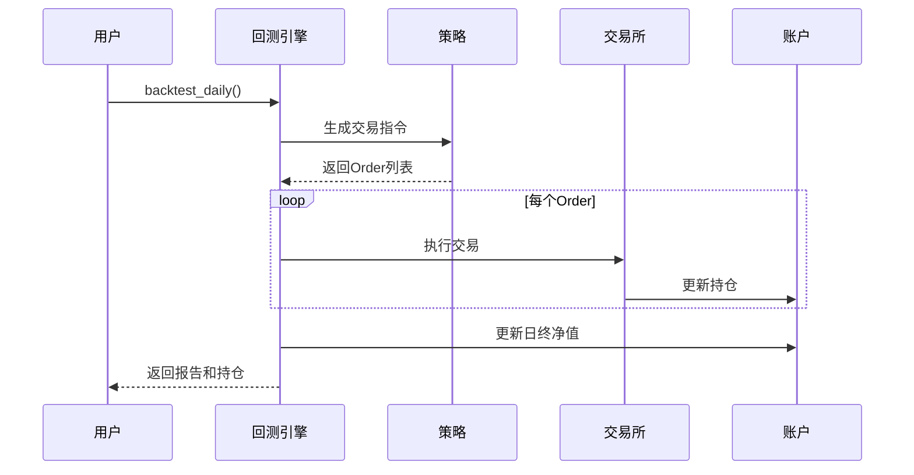

# 第6章：回测执行

在[第5章：策略](05_strategy.md)中，我们学习了如何创建`Strategy`，将模型预测转化为"买入股票A"或"卖出股票B"等可执行交易决策

但如何验证这些决策在实际市场中能否盈利？显然==不能未经测试就直接投入实盘交易==

这就是"回测执行"的价值所在。它如同**交易策略的飞行模拟器**，让我们能在历史市场数据上测试、评估和优化投资策略，无需承担真实资金风险。

回测执行系统是模拟真实交易的核心引擎。

它接收策略生成的交易指令，结合历史市场环境（价格、成交量、成本）进行处理，并管理模拟投资组合（现金、股票持仓）。最终生成包含收益、风险和交易成本等指标的完整策略表现报告。

## 回测执行的核心组件

Qlib回测引擎通过以下关键组件构建真实交易模拟：

1. **`Executor`**：回测中枢控制器。按日（或分钟）逐步处理`Strategy`生成的交易指令，确保指令发送至`Exchange`并正确更新`Account`。
2. **`Exchange`**：模拟真实市场环境。提供历史价格和成交量数据，应用交易成本（佣金、滑点）和市场规则（如涨跌停、最小交易单位）。决定指令是否成交及成交价格。
3. **`Account`**：管理模拟资金状态。跟踪总现金、股票持仓价值，计算每日盈亏，记录所有交易及成本。
4. **`Position`**：==作为`Account`的子组件，记录每支股票的具体持仓数量==。

这些组件共同构建了严谨可靠的策略测试平台。

## 策略回测实战演示

我们以[第5章](05_strategy.md)的`TopkDropoutStrategy`为例，展示如何在历史数据上运行回测：

```python
# 1. 初始化Qlib（同第1章）
data_folder_path = "~/.qlib/qlib_data/cn_data"
qlib.init(provider_uri=data_folder_path, region=REG_CN)

# 2. 准备数据处理器（同第3章）
handler = Alpha158(
    start_time="2010-01-01",
    end_time="2021-01-22",
    instruments="csi300"
)

# 3. 创建数据集（同第4章）
dataset = DatasetH(
    handler=handler,
    segments={
        "train": ("2010-01-01", "2015-12-31"),
        "test": ("2017-01-01", "2017-12-31"), # 使用更长的测试期回测
    }
)

# 4. 训练模型（同第4章）
model = LGBModel(loss="mse", num_boost_round=50)
model.fit(dataset)

# 5. 获取预测分数
pred_score = model.predict(dataset, segment="test")

# 6. 配置策略（同第5章）
strategy_obj = TopkDropoutStrategy(
    topk=50,      # 持有50支股票
    n_drop=5,     # 每日调仓5支
    signal=pred_score # 模型预测分数
)
```

### 运行回测

Qlib提供便捷的`backtest_daily`函数执行日频回测：

```python
# 7. 定义回测参数
backtest_params = {
    "start_time": "2017-01-01",
    "end_time": "2017-12-31",
    "account": 100000000,    # 初始资金1亿元
    "benchmark": "SH000300", # 沪深300基准
    "exchange_kwargs": {
        "limit_threshold": 0.095, # 涨跌停幅度9.5%
        "open_cost": 0.0005,     # 买入佣金0.05%
        "close_cost": 0.0015,     # 卖出佣金0.15%
        "impact_cost": 0.001      # 滑点成本
    }
}

# 8. 执行回测
report_normal, positions_normal = backtest_daily(
    strategy=strategy_obj,
    **backtest_params
)
```

### 分析回测结果

```python
# 9. 绩效分析
analysis = risk_analysis(report_normal["return"] - report_normal["bench"])

print("\n--- 年化绩效报告 ---")
print(f"超额收益率: {analysis['annualized_return']:.2%}")
print(f"信息比率: {analysis['information_ratio']:.2f}")
print(f"最大回撤: {analysis['max_drawdown']:.2%}")

print("\n--- 首日持仓样例 ---")
first_day = list(positions_normal.keys())[0]
for stock, data in positions_normal[first_day].get_stock_list_df().iterrows():
    print(f"{stock}: {data['amount']}股")
```

## 回测执行流程

`backtest_daily`内部执行流程如下：



## 代码层实现

核心类包括：
- `SimulatorExecutor`：控制回测时序和指令处理
- `Exchange`：模拟市场撮合和成本计算
- `Account`：管理资金和持仓状态

```python
# Exchange核心方法示例
def deal_order(self, order):
    if not self.is_stock_tradable(order.stock_id):
        return 0, 0, np.nan  # 股票不可交易
    
    price = self.get_deal_price(order.stock_id)  # 获取成交价
    amount = self._calc_actual_amount(order)      # 计算实际成交量
    cost = max(amount * price * self.cost_ratio, self.min_cost)
    
    self.account.update_order(order, amount*price, cost, price)
    return amount*price, cost, price
```

## 总结

回测执行是量化策略研发的关键环节：
1. 通过历史数据==验证==策略有效性
2. ==评估==收益风险特征和成本影响
3. 基于模块化设计==实现==真实市场模拟

下一步我们将探索[实验管理(R)](07_experiment_management__r__.md)，`实现高效的回测结果管理和策略比较`

