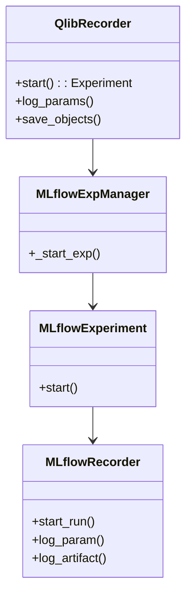

# 第7章：实验管理(R)

在[第6章：回测执行](06_backtest_execution_.md)中，我们学习了如何使用历史数据对交易策略进行完整模拟，并获得包含收益和回撤等指标的报告。但想象一下，作为忙碌的量化研究员，我们经常需要调整模型参数、修改策略配置，运行数十甚至上百次回测。如何==有效管理==这些实验配置、性能结果以及生成的模型和报告？这很容易变成一堆混乱的文件和数据！

"实验管理"功能正是为此而生。在Qlib中，这一核心能力通过名为`R`的全局对象实现。`R`如同**精心组织的数字实验笔记本**，自动记录量化研究的所有细节，帮助比较、分析和复现实验结果，通常以MLflow作为后端支持。

通过`R`，我们可以：
* **记录参数**：自动保存模型超参数（如学习率、树数量）和策略配置（如`topk`、`n_drop`）
* **跟踪指标**：记录回测关键指标（年化收益、夏普比率、最大回撤）便于对比
* **保存成果**：存储训练好的模型、预测分数和详细回测报告
* **组织实验**：将相关运行分组为逻辑"实验"便于管理

## 数字实验笔记本：`R`对象

`qlib.workflow.R`是实验管理的核心接口，其底层采用分层结构：

1. **`ExperimentManager`**：顶层管理器，负责创建和检索实验
2. **`Experiment`**：逻辑实验组（如"LGBM超参调优"）
3. **`Recorder`**：单个实验运行记录器，存储具体参数和结果

> 当配置使用MLflow后端时，可通过`mlflow ui`命令可视化实验结果。

## 实战：记录回测结果

我们基于第6章的回测示例，演示如何使用`R`记录实验：

```python
from qlib.workflow import R

# 1. 初始化Qlib（可选配置MLflow后端）
qlib.init(provider_uri="~/.qlib/qlib_data/cn_data")

# 2. 准备数据处理器（同第3章）
handler = Alpha158(
    start_time="2010-01-01",
    end_time="2021-01-22",
    instruments="csi300"
)

# 3. 训练模型（同第4章）
model = LGBModel(loss="mse", num_boost_round=50)
model.fit(DatasetH(handler=handler))

# 4. 启动实验记录
with R.start(experiment_name="量化策略实验", recorder_name="LGBM_基准策略"):
    # 记录参数
    R.log_params(
        model_type="LGBM",
        topk=50,
        n_drop=5,
        init_cash=100000000
    )
    
    # 执行回测（同第6章）
    report, positions = backtest_daily(...)
    
    # 记录指标
    analysis = risk_analysis(report["return"] - report["bench"])
    R.log_metrics(
        annual_return=analysis["annualized_return"],
        sharpe_ratio=analysis["information_ratio"]
    )
    
    # 保存成果
    R.save_objects(
        trained_model=model,
        backtest_report=report
    )
```

### 实验结果

```python
# 获取历史实验记录
recorder = R.get_recorder(experiment_name="量化策略实验")

# 加载保存的模型
model = recorder.load_object("trained_model.pkl")

# 查看记录指标
print(recorder.list_metrics())
```

## 技术实现

`R`对象作为门面模式，将调用委托给底层组件：



关键类说明：
1. **`QlibRecorder`**：全局接口`R`的实现类
2. **`MLflowExpManager`**：通过MLflow客户端管理实验
3. **`MLflowExperiment`**：包装MLflow实验对象
4. **`MLflowRecorder`**：直接调用MLflow API记录运行

## 总结

`R`对象是Qlib研究流程的终极组织工具：
- 通过标准化记录确保实验可复现
- 结构化存储便于结果对比
- ==无缝集成MLflow提供可视化支持==

MLflow传送：[MLflow](https://mlflow.org/)

至此我们完成了Qlib核心功能的探索之旅，涵盖==数据准备、建模、策略开发、回测验证到实验管理==的完整流程

END *★,°*:.☆(￣▽￣)*.°★* 。