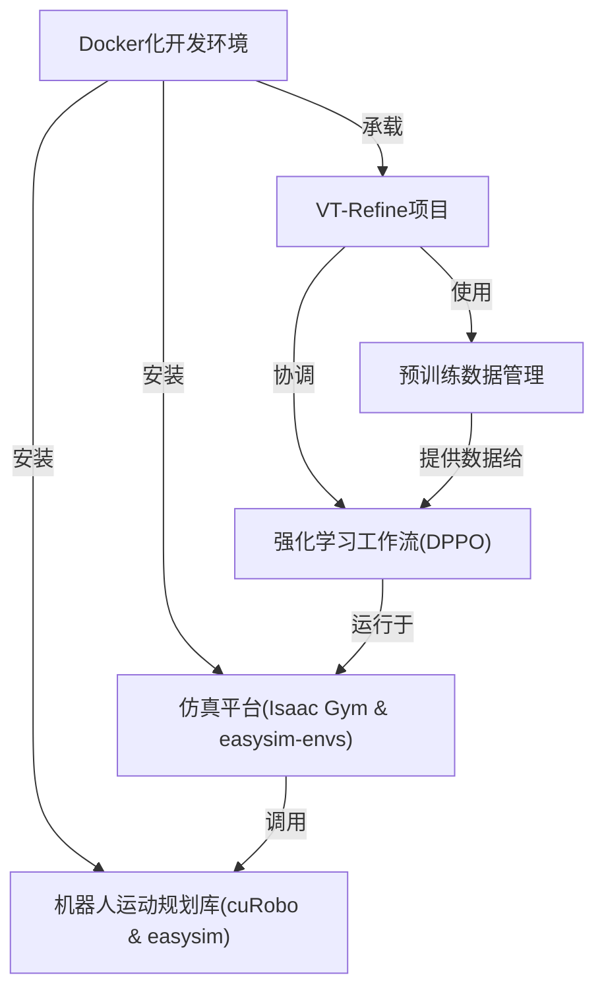

链接：[[2510.14930\] VT-Refine: Learning Bimanual Assembly with Visuo-Tactile Feedback via Simulation Fine-Tuning](https://arxiv.org/abs/2510.14930)

[VT-Refine](https://binghao-huang.github.io/vt_refine/)

# docs：VT-Refine项目

VT-Refine项目就像一个**机器人训练学院**，教会机器人如何执行*复杂的双手装配任务*。

通过结合从真实*仿真环境*中收集的*视觉与触觉反馈*来实现这一目标。训练过程包含基于大规模数据集的预训练阶段，以及后续的微调过程，使机器人能够==在虚拟世界中掌握==*精确交互*和复杂的手-眼-触觉协调能力。

## 可视化

## 章节

1. [VT-Refine项目](01_vt_refine_project_.md)
2. [强化学习工作流(DPPO)](02_reinforcement_learning_workflow__dppo__.md)
3. [仿真平台(Isaac Gym & easysim-envs)](03_simulation_platform__isaac_gym___easysim_envs__.md)
4. [预训练数据管理](04_pre_training_data_management_.md)
5. [机器人运动规划库(cuRobo & easysim)](05_robotics___motion_planning_libraries__curobo___easysim__.md)
6. [Docker化开发环境](06_dockerized_development_environment_.md)

---

paper