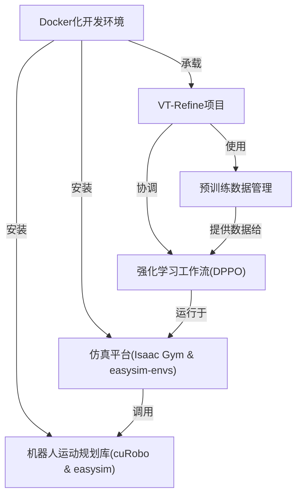

链接：[[2510.14930\] VT-Refine: Learning Bimanual Assembly with Visuo-Tactile Feedback via Simulation Fine-Tuning](https://arxiv.org/abs/2510.14930)

[VT-Refine](https://binghao-huang.github.io/vt_refine/)

# docs：VT-Refine项目

VT-Refine项目就像一个**机器人训练学院**，教会机器人如何执行*复杂的双手装配任务*。

通过结合从真实*仿真环境*中收集的*视觉与触觉反馈*来实现这一目标。训练过程包含基于大规模数据集的预训练阶段，以及后续的微调过程，使机器人能够==在虚拟世界中掌握==*精确交互*和复杂的手-眼-触觉协调能力。

## 可视化

## 章节

1. [VT-Refine项目](01_vt_refine_project_.md)
2. [强化学习工作流(DPPO)](02_reinforcement_learning_workflow__dppo__.md)
3. [仿真平台(Isaac Gym & easysim-envs)](03_simulation_platform__isaac_gym___easysim_envs__.md)
4. [预训练数据管理](04_pre_training_data_management_.md)
5. [机器人运动规划库(cuRobo & easysim)](05_robotics___motion_planning_libraries__curobo___easysim__.md)
6. [Docker化开发环境](06_dockerized_development_environment_.md)

---

# VT-Refine：通过仿真微调学习具有视觉-触觉反馈的双手机器人装配

## 摘要
人类在双手机器人装配任务中表现出色，能够通过丰富的触觉反馈进行自适应调整。然而，仅通过行为克隆（behavioral cloning）难以在机器人中复现这种能力，因为人类演示数据通常存在次优性和多样性不足的问题。在本文中，我们提出了VT-Refine，一种结合真实世界演示、高保真触觉仿真和强化学习的视觉-触觉策略学习框架，用于解决高精度、接触密集的双手机器人装配任务。  

我们首先利用同步的视觉和触觉输入，在小规模演示数据集上训练扩散策略（diffusion policy）。随后，将该策略迁移至配备仿真触觉传感器的数字孪生环境中，并通过大规模强化学习进一步优化，以提升策略的鲁棒性和泛化能力。为了实现精确的仿真到现实（sim-to-real）迁移，我们采用了高分辨率压阻式触觉传感器，该传感器能够提供法向力信号，并可通过GPU加速的仿真进行高保真建模。实验结果表明，VT-Refine通过增加数据多样性和更有效的策略微调，显著提升了仿真和现实环境中的装配性能。项目页面详见：[https://binghao-huang.github.io/vt_refine/](https://binghao-huang.github.io/vt_refine/)。  

**关键词**：触觉仿真、双手机器人操作、强化学习微调  

---

## 1 引言
完成精确的双手机器人装配任务需要视觉和触觉感知的复杂协调。以双手机器人插头-插座装配为例：人类首先依赖视觉定位零件，并通过双手协调抓取和拾取每个零件。一旦零件被握持并准备插入，触觉反馈变得至关重要，因为插入过程中的接触信号可能被视觉遮挡（图1），仅靠视觉无法满足精细接触交互的精度需求。  

近年来，基于扩散策略的行为克隆方法[1,2]在从少量人类远程操作演示中学习双手机器人视觉-触觉策略方面展现出潜力[3,4]。然而，将这些方法扩展到现实世界中的高精度装配任务仍面临两大挑战：  
1. **数据收集成本高**：真实世界演示的采集成本高昂，且随着任务精度和接触复杂度的提升，数据需求呈指数增长，使得大规模采集变得不切实际。  
2. **触觉反馈缺失**：当前演示接口通常缺乏触觉反馈，导致无法捕捉人类如何利用触觉进行精细操作。因此，收集的演示数据通常缺少对接触密集型任务至关重要的探索行为（如迭代调整），从而产生次优的训练数据。  

仿真为扩展视觉-触觉策略学习提供了可行路径，但现有研究主要集中于视觉模态或对触觉依赖较少的任务[5–7]。尽管近期工作探索了基于仿真的触觉数据生成[8–13]，但这些研究通常局限于简单任务（如单手机器人操作）或尚未解决触觉关键型双手机器人任务的大规模训练和鲁棒仿真到现实迁移问题[14]。  

为解决这些挑战，我们提出了一种新颖的“现实-仿真-现实”（real-to-sim-to-real）框架，专为高精度双手机器人装配设计。我们的方法首先采集少量真实世界演示（如30次任务片段），用于预训练双手机器人视觉-触觉扩散策略。随后，在并行仿真环境中通过强化学习（RL）对策略进行微调。最后，将微调后的策略从仿真环境迁移回现实世界。  

本框架的三大贡献如下：  
1. **仿真中的强化学习微调**：通过在仿真中探索初始人类演示附近的状态-动作区域，提升视觉-触觉扩散策略的性能。  
2. **GPU并行触觉仿真模块**：在基于GPU的物理仿真器中开发了高保真压阻式触觉传感器仿真，显著缩小仿真到现实的差距。  
3. **点云表示的统一性**：采用基于点云的视觉和触觉表示，确保现实-仿真-现实迁移的无缝衔接，增强策略的有效性。  

据我们所知，本文是首个成功实现双手机器人视觉-触觉策略的大规模仿真训练和仿真到现实迁移的研究。  

我们在五项挑战性双手机器人装配任务上全面评估了系统性能，证明了仿真微调对现实世界执行的显著提升。实验分析表明，高分辨率触觉反馈在预训练和微调阶段均显著提升了策略性能，而基于点云的表示则确保了跨任务和跨领域的鲁棒迁移能力。  

---

## 2 相关工作
### 触觉传感器与仿真
触觉信息对人类日常生活至关重要，同样对机器人环境交互具有重要作用[15]。研究者已通过结合视觉和触觉感知增强机器人操作能力[3,4,8,13,14,16–25]。现有工作多聚焦于光学触觉传感器（如GelSight[16]），其可捕获法向力和剪切力以及精细表面纹理[10,12,26–30]。然而，这些传感器的高分辨率图像难以精确仿真，且仿真到现实的差距较大。  

### 双手机器人视觉-触觉操作
双手机器人操作在装配任务中面临显著挑战[7,17,34–38]。近期，基于学习的方法（如模仿学习[39–43]）利用多模态人类演示实现精细操作。然而，高精度任务对数据量的需求在双手机器人场景中急剧增加。仿真被用于生成额外数据以增强策略鲁棒性[5]，但多数双手机器人框架仍仅依赖视觉输入[44–46]，主要因触觉信号（尤其是光学触觉传感器）难以仿真和迁移[47]。  

相比之下，我们的框架选择了一种易于仿真的触觉模态（法向力信号），并结合高保真仿真，实现了高效的现实-仿真-现实学习。  

---

## 3 视觉-触觉系统与触觉仿真
### 触觉传感器硬件
我们的FlexiTac传感器基于电阻式传感矩阵设计，灵感来源于3D ViTac[3]，能够高效将机械压力转换为电信号。选择矩阵式柔性传感器的动机包括：  
1. **兼容性**：传感器可安装于多种机器人末端执行器（包括刚性和柔性手指）。  
2. **仿真到现实的可迁移性**：传感模态可在仿真中高保真模拟，确保跨环境行为一致性。  

如图2所示，每个机器人手指配备一个由12×32传感单元组成的触觉垫，空间分辨率为2mm。传感器采用三层结构（图2(iii)），压阻传感层夹在两片柔性印刷电路（FPC）之间。FPC显著提升了空间一致性，且单个传感器可在5分钟内完成制作，支持低成本、可扩展部署。  

### 触觉仿真
为模拟触觉传感输入，我们在Isaac Gym[48]中基于GPU加速的触觉仿真库TacSL[12]开发了仿真模块。由于传感器信号与TacSL模拟的法向力信号高度相似，我们采用穿透式触觉力模型[49]模拟柔性触觉传感器与刚性物体的接触（图2(vi)）。  

每个触觉点（即传感单元的3D位置）与刚性物体的交互通过Kelvin-Voigt模型建模，包含线性弹簧和粘性阻尼器。触觉点的法向力计算为：  
\[ f_n = -(k_n d + k_d \dot{d}) \mathbf{n} \]  
其中，\( d \)和\( \dot{d} \)分别为穿透深度和沿接触法线的相对速度，\( \mathbf{n} \)为接触法向量。  

---

## 4 视觉-触觉策略优化
我们的目标是学习一个通用且鲁棒的控制策略\( \pi: \mathcal{O} \rightarrow \mathcal{A} \)，将多模态观测\( o \in \mathcal{O} \)映射为机器人动作\( a \in \mathcal{A} \)。如图3所示，方法分为两阶段：  
1. **现实世界预训练**：在小规模人类演示上通过行为克隆预训练扩散策略。  
2. **仿真微调**：在仿真中通过策略梯度强化学习（如DPPO[6]）优化预训练策略。  

### 视觉-触觉表示
观测\( o \)包含三部分：  
1. **视觉**：无色点云\( \mathcal{P}_{\text{visual}} \in \mathbb{R}^{N_{\text{vis}} \times 4} \)。  
2. **触觉**：触觉传感器生成的3D位置和传感读数点云\( \mathcal{P}_{\text{tactile}} \in \mathbb{R}^{N_{\text{tac}} \times 4} \)。  
3. **本体感知**：双臂和双夹持器的关节位置。  

通过PointNet[52]编码器处理合并后的点云，并与多层感知机（MLP）编码的本体特征拼接，作为去噪扩散网络的条件输入。  

---

## 5 实验结果
实验围绕三个核心问题展开：  
1. **微调策略的性能提升**：RL微调策略在现实世界中比基线扩散策略成功率提升约20%（仅视觉）和40%（视觉-触觉）。  
2. **跨领域表示迁移**：尽管存在轻微性能下降（仿真到现实迁移约5–10%），但RL微调的整体增益显著。  
3. **预训练数据量的影响**：30次演示足以支持有效微调，进一步增加数据量收益有限。  

---

## 6 结论
本文提出了一种结合多模态感知的现实-仿真-现实流水线，用于高精度双手机器人操作。通过高保真触觉仿真和强化学习微调，我们在多样化的精密装配任务中实现了性能的显著提升。  

---

## 7 局限性与未来工作
1. **与光学触觉传感器的权衡**：FlexiTac分辨率较低（2mm/单元），但仿真到现实迁移更可靠。  
2. **仿真对齐的校准需求**：视觉、触觉分布和底层控制需手动对齐。  
3. **适用范围限制**：当前流水线依赖仿真器能力，且缺乏对可变形物体的支持。  

未来工作将进一步提升仿真保真度，并探索无CAD模型的即插即用流水线。  

