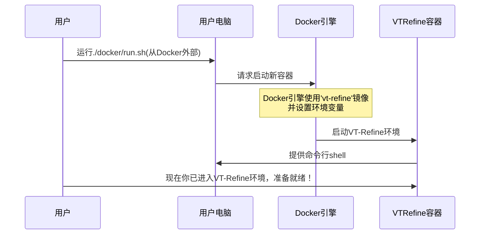

# 第1章：VT-Refine项目

本章是我们理解这个项目的起点。可以把它想象成参观一所非常特殊的"机器人训练学院"的高层概览。

### 什么是VT-Refine？机器人训练学院

想象一下，我们需要让机器人完成一项非常复杂的任务，比如用双手组装一个精巧的玩具，每个触碰和动作都需要恰到好处。

这对机器人来说并不容易。它们需要准确"看到"零件的位置，并"感受"是否用力过猛或零件是否正确组装。

这正是**VT-Refine项目**要解决的问题。

它是一个核心系统，旨在教会机器人掌握这类需要精确动作和细致交互的复杂双手(bimanual)装配任务。

把**VT-Refine**想象成一所综合性的"机器人训练学院"。在这所学院里，机器人不仅通过视觉学习，还通过触觉学习。它们在==一个安全的虚拟世界中反复练习==，直到精通复杂任务，就像人类练习新技能一样。

### 核心理念：通过视觉和触觉学习(Visuo-Tactile Feedback)

传统上，机器人通过摄像头"看到"东西(视觉信息)来完成各种任务。但对于组装工作来说，仅靠视觉往往不够。想象一下闭着眼睛拧灯泡——我们很大程度上依赖==触觉==感受。

*   **视觉-触觉反馈**：这个术语指的是结合"视觉"(机器人看到的)和"触觉"(机器人感受到的)信息。VT-Refine利用这两种从虚拟训练环境中收集的反馈，让机器人更全面地理解自己的动作。

### 训练场所：虚拟世界(Simulation)

在现实世界中训练机器人可能缓慢、昂贵，有时甚至存在风险(如果机器人弄坏东西！)。因此VT-Refine使用==仿真环境==。

*   **仿真环境**：这是一个虚拟训练场，机器人可以在这里进行数百万次练习而不会产生任何实际后果。就像机器人的电子游戏，它们可以不断尝试、犯错并快速学习。我们将在[仿真平台(Isaac Gym & easysim-envs)](03_simulation_platform__isaac_gym___easysim_envs__.md)中详细介绍这个虚拟世界。

### 机器人如何进步：微调(Fine-Tuning)

当机器人掌握一些基础知识(可能来自观察人类演示或初始简单训练)后，它们就进入一个关键阶段——**微调**。

*   **微调**：这是VT-Refine真正发挥作用的阶段。机器人利用仿真环境中的视觉和触觉反馈，使动作变得极其精确高效。就像从会弹几个钢琴音符到能完美演奏复杂协奏曲的转变。这个微调过程由先进的学习技术驱动，我们将在[强化学习工作流(DPPO)](02_reinforcement_learning_workflow__dppo__.md)中详细介绍。

### VT-Refine入门：准备训练

要建立自己的机器人训练学院，首先需要在电脑上设置VT-Refine项目。我们使用**Docker**工具创建一个干净、隔离的环境，使安装过程更加简单。

#### 第一步：获取VT-Refine代码

首先需要从互联网下载项目文件。打开终端(命令提示符)输入：

```bash
git clone --recursive https://github.com/NVlabs/vt-refine.git
cd vt-refine
```

*这个命令做两件事：`git clone`下载所有项目文件，`--recursive`确保获取所有相关工具。然后`cd vt-refine`进入新下载的项目文件夹。*

#### 第二步：构建机器人训练环境

接下来，我们将构建特殊的Docker环境。这会准备好机器人训练所需的一切，包括软件、库和工具。

```bash
./docker/build.sh
```

*这个命令运行一个脚本，使用特殊的蓝图文件(`docker/Dockerfile`，稍后可以查看)创建一个独立的虚拟机镜像。它会安装所有必要软件，包括我们的仿真平台。可以把它想象成为一个专用教室配备所有合适的工具。*

#### 第三步：进入训练学院

最后，让我们进入准备好的训练环境。

```bash
DPPO_WANDB_ENTITY=$DPPO_WANDB_ENTITY ./docker/run.sh
```

*这个命令基于刚构建的镜像启动一个Docker容器。就像打开机器人训练教室的门！`DPPO_WANDB_ENTITY`是可选的在线跟踪机器人进度的设置，对[强化学习工作流(DPPO)](02_reinforcement_learning_workflow__dppo__.md)很有用。运行后，终端会变化，你将进入Docker环境，准备与VT-Refine交互。*

#### 运行`docker/run.sh`时会发生什么？

让我们可视化启动训练环境的简单过程：



*当你执行`./docker/run.sh`时，电脑的Docker系统会启动一个新的VT-Refine环境实例。这个称为"容器"的新环境是隔离的，但安装了所有必要工具(如`docker/Dockerfile`中定义的)。它还智能地将本地`vt-refine`项目文件夹与容器共享，因此你对电脑代码的任何修改都会反映在容器内，反之亦然！你会获得容器内的命令提示符，准备开始工作。*

### 总结

本章介绍了**VT-Refine项目**作为一个先进的"机器人训练学院"，专注于在仿真环境中结合视觉和触觉反馈来教授机器人复杂的双手装配任务，以及关键的微调过程。

我们还学习了如何通过克隆仓库、构建Docker环境和启动第一个容器来设置项目。

现在你已经迈出了理解VT-Refine强大能力的第一步

下一章我们将深入探讨机器人如何在这个学院中真正学习和进步，探索[强化学习工作流(DPPO)](02_reinforcement_learning_workflow__dppo__.md)。

