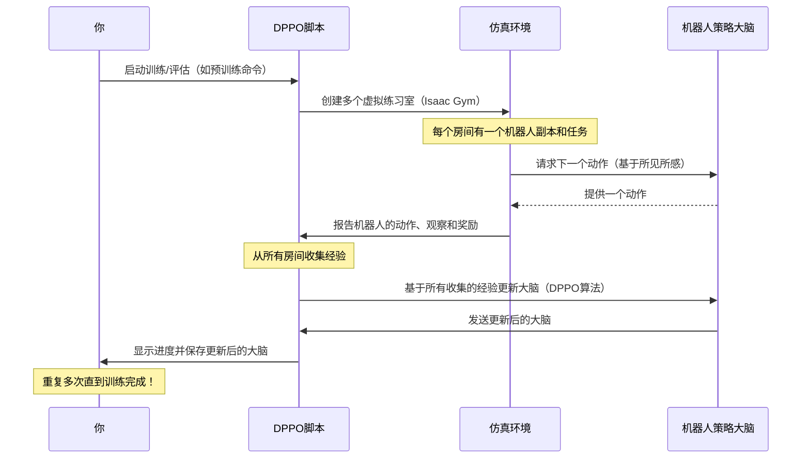

# 第2章：强化学习工作流(DPPO)

欢迎回来

在[VT-Refine项目](01_vt_refine_project_.md)中，我们了解到VT-Refine就像一所机器人训练学院，而它让机器人变得超级精确的秘诀是一个称为"微调"的过程。但这个"微调"具体是如何发生的？机器人如何从一个任务表现平平变成专家？

本章将介绍VT-refine为机器人设计的"训练计划"或"课程"，即**强化学习工作流(DPPO)**。可以把它想象成一个多阶段的教育计划，旨在教会机器人复杂的技能。

### 这个工作流解决了什么问题？（机器人的学习之旅）

想象一下，想教机器人完成一项非常具体且精细的任务，比如小心翼翼地将一根微型USB-C线插入接口，或者用恰到好处的力量组装两块复杂的乐高积木。

> 这不仅仅是移动手臂的问题；它需要*学习*最佳的动作序列、施加多少力量，以及如何根据所见所感做出反应。

这就是**强化学习工作流(DPPO)**的用武之地。它为VT-Refine训练和优化机器人技能提供了一个结构化的"配方"。就像教练通过练习、比赛和表现评估来指导运动员不断进步一样。

### 强化学习：通过实践学习

我们工作流的核心是一种强大的学习方法——**强化学习(RL)**。

*   **强化学习(RL)**：想象教狗一个新把戏。当狗做对了，你会给它一块零食（"奖励"）。如果做错了，它得不到零食，甚至可能听到一声轻轻的"不"（"惩罚"或没有奖励）。久而久之，狗会学会哪些动作能带来零食，哪些不能。
    *   在RL中，**机器人**就像狗（"智能体"）。
    *   **虚拟世界**（或现实世界）就像狗表演的环境（"环境"）。
    *   机器人尝试不同的动作，获得"奖励"（比如成功放置零件）或"惩罚"（比如掉落零件），并利用这些反馈来改进。
    *   机器人决定做什么的"大脑"称为**策略**。这个策略通常是一种特殊的计算机程序，称为神经网络。

### 强化升级：分布式近端策略优化(DPPO)

现在，让我们看看工作流中的"DPPO"部分。

*   **近端策略优化(PPO)**：这是一种非常流行且高效的算法（一组指令），用于==智能地更新==机器人的"大脑"（策略）。它的设计目的是快速学习，同时避免对机器人行为做出剧烈且适得其反的改变。可以把它想象成一位教练，给运动员提供建设性的反馈，确保改进是稳定且不冒险的。

*   **分布式PPO(DPPO)**：=="D"代表分布式==。想象你想更快地训练你的狗。如果不止一个训练师，而是10个训练师，每个在自己的院子里同时训练10只不同的狗学习同一个把戏呢？它们==共享所学==，使整体训练更快、更高效。
    *   在我们的案例中，"分布式"意味着我们使用许多**并行仿真环境**（就像许多虚拟院子）同时训练机器人的策略。这显著加快了学习过程。我们将在[仿真平台(Isaac Gym & easysim-envs)](03_simulation_platform__isaac_gym___easysim_envs__.md)中更深入地探讨这些仿真环境。

因此，**强化学习工作流(DPPO)**是VT-Refine使用的一种复杂的分布式学习算法来训练机器人的完整系统。

### 机器人训练的三个阶段：预训练、微调和评估

我们的DPPO工作流结构像一个多阶段的课程，从通用知识到专业技能，再到最终考核。

让我们看看这些阶段，以及如何使用VT-Refine的命令与它们交互。所有这些命令都在第1章启动的Docker容器中运行。

#### 阶段1：预训练（通识教育）

*   **是什么**：在这个初始阶段，机器人通过练习多样化的任务和数据集学习广泛的技能。就像一个学生通过通识教育课程学习基础概念，这些知识在许多领域都有用。对于VT-Refine来说，这通常意味着从各种人类演示或更简单的任务中学习。这一阶段帮助机器人在应对具体挑战之前打下良好的基础。
*   **为什么重要**：它提供了一个强大的起点，使后续更具体的微调更快、更有效。
*   **如何运行（示例）**：

    ```bash
    python3 dppo/script/run.py \
        --config-name=pre_tactile \
        --config-path=../cfg/aloha/pretrain/00186
    ```
    *   **这个命令的作用**：启动预训练过程。
        *   `python3 dppo/script/run.py`：这是启动任何DPPO训练或评估的主脚本。`dppo`文件夹实际上是VT-Refine用于强化学习的一个独立项目。
        *   `--config-name=pre_tactile`：告诉脚本使用专门为触觉（触摸）信息预训练的配置设置。
        *   `--config-path=../cfg/aloha/pretrain/00186`：指向一个特定的配置文件。可以把这个文件想象成一个详细的课程计划，指定预训练阶段*学什么*（比如使用"Aloha"机器人数据）和*如何学*。
    *   **输出**：运行时，终端会显示大量文本滚动，机器人正在练习。DPPO（通过`dppo`项目）会自动将机器人不断演化的"大脑"（策略）保存到日志文件夹，如果设置了`DPPO_WANDB_ENTITY`（如第1章所述），还可以将进度报告发送到Weights & Biases等工具。

#### 阶段2：微调（专业课程）

*   **是什么**：一旦机器人通过预训练打下了良好的基础，就进入微调阶段。在这里，机器人利用仿真环境中的精确视觉和触觉反馈，将其学到的技能适应*非常具体*的目标任务。就像一个学生选修专业课程，为特定职业路径磨练技能。
*   **为什么重要**：这是VT-Refine让机器人对复杂双手装配任务变得极其精确的地方。它利用预训练的基础，快速成为新任务的专家。
*   **如何运行（示例）**：

    ```bash
    # 重要：将$PRETRAIN_POLICY_PATH替换为预训练策略的实际路径！
    # 示例：/root/vt-refine/log/your_pretrain_run_id/policy_last.pth
    python3 dppo/script/run.py \
        --config-name=ft_tactile \
        --config-path=../cfg/aloha/finetune/00186 \
        base_policy_path=$PRETRAIN_POLICY_PATH
    ```
    *   **这个命令的作用**：启动微调过程。
        *   `--config-name=ft_tactile`：指定用于触觉反馈微调的配置。
        *   `--config-path=../cfg/aloha/finetune/00186`：指向这个特定"Aloha"任务的微调课程计划。
        *   `base_policy_path=$PRETRAIN_POLICY_PATH`：**这很关键！**它告诉脚本从预训练阶段学到的机器人"大脑"（策略）开始微调。这比从头开始节省了大量时间。
    *   **输出**：与预训练类似，你会看到持续的日志，更新后的微调策略会被保存。

#### 阶段3：评估（期末考试）

*   **是什么**：预训练和微调之后，是时候看看机器人学得怎么样了！评估阶段严格测试机器人在目标任务上的表现。就像一个学生参加期末考试来展示掌握程度。
*   **为什么重要**：这一阶段衡量训练过程的成功，并为你提供机器人策略能力的定量结果。
*   **如何运行（示例）**：

    ```bash
    # 重要：将$FINETUNE_POLICY_PATH替换为微调策略的实际路径！
    # 示例：/root/vt-refine/log/your_finetune_run_id/policy_last.pth
    python3 dppo/script/run.py \
        --config-name=eval_ft_tactile \
        --config-path=../cfg/aloha/eval/00186 \
        base_policy_path=$FINETUNE_POLICY_PATH
    ```
    *   **这个命令的作用**：运行评估。
        *   `--config-name=eval_ft_tactile`：指定用于微调触觉策略的评估配置。
        *   `--config-path=../cfg/aloha/eval/00186`：指向该任务的具体评估标准。
        *   `base_policy_path=$FINETUNE_POLICY_PATH`：告诉脚本评估*哪个*机器人"大脑"（策略）。
    *   **输出**：与持续训练不同，你通常会看到机器人表现的摘要，比如多次试验的成功率，或基于任务完成情况的得分。

### 幕后：DPPO如何施展魔法

当运行这些`python3 dppo/script/run.py`命令时，实际发生了什么？让我们简单看看幕后。

1.  **你发出命令**：你告诉DPPO脚本做什么（预训练、微调或评估）以及使用哪个机器人任务配置。
2.  **DPPO设置训练场**：DPPO系统加载机器人当前的"大脑"（策略），并使用[仿真平台(Isaac Gym & easysim-envs)](03_simulation_platform__isaac_gym___easysim_envs__.md)==创建多个虚拟训练室==（仿真）。每个房间有一个机器人和特定任务（比如组装"00186"物品）。
3.  **机器人开始练习**：在每个虚拟房间中，机器人的副本尝试完成任务。它采取行动，观察结果（视觉和触觉），并获得奖励或惩罚。
4.  **从经验中学习**：从这些并行仿真中收集的所有经验被汇总。DPPO算法分析这些集体经验，并决定如何调整机器人的"大脑"（策略），以便下次做出更好的决策。
5.  **重复、重复、再重复**：这个练习、观察和调整的循环会重复数百万次。随着时间的推移，机器人的策略变得更聪明，任务完成得更成功！

以下是简化的操作序列：



整个过程可以通过`cfg`目录中的文件（如`cfg/aloha/pretrain/00186`）高度配置。这些配置文件定义了从任务细节到学习率和奖励机制的一切。

### 总结

本章我们探索了**强化学习工作流(DPPO)**，这是VT-Refine用于训练机器人的复杂多阶段课程。我们了解到：

*   它使用**强化学习**，机器人通过试错学习，由奖励引导。
*   **DPPO**（分布式近端策略优化）是用于训练机器人"大脑"（策略）的具体高效算法，通过并行运行多个仿真实现。
*   工作流包含三个阶段：
    *   **预训练**：从多样化==数据集==中进行通用学习。
    *   **微调**：适应==特定==精确任务。
    *   **评估**：测量最终表现。

现在理解了VT-Refine如何赋能机器人学习和优化复杂的双手装配技能。

接下来，我们将深入探讨所有这些学习实际发生的虚拟世界，探索[仿真平台(Isaac Gym & easysim-envs)](03_simulation_platform__isaac_gym___easysim_envs__.md)。

