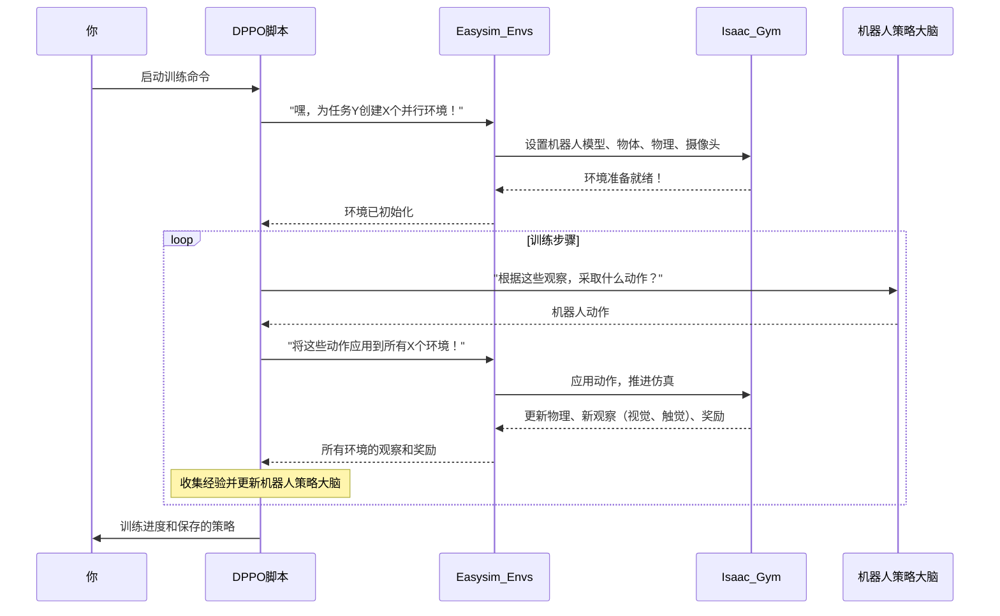

# 第3章：仿真平台(Isaac Gym & easysim-envs)

欢迎回来

在[强化学习工作流(DPPO)](02_reinforcement_learning_workflow__dppo__.md)中，我们了解到VT-Refine的机器人通过一种强大的DPPO过程进行训练，而关键的是，这种训练发生在**多个并行仿真环境**中。

> 但这些环境具体*是什么*？所有这些虚拟练习在哪里进行？

本章将介绍机器人学习魔法发生的"虚拟游乐场"或"训练场"：由**Isaac Gym**和**easysim-envs**驱动的**仿真平台**。

### 这个平台解决了什么问题？（虚拟练习室）

想象你在教机器人完成一项精细的装配任务，比如用双手小心地将充电器插入手机。
*   **在现实世界中训练**会很慢（一次只能训练一个机器人）、昂贵（如果零件损坏）且可能危险（如果机器人犯了大错）。
*   **等待人类演示**每个场景也非常耗时。

这就是**仿真平台**的用武之地。它提供了一个安全的虚拟空间，机器人可以在这里练习数百万次而不会产生任何现实后果。可以把它想象成一个专为安全高效训练和测试复杂机器人行为而设计的高度先进的视频游戏引擎。

**VT-Refine仿真平台**通过以下方式解决这些问题：
1.  **提供虚拟世界**：机器人、物体和装配站的逼真数字副本。
2.  **允许超快速练习**：同时运行多个机器人副本，每个在自己的虚拟环境中学习。
3.  **支持安全实验**：机器人可以尝试任何操作而不会损坏真实硬件或物体。
4.  **收集丰富数据**：轻松==收集==对机器人学习至关重要的"视觉"（摄像头图像）和"触觉"（触摸）反馈。

### 仿真平台的两大核心支柱

我们的仿真平台建立在两个关键组件上，它们协同工作：

1.  **Isaac Gym**："高性能游戏引擎"
2.  **easysim-envs**：为VT-Refine定制的"特定游戏关卡和机器人角色"

让我们分别探讨它们。

#### 1. Isaac Gym：高性能游戏引擎

可以把Isaac Gym看作我们机器人训练平台的核心"游戏引擎"，类似于Unity或Unreal Engine为许多视频游戏提供动力。但Isaac Gym的特殊之处在于它是专为机器人技术设计的，并利用计算机的**GPU（图形处理单元）**来极其快速地运行仿真。

以下是Isaac Gym的强大之处：

*   **GPU加速物理**：这意味着它可以非常快速且逼真地计算物体的移动、碰撞和交互。它不仅可以模拟一个机器人，还可以同时模拟*数百甚至数千个*机器人做不同的事情！
*   **逼真渲染**：它从虚拟摄像头生成逼真的图像，这对机器人的"视觉"反馈至关重要。
*   **并行仿真能力**：这是DPPO的关键。Isaac Gym能够并行运行多个仿真，极大地加快了学习过程。与其让一个机器人学习一天，不如让100个机器人学习一小时，积累相同的经验

> Isaac Gym提供了一个底层、快速且逼真的虚拟世界，机器人可以在这里真正地实验和学习。

#### 2. easysim-envs：特定游戏关卡和机器人角色

Isaac Gym提供了原始动力和物理引擎，而**easysim-envs**（"简易仿真环境"的缩写）则是VT-Refine用来定义*特定*任务、*特定*机器人和*特定*规则的工具，以应对我们的双手装配挑战。

可以把`easysim-envs`看作：

*   **机器人模型**：加载VT-Refine使用的机器人数字蓝图，包括它们的手臂、夹爪甚至虚拟触觉传感器。
*   **任务设置**：定义"游戏关卡"——物体的放置位置、目标是什么（例如将零件A插入零件B）以及成功或失败的标准。
*   **交互接口**：==提供机器人"大脑"（由DPPO训练的策略）与Isaac Gym仿真之间的桥梁==。它告诉Isaac Gym机器人想要采取的动作（例如"移动手臂到这里"、"关闭夹爪"），然后从仿真中收集所有"视觉"和"触觉"反馈，发送回机器人的大脑。
*   **易于定制**：如其名称所示，`easysim-envs`旨在简化新机器人任务和环境的设置，而不会陷入仿真器的复杂细节中。

Isaac Gym和`easysim-envs`共同为VT-Refine的机器人创建了一个强大、灵活且高性能的虚拟训练场。

### VT-Refine如何使用仿真平台（概念）

作为初学者，大多数时候你不会直接编写代码来控制Isaac Gym或`easysim-envs`。相反，会通过我们在[强化学习工作流(DPPO)](02_reinforcement_learning_workflow__dppo__.md)中看到的DPPO训练脚本==间接==与它们交互。

当你运行类似第2章中的命令时：

```bash
# 在Docker容器内
python3 dppo/script/run.py \
    --config-name=pre_tactile \
    --config-path=../cfg/aloha/pretrain/00186
```

以下是仿真平台相关的操作：

1.  `dppo/script/run.py`脚本启动。
2.  它读取由`--config-path`指定的配置文件（例如`../cfg/aloha/pretrain/00186`）。
3.  这个配置文件告诉脚本加载*哪个*特定的`easysim-envs`任务（例如"Aloha"机器人的"00186"装配任务）。
4.  `easysim-envs`然后初始化Isaac Gym，设置该特定任务的多个并行实例。每个实例包含一个机器人、装配物体和虚拟摄像头/触觉传感器。
5.  ==DPPO算法开始训练，向所有这些并行的`easysim-envs`实例发送动作，并接收观察和奖励==。

这种==无缝集成==使得DPPO能够高效地在复杂场景中训练机器人。

### 幕后：仿真生命周期

让我们可视化这些组件在你启动训练时的协作过程：



### Dockerfile中的安装上下文

在[VT-Refine项目](01_vt_refine_project_.md)中，已经通过构建Docker环境迈出了设置VT-Refine的第一步。这个构建过程正是安装Isaac Gym和`easysim-envs`的地方。可以从`docker/Dockerfile`中看到相关代码片段：

首先，安装Isaac Gym：
```dockerfile
# ... 其他设置 ...

# 从TacSL安装Isaac Gym。
# ...（安装依赖的行）...
RUN pip install gdown && \
    gdown 1nhLF4cKeUokCqU5LvEu8uYdEQtyJolXl && \
    tar zxvf IsaacGym_Preview_TacSL_Package.tar.gz && \
    pip install -e ./IsaacGym_Preview_TacSL_Package/isaacgym/python && \
    rm -rf /var/lib/apt/lists/*
# 为Isaac Gym查看器设置NVIDIA_DRIVER_CAPABILITIES。
ENV NVIDIA_DRIVER_CAPABILITIES=compute,graphics,utility

# ... 更多设置 ...
```
*   **作用**：这部分Dockerfile下载并安装了一个特殊版本的Isaac Gym。`pip install -e .../isaacgym/python`命令使得Python程序可以在Docker容器中使用Isaac Gym库。`ENV NVIDIA_DRIVER_CAPABILITIES`行确保Isaac Gym可以使用GPU进行快速图形和物理计算。

接下来，安装`easysim`和`easysim-envs`。这些实际上是VT-Refine使用的独立项目。`easysim`提供核心仿真工具，而`easysim-envs`在此基础上提供特定任务环境：

```dockerfile
# ... 其他设置 ...

# 安装vt-refine。
# ...（安装依赖的行）...
RUN git clone --recursive https://github.com/NVlabs/vt-refine.git && \
    pip install gdown && \
    pip install -U pip && \
    python3 -m pip install -e ./vt-refine/easysim[dev] && \
    python3 -m pip install -e ./vt-refine/easysim-envs[dev] && \
    python3 -m pip install -e ./vt-refine/dppo && \
    rm -rf /var/lib/apt/lists/*
```
*   **作用**：克隆`vt-refine`项目（包含`easysim`和`easysim-envs`作为子模块，如`.gitmodules`文件所示）后，这些行以"可编辑"模式（`-e`）安装`easysim`和`easysim-envs`。这意味着Python可以找到并使用它们，如果你在`vt-refine`文件夹中修改`easysim`或`easysim-envs`代码，这些更改会立即反映在Docker环境中。

### 总结

本章我们探索了驱动VT-Refine机器人训练的至关重要的**仿真平台**。我们了解到：

*   它提供了一个**安全高效的虚拟环境**，让机器人学习复杂的双手装配任务。
*   **Isaac Gym**是高性能、GPU加速的"游戏引擎"，负责处理逼真的物理和渲染虚拟世界。
*   **easysim-envs**在Isaac Gym的基础上，为VT-Refine的挑战提供了特定的机器人模型、任务定义和交互接口。
*   你主要通过DPPO训练脚本*间接*与该平台交互，这些脚本使用配置文件来定义在Isaac Gym中运行哪个`easysim-envs`任务。

现在你明白了VT-Refine的机器人在哪里以及如何练习并成为专家

接下来，我们将探索[预训练数据管理](04_pre_training_data_management_.md)，了解项目如何==管理预训练和微调==所需的所有宝贵数据。

