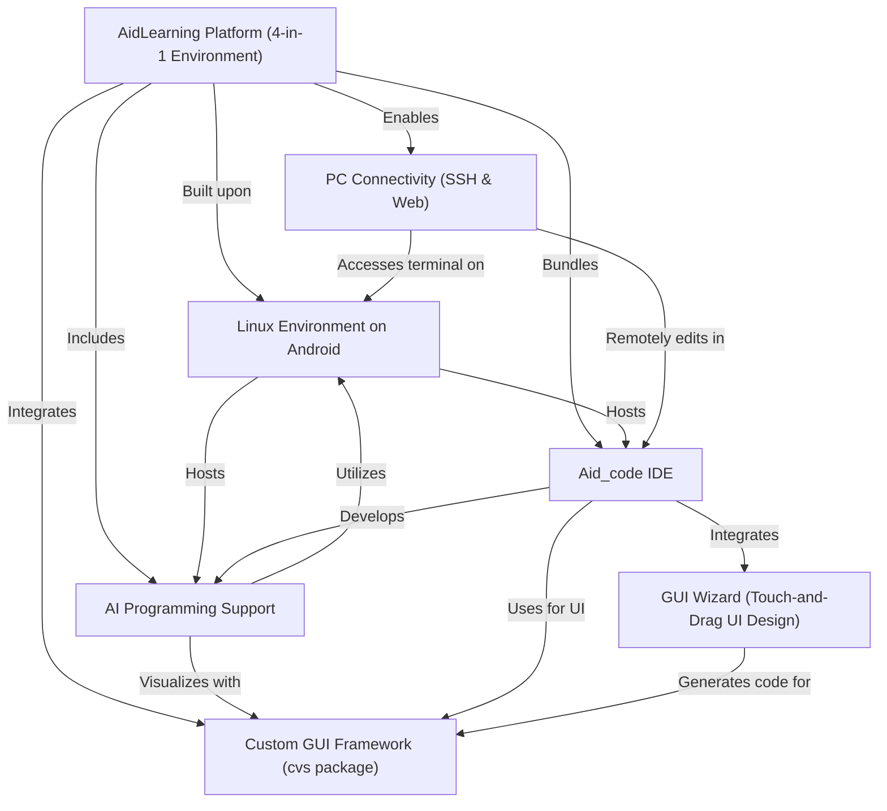
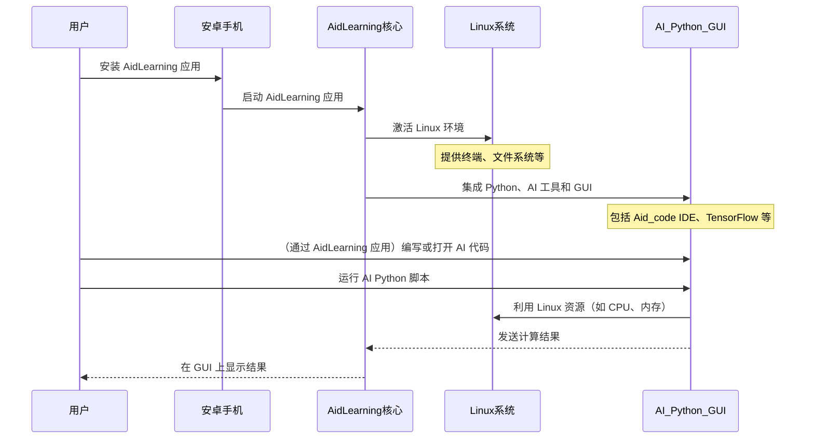

链接：[APLUX Doc Center](https://docs.aidlux.com/)

# docs：AidLearning-FrameWork

AidLearning-FrameWork 是一个**革命性平台**，它将安卓手机转变为*便携式 AI 开发工作站*

它将**完整的 Linux 操作系统**、强大的**AI 编程工具**、Python 语言以及*自定义图形用户界面框架*集成到一个统一的环境中。

这使得我们能够直接在移动设备上**开发、运行和调试复杂的 AI 应用程序**，==实现*碎片化或类似桌面的编程体验*==

## 可视化

## 章节

1. [AidLearning Platform (4-in-1 Environment)
](01_aidlearning_platform__4_in_1_environment__.md)
2. [AI Programming Support
](02_ai_programming_support_.md)
3. [Aid_code IDE
](03_aid_code_ide_.md)
4. [Linux Environment on Android
](04_linux_environment_on_android_.md)
5. [GUI Wizard (Touch-and-Drag UI Design)
](05_gui_wizard__touch_and_drag_ui_design__.md)
6. [Custom GUI Framework (`cvs` package)
](06_custom_gui_framework___cvs__package__.md)
7. [PC Connectivity (SSH & Web)
](07_pc_connectivity__ssh___web__.md)

---

# 第一章：AidLearning 平台（四合一环境）

欢迎来到 AidLearning 

本章将介绍 **AidLearning 平台** 的核心概念，我们称之为“四合一环境”。您可以将其视为一个超级工具箱，直接安装在您的安卓手机上。

## 什么是 AidLearning 平台？

想象一下，我们想要开发和运行高级人工智能（AI）程序，但并不总是随身携带电脑。或者，我们希望在移动设备上随时随地进行编程实验。这正是 AidLearning 解决的问题！

AidLearning 平台将普通的安卓智能手机转变为完整的便携式 AI 工作站。它不仅仅是一个应用程序，而是一个完整的生态系统，将四个关键组件无缝集成在一起：

1.  **完整的 Linux 操作系统**
2.  **强大的 AI 开发工具**
3.  **Python 编程语言**
4.  **图形用户界面（GUI）**

这四个组件共同创造了一个独特的环境，让我们可以直接在移动设备上开发和运行复杂的 AI 应用程序。这意味着我们可以在短暂的休息时间进行编程（碎片化编程），甚至可以在手机上设置类似桌面的体验，连接键盘和鼠标！

## 解析“四合一”的强大功能

让我们看看构成 AidLearning 平台的这些强大组件：

### 1. 口袋里的 Linux 操作系统

我们可能熟悉电脑上的 Windows 或 macOS，或者手机上的安卓系统。Linux 是另一种非常流行的操作系统，尤其是在开发者和用于服务器及 AI 系统的场景中。

AidLearning 为安卓手机带来了**完整的 Linux 环境**，**无需“root”设备**（这一过程有时会失去保修或存在风险）。这意味着我们可以访问所有标准的 Linux 命令和工具，安装软件、管理文件和运行进程，就像在普通的 Linux 电脑上一样。它运行速度快且接近实时，因为它直接运行在手机上，而不是在较慢的“虚拟”环境中。

### 2. 强大的 AI 开发工具

AI 是一个广阔而令人兴奋的领域，依赖于专门的工具和框架。AidLearning 预装了许多最流行和强大的 AI 开发框架，例如：

*   **TensorFlow**
*   **PyTorch**
*   **Caffe**
*   **Keras**
*   **Mxnet**
*   **OpenCV**

这意味着我们无需担心通常需要复杂设置的这些工具。它们开箱即用，通过内置的加速技术显著提升深度学习算法的性能。

### 3. Python 编程语言

Python 因其简单性、可读性以及丰富的机器学习和深度学习库而被称为“AI 语言”。AidLearning 平台完全支持 Python（包括 Python 2 和 Python 3），使其成为编写 AI 程序的主要语言。我们可以使用其可视化编程功能，甚至实时调试代码。

### 4. 图形用户界面（GUI）

虽然许多高级程序员喜欢命令行，但图形用户界面（GUI）让一切变得更加简单，尤其是对初学者而言。AidLearning 在安卓设备上提供了**类似桌面的 GUI**。这意味着我们可以通过熟悉的鼠标（或触摸）和窗口控制与 Linux 环境交互，管理文件并开发 AI 应用程序，就像在电脑上一样。这种可视化方法还延伸到“触摸拖拽”设计应用界面，我们将在后续章节中探讨。

## 这一切如何协同工作（快速揭秘）

当我们在安卓手机上安装并启动 AidLearning 应用时，它不仅仅是运行在安卓系统之上，而是巧妙地建立了一个强大的生态系统。以下是使用 AidLearning 运行 AI 程序时的简化流程：

本质上，AidLearning 应用充当了安卓手机与其托管的强大 Linux 系统之间的桥梁。在这个 Linux 系统中，Python 已经准备就绪，所有前沿的 AI 框架都已集成。GUI 则提供了一种用户友好的方式与所有这些组件交互，让我们能够轻松开发和运行项目。

## 这对我们意味着什么

通过 AidLearning 平台，安卓手机不再仅仅是通信设备或娱乐中心。它变成了一个完全功能的便携式 AI 开发工作站。我们可以：

*   **随时随地编程**：利用碎片时间开发创意。
*   **运行真实的 AI 模型**：直接在设备上实验深度学习。
*   **获得完整的开发体验**：使用 IDE、终端和 GUI，就像在桌面上一样。
*   **构建自己的应用**：AidLearning 甚至可以帮助我们将 AI 项目打包为安卓 APK。

这种独特的组合使 AidLearning 成为学习、实验甚至在移动设备上部署 AI 应用程序的理想平台。

## 总结

在本章中，我们介绍了 **AidLearning 平台** 作为一个强大的“四合一环境”，将 Linux、AI 工具、Python 和 GUI 集成到安卓手机上。这让我们能够直接在移动设备上开发和运行复杂的 AI 应用程序，将其转变为便携式 AI 工作站。

在下一章中，我们将深入探讨 AidLearning 如何提供具体的 [AI 编程支持](02_ai_programming_support_.md)，以及这对我们的 AI 开发之旅意味着什么。

[下一章：AI 编程支持](02_ai_programming_support_.md)

